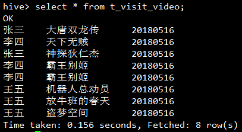

# hive sql
## collect_list和collect_set
[Hive笔记之collect_list/collect_set(列转行)](https://www.cnblogs.com/cc11001100/p/9043946.html)

它们都是将分组中的某列转为一个数组返回,不同的是collect_list不去重而collect_set去重.

做简单的实验加深理解,创建一张实验用表,存放用户每天点播视频的记录:
```hive
create table t_visit_video (
  username string,
  video_name string
) partitioned by (day string)
row format delimited fields terminated by ',';
```
在本地文件系统创建测试数据文件:
```data
张三,大唐双龙传
李四,天下无贼
张三,神探狄仁杰
李四,霸王别姬
李四,霸王别姬
王五,机器人总动员
王五,放牛班的春天
王五,盗梦空间
```
将数据加载到Hive表:
```hive
load data local inpath '/root/hive/visit.data' into table t_visit_video partition (day='20180516');
```



按用户分组,取出每个用户每天看过的所有视频的名字:
```hive
select username, collect_list(video_name) from t_visit_video group by username ;
```
```data
张三 ["大唐双龙传", "神探狄仁杰"]
李四 ["天下无贼", "霸王别姬", "霸王别姬"]
王五 ["机器人总动员", "放牛班的春天", "盗梦空间"]
```

```hive
select username, collect_set(video_name) from t_visit_video group by username;
```
```data
张三 ["大唐双龙传", "神探狄仁杰"]
李四 ["天下无贼", "霸王别姬"]
王五 ["机器人总动员", "放牛班的春天", "盗梦空间"]
```

