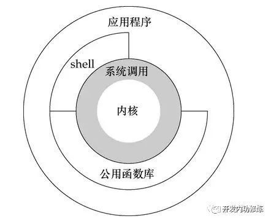

- [一次系统调用开销到底有多大?](https://cloud.tencent.com/developer/article/1760744)
- [从"read"看系统调用的耗时](https://www.cnblogs.com/syntax/archive/2012/11/05/2755129.html)

# intro
系统调用拾遗
首先说说系统调用是什么,当你的代码需要做IO操作(open,read,write),或者是进行内存操作(mmap,sbrk),甚至是说要获取一个网络数据,
就需要通过系统调用来和内核进行交互. 无论你的用户程序是用什么语言实现的,是php,c,java还是go,只要你是建立在Linux内核之上的,
你就绕不开系统调用.



# fread/read/mmap
## fread
fread.cc
```cpp
#include <stdio.h>

int main() {
  auto* pf = fopen("data.bin", "r");
  char buf[2] = {0};
  while (fread(buf, 1, 1, pf)) {
  }
  return 0;
}
```

两个文件的功能完全一样,打开同一个文件,并逐字节地读取整个文件.
```shell
dd if=/dev/zero of=data.bin bs=1M count=1
```
下面的数据都是用的10M 产生的, 但是 `strace ./read` 非常耗时.

将它们编译后得到的可执行程序fread和read分别在同一台PC(linux系统)上执行,得到的如果如下
```shell
playground(master ✗) time ./fread
./fread  0.15s user 0.02s system 99% cpu 0.168 total
playground(master ✗) time ./read
./read  1.12s user 3.31s system 99% cpu 4.431 total
```
fread与read的耗时相差数十倍之多!可见啊~ read一个字节这种写法是相当不可取的.

但是,事情为什么会是这样的呢?让我们用strace来看看:

```bash
strace ./fread >out.fread 2>&1
```
```plain
execve("./fread", ["./fread"], 0x7fffc97fd8e0 /* 30 vars */) = 0
...
openat(AT_FDCWD, "data.bin", O_RDONLY)  = 3
fstat(3, {st_mode=S_IFREG|0644, st_size=10485760, ...}) = 0
read(3, "\0\0\0\0\0\0\0\0\0\0\0\0\0\0\0\0\0\0\0\0\0\0\0\0\0\0\0\0\0\0\0\0"..., 4096) = 4096
read(3, "\0\0\0\0\0\0\0\0\0\0\0\0\0\0\0\0\0\0\0\0\0\0\0\0\0\0\0\0\0\0\0\0"..., 4096) = 4096
...
```
```bash
cat out.fread | grep "read(3" | wc -l
```
得到 2576 次 read 系统调用

```plain
playground(read ✗) strace -c ./fread
% time     seconds  usecs/call     calls    errors syscall
------ ----------- ----------- --------- --------- ----------------
 60.89    0.005269           2      2576           read
 11.63    0.001006           7       127           rt_sigprocmask
  8.70    0.000753          12        59           mmap
  3.83    0.000331          19        17           openat
  3.35    0.000290         290         1           execve
  2.87    0.000248          14        17           mprotect
  1.95    0.000169           9        18           close
  1.79    0.000155           9        16           fstat
  0.96    0.000083          10         8           pread64
  0.52    0.000045          11         4           brk
  0.50    0.000043          21         2           munmap
  0.46    0.000040           8         5           futex
  0.38    0.000033          16         2         2 connect
  0.34    0.000029          14         2           socket
  0.32    0.000028          14         2         1 arch_prctl
  0.28    0.000024           4         5           getpid
  0.24    0.000021          21         1         1 access
  0.21    0.000018           9         2           rt_sigaction
  0.21    0.000018           9         2           msync
  0.12    0.000010          10         1         1 mincore
  0.10    0.000009           9         1           set_tid_address
  0.09    0.000008           8         1           lseek
  0.09    0.000008           8         1           geteuid
  0.09    0.000008           8         1           prlimit64
  0.08    0.000007           7         1           set_robust_list
------ ----------- ----------- --------- --------- ----------------
100.00    0.008653                  2872         5 total
```

### perf fread
```cpp
#include <fcntl.h>
#include <stdio.h>
#include <sys/stat.h>

const std::string path = "data.bin";

int main(int argc, char* argv[]) {
  int fd = open(path.c_str(), 0);
  struct stat statbuf;
  fstat(fd, &statbuf);

  auto* pf = fopen(path.c_str(), "r");
  char buf[2] = {0};

  for (auto i = 0; i < statbuf.st_size; ++i) {
    fread(buf, 1, 1, pf);
  }

  return 0;
}
```

```plain
playground(read ✗) perf stat ./fread
 Performance counter stats for './fread':

            150.55 msec task-clock                #    0.994 CPUs utilized
                 5      context-switches          #    0.033 K/sec
                 0      cpu-migrations            #    0.000 K/sec
             1,165      page-faults               #    0.008 M/sec
                 0      cycles                    #    0.000 GHz
     1,523,732,112      instructions
       317,167,502      branches                  # 2106.720 M/sec
           127,522      branch-misses             #    0.04% of all branches

       0.151417913 seconds time elapsed

       0.139406000 seconds user
       0.011950000 seconds sys
```

然后把 for 循环中的 fread 注释掉, 再次运行 perf stat
```plain
playground(read ✗) perf stat ./fread
 Performance counter stats for './fread':

              5.68 msec task-clock                #    0.910 CPUs utilized
                 0      context-switches          #    0.000 K/sec
                 0      cpu-migrations            #    0.000 K/sec
             1,166      page-faults               #    0.205 M/sec
                 0      cycles                    #    0.000 GHz
         8,455,428      instructions
         1,606,278      branches                  #  282.591 M/sec
            31,421      branch-misses             #    1.96% of all branches

       0.006245851 seconds time elapsed

       0.000000000 seconds user
       0.006302000 seconds sys
```
对于10M 文件一共有 10485760 bytes.
所以每次fread 调用, 平均会产生 (1523732112 - 8455428) / 10485760 = 144 次CPU 指令数.

## read
read.cc
```cpp
#include <fcntl.h>
#include <stdio.h>
#include <sys/stat.h>

int main() {
  auto fd = open("data.bin", 0);
  char buf[2] = {0};
  while (read(fd, buf, 1)) {
  }
  return 0;
}
```

```bash
strace ./read >out.read 2>&1
```
```plain
execve("./read", ["./read"], 0x7fff59f105b0 /* 30 vars */) = 0
...
openat(AT_FDCWD, "data.bin", O_RDONLY)  = 3
read(3, "\0", 1)                        = 1
read(3, "\0", 1)                        = 1
...
```

```bash
cat out.read | grep "read(3" | wc -l
```
得到 10485776 次 read 系统调用.(10485776 / 4096 = 2560)

```plain
playground(read ✗) strace -c ./read
% time     seconds  usecs/call     calls    errors syscall
------ ----------- ----------- --------- --------- ----------------
100.00  102.080603           9  10485776           read
  0.00    0.000944           7       127           rt_sigprocmask
  0.00    0.000437           7        59           mmap
  0.00    0.000226          13        17           openat
  0.00    0.000199          11        17           mprotect
  0.00    0.000125           6        18           close
  0.00    0.000087           5        15           fstat
  0.00    0.000052          10         5           getpid
  0.00    0.000047           5         8           pread64
  0.00    0.000041          20         2           socket
  0.00    0.000041           8         5           futex
  0.00    0.000040           8         5           brk
  0.00    0.000036          18         2         2 connect
  0.00    0.000035          17         2           munmap
  0.00    0.000023           7         3           msync
  0.00    0.000014           7         2           rt_sigaction
  0.00    0.000008           8         1         1 mincore
  0.00    0.000007           7         1           lseek
  0.00    0.000007           7         1           geteuid
  0.00    0.000007           3         2         1 arch_prctl
  0.00    0.000007           7         1           set_tid_address
  0.00    0.000007           7         1           set_robust_list
  0.00    0.000007           7         1           prlimit64
  0.00    0.000000           0         1         1 access
  0.00    0.000000           0         1           execve
------ ----------- ----------- --------- --------- ----------------
100.00  102.083000              10486073         5 total
```

fread库函数在内部做了缓存,每次读取4096个字节,而read就老老实实一个字节一个字节地读.

那么再想想,我们读的是什么?是磁盘.难道上面提到的差异,就是因为这4096倍的读磁盘次数差而引起的吗? 并不是这样.
磁盘是块设备,每次读取的最小单位是块.而当我们通过系统调用读一个字节时,linux会怎么做呢?它会是读取一个块,然后返回一个字节,
再把其余字节都丢掉吗?当然不会,这样的操作系统也太拙劣了.

实际上linux的文件系统层(fs层)不仅会将每次读的一整块数据缓存下来,还有预读机制(一次预读多个块,以减少磁盘寻道时间),并且缓存
的内容是放在文件对应的inode里面,是可以在进程间共享的.(省略细节若干^)

那么,fread与read执行的耗时差别来自于哪里呢?
从代码看,它们都做了相同次数的函数调用,从内核看,它们都造成了基本上相同的磁盘IO. 但是注意到,第一段代码中一共进行了N次fread
函数调用,产生约N/4096次系统调用,第二段代码中一共进行了N次read函数调用,产生N次系统调用.实际上这里的耗时差就来自于4096倍的
系统调用次数差!fread()库函数中缓存的作用并不是减少读磁盘的次数,而是减少系统调用的次数.

由此可见,系统调用比起普通函数调用有很大的开销,编写代码时应当注意避免滥用系统调用.

为了进一步减少系统调用的次数,关于读文件的这个问题,我们还可以这样做:

## mmap
mmap.cc
```cpp
#include <fcntl.h>
#include <sys/mman.h>
#include <sys/stat.h>

int main(int argc, char* argv[]) {
  int fd = open("data.bin", 0);
  struct stat statbuf;
  fstat(fd, &statbuf);

  char buf[2] = {0};

  auto* buffer = (char*)mmap(nullptr, statbuf.st_size, PROT_READ, MAP_PRIVATE, fd, 0);
  for (auto offset = 0; offset < statbuf.st_size; ++offset) {
    *buf = buffer[offset];
  }

  return 0;
}
```

```shell
playground(master ✗) time ./mmap
./mmap  0.00s user 0.01s system 96% cpu 0.006 total
```

```plain
playground(read ✗) strace -c ./mmap
% time     seconds  usecs/call     calls    errors syscall
------ ----------- ----------- --------- --------- ----------------
 62.46    0.000920           7       127           rt_sigprocmask
 11.47    0.000169           9        17           mprotect
  4.28    0.000063           1        60           mmap
  3.26    0.000048           9         5           brk
  2.72    0.000040           2        17           openat
  2.38    0.000035          17         2           munmap
  1.90    0.000028           1        18           close
  1.43    0.000021           1        16           fstat
  1.36    0.000020           1        15           read
  1.36    0.000020          10         2         2 connect
  1.22    0.000018           9         2           msync
  0.95    0.000014           7         2           rt_sigaction
  0.95    0.000014           2         5           getpid
  0.88    0.000013           6         2         1 arch_prctl
  0.68    0.000010           5         2           socket
  0.54    0.000008           8         1         1 mincore
  0.54    0.000008           8         1           prlimit64
  0.48    0.000007           1         5           futex
  0.48    0.000007           7         1           set_tid_address
  0.41    0.000006           6         1           set_robust_list
  0.27    0.000004           4         1           lseek
  0.00    0.000000           0         8           pread64
  0.00    0.000000           0         1         1 access
  0.00    0.000000           0         1           execve
  0.00    0.000000           0         1           geteuid
------ ----------- ----------- --------- --------- ----------------
100.00    0.001473                   313         5 total
```

同样是遍历整个文件,但是读文件的过程中不需要使用系统调用,直接把文件当成内存buffer来读就行了.
其原理是mmap的执行,仅仅是在内核中建立了文件与虚拟内存空间的映射关系.用户访问这些虚拟内存空间时,页表里面并没有这些空间的
表项,于是CPU产生缺页异常.内核捕捉这些异常,逐渐将文件读入内存,并建立相关的页表项.

看到这里,我们不禁要问,系统调用为什么就这么耗时呢?系统调用与普通函数调用到底有什么不同?

1. 两者都是在调用处进行跳转,转到被调用的代码中去执行.
  系统调用使用的"跳转"指令相对复杂.因为跳转到内核空间去执行时,CPU特权级别需要改变(否则没有权限访问到内核空间).
  于是,CPU必须封装一条指令,既实现跳转,又实现特权级别的改变,并且还要保证跳转到的地方就是内核代码(否则用户程序用这个指令假
  跳一下,自己就拥有特权了).
  而软中断指令恰好能满足这三点要求,所以,X86下实现系统调用的经典方法就是"INT 0x80"(现在好像换sysenter了吧~ 但是指令要做的
  事情应该不会变),

2. 两者都是执行到返回点,然后跳转回到原先的调用点.
  系统调用的返回过程还伴随着很多的工作,比如检查是否需要调度,是否有异步信号需要处理,等等.
  然后,既然来的时候改变了CPU特权级别,返回的时候还得改回去,

3. 两种调用中,调用前后的代码都在相同的虚拟地址空间中(内核空间也属于用户进程所能看到的虚拟地址空间范围内,尽管进程一般情况
  下没有权限去访问),地址空间并没有切换, 运行内核代码时使用的栈是内核栈,系统调用时需要进行栈的切换,

4. 两者的参数传递看似相同.
  普通函数调用是通过栈来传递参数的,而系统调用是通过寄存器来传递参数,寄存器不够用时才逼不得已使用栈.
  因为栈要切换,参数传递起来不那么简单,(但是在这一点上,系统调用与普通函数调用的耗时并无太大差异.)

5. CPU执行内核代码和执行用户程序代码没什么区别,
  但是注意到,内核代码对用户参数是充分的不信任. 以read/fread的buffer参数为例,fread库函数一般不会检查buffer参数是否合法.
  就算想要检查,也没这个能力,他不知道buffer是不是个野指针,不知道buffer的大小是否与len不符,不知道buffer指向的这块内存是否
  可写,他唯一能做的检查只是buffer是否为NULL,可惜这没什么意义.但是通过系统调用进入内核以后,情况就不同了.前面说到的那些检
  查,统统都要做,并且每次调用都要不厌其烦地做.

以上几点区别,仅是我目前能够想到的.但是管中窥豹,可见一斑.进入内核以后,要做的事情的确是很多很多.

