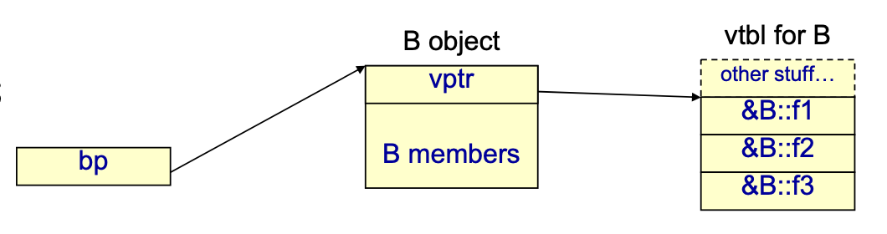
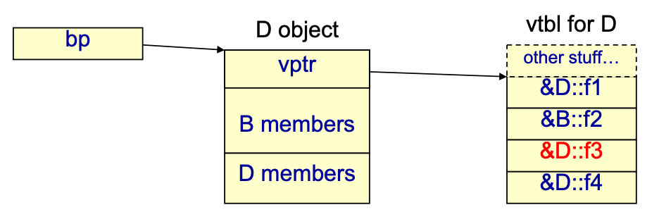
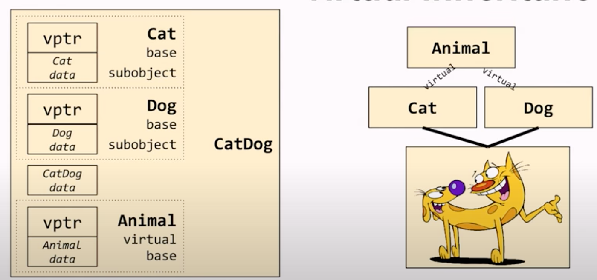
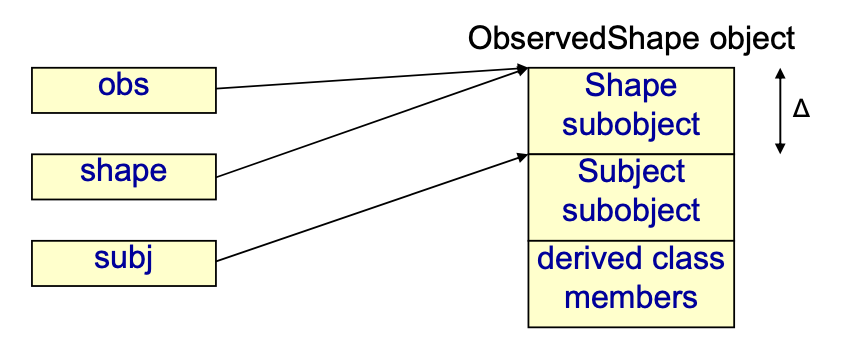

- [constructor and operator](#constructor-and-operator)
  - [operator=](#operator)
  - [copy contructor](#copy-contructor)
  - [Returning a Reference to a Non-const Object](#returning-a-reference-to-a-non-const-object)
  - [Returning a const Object](#returning-a-const-object)
- [初始化列表](#初始化列表)
- [Virtual Function](#virtual-function)
  - [虚函数的实现的基本原理](#虚函数的实现的基本原理)
    - [parameter of an overriding function](#parameter-of-an-overriding-function)
    - [虚析构函数](#虚析构函数)
    - [virtual inheritance](#virtual-inheritance)
    - [在非虚函数中调用虚函数](#在非虚函数中调用虚函数)
    - [子类调用父类的方法](#子类调用父类的方法)
- [class layout](#class-layout)
  - [Base Class Layout](#base-class-layout)
  - [Empty Class](#empty-class)
  - [Lexical vs. Physical Ordering](#lexical-vs-physical-ordering)

# constructor and operator
```C++
class Empty {}; // sizeof(Empty) 为 1
```
Thanks to C++ compiler, actually it becomes something like this:
```C++
class Empty {
 public:
  Empty() {}  // default constructor
  Empty(const Empty&) {}  // copy constructor
  ~Empty() {}  // destructor
  Empty& operator=(const Empty&) {  // assignment operator
    return *this;
  }
};
```

```C++
Empty eA;  // default constructor
~Empty();  // destructor
Empty eB(eA);  // copy constructor(creating a new object)
eB = eA;  // assignment operator(assign to an existing object)
Empty eC = eA;  // copy constructor(creating a new object)
```

## operator=
赋值运算符(`operator=`)返回类型一般声明为类型的引用, 并在函数结尾时返回实例自身的引用(即`*this`).这里主要有两个原因:

1. 返回引用可以减少一次拷贝构造和析构函数导致不必要的开销,因为如果返回值类型不是引用,会创建一个匿名对象,这个匿名对象时个右值,获取return的值.
1. 可以实现连续赋值, 在例子中 `b = c = a;`, 运算顺序 `b = (c = a);` 返回值不是引用类型也是可以的, c得到一个右值,再将右值赋给b,所以逻辑上没有问题的.
  但是如果是 `(b = c) = a;` 这里将会出错,`b = c`后b是一个右值,所以`b = a`时将会出错.

## copy contructor
The copy constructor should have one of the following forms:

- `MyClass(const MyClass&);`
- `MyClass(MyClass&);`
- `MyClass(volatile MyClass&);`
- `MyClass(volatile const MyClass&);`

copy constructor 必须以引用的方式传递参数.
因为,在值传递的方式传递给一个函数的时候,会调用拷贝构造函数生成函数的实参.如果拷贝构造函数的参数仍然是以值的方式,就会无限循环的调用下去,直到函数的栈溢出.
**拷贝构造函数使用传入对象的值生成一个新的对象的实例,而赋值运算符是将对象的值复制给一个已经存在的实例**.

friend关键字,它能让被修饰的对象冲破本class的封装特性,从而能够访问本class的私有对象.

- 如果你在A类中,申明了函数func()是你的friend,那么func()就可以使用A类的所有成员变量,无论它在什么地方定义的.
- 如果你在A类中,申明了B类是你的friend,那么B类中的方法就可以访问A类的所有成员变量.

[C++ TUTORIAL - OBJECT RETURNING - 2018](http://www.bogotobogo.com/cplusplus/object_returning.php)

```C++
class Complx {
 public:
  Complx() {}
  Complx(double r, double i): real(r), imag(i) {}

  Complx operator+(const Complx & c) const{
    return Complx(real + c.real, imag + c.imag);
  }

  Complx& operator=(const Complx& c) {
    if (this == &c) {
      return *this;
    }
    real = c.real;
    imag = c.imag;
    return *this;
  }

  friend std::ostream& operator<<(std::ostream& os, const Complx& c); // friend 标记不能少

  double size() const {
    return sqrt(real * real + imag * imag);
  }

 private:
  double real;
  double imag;
};

std::ostream& operator<<(std::ostream& os, const Complx& c){
  os << "(" << c.real << ", " << c.imag << ")";
  return os;
}
```

## Returning a Reference to a Non-const Object
The return value of `operator=()` is used for chained assignment:
```C++
Complx c3(20,40);
Complx c4, c5;
c5 = c4 = c3;
```
In the code, the return value of `c4.operator=(c3)` is assigned to c5.
Returning either a Complx object or a reference to a Complx object would work. But using a reference allows the function to avoid calling the Complx copy constructor to create a new Complx object.
In this case, the return type is not const because operator=() method returns a reference to c4, which is modified.

The return value of `operator<<()` is used for chained output:
```C++
cout << c4 << " got its value from c3" << endl;
```
In the code, the return value of `operator<<(cout, c4)` becomes the object used to display the string " got its value from c3". Here, the return type must be `ostream &` and not just ostream.

## Returning a const Object
The `Complx::operator+()` in the example has a strange property. The intended use is this:
```C++
Complx c6 = c1 + c2;  // #1
```
But the definition also allows us to use the following:
```C++
Complx c7;
c1 + c2 = c7;  // #2
```
This code is possible because the copy constructor constructs a temporary object to represent the return value.
So, in the code, the expression c1 + c2 stands for that temporary object. In statement #1, the temporary object is assigned to c6. In statement #2, c7 is assigned to the temporary object.

The temporary object is used and then discarded. For instance, in statement #2, the program computes the sum of c1 and c2, copies the answer into the temporary return object, overwrites the contents with the contents of c7,
and then discards the temporary object. The original complex numbers are all left unchanged.

If we declare the return type as a const object, we can avoid the problem.
```C++
const Complx operator+(const Complx & c) const{
  return Complx(real + c.real, imag + c.imag);
}
```

private, public or protected.

- private: members of a class are accessible only from within other members of **the same class** or from their **friends**.
- protected: members are accessible from members of their **same class** and from their **friends**, but also from members of their **derived classes**.
- public: members are accessible from **anywhere** where the object is visible.

By default, all members of a class are private. 结构体的成员默认是public

const对象不能调用非const函数

# 初始化列表
构造函数的执行可以分成两个阶段,初始化阶段和计算阶段,初始化阶段先于计算阶段.

- 初始化阶段: 所有类类型(class type)的成员都会在初始化阶段初始化,即使该成员没有出现在构造函数的初始化列表中.
- 计算阶段: 一般用于执行构造函数体内的赋值操作

成员是按照他们在类中出现的顺序进行初始化的, 而不是按照他们在初始化列表出现的顺序初始化的.

```C++
class Foo {
 public:
  Foo() {
    LOG(INFO) << "default construct for Foo";
  }

  Foo(const Foo& foo) {
    LOG(INFO) << "copy constructor for Foo";
    this->a_ = foo.a_;
  }

  Foo& operator=(const Foo& foo) {
    LOG(INFO) << "assignment for Foo";
    this->a_ = foo.a_;
    return *this;
  }

 private:
  int a_;
};
```

不使用初始化列表时
```C++
class Bar {
 public:
  Bar(const Foo &foo) {
    foo_ = foo;
  }

 private:
  Foo foo_;
};

Foo foo;
Bar bar(foo);
```

```log
I0825 09:31:59.868443 167398 main_test.cc:16] default construct for Foo
I0825 09:31:59.868752 167398 main_test.cc:16] default construct for Foo
I0825 09:31:59.868777 167398 main_test.cc:25] assignment for Foo
```

使用初始化列表
```C++
class Bar {
 public:
  Bar(const Foo &foo) : foo_(foo) {}

 private:
  Foo foo_;
};

Foo foo;
Bar bar(foo);
```

```log
I0825 09:33:34.305039 167620 main_test.cc:16] default construct for Foo
I0825 09:33:34.305356 167620 main_test.cc:20] copy constructor for Foo
```
可以看到使用初始化列表之后, 可以减少一次构造函数的调用

# Virtual Function
Once a function is declared as virtual, it remains virtual in all the dervied classes.
既不需要在dervied class 中显式指定virtual

虚函数不能定义为内联函数, inline是在编译器将函数类容替换到函数调用处, 是静态编译的, 而虚函数是动态调用的, 在编译器并不知
道需要调用的是父类还是子类的虚函数, 所以不能够inline声明展开, 所以编译器会忽略

## 虚函数的实现的基本原理
If a class has a virtual function, every object of that type contains a pointer to a shared virtual function table.
```cpp
class B {
 public:
  virtual int f1();
  virtual void f2(int);
  virtual int f3(int);
  // ~~~
};

B* bp = new B;
```


The "other stuff" is usually

- an offset to the start of the complete object,
- a pointer to the typeinfo for the object, and
- offsets to virtual base class subobjects in the complete object

The virtual calling sequence is indirect through the object's virtual function table. The call
```cpp
bp‐>f1();
```
Is translated to something like
```cpp
(*(bp‐>vptr)[0])(bp)
```

A derived class has its own virtual table.
Overriding derived class functions replace those of the base class.
```cpp
class D: public B {
 public:
  int f1() override;  // overrides B::f1
  virtual void f4();  // new virtual
  int f3(int) override;  // override B::f3
  // ~~~
};

B* bp = new D;
bp‐>f3();
```


Note that while this is a typical implementation, the standard does not specify a particular mechanism.

Some compilers would locate the virtual pointer somewhere other than at the beginning of an object, typically at the end
of a base class subobject.

It's conceivable that a compiler might not use the vptr/vtbl mechanism at all. (I'm not aware of any such compiler.)

### parameter of an overriding function
虚函数body 可以被覆盖掉, 但是默认参数还是使用base class 中声明的.
```C++
class A {
 public:
  virtual ~A() {}
  virtual int foo(int x = 99) {
    std::cout << "A:foo" << std::endl;
    return x;
  }
};

class B : public A {
 public:
  int foo(int x = 77) {
    std::cout << "B:foo" << std::endl;
    return x;
  }
};

int main(int argc, char* argv[]) {
  A* a = new B;
  std::cout << a->foo() << std::endl; // output B:foo and 99
  delete a;

  return 0;
}
```

### 虚析构函数
- Constructors can't be virtual! 因为构造函数被invoked 时候, 说明object 还未创建完成, 也就不能做到虚函数的runtime dynamic binding.
- Virtual Destructor can be pure, but we must provide a function body for the pure virtual destructor. 作用仅仅是在没有其他纯虚函数的情况下, 指名这个class 不能被实例化

```C++
class Base {
 public:
  Base() {
    LOG(INFO) << "constructor in base";
  };
  virtual ~Base() {
    LOG(INFO) << "destructor in base";
  };

  virtual void faire() {
    LOG(INFO) << "do something in base";
  };
};

class Derived : public Base {
 public:
  Derived() {
    LOG(INFO) << "constructor in derived";
  };
  ~Derived() {
    LOG(INFO) << "destructor in derived";
  }

  void faire() {
    LOG(INFO) << "do something in derived";
  }
};
```

```C++
Base* instance = new Derived();
instance->faire();
delete instance;
```
在将 `~Base` 声明为虚函数时, 上面的代码会输出:
```log
I0605 15:45:05.518903   159 test.cpp:14] constructor in base
I0605 15:45:05.519145   159 test.cpp:28] constructor in derived
I0605 15:45:05.519162   159 test.cpp:35] do something in derived
I0605 15:45:05.519176   159 test.cpp:31] destructor in derived
I0605 15:45:05.519187   159 test.cpp:17] destructor in base
```
可以看到, 析构的时候, 先调用的Derived 的析构函数, 然后再调用的Base 的析构函数.

如果将 `~Base` 不声明为虚函数, 上面的代码会输出
```log
I0605 15:50:43.765009   167 test.cpp:14] constructor in base
I0605 15:50:43.765822   167 test.cpp:28] constructor in derived
I0605 15:50:43.765849   167 test.cpp:35] do something in derived
I0605 15:50:43.765859   167 test.cpp:17] destructor in base
```
只调用了Base 的析构函数(因为instance 声明的是Base 类型的), Derived 中就可能发生内存泄露, 资源没有释放.

### virtual inheritance
[CppCon 2017: Arthur O'Dwyer "dynamic_cast From Scratch"](https://www.youtube.com/watch?v=QzJL-8WbpuU)

```cpp
class Animal {
 public:
  virtual ~Animal() {}
};  // sizeof = 4 on 32-bit machine

class Cat : public Animal {};  // sizeof = 4
class Dog : public Animal {};  // sizeof = 4
class CatDog : public Cat, public Dog {};  // sizeof = 8
```
Is a CatDog an Animal? NO, it's two Animals.


```cpp
Animal* x = new CatDog;
```
报错提示
```plain
[clang ambiguous_derived_to_base_conv] [E] Ambiguous conversion from derived
                    class CatDog -> class Cat -> class Animal
                    class CatDog -> class Dog -> class Animal
```

Fix with virtual inheritance
```cpp
class Cat : public virtual Animal {};  // sizeof = 4
class Dog : public virtual Animal {};  // sizeof = 4
class CatDog : public Cat, public Dog {};  // sizeof = 8
```
Now, a CatDog is an Animal.



示意图中画了三个vptr, 如果是这样的内存布局的话, sizeof 应该是12, 而不是8, 所以姑且只能借助这个图来大概理解, 真实的layout
应该不是这样的.

### 在非虚函数中调用虚函数
```C++
class RowOrientedBenchmark{
 public:
  virtual ~RowOrientedBenchmark(){ }
  virtual void DoRow(int i) {
    LOG(INFO) << "DoRow in RowOrientedBenchmark";
  }
  void run() {
    for(int i = 0; i < 10; ++i){
      DoRow(i);
    }
  }
};

class ReadBenchmark : public RowOrientedBenchmark {
 public:
  void DoRow(int i) {
    LOG(INFO) << "DoRow in ReadBenchmark";
  }
};

auto bc1 = std::make_unique<RowOrientedBenchmark>();
bc1->run(); // output "DoRow in RowOrientedBenchmark"

auto bc2 = std::make_unique<RowOrientedBenchmark>();
bc2->run(); // output "DoRow in ReadBenchmark"
```
通过这种方式可以看到一个明显的优点, 先在base 中把框架确定下来(这里就是run), 然后再子类中具体实现怎么做.

### 子类调用父类的方法
```C++
class A {
 public:
  virtual ~A() {}
  void faire() {
    LOG(INFO) << "A faire";
  }
  virtual void say() {
    LOG(INFO) << "A say";
  }
};

class B : public A {
 public:
  void faire() {
    A::faire();
    LOG(INFO) << "B faire";
  }
  /* 如果派生类在虚函数声明时使用了override描述符,那么该函数必须重载其基类中的同名函数,否则代码将无法通过编译. 不加也可以, 只是加了编译检查会更严格.
   * 如果是声明和实现分开到.h 和 .cpp 文件中, 声明可以加override 关键字, 但是实现不能加.
   */
  void say() override {
    A::say();
    LOG(INFO) << "B say";
  }
};

std::unique_ptr<A> a(new B);
a->faire(); // output "A faire"
a->say(); // output "A say" "B say"

std::unique_ptr<B> b(new B);
b->faire(); // output "A faire" "B faire"
b->say(); // output "A say" "B say"
```
在子类的虚函数中也可以调用父类的同名函数.

# class layout
[Back to Basics: Class Layout - Stephen Dewhurst - CppCon 2020](https://www.youtube.com/watch?v=SShSV_iV1Ko)
[pdf](https://github.com/CppCon/CppCon2020/blob/main/Presentations/back_to_basics_class_layout/back_to_basics_class_layout__steve_dewhurst__cppcon_2020.pdf)

Only non-static data declarations in a class definition add anything to the size of class objects.
```cpp
class HR {
 public:
  void terminator(Salary*, Hourly*, Temp*);
 private:
  enum {max = 100};
  static size_t num_dispatched;
  Employee* emps[max];
  size_t size;
};
```
sizeof applied to the HR class yields the same result as sizeof applied to this structure:
```cpp
enum {HR_max = 16383};
extern size_t HR_num_dispatched;
struct HR_type {
  Employee* emps[HR_max];
  size_t size;
}
```
You can declare an enumeration nested inside a C structure, however, C does not consider nested enumeration types and
constants to be members of the structure. They have the same names scope as the structure name.

Storage for static member data is allocated with other static data(in .data).

What do we know about the order of non-static data members?
```cpp
class C {
 public:  // access specifier
  int a;
  int b;
 private:  // access specifier
  int c;
  int d;
 public:  // access specifier
  int e;
 private:  // access specifier
  int f;
};
```
In traditional C++, the only ordering guarantee was that the members between access specifiers had to be laid out in the
same relative order.

In practive, compilers did not (or very rarely) reorder memory layout.

In modern C++, that ordering guarantee was modified to state that members with the same access had to be laid out in the
same relative order.

## Base Class Layout
"The order in which the base class subobjects are allocated in the most derived object...is unspecified."

It is typical that storage for a base class subobject precedes storage for derived class data members.

It is typical that multiple base class subobjects are laid out in the order they appear on the base class list.

However, a compiler may elect to optimize storage use by permuting the base class subobject order.

```cpp
struct Shape {int a;};
struct Subject {int b;};
struct ObservedShape: public Shape, public Subject {int c;};

ObservedShape *obs = new ObservedShape;
Shape* shape = obs;  // safe, predefined conversion
Subject* subj = obs;  // safe, predefined conversion
```



When we compare pointers in C++, we are not asking a question about addresses.
We are asking a question about object identity.
If the pointers refer to the same object, they compare equal. In most cases the comparison amounts to a simple address
comparison:

```cpp
ASSERT_EQ(obs, shape);
ASSERT_EQ(obs, subj);
LOG(INFO) << obs << " " << shape;  //  0x55ce9f40c4c0 0x55ce9f40c4c0
LOG(INFO) << obs << " " << subj;  //   0x55ce9f40c4c0 0x55ce9f40c4c4
```

```plain
if (obs == subj)

The amount of the adjustment, or "delta", is known at compile time.
(obs ? obs + delta : 0) == subject
```

The same address adjustment takes place for a static cast.
```cpp
ObservedShape* obs = new ObservedShape;
Shape* shape = obs;  // no delta
Subject* subj = obs;  // delta

obs = static_cast<ObservedShape*>(shape);  // no delta
obs = static_cast<ObservedShape*>(subj);  // delta
obs = (ObservedShape*)shape;  // no delta
obs = (ObservedShape*)subj;  // delta
```
The dynamic_cast operator usually uses a different mechanism and is more expensive.

## Empty Class
An empty class has no non-static data members, no virtual functions, and no virtual base classes.
We often call these types/objects/closures "stateless."
However, even an empty class must occupy some space.
```cpp
class Empty {}; // sizeof(Empty) is probably 1
Empty e; // sizeof(e) is probably 1
class Empties { // sizeof(Empties) is probably 3
  Empty e1_; // offset 0
  Empty e2_; // offset 1
  Empty e3_; // offset 2
};
```

...Until C++20!

The `no_unique_address` attribute allows an empty non-static data member to share space with another subobject (base
class or member) of a different type.
```cpp
class Empty {};
Empty e;
class Empties { // sizeof(Empties) is probably 1
  [[no_unique_address]] Empty e1_;
  [[no_unique_address]] Empty2 e2_;
  [[no_unique_address]] Empty3 e3_;
};
```
The "Empty Base Class Optimization," also known as the EBCO or EBO (if you prefer TLA's) is a common compiler
optimization.

With respect to multiple inheritance, it often makes sense to rearrange the order of base classes so that empty base
classes appear first on the base class list.

## Lexical vs. Physical Ordering
Note that language constructs that enforce an ordering on members are defined lexically, not physically.

For example:

- A member initialization list initializes in the order of declaration of the members.
- Base class subobjects are initialized and destroyed based on their lexical position on the base class list, not the
  order in which they're allocated in memory.
- A defaulted operator <=> compares members in their declared order.

**Lexical Comparison**

The implementation compares the data members in the lexical order x, y, and z even if z is physically placed at offset 0.
```cpp
class Flatland {
 public:
  auto operator <=>(const Flatland &) const = default;

  int x;
  int y;
 private:
  int z;
};
```

Just be careful about making layout assumptions.
```cpp
class Flatland {
 public:
  auto operator<=>(const Flatland& rhs) const {
    return memcmp(this, &rhs, sizeof(Flatland));
  }

  int x;
  int y;
 private:
  int z;
};
```
operator<=> 不能用memcpy 有两个原因:

1. 内存对齐可能会有一些padding, 用memcmp 直接比较sizeof(Flatland) 的大小会把这些padding 也包括进去.
1. 编译器可能在某次升级后, 把z 放到了x, y 的前面, 也就是physical 和lexical order 不一样, 原来先比较的x,y 变成了先比较z.

Using Static Assertions to Verify Layout
```cpp
struct Timer {
  uint8_t mode;
  uint32_t data;
  uint32_t count;
};

// offsetof is a standard macro from <cstddef>
static_assert(offsetof(Timer, data) == 4, "data must be at offset 4");
```

