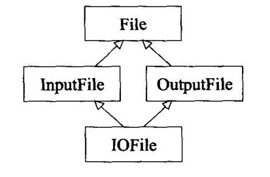

# Accustoming yourself to C++
今天的C++ 已经是个 multiparadigm programming language, 一个同时支持过程形式(procedual), 面向对象形式(object-oriented), 函数形式(functional), 泛型形式(generic), 元编程形式(metaprogramming).

对内置(也就是C-like) 类型而言, pass-by-value 通常比pass-by-reference 高效;
但当从C part of C++ 移往object-oriented C++, 由于用户自定义构造函数和析构函数的存在, pass-by-reference 往往更好.

## prefer const, enum, and inlines to `#define`s
```C++
class GamePlayer {
 private:
  static const int NumTurns = 5;  // 常量声明式
  int socres_[NumTurns];
};
```
然后你所看到的是NumTurns 的声明式而非定义式. 通常C++ 要求你对你所使用的任何东西提供一个定义式, 但如果它是class专属static 常量且为整型(integral type, 例如int, char, bool), 则需特殊处理.
只要不取它们的地址, 你可以声明并使用他们, 而无须提供定义式.
但如果你取某个class专属常量的地址, 或纵使你不取其地址而编译器坚持要看到一个定义式, 你就必须另外提供定义式如下:
```C++
const int GamePlayer::NumTurns;  // NumTurns 的定义
```
定义式需要放到一个实现文件而非头文件. 由于class 常量已在声明时获得初值, 因此定义时不可以再设初值.

## use const whenever possible
```C++
class TextBlock {
 public:
 // operator[] for const object
  const char& operator[](std::size_t position) const {
    return text_[position];
  }
 // operator[] for non-const object
  char& operator[](std::size_t position) {
    return text_[position];
  }
 private:
  std::string text_;
};
```
如果在return 之前有很多复杂的操作, 比如boundary checking, log access data, verify data integrity, 对于const 和 non-const 这些操作都是一样的, 为了避免代码重复, 除了可以把这些部分抽象出单独的函数外
```C++
class TextBlock {
 public:
 // operator[] for const object
  const char& operator[](std::size_t position) const {
    ...
    return text_[position];
  }
 // operator[] for non-const object
  char& operator[](std::size_t position) {
    return const_cast<char&>(static_cast<const TextBlock&>(*this)[position]);
  }
 private:
  std::string text_;
};
```

## Minimize casting
- `const_cast`: 通常被用来cast away the constness. 它也是唯一有此能力的 C++-style 转型操作符
- `dynamic_cast`: 主要用来执行safe downcasting, 也是唯一可能耗费重大运行成本的转型动作(一个很普遍的实现版本基于class 名称至字符串比较).
- `reinterpret_cast`: 意图执行低级转型
- `static_cast`: 用来强迫隐式转换, 例如将 non-const 对象转换为const 对象, 或将int 转换为 double.
  它也可以用来执行上述多种转换的反向转换, 例如将pointer-to-based 转为 pointer-to-derived, 但它无法将 const 转为non-const, 这个只有`const_cast` 才办得到.

## make sure that objects are initialized before they're used
函数内的 static 对象称为local static 对象, 其他static 对象称为non-local static 对象.

如果某编译单元内的某个non-local static 对象的初始化使用了另外一个编译单元的某个non-local static 对象, 它所用到的这个对象可能尚未被初始化,
因为C++ 对定义于不同编译单元内的 non-local static 对象的初始化次序并无明确定义.

幸运的是一个小小的设计便可以完全消除这个问题. 唯一需要做的就是将每个non-local static 对象搬到自己的专属函数内.
这种手法的基础在于: C++ 保证, 函数内的local static 对象会在 该函数被调用期间, 首次遇上该对象之定义式时被初始化.
所以如果你以函数调用替换直接访问non-local static 对象, 你就获得了保证.
```C++
class FileSystem {};
FileSystem& tfs() {
  static FileSystem fs;
  return fs;
}
```
任何一种 non-const static 对象, 不论它是local 还是non-local, 在多线程环境下等待某事发生都会有麻烦.
处理这个麻烦的手法一种做法是: 在程序的单线程启动阶段手工调用所有reference-returning 函数, 以消除与初始化有关的race conditions

# Constructors, Destructors and Assignment Operators
## Nevel call virtual functions during construction or destruction
你不该在构造函数和析构函数期间调用virtual 函数, 这样的调用不会带来你预想的结果.

1. base class 构造期间, 对象的类型时base class 而不是virtual class.
  不止virtual 函数会被编译器解析至base class, 若使用运行期类型信息(runtime type information, 例如`dynamic_cast` 和 typeid), 也会被视为base class 类型.
1. base class 的执行更早于derived class 构造函数, 当base class 构造函数执行时, derived class 的成员变量尚未初始化.

## Have assignment operators return a reference to `\*this`
```C++
int x, y, z;
x = y = z = 15;  // 赋值连锁形式
```
同样有趣的是, 赋值采用右结合律, 所以上述连锁赋值被解析为:
```C++
x = (y = (z = 15));
```
为了实现连锁赋值, assignment operator 必须返回一个reference 指向操作符的左侧实参.
```C++
class Widget {
 public:
  Widget& operator=(const Widget& rhs) {
    ...
    return *this;
  }
};
```

## Hanle assignment to self in operator=
```C++
class Bitmap { ... };
class Widget {
 private:
  Bitmap* pb;
};

Widget& Widget::operator=(const Widget& rhs) {
  if (this == &rhs) {
    return *this;
  }

  auto* pb_bak = pb;
  pb = new Bitmap(*rhs.pb);
  delete pb_bak;
  return *this;
}
```
如果去掉pb bak, 直接使用 `pb = new Bitmap(*rhs.pb)`, 不具备异常安全性, 如果new Bitmap 导致异常, Widget 最终会持有一个指向一块已经被删除掉的Bitmap.

# Resouce Management
## use the same form in corresponding uses of new and delete
当你使用new, 有两件事发生:

1. 内存被分配出来
1. 针对此内存会有一个(或多个)构造函数被调用

当你使用delete, 也有两件事发生

1. 针对此内存会有一个(或多个)析构函数被调用
1. 然后内存才被释放

# Designs and Declarations
## Declare non-member functions when type conversions should apply to all parameters
```C++
// 分数形式的有理数
class Rational {
 public:
  Rational(int numerator = 0, int denominator = 1);  // 构造函数刻意不为explicit, 允许int-to-Rational 隐式转换
  const Rational operator*(const Rational& rhs) const;
};

Rational oneHalf(1, 2);
auto res = oneHalf * 2;  // ok, oneHalf.operator*(2)
res = 2 * oneHalf; // error, 2.operator*(oneHalf)
```
只有当参数被列于parameter list 内, 这个参数才是隐式类型转换的合格参与者. 地位相当于"被调用之成员函数所隶属的那个对象"--- 即this对象.
如果一定要支持混合式算数运算, 让`operator*`成为一个non-member 函数, 便允许编译器在每一个实参身上执行隐式类型转换.
```C++
const Rational operator*(const Rational& lhs, const Rational& rhs) {
  return Rational(lhs.numerator() * rhs.numerator(), lhs.denominator() * rhs.denominator());
}
```
返回的类型const, 是为了避免下面这种代码, 加了const 之后编译无法通过.
```C++
Rational a, b, c;
(a * b) = c;
```

## consider support for a non-throwing swap
如果swap 默认实现版的效率不足(那几乎总是意味着你的class 或template 使用了某种pimpl 手法), 试着做以下事情:

1. 提供一个public swap 函数, 让它高效地置换你的类型的两个对象值. 这个函数不该抛出异常
1. 在你的class 或者template 所在地命名空间内提供一个non-member swap, 并令它调用上述swap 成员函数
1. 如果你正编写一个class(而非class template)`, 为你的class 特化std::swap, 并令它调用你的swap 成员函数.
1. 最后, 请使用using 声明式, 以便让std::swap 在你的函数内曝光可见, 然后不加任何namespace 修饰符, 赤裸裸的调用swap.

成员版swap 绝不可抛出异常, 这一约束只施行于成员版. 不可施行于非成员版, 因为swap 缺省版本是以copy ctor 和 copy assignment 操作符为基础, 而一般情况下, 两者都允许抛出异常.

# Inheritance and Object-Oriented Design
## make sure public inheritance model "is-a"
如果你令class D("Derived") 以public 形式继承class B("Base"), 你便是告诉编译器说, 每一个类型为D 的对象同时也是一个类型为B 的对象, 反之不成立.
B 比D 表现出更一般化的概念, 而D 比B 表现出更特殊化的概念.
B 对象可派上用场的地方, D 对象一样可以派上用场, 因为每一个D 对象都是一个B 对象.

## Avoid hiding inherited names
这个题材其实和继承五个, 而是和作用域(scopes) 有关.
```C++
int x;  // global 变量
void someFunc() {
  double x;  // local 变量
  std::cin >> x;
}
```
这个读取数据的语句指涉的是local 变量x, 而不是global 变量x.
本例的someFunc 的x 是double 类型, 而global x 是int 类型, 但那不要紧. C++ 的名称遮掩规则(name-hiding rules) 所做的唯一事情就是: 遮掩名称. 至于名称的类型, 并不重要.

```C++
class Base {
 public:
  virtual void mf1() = 0;
  virtual void mf1(int);
  virtual void mf2();
  void mf3();
  void mf3(double);

 private:
  int x;
};

class Derived : public Base {
 public:
  virtual void mf1();
  void mf3();
  void mf4();
};
```
base class 内所有名为mf1 和 mf3 的函数都被derived class 内的mf1 和 mf3 函数遮掩调了.
```C++
Drived d;
int x;
double y;
d.mf1();  // call Dervied::mf1
d.mf1(x);  // error, Base::mf1 was hidden
d.mf2();  // call Base::mf2
d.mf3();  // call Derived::mf3
d.mf3(y);  // error, Base::mf3 was hidden
```
即使base class 和 derived class 内的函数有不同的参数类型也适用, 而且不论函数是virtual 或non-virtual 一样适用.

这些行为背后的基本理由是为了防止你在程序内建立新的derived class 附带地从疏远地base class 继承重载函数.
如果一定要使用默认被遮掩的函数, 可以使用using 来让被遮掩的函数重新可见.
```C++
class Derived : public Base {
 public:
  using Base::mf1;  // 让base class 内名为mf1, mf3 的所有东西在derived 作用域内都可见并且public
  using Base::mf3;
  virtual void mf1();
  void mf3();
  void mf4();
};
```

## differentiate between inheritance of interface and inheritance of implementation
```C++
class Shape {
 public:
  virtual void draw() const = 0;
  virtual void error(const std::string& msg);
  int objectID() const;
};

class Rectangle : public Shape {...};
class Ellipse : public Shape {...};
```
我们可以为pure virtual 函数提供定义, 但调用它的唯一途径是调用时明确指出其名称.

```C++
void Shape::draw() const {
  ...
}

Shape* ps1 = new Rectangle;
ps1->draw();
Shape* ps2 = new Ellipse;
ps2->draw();

ps1->Shape::draw();  // call Shape::draw
ps2->Shape::draw();
```

## never redefine an inherited non-virtual function
```C++
class B {
 public:
  void mf();
};

class D : public B{
 public:
  void mf();  // hides B::mf
};

D x;
B* pB = &x;
pB->mf();  // call B::mf

D* pD = &x;
pD->mf();  // call D::mf
```
造成这种差异的原因是, non-virtual 函数都是静态绑定的(statically bound), virtual 函数是动态绑定(dynamicaly bound).

## never redefine a function's inherited default parameter value
virtual 函数系动态绑定, 而缺省参数值缺是静态绑定.

所谓静态类型(static type) 就是它在程序中被声明时所采用的类型.
动态类型(dynamic type) 则是指目前所指对象的类型.

```C++
Shape* ps;
Shape* pc = new Circle;
Shape* pr = new Rectangle;
```
他们三个的静态类型都是pointer to Shape

## Use private inheritance judiciously
private 继承在软件设计层面上没有意义, 其意义只及于软件实现层面.
尽可能使用复合, 必要时才使用private 继承.

这种所谓的empty class 对象不使用任何空间, 因为没有任何隶属对象的数据需要存储. 然而由于技术上的理由, C++ 裁定凡是独立(非附属)对象都必须有非零大小.
```C++
class Empty {};
class HoldsAnInt {
 private:
  int x;
  Empty e;
};

```
`sizeof(Empty)` 大多数编译器中为 1, 因为面对零之独立对象, 通常C++ 勒令默默安插一个char 到空对象内.
`sizeof(HoldsAnInt)` 通常为8, 因为内存对齐的原因.

## use multiple inheritance judiciously
程序有可能从一个以上的base classes 继承相同名称(如函数, typedef 等), 那会导致较多的歧义机会.
```C++
class BorrowableItem {
 public:
  void checkOut();
};

class ElectronicGadget {
 private:
  void checkOut() const;  // 执行自我检测
};

class MP3Player : public BorrowableItem, public ElectronicGadget { };

MP3Player mp;
mp.checkOut();  // error, ambiguous
```
可以看到即使ElectronicGadget 中的 checkOut 是private 的, 仍然会造成歧义, 因为名称还是一样.

钻石型多重继承

```C++
class File {...};
class InputFile: public File {...};
class OutputFile: public File{...};
class IOFile: public InputFile, public OutputFile {...};
```
任何时候只要你的继承体系中某个 base class 和某个 derived class 之间有一条以上的想通路线,你就必须面对这样一个问题:是否打算让 base class 内的成员经由每一条路径被复制?
假设 File 有个成员变量 fileName,那么 IOFile 应给有两份 fileName 成员变量.但从另一个角度来说,简单的逻辑告诉我们,IOFile 对象只有一个文件名称,所以他继承自两个 base class 而来的 fileName 不能重复.
C++ 的缺省做法是执行重复.如果那不是你要的,你必须令那个带有此数据的 base class(也就是 File)成为一个 virtual base class.必须令所有直接继承自它的 classes 采用 "virtual 继承":

从正确行为的观点看, public 继承应该总是virtual.
但是正确性并不是唯一观点, 为避免继承得来的成员变量重复, 编译器必须提供若干幕后戏法, 而其后果是: 使用virtual 继承的那些classes 所产生的对象往往比使用non-virtual 继承的兄弟们体积大,
访问virtual base classes 的成员变量时, 也比访问non-virtual base classes 的成员变量速度慢.

# Templates and Generic Programming
C++ template 机制自身是一部完整的图灵机, 它可以被用来计算任何可计算的值. 于是导出了模板元编程(template metaprogramming), 创造出在C++ 编译器内执行并于编译完成时停止执行的程序.

## understand the two meanings of typename
template 内出现的名称如果相依于某个template参数, 称之为从属名称(dependent names). 如果从属名称在class 内呈嵌套状, 我们称之为nested dependent name.
```C++
template<typename C>
void print2nd(const C& container) {
  if (container.size() >= 2) {
    // it 声明式只有在C::const_iterator 是个类型时才合理, 所以需要在前面加typename
    // 实际上用auto 就行了, 可以省掉typename
    typename C::const_iterator it(container.begin());
    ++it;
    std::cout << *it;
  }
}
```
如果`C::const_iterator` 不是一个类型呢? 如果C 有个static 成员变量碰巧的被命名为 `const_iterator`, 撰写C++ 解析器的人必须操心所有可能得输入.
在我们知道C 是什么之前, 没有任何办法可以知道`C::const_iterator` 是否为一个类型, 而当编译器开始解析template print2nd 时, 尚未确知C 是什么东西.
C++ 有一个规则可以resolve 此一歧义状态: 如果解析器在template 中遭遇一个嵌套从属名称, 它便假设这个名称不是一个类型, 除非你告诉它是. 所以缺省情况下, 嵌套从属名称不是类型.

## know how to access names in templateized base classes
```C++
class CompanyA {
 public:
  void sendCleartext(const std::string& msg);
  void sendEncrypted(const string& msg);
};

class CompanyB {
 public:
  void sendCleartext(const std::string& msg);
  void sendEncrypted(const string& msg);
};

class MsgInfo{};

template<typename Company>
class MsgSender {
 public:
  void sendClear(const MsgInfo& info) {
    string msg;
    ... // fill msg with info
    Company c;
    c.sendCleartext(msg);
  }

  void sendSecret(const MsgInfo& info) { ... }  // 类似sendClear
};

// 假设我们想要在每次送出信息时log 某些信息, derived class 可轻易加上这样的能力, 并且似乎是个合情合理的做法
template<typename Company>
class LoggingMsgSender : public MsgSender<Company> {
 public:
  void sendClearMsg(const MsgInfo& info) {
    // log before
    sendClear(info);  // 调用base class 函数, 这段代码无法通过编译
    // log after
  }
};
```
注意这个derived class 的信息传送函数有一个不同的名称(sendClearMsg), 与其base class 内的名称(sendClear) 不同. 这是个好设计, 因为它避免遮掩继承得来的名称.

上述代码无法通过编译,至少是对严守规律的编译器而言.这样的编译器会抱怨sendClear不存在.虽然我们看到sendClear确实在基类内,然而编译器就是看不到它们.
问题在于, 当编译器遭遇class template LoggingMsgSender 定义式时, 并不知道它继承什么样的class. 当然它继承的是MsgSender<Company>, 但其中的Company 是template 参数,
不到后来(当LoggingMsgSender 被具现化) 无法确切知道它是什么. 而如果不知道Company 是什么, 就无法知道class MsgSender<Company> 是否有sendClear 函数.
其原因是因为有一种所谓的模板全特化,在这个特化版的基类里可能没有sendClear这个函数,因此C++拒绝这个调用的原因是:
它知道基类模板有可能被特化,而那个特化版本可能不提供和一般模板相同的接口.因此它往往拒绝在模板化基类内寻找继承而来的名称.

例如有一家公司只使用加密通信:
```C++
class CompanyZ {
 public:
  void sendEncrypted(const std::string& msg);
};
```
之前定义的MsgSender模板对CompanyZ并不合适,因为该模板还提供了sendClear发送明文的函数.因此要针对CompanyZ产生一个MsgSender特化版:
```C++
template<>
class MsgSender<CompanyZ> {
 public:
  void sendSecret(const MsgInfo& info) {.........}
};
```

为了重头来过来过, 我们必须有某种办法令C++ "不进入 templatized base classes 观察" 的行为失效. 有三个办法:

1. 在调用base class 函数之前加上`this->`

  ```C++
  template<typename Company>
  class LoggingMsgSender : public MsgSender<Company> {
   public:
    void sendClearMsg(const MsgInfo& info) {
      // log before
      this->sendClear(info);  // 成立, 假设sendClear 将被继承
      // log after
    }
  };
  ```
1. 使用using 声明式

  ```C++
  template<typename Company>
  class LoggingMsgSender : public MsgSender<Company> {
   public:
    using MsgSender<Company>::sendClear;  // 告诉编译器, 请它假设sendClear 位于base class 内
    void sendClearMsg(const MsgInfo& info) {
      // log before
      sendClear(info);  // 成立, 假设sendClear 将被继承
      // log after
    }
  };
  ```
1. 显式调用, 但这往往是最不让人满意的一个解法, 因为如果调用的是virtual 函数, 上述的explicit qualification 会关闭virtual 绑定行为.

  ```C++
  template<typename Company>
  class LoggingMsgSender : public MsgSender<Company> {
   public:
    void sendClearMsg(const MsgInfo& info) {
      // log before
      MsgSender<Company>::sendClear(info);  // 成立, 假设sendClear 将被继承
      // log after
    }
  };
  ```

## use member function templates to accept all compatible types
真实指针做得很好的一件事是, 支持隐式转换(implicit conversions). derived class 指针可以隐式转换为base class 指针; 指向non-const 的指针可以转换为指向const 对象等.
```C++
class Top {};
class Middle : public Top {};
class Bottom : public Middle {};
Top* pt1 = new Middle;
Top* pt1 = new Bottom;
```
但如果想在自定义的智能指针上模拟上述转换, 稍微有点儿麻烦, 我们希望以下代码通过编译:
```C++
template<typename T>
class SmartPtr {
 public:
  explicit SmartPtr(T* realPtr);  // 智能指针通常以原始指针完成初始化
};

SmartPtr<Top> pt1 = SmartPtr<Middle>(new Middle);
SmartPtr<Top> pt1 = SmartPtr<Bottom>(new Bottom);
```
但是, 同一个template 的不同instantiations 之间并不存在什么与生俱来的固有关系(这里指如果以带有base-derived 关系到B, D两类型分别具现化于某个template, 产生出来的两个具现体并不带有base-derived关系).
所以编译器视 SmartPtr<Top> 和 SmartPtr<Middle> 为完全不同的class, 没有base-derived 关系.

因为一个template 可以被无限量具现化, 以致生成无限量函数, 因为我们需要的不是为SmartPtr 写一个构造函数, 而是为它写一个构造模板, 这样的模板是所谓member function templates.
```C++
template<typename T>
class SmartPtr {
 public:
  template<typename U>
  SmartPtr(const SmartPtr<U>& other);
};
```
这一构造函数根据对象u 创建对象 t(例如根据`SmartPtr<U>` 创建一个`SmartPtr<T>`), 而u 和 v 的类型是同一个template 的不同具现体, 有时我们称之为generalized copy 构造函数.
上面的泛化copy 构造函数并未被声明为explicit, 那是蓄意的, 因为原始指针类型之间的转换(例如从derived class 指针转为base class 指针) 是隐式转换, 无需明白写出转型cast, 所以让智能指针仿效这种行径也属合理.

完成声明后, 这个泛化copy 构造函数提供的东西比我们需要的多, 我们希望根据一个 `SmartPtr<Bottom>` 创建一个`SmartPtr<Top>`, 却不希望根据一个`SmartPtr<Top>` 创建一个`SmartPtr<Bottom>`;
我们也不希望根据`SmartPtr<double>` 创建一个`SmartPtr<int>`, 因为现实中并没有见过`int*`转换为`double*` 的对应隐式转换行为, 我们必须从某方面对这一泛化构造函数进行拣选或筛除.
```C++
template<typename T>
class SmartPtr {
 public:
  template<typename U>
  SmartPtr(const SmartPtr<U>& other) : heldPtr(other.get()) {}

  T* get() const {
    return heldPtr;
  }

 private:
  T* heldPtr;
};
```
这个行为只有当可以将`U*`隐式转换为`T*` 时才能通过编译, 正是我们想要的, 最终效益是`SmartPtr<T>` 先在有一个泛化copy 构造函数, 且只有其实参隶属兼容类型时才能通过编译.
(实际上也可以通过`std::enable_of` 元编程的方式来限制T 和 U 的关系).

member function templates 并不改变语言规则, 而语言规则说, 如果程序需要一个copy 构造函数, 你却没有声明它, 编译器会为你暗自生成一个.
在class 内声明泛化copy 构造函数, 并不阻止编译器生成一个它们自己的copy 构造函数(一个non-template), 所以如果你想要控制copy 构造函数的方方面面, 你必须同时声明泛化copy 构造函数和正常的copy 构造函数.
相同规则也适用于assignment 操作.

标准的`std::shared_ptr` 的定义
```C++
template<class T>
class shared_ptr {
 public:
  shared_ptr(const shared_ptr& r);  // copy 构造函数
  template<class Y>
  shared_ptr(const shared_ptr<Y>& r);  // 泛化copy 构造函数
  shared_ptr& operator=(const shared_ptr& r);  // copy assignment
  template<class Y>
  shared_ptr& operator=(const shared_ptr<Y>& r);  // 泛化copy assignment
};
```

