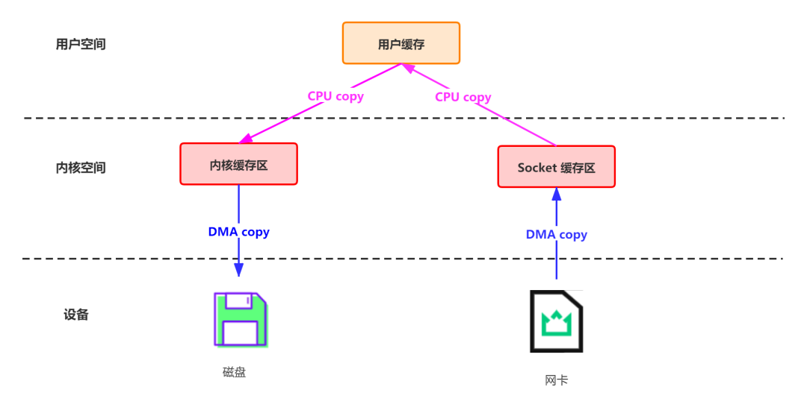
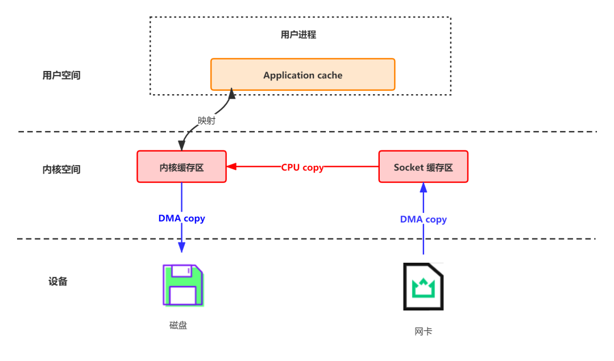
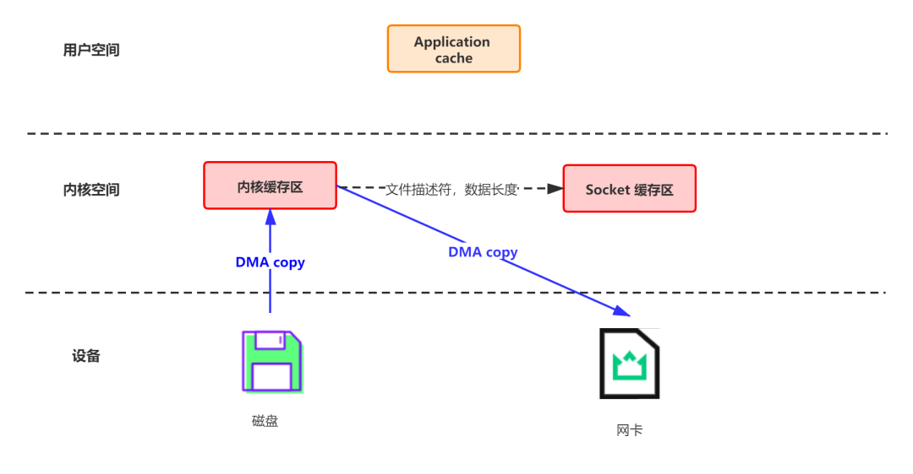

- [I/O 模型](#io-模型)
  - [阻塞,无锁,无等待的区别](#阻塞无锁无等待的区别)
  - [IO复用模型](#io复用模型)
    - [Select](#select)
    - [poll](#poll)
    - [epoll](#epoll)
- [高级IO函数](#高级io函数)
  - [套接字超时](#套接字超时)
- [非阻塞式IO](#非阻塞式io)
- [信号驱动式IO](#信号驱动式io)
- [零拷贝](#零拷贝)
  - [网络数据持久化到磁盘 (Producer 到 Broker)](#网络数据持久化到磁盘-producer-到-broker)
  - [磁盘文件通过网络发送(Broker 到 Consumer)](#磁盘文件通过网络发送broker-到-consumer)

# I/O 模型
在Unix 下的可用的5 中I/O 模型  

- 阻塞式I/O: 默认情况下, 所有套接字都是阻塞的.
- 非阻塞式I/O
- I/O 复用(select/poll/epoll)
- 信号驱动式I/O(SIGIO)
- 异步IO


读:

- 读本质来说其实不能是读, 在实际中, 具体的接收数据是由系统底层自动完成的, read 和 recv只是负责把数据从底层缓冲copy到我们指定的位置.
- 在阻塞条件下如果没有发现数据在网络缓冲中会一直等待, 当发现有数据的时候会把数据读到用户指定的缓冲区.
  read的原则是数据在不超过指定的长度的时候有多少读多少, 没有数据就会一直等待.
  所以一般情况下我们读取数据都需要采用循环读的方式读取数据, 一次read完毕不能保证读到我们需要长度的数据, read完一次需要判断读到的数据长度再决定是否还需要再次读取.
- 在非阻塞的情况下, read的行为是如果发现没有数据就直接返回, 如果发现有数据那么也是采用有多少读多少的进行处理.对于读而言, 阻塞和非阻塞的区别在于没有数据到达的时候是否立刻返回.

写:

- 写的本质也不是进行发送操作, 而是把用户态的数据copy到系统底层去, 然后再由系统进行发送操作,返回成功只表示数据已经copy到底层缓冲,而不表示数据已经发出,更不能表示对端已经接收到数据
- 在阻塞的情况下会一直等待直到write完全部的数据再返回. 这点行为上与读操作有所不同, 究其原因主要是读数据的时候我们对对端发送数据没有任何预知.
  而对于write, 由于需要写的长度是已知的, 所以可以一直写, 直到写完.
  不过问题是write是可能被打断造成write一次只write一部分数据, 所以write的过程还是需要考虑循环write, 只不过多数情况下一次write调用就可能成功.
- 非阻塞写的情况下, 是采用可以写多少就写多少的策略

经典的做法就是采用select/epoll + 非阻塞IO进行判断, select在超时时间内判断是否可以读写操作,然后采用非堵塞读写.
不过一般实现的时候读操作不需要设置为非堵塞, 上面已经说过读操作只有在没有数据的时候才会阻塞, select的判断成功说明存在数据.
所以即使是阻塞读在这种情况下也是可以做到非阻塞的效果,就没有必要设置成非阻塞的情况了.

## 阻塞,无锁,无等待的区别
- 阻塞,blocking
  一个方法被称为阻塞的,即这个方法在其演进过程中不能正常运行直到其他(占有锁的)线程释放.
  也就是普通的synchronized方法,同一时间内只有一个线程占有了锁,其他线程只能等待.但是这个占有锁的线程并不一定真的在工作(可能被挂起了).
- 无锁,lock-free
  An algorithm is lock-free if, when the program threads are run for a sufficiently long time, at least one of the threads makes progress (for some sensible definition of progress).
  如果所有线程运行了足够长时间后,至少有一个线程能获得进展,那么这个算法是无锁的.
  用人话讲就是:系统中无论何时,始终有一个线程在工作.
- 无等待,wait-free
  An algorithm is wait-free if every operation has a bound on the number of steps the algorithm will take before the operation completes.
  假如一个方法是无等待的,那么它保证了每一次调用都可以在有限的步骤内结束.
  用人话讲就是,系统中的所有线程,都会在有限时间内结束,无论如何也不可能出现饿死(starving)的情况.

再通俗一点的说:

- 阻塞算法可能会出现整个系统都挂起的情况(占有锁的线程被中断,那么所有试图争用这个锁的线程会被挂起),系统中的所有线程全部饿死
- 无锁算法可以保证系统中至少有一个线程处于工作状态,但是还是可能有线程永远抢不到资源而被饿死
- 无等待算法保证系统中的所有线程都能处于工作状态,没有线程会被饿死,只要时间够,所有线程都能结束.

## IO复用模型
I/O多路复用通过一种机制, 可以监视多个描述符, 一旦某个描述符就绪(一般是读就绪或者写就绪), 能够通知程序进行相应的读写操作.
但select, poll, epoll本质上都是同步I/O, 因为他们都需要在读写事件就绪后自己负责进行读写, 也就是说这个读写过程是阻塞的

[select, poll, epoll之间的区别总结](http://www.cnblogs.com/Anker/p/3265058.html)

### Select
```C++
while true {
  select(streams[]);
  for i in streams[] {
    if i has data {
      read or write i;
    }
  }
}
```

描述符就绪条件

- 满足下面4 个条件中的任何一个时, 一个套接字准备好读
  1. 该套接字接受缓冲区中的数据字节数大于等于套接字接受缓冲区**低水位标记**的当前大小. 对这样的套接字执行读操作不会阻塞并将**返回一个大于0的值**
  2. 该连接的读半部关闭(也就是接受了FIN的TCP连接). **读不阻塞并返回0**(也就是EOF)(读已经关闭了, 读不了内容, 所以不用阻塞)
  3. 该套接字是一个监听套接字, 且已完成的连接数不为0. 对这样的套接字的accept通常不会阻塞
  4. 有一个套接字错误待处理. 不会阻塞并返回-1, 同时把errno 置为确切的错误条件
- 满足下面4 个条件中的任何一个时, 一个套接字准备好写
  1. 该套接字发送缓冲区中的可用空间
  2. **该连接的写半部关闭. 对这样的套接字的写将返回SIGPIPE信号**
  3. 使用非阻塞式connect 的套接字已建立连接, 或者connect 以失败告终
  4. 其上有一个套接字错误待处理. 不会阻塞并返回-1, 同时把errno 置为确切的错误条件

example:

1. 如果对端TCP发送一个RST(对端主机崩溃并重新启动), 那么该套接字变位可读, 并且read返回-1, 而errno中含有确切的错误代码.
2. 如果对端TCP发送数据, 那么该套接字变为可读, 并且read 返回一个大于0 的值(即读入数据的字节数).

select的几大缺点:

1. 每次调用select, 都需要把fd集合从用户态拷贝到内核态, 这个开销在fd很多时会很大
1. 同时每次调用select都需要在内核遍历传递进来的所有fd, 这个开销在fd很多时也很大
1. select支持的文件描述符数量太小了, 默认是1024
1. select 正常返回, 仅仅说明有I/O事件发生了, 但并不知道是那几个流, 我们只能无差别轮询所有流, 找出能读出数据, 或者写入数据的流, 对他们进行操作. 因此有O(n)的无差别轮询复杂度.

### poll
poll的实现和select非常相似,只是描述fd集合的方式不同,poll使用pollfd结构而不是select的`fd_set`结构,其他的都差不多.
poll与select的主要区别在与,select需要为读,写,异常事件分配创建一个描述符集合,最后轮询的时候,需要分别轮询这三个集合.
而poll只需要一个集合,在每个描述符对应的结构上分别设置读,写,异常事件,最后轮询的时候,可以同时检查三种事件.

### epoll
ref:

1. [我读过的最好的epoll讲解](https://my.oschina.net/dclink/blog/287198)
1. [IO多路复用之epoll总结](http://www.cnblogs.com/Anker/archive/2013/08/17/3263780.html)
1. [自己趟过epoll的坑](http://youbingchenyoubing.leanote.com/post/%E8%87%AA%E5%B7%B1%E8%B6%9F%E8%BF%87epoll%E7%9A%84%E5%9D%91)

```C++
while true {
  active_stream[] = epoll_wait(epollfd);
  for i in active_stream[] {
    read or write i;
  }
}
```
epoll提供了三个函数: `#include <sys/epoll.h>`

- `int epoll_create(int size)`: 创建一个epoll句柄, size 要大于 0
- `int epoll_ctl(int epfd, int op, int fd, struct epoll_event *event)`: 注册要监听的事件类型, op指定`EPOLL_CTL_ADD, EPOLL_CTL_MOD, EPOLL_CTL_DEL`
- `int epoll_wait(int epfd, struct epoll_event *events, int maxevents, int timeout);` 等待事件的产生, timeout 0(立即返回), -1(阻塞), other(等待特定毫秒)

event可以是以下几个宏的集合:

- EPOLLIN: 表示对应的文件描述符可以读(包括对端SOCKET正常关闭,
- EPOLLOUT: 表示对应的文件描述符可以写,
- EPOLLPRI: 表示对应的文件描述符有紧急的数据可读(这里应该表示有带外数据到来),
- EPOLLERR: 表示对应的文件描述符发生错误,
- EPOLLHUP: 表示对应的文件描述符被挂断,
- EPOLLET: 将EPOLL设为边缘触发(Edge Triggered)模式,这是相对于水平触发(Level Triggered)来说的.
- EPOLLONESHOT: 只监听一次事件,当监听完这次事件之后,如果还需要继续监听这个socket的话,需要再次把这个socket加入到EPOLL队列里

针对select 的4个缺点

1. 对于第一个缺点, epoll的解决方案在`epoll_ctl`函数中, 每次注册新的事件到epoll句柄中时, 会把所有的fd拷贝进内核, 而不是在`epoll_wait`的时候重复拷贝.
  epoll保证了每个fd在整个过程中只会拷贝一次.
1. 对于第二个缺点, epoll的解决方案不像select或poll一样每次都把current轮流加入fd对应的设备等待队列中, 而只在`epoll_ctl`时把current挂一遍(这一遍必不可少)并为每个fd指定一个回调函数,
  当设备就绪, 唤醒等待队列上的等待者时, 就会调用这个回调函数, 而这个回调函数会把就绪的fd加入一个就绪链表).
  `epoll_wait`的工作实际上就是在这个就绪链表中查看有没有就绪的fd(利用`schedule_timeout()`实现睡一会,判断一会的效果, 和select实现中的第7步是类似的).
1. 对于第三个缺点, epoll没有这个限制, 它所支持的FD上限是最大可以打开文件的数目, 这个数字一般远大于2048.
  举个例子,在1GB内存的机器上大约是10万左右,具体数目可以cat /proc/sys/fs/file-max察看,一般来说这个数目和系统内存关系很大.
1. 对于第四个缺点, epoll 使用回调函数的形式, 避免了全部轮询

Epoll的2种工作方式- Level Triggered(LT)和Edge Triggered(ET)

- LT(level triggered)是epoll缺省的工作方式,并且同时支持block和no-block socket.
  - 在这种做法中, 内核告诉你一个文件描述符是否就绪了, 然后你可以对这个就绪的fd进行IO操作. 如果你不作任何操作, 内核还是会继续通知你的.
    所以, 这种模式编程出错误可能性要小一点. 传统的select/poll都是这种模型的代表.
- ET (edge-triggered)是高速工作方式,只支持no-block socket,它效率要比LT更高. 但只在数据情况发生变化的时候激活(比如不可读进入可读状态).
  - 当一个新的事件到来时, ET模式下当然可以从`epoll_wait`调用中获取到这个事件, 可是如果这次没有把这个事件对应的套接字缓冲区处理完,
    一段时间内, 在这个套接字中没有新的事件再次到来时,是无法再次从`epoll_wait`调用中获取这个事件的.
    而LT模式正好相反,只要一个事件对应的套接字缓冲区还有数据, 就总能从epoll_wait中获取这个事件. 因此, LT模式下开发基于epoll的应用要简单些, 不太容易出错.
    而在ET模式下事件发生时, 如果没有彻底地将缓冲区数据处理完, 则会导致缓冲区中的用户请求得不到响应, 因此都需要使用while 来包裹io 操作, 并保证一次处理完.
  - 即使使用ET模式, 一个socket上的某个事件还是可能被触发多次, 这是跟数据报的大小有关系, 常见的情景就是一个线程处理一个socket连接,
    而在数据的处理过程中该socket上又有新数据可读(EPOLLIN再次被触发), 此时另外一个线程被唤醒处理这些新的数据,
    于是出现了两个线程同时操作一个socket, 为了避免这种情况, 就可以采用epoll的EPOLLONESPOT事件.
    同时要注意, 注册了EPOLLONESHOT事件的socket一旦被某个线程处理完毕, 该线程就应该立即重置这个socket的EPOLLONESHOT的事件,
    以确保这个socket下次可读时, 其EPOLLIN事件被触发, 进而让其他的工作线程有机会继续处理这个socket.

# 高级IO函数
## 套接字超时
在涉及套接字的IO操作上设置超时的方法有以下3 种:

1. 调用`alarm`, 他在指定超时期满时产生`SIGALARM`信号.
1. 在`select`中阻塞等待IO(select 有内置的时间限制), 以此代替直接阻塞在read或write调用上
1. 使用较新的`SO_RECVTIMEO`和`SO_SNDTIMEO`套接字选项(但是并非所有实现都支持这两个套接字).

example: lib/connect_timeo.c, advio/dgclitimeo.c, lib/readable_timeo.c

# 非阻塞式IO
套接字的默认状态是阻塞的. 这就意味着当发出一个不能立即完成的套接字调用时, 其进程将被投入睡眠, 等待相应操作完成.  
可能阻塞的套接字调用可分为以下四类

1. 输入操作: 包括`read, readv, recv, recvfrom, recvmsg` 共5 个函数.  
  - 如果某个进程对一个阻塞的TCP套接字(默认设置)调用这些输入函数, 而且**该套接字的接收缓冲区中没有数据可读**, 该进程将被投入睡眠, 直到有一些数据到达.
    既然TCP 是字节流协议, 该进程的唤醒就是只要有一些数据到达, 可以使单个字节, 也可以是一个完整的TCP分节.
    如果想等到某个固定数目的数据可读为止, 那么可以调用我们的`readn` 函数或者指定`MSG_WAITALL` 标志.
  - 既然UDP是数据报协议, 如果一个阻塞的UDP套接字的接收缓冲区为空, 对它调用输入函数的进程将被投入睡眠, 直到有UDP数据报到达.  
  - 对于非阻塞的套接字, 如果输入操作不能被满足, 相应调用将立即返回一个`EWOULDBLOCK` 错误.
1. 输出操作: 包括`write, writev, send, sendto, sendmsg` 共5 个函数.  
  - 对于TCP, 内核将从应用进程的缓冲区到该套接字的发送缓冲区复制数据. 对于阻塞的套接字, 如果其发送发送缓冲区中没有空间, 进程将被投入睡眠, 直到有空间为止.
  - 对于一个非阻塞的TCP套接字, 如果其发送缓冲区中根本没有空间, 输出操作调用将立即返回一个`EWOULDBLOCK` 错误.
  - UDP套接字不存在真正的发送缓冲区. 内核只是复制应用进程数据并把它沿协议栈向下传送, 渐次冠以UDP首部和IP首部. 因此对一个阻塞的UDP套接字(默认设置), 输出函数调用将不会因与TCP套接字一样的原因二阻塞, 不过有可能会因为其他的原因而阻塞.
1. 接受外来连接, 即`accept`函数
  - 对一个阻塞的套接字调用accept 函数, 并且尚无新的连接到达, 调用进程将被投入睡眠
  - 对一个非阻塞的套接字调用accept函数, 并且尚无新的连接到达, 调用将立即返回一个`EWOULDBLOCK` 错误.
1. 发起外出连接, 即用于TCP的`connect` 函数
  - TCP的建立涉及一个三路握手过程, 而且`connect` 函数一直要等到客户收到对于自己的`SYN`的`ACK` 为止才返回. 这意味着TCP的每个connect 总会阻塞其调用进程至少一个到服务器的RTT时间.
  - 如果对一个非阻塞的TCP套接字调用connect, 并且连接不能立即建立, 那么连接的建立能照样发起(譬如发送出TCP三路握手的第一个分组), 不过会返回一个`EINPROGRESS`错误.
    另请注意, 有些连接可以立即建立, 通常是由于服务器和客户同在一个主机, 因此对于一个非阻塞的connect, 我们也得预备connect 成功返回的情况发生.

# 信号驱动式IO
进程预先告知内核, 使得当某个描述符上发生某事时, 内核使用信号通知相关进程.

针对一个套接字使用信号驱动式IO(SIGIO)要求进程执行以下3个步骤:

1. 建立SIGIO信号的信号处理函数
1. 设置该套接字的属主, 通常使用`fcntl`的`F_SETOWN`命令设置
1. 开启该套接字的信号驱动式IO, 通常通过使用`fcntl` 的`F_SETFL`命令打开`O_ASYNC`标志完成

尽管很容易把一个套接字设置成以信号驱动式IO模式工作, 确定哪些条件导致内核条件递交给套接字属主的SIGIO信号却殊非易事. 这种判定取决于支撑协议.

- 对于UDP套接字, SIGIO信号在发生以下事件时产生
  - 数据报到达套接字
  - 套接字上发生异步错误
- 对于TCP套接字, 不幸的是, 信号驱动式IO对于TCP套接字近乎无用. 问题在于该信号产生得过于频繁, 并且它的出现并没有告诉我们发生了什么事件. 下列条件均导致对于一个TCP套接字产生SIGIO信号.
  - 监听套接字上某个连接请求已经完成
  - 某个断连请求已经发起
  - 某个断连请求已经关闭
  - 某个连接之半已经关闭
  - 数据到达套接字
  - 发生某个异步错误

举例来说, 如果一个进程即读自又写往一个TCP套接字, 那么当有新数据到达时或者当以前写出的数据得到确认时, SIGIO信号均会产生, 而且信号处理函数中无法区分这两种情况.  
如果SIGIO用于这种数据读写情形, 那么TCP套接字应该设置成非阻塞式, 以防`read`或`write`发生阻塞.  
我们应该考虑**只对监听套接字使用SIGIO**, 因为对于监听套接字产生SIGIO的唯一条件式某个新连接的完成

# 零拷贝
[终于知道Kafka为什么这么快了](https://mp.weixin.qq.com/s/0gRuvW-WBMOljOGJMFKvtg)

传统的 Linux 系统中,标准的 I/O 接口(例如 read,write)都是基于数据拷贝操作的,
即 I/O 操作会导致数据在内核地址空间的缓冲区和用户地址空间的缓冲区之间进行拷贝,所以标准 I/O 也被称作缓存 I/O.
这样做的好处是,如果所请求的数据已经存放在内核的高速缓冲存储器中,那么就可以减少实际的 I/O 操作,但坏处就是数据拷贝的过程,
会导致CPU 开销.

## 网络数据持久化到磁盘 (Producer 到 Broker)
传统模式下, 数据从网络传输到文件需要4 次数据拷贝, 4 次上下文切换和两次系统调用.
```C++
data = socket.read()  // 读取网络数据
File file = new File()
file.write(data)  // 持久化到磁盘
file.flush()
```
这一过程实际上发生了四次数据拷贝:

1. 首先通过 DMA copy 将网络数据拷贝到内核态 Socket Buffer.
1. 然后应用程序将内核态 Buffer 数据读入用户态(CPU copy).
1. 接着用户程序将用户态 Buffer 再拷贝到内核态(CPU copy).
1. 最后通过 DMA copy 将数据拷贝到磁盘文件.

DMA(Direct Memory Access):直接存储器访问.DMA 是一种无需 CPU 的参与,让外设和系统内存之间进行双向数据传输的硬件机制.
使用 DMA 可以使系统 CPU 从实际的 I/O 数据传输过程中摆脱出来,从而大大提高系统的吞吐率.

同时,还伴随着四次上下文切换,如下图所示:



对于 Kafka 来说, Producer 生产的数据存到Broker, 这个过程读取到 socket buffer 的网络数据, 其实可以直接在内核空间完成落盘.
在此特殊场景下:接收来自 socket buffer 的网络数据,应用进程不需要中间处理,直接进行持久化时.可以使用 mmap 内存文件映射.

TODO: 这里有点儿没太懂, broker 难道不需要拿到具体的消息, 然后根据消息的key 计算需要把这个消息写到哪个partition 中吗?

猜测是下面的过程:
```C++
ptr = mmap()  // 拿到内核空间的地址, 同时可以在用户空间使用
ptr = socket.read()  // 把数据从网卡拷贝到socket 缓冲区, 再拷贝到内核缓冲区
munmap()  // 把数据从内核缓冲区flush 到磁盘
```

Memory Mapped Files:简称 mmap,使用 mmap 的目的是将内核中缓冲区的地址与用户空间的缓冲区进行映射.
从而实现内核缓冲区与应用程序内存的共享.
它的工作原理是直接利用操作系统的 Page 来实现文件到物理内存的直接映射.完成映射之后你对物理内存的操作会被同步到硬盘上.
使用这种方式可以获取很大的 I/O 提升,省去了用户空间到内核空间复制的开销.

mmap 也有一个很明显的缺陷:不可靠,写到 mmap 中的数据并没有被真正的写到硬盘,操作系统会在程序主动调用 Flush 的时候才把数据
真正的写到硬盘.



## 磁盘文件通过网络发送(Broker 到 Consumer)
传统方式实现:先读取磁盘,再用 Socket 发送,实际也是进过四次 Copy.
```C++
buffer = File.read
Socket.send(buffer)
```
这一过程可以类比上边的生产消息:

1. 首先通过系统调用将文件数据读入到内核态 Buffer(DMA 拷贝).
1. 然后应用程序将内存态 Buffer 数据读入到用户态 Buffer(CPU 拷贝).
1. 接着用户程序通过 Socket 发送数据时将用户态 Buffer 数据拷贝到内核态 Buffer(CPU 拷贝).
1. 最后通过 DMA 拷贝将数据拷贝到 NIC Buffer.

Linux 2.4+ 内核通过sendfile 系统调用,提供了零拷贝.数据通过 DMA 拷贝到内核态 Buffer 后,直接通过 DMA 拷贝到 NIC Buffer,
无需CPU 拷贝. 这也是零拷贝这一说法的来源.

除了减少数据拷贝外, 因为整个读文件, 网络发送由一个sendfile 调用完成,整个过程总共发生 2 次内核数据拷贝,2 次上下文切换和
一次系统调用, 消除了 CPU 数据拷贝, 因此大大提高了性能.



