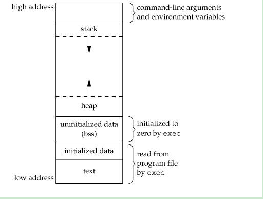

- [memory layout](#memory-layout)
  - [内存分区](#内存分区)
- [内存对齐](#内存对齐)

# memory layout
## 内存分区


- stack: grows downwards, from upper to lower adresses. The top of the stack is the stack pointer(sp).
- heap: grows upwards, from lower to upper addresses. The top of the heap is known as program break(brk).
- data segment: 通常是指用来存放程序中**已初始化的全局变量和静态变量**的一块内存区域, 属于静态内存分配.
- bbs segment: 通常是指用来存放程序中**未初始化的全局变量和静态变量**的一块内存区域, 紧跟在data segment 之后. 属于静态内
  存分配. 当这个内存区进入程序的地址空间后全部清零, 通常是memset全部置0, 也正因为此, 在生成的二进制文件中, bbs segment
  不占大小, 因为反正都会被置0, 只需要知道名字, 类型, 长度等meta 信息就行了.
- text segment: 通常是指用来存放程序执行代码的一块内存区域. 这部分区域的大小在程序运行前就已经确定, 并且内存区域通常属于
  只读.在代码段中,也有可能包含一些只读的常数变量,例如字符串常量等.

- 栈, 是向下生长的, 而堆是向上生长的,正好形成一个闭区间.
- 通常把data segment 和bbs segment 统一称为数据区.
- `std::vector<T> v` 中只有对象v本身是在栈上的,它所管理的数据(这些数据大多数时候都会远大于其本身的大小)还是保存在堆上.

我们知道知道在UNIX操作系统中,一个C语言文件经过预处理(cpp),编译(cc1),汇编(as)和链接(ld)后可以得到可执行文件a.out.
我们可以用size命令(或nm, dump)检查可执行文件,它会告诉你这个文件中的三个段(文本段.text, 数据段.data, .bss段)的大小.

上面这些内容可以通过size命令很直观的查看与验证.
```cpp
int data[30000] = {1, 2, 3, 4, 5, 6};
int bbs[30000];
int main() {}
```
```plain
[18:49:57 root@dev:code]$ ll -trh a.out
-rwxr-xr-x 1 root root 134K Jan 24 18:49 a.out
[18:50:02 root@dev:code]$ size a.out
   text	   data	    bss	    dec	    hex	filename
   1418	 120560	 120032	 242010	  3b15a	a.out
```
30000 个int 类型的数据, 大小为120KB 左右, a.out 文件大小明显小于 240KB, 说明bbs 确实不占a.out 的大小.

# 内存对齐
某个类型放的地址必须是其大小的倍数

```cpp
struct A {
  char c;
  int i;
} a;
```
因为内存对齐的原因,`char c` 占用4 个字节, 但实际使用1个字节, `int i` 占用4个字节.
```cpp
&a.c == (char *)&a
(char *)&a.i == &a.c + 4
```
C++标准委员会不限制由"public/protected/private"关键字分开的各段在实现时的先后顺序, 因此, 不同的编译器实现的内存布局可能
并不相同.

