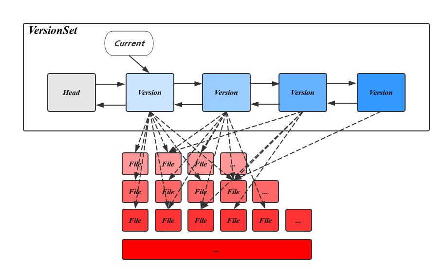

# leveldb
[LevelDB库简介](https://www.cnblogs.com/chenny7/p/4026447.html)

LevelDB是Google开源的持久化KV单机数据库,具有很高的随机写,顺序读/写性能,但是随机读的性能很一般,也就是说,LevelDB很适合应用在查询较少,而写很多的场景.

特性

1. 可以创建数据全景的snapshot(快照),并允许在快照中查找数据,
1. 可以通过前向(或后向)迭代器遍历数据(迭代器会隐含的创建一个snapshot)
1. 一次只允许一个进程访问一个特定的数据库;
1. 没有内置的C/S架构,但开发者可以使用LevelDB库自己封装一个server;
1. LevelDB本身只是一个lib库,在源码目录make编译即可,然后在我们的应用程序里面可以直接include leveldb/include/db.h头文件

## 存储模型
下图是LevelDB运行一段时间后的存储模型快照:


内存中的MemTable和Immutable MemTable以及磁盘上的几种主要文件:Current文件,Manifest文件,log文件以及SSTable文件.
当然,LevelDb除了这六个主要部分还有一些辅助的文件,但是以上六个文件和数据结构是LevelDb的主体构成元素.

log文件,MemTable,SSTable文件都是用来存储k-v记录的,下面再说说manifest和Current文件的作用.

SSTable中的某个文件属于特定层级, 而且其存储的记录是key有序的,那么必然有文件中的最小key和最大key,这是非常重要的信息,Manifest 就记载了SSTable各个文件的管理信息,
比如属于哪个Level,文件名称叫啥,最小key和最大key各自是多少.下图是Manifest所存储内容的示意:

| level  |  sstable  | min key | max key |
|--------|-----------|---------|---------|
|level 0 | test1.sst | "abc"   | "hello" |
|level 0 | test2.sst | "bbc"   | "world" |

另外,在LevleDb的运行过程中,随着Compaction的进行,SSTable文件会发生变化,会有新的文件产生,老的文件被废弃,Manifest也会跟着反映这种变化,此时往往会新生成Manifest文件来记载这种变化,
而Current则用来指出哪个Manifest文件才是我们关心的那个Manifest文件.

在写memtable时,如果flush 的条件, 会将其改成immutable memtable(只读),然后等待dump到磁盘SST文件中,此时也会生成新的memtable供写入新数据, memtable采用skiplist结构实现.

## SSTable文件
Level 0的SSTable文件和其它Level的文件相比有特殊性:这个层级内的sst文件,两个文件可能存在key重叠.
其它Level的SSTable文件, 则不会出现同一层级内sst文件的key重叠现象,就是说Level L(L >= 1)中任意两个sst文件,那么可以保证它们的key值是不会重叠的.

当某个level下的SSTable文件数目超过一定设置值后,levelDb会从这个level的SSTable中选择一个文件, 将其和高一层级的level+1的SSTable文件合并,这就是major compaction.

我们知道在大于0的层级中,每个SSTable文件内的Key都是由小到大有序存储的,而且不同文件之间的key范围(文件内最小key和最大key之间)不会有任何重叠.
Level 0的SSTable文件有些特殊,尽管每个文件也是根据Key由小到大排列,但是因为level 0的文件是通过minor compaction直接生成的,所以任意两个level 0下的两个sstable文件可能再key范围上有重叠.
所以在做major compaction的时候,对于大于level 0的层级,选择其中一个文件就行,但是对于level 0来说,指定某个文件后,本level中很可能有其他SSTable文件的key范围和这个文件有重叠,
这种情况下,要找出所有有重叠的文件和level 1的文件进行合并,即level 0在进行文件选择的时候,可能会有多个文件参与major compaction.

LevelDb在选定某个level进行compaction后,还要选择是具体哪个文件要进行compaction,比如这次是文件A进行compaction,那么下次就是在key range上紧挨着文件A的文件B进行compaction,
这样每个文件都会有机会轮流和高层的level 文件进行合并.

如果选好了level L的文件A和level L+1层的文件进行合并,那么问题又来了,应该选择level L+1哪些文件进行合并?
levelDb选择L+1层中和文件A在key range上有重叠的所有文件来和文件A进行合并.也就是说,选定了level L的文件A,之后在level L+1中找到了所有需要合并的文件B,C,D…..等等.

## 版本控制
在Leveldb中,Version就代表了一个版本,它包括当前磁盘及内存中的所有文件信息.在所有的version中,只有一个是CURRENT(当前版本),其它都是历史版本.

当执行一次compaction 或者 创建一个Iterator后,Leveldb将在当前版本基础上创建一个新版本,当前版本就变成了历史版本.

VersionSet 所有Version 构成的双向链表, 这些Version按时间顺序先后产生，记录了当时的元信息，链表头指向当前最新的Version，
同时维护了每个Version的引用计数，被引用中的Version不会被删除，其对应的SST文件也因此得以保留，通过这种方式，使得LevelDB可以在一个稳定的快照视图上访问文件。
VersionSet中除了Version的双向链表外还会记录一些如LogNumber，Sequence，下一个SST文件编号的状态信息。



VersionEdit 表示Version之间的变化,相当于delta 增量,表示有增加了多少文件,删除了文件:

```
Version0 + VersionEdit --> Version1
Version0->Version1->Version2->Version3
```
VersionEdit会保存到MANIFEST文件中,当做数据恢复时就会从MANIFEST文件中读出来重建数据.

Leveldb的version管理和双buffer切换类似,但是如果原version被某个iterator引用,那么这个version会一直保持,直到没有被任何一个iterator引用,此时就可以删除这个version.

## RocksDB
RocksDB支持一次获取多个K-V,还支持Key范围查找.LevelDB只能获取单个Key

压缩方面RocksDB可采用多种压缩算法,除了LevelDB用的snappy,还有zlib,bzip2.LevelDB里面按数据的压缩率(压缩后低于75%)判断是否对数据进行压缩存储,
而RocksDB典型的做法是Level 0-2不压缩,最后一层使用zlib,而其它各层采用snappy.

RocksDB支持管道式的Memtable,也就说允许根据需要开辟多个Memtable,以解决Put与Compact速度差异的性能瓶颈问题.
在LevelDB里面因为只有一个Memtable,如果Memtable满了却还来不及持久化,这个时候LevelDB将会减缓Put操作,导致整体性能下降.

# redis
## intro
redis 中数据对象都是 string 类型, 但是有时会把string 解释成其他类型, 例如 incr 会把 string 解释成int 类型

Redis keys are binary safe, this means that you can use any binary sequence as a key, from a string like "foo" to the content of a JPEG file.
The empty string is also a valid key.

- FLUSHALL: 清空所有数据
- RANDOMKEY: 随机获取一个key
- DBSIZE: 返回当前数据库的 key 的数量
- INFO: Redis 服务器的各种信息和统计数值

- start: `redis-server redis.conf`
- stop: `redis-cli shutdown`

## data type
### Binary-safe string
- `set key value`: 如果key 之前有值, 会被替换掉
- `setnx key value`: set if not exist
- `get key`
- `incr key` => "11" ## incr 是原子操作, INCRBY, DECR and DECRBY
- `del key`
- `expire key time(in seconds)`, 只对之前紧挨着的set key value 有效
- `ttl key`: 返回key的仍然有效时间, The -2 means that the key does not exist (anymore), -1 means that it will never expire.
- `exists key`
- `type key`, which returns the kind of value stored at the specified key:

C API

- set 返回的`reply->type` 为 `REDIS_REPLY_STATUS`, `reply->str` 为 "OK"
- del 返回 `reply->type` 为 `REDIS_REPLY_INTEGER`
- get 返回的type 为 `REDIS_REPLY_STATUS`, 结果在 `reply->str` 中

### Lists
collections of string elements sorted according to the order of insertion. They are basically linked lists

- RPUSH(LPUSH): right push, left push
- LLEN: list length
- LRANGE: lrange list start end(包括两个边界), 0 表示第一个元素, -1 表示最后一个元素
- LPOP(RPOP): left(right) pop: removes the first(last) element from the list and returns it

### Sets
collections of unique, unsorted string elements

- SADD: set add
- SREM: set remove
- SISMEMBER: set is member
- SMEMBERS: set members: returns all members
- SUNION: set union

### Sorted sets
similar to Sets but where every string element is associated to a floating number value, called score.
The elements are always taken sorted(正序排列的) by their score, so unlike Sets it is possible to retrieve a range of elements
(for example you may ask: give me the top 10, or the bottom 10).

- `zadd set score value`
- `zrange set start end`;
- zrangebyscore: `zrangebyscore hackers -inf 1950`

### Hash
- `HSET key field1 value1`, 或者合在一起`HMSET key field1 value1 field2 value2 ... fieldn valuen`
- `HGETALL key`
- `HGET key fieldi`
	- C API 中 HGET 不存在的key, 返回的reply type 为 `REDIS_REPLY_NIL`
- `HDEL key field1 field2 ... fieldn`
- `HINCRBY key fieldi num`: num 设置为负, 就实现了减

### Bit arrays (or simply bitmaps)
it is possible, using special commands, to handle String values like an array of bits:
you can set and clear individual bits, count all the bits set to 1, find the first set or unset bit, and so forth

## API
```C++
typedef struct redisReply {
	int type; /* REDIS_REPLY_* */
	long long integer; /* The integer when type is REDIS_REPLY_INTEGER */
	int len; /* Length of string */
	char *str; /* Used for both REDIS_REPLY_ERROR and REDIS_REPLY_STRING */
	size_t elements; /* number of elements, for REDIS_REPLY_ARRAY */
	struct redisReply **element; /* elements vector for REDIS_REPLY_ARRAY */
} redisReply;
```

`redisReply *reply = (redisReply *)redisCommand(redis, cmd);` 每次都需要执行`freeReplyObject(reply);`释放redisCommand 函数为reply 申请的内存

pipeline

1. redis的底层通信协议对管道(Pipelining)提供了支持,
2. 通过管道可以一次发送多条命令,并在执行完命令后将结果统一返回,
3. 当一组命令中每条命令都不依赖于之前命令的执行结果时,就可以将这组命令一起放入管道中发出,
4. 管道通过减少通信次数,降低往返时延累加造成的性能消耗,从而提升效率,

## 扩展写性能和内存容量
[Redis实战:如何构建类微博的亿级社交平台](http://www.tuicool.com/articles/eyAfeyq)

随着被缓存的数据越来越多,当数据没办法被存储到单台机器上面的时候,我们就需要想办法把数据分割存储到由多台机器组成的集群里面.
如果用尽了一切方法降低内存占用并且尽可能地提高性能之后,问题仍然未解决,那么说明我们已经遇到了只使用单台机器带来的瓶颈,是时候将数据分片到多台机器上面了.

本文介绍的数据分片方法要求用户使用固定数量的 Redis 服务器.
举个例子,如果写入量预计每 6 个月就会增加 4 倍,那么我们可以将数据预先分片(preshard)到 256 个分片里面,从而拥有一个在接下来的 2 年时间里面都能够满足预期写入量增长的分片方案
具体要规划多长远的方案要由你自己决定).
在为了应对未来可能出现的流量增长而对系统进行预先分片的时候,我们可能会陷入这样一种处境:目前拥有的数据实在太少,按照预先分片方法计算出的机器数量去存储这些数据只会得不偿失.
为了能够如常地对数据进行分割,我们可以在单台机器上面运行多个 Redis 服务器,并将每个服务器用作一个分片.
注意,在同一台机器上面运行多个 Redis 服务器的时候,请记得让每个服务器都监听不同的端口,并确保所有服务器写入的都是不同的快照文件或 AOF 文件.

# 实践
#### 用get/set方式使用Redis
作为一个key value存在, 很多开发者自然的使用set/get方式来使用Redis, 实际上这并不是最优化的使用方法. 尤其在未启用VM情况下, Redis全部数据需要放入内存, 节约内存尤其重要.
假如一个key-value单元需要最小占用512字节, 即使只存一个字节也占了512字节.
这时候就有一个设计模式, 可以把key复用, 几个key-value放入一个key中, value再作为一个set存入, 这样同样512字节就会存放10 - 100倍的容量.
这就是为了节约内存, 建议使用hashset而不是set/get的方式来使用Redis

# memcache
ref: [MemCache超详细解读](http://www.csdn.net/article/2016-03-16/2826609)

MemCache虽然被称为"分布式缓存",但是MemCache本身完全不具备分布式的功能,MemCache集群之间不会相互通信,所谓的"分布式",完全依赖于客户端程序的实现.

MemCache一次写缓存的流程:

1. 应用程序输入需要写缓存的数据
2. API将Key输入路由算法模块,路由算法根据Key和MemCache集群服务器列表得到一台服务器编号
3. 由服务器编号得到MemCache及其的ip地址和端口号
4. API调用通信模块和指定编号的服务器通信,将数据写入该服务器,完成一次分布式缓存的写操作

读缓存和写缓存一样,只要使用相同的路由算法和服务器列表,只要应用程序查询的是相同的Key

不能够遍历MemCache中所有的item,因为这个操作的速度相对缓慢且会阻塞其他的操作

MemCache的高性能源自于两阶段哈希结构:

1. 第一阶段在客户端,通过Hash算法根据Key值算出一个节点,
1. 第二阶段在服务端,通过一个内部的Hash算法,查找真正的item并返回给客户端.从实现的角度看,MemCache是一个非阻塞的,基于事件的服务器程序

## 一致性Hash算法

## Memcache内存管理机制
ref: [Memcache内存分配机制](https://my.oschina.net/hejiula/blog/151287)


- MemCache将内存空间分为一组slab
- 每个slab下又有若干个page,每个page默认是1M(所以每个value 的大小不能超过1M),如果一个slab占用100M内存的话,那么这个slab下应该有100个page
- 每个page里面包含一组chunk,chunk是真正存放数据的地方,同一个slab里面的chunk的大小是固定的
- 有相同大小chunk的slab被组织在一起,称为slab class
- MemCache内存分配的方式称为allocator,slab的数量是有限的,几个,十几个或者几十个,这个和启动参数的配置相关.

# redis vs memcache
ref: [ Redis和Memcache对比及选择](http://blog.csdn.net/sunmenggmail/article/details/36176029)

You should not care too much about performances.
**Redis is faster per core with small values, but memcached is able to use multiple cores** with a single executable and TCP port without help from the client.
Also memcached is faster with big values in the order of 100k. Redis recently improved a lot about big values (unstable branch) but still memcached is faster in this use case.
The point here is: nor one or the other will likely going to be your bottleneck for the query-per-second they can deliver.

You should care about memory usage.
For simple key-value pairs memcached is more memory efficient.
If you use Redis hashes, Redis is more memory efficient. Depends on the use case.

You should care about persistence and replication, two features only available in Redis.
Even if your goal is to build a cache it helps that after an upgrade or a reboot your data are still there.

You should care about the kind of operations you need.
In Redis there are a lot of complex operations, even just considering the caching use case, you often can do a lot more in a single operation,
without requiring data to be processed client side (a lot of I/O is sometimes needed).
This operations are often as fast as plain GET and SET. So if you don't need just GEt/SET but more complex things Redis can help a lot (think at timeline caching).

# Berkeley DB
[嵌入式数据库系统Berkeley DB](https://www.ibm.com/developerworks/cn/linux/l-embdb/index.html)

DB是嵌入式数据库系统,而不是常见的关系/对象型数据库, DB的设计思想是简单,小巧,可靠,高性能. DB库非常紧凑,不超过500K,但可以管理大至256T的数据量.
DB提供了一系列应用程序接口(API),调用本身很简单,应用程序和DB所提供的库在一起编译成为可执行程序.
这种方式从两方面极大提高了DB的效率.第一:DB库和应用程序运行在同一个地址空间,没有客户端程序和数据库服务器之间昂贵的网络通讯开销,也没有本地主机进程之间的通讯,第二:不需要对SQL代码解码,对数据的访问直截了当.
DB的设计充分体现了UNIX的基于工具的哲学,即若干简单工具的组合可以实现强大的功能. DB的每一个基础功能模块都被设计为独立的,也即意味着其使用领域并不局限于DB本身.
例如加锁子系统可以用于非DB应用程序的通用操作,内存共享缓冲池子系统可以用于在内存中基于页面的文件缓冲.

## DB核心数据结构
- 数据库句柄DB: 包含了若干描述数据库属性的参数,如数据库访问方法类型,逻辑页面大小,数据库名称等,同时,DB结构中包含了大量的数据库处理函数指针,大多数形式为 `(*dosomething)(DB *, arg1, arg2, ...)`. 其中最重要的有open,close,put,get等函数.
- 数据库记录DBT: DB中的记录由关键字和数据构成, 关键字和数据都用结构DBT表示.实际上完全可以把关键字看成特殊的数据.结构中最重要的两个字段是 `void *data`和`u_int32_t size`,分别对应数据本身和数据的长度.
- 数据库游标DBC: 游标(cursor)是数据库应用中常见概念,其本质上就是一个关于特定记录的遍历器.注意到DB支持多重记录(duplicate records),即多条记录有相同关键字,在对多重记录的处理中,使用游标是最容易的方式.
- 数据库环境句柄`DB_ENV`: 环境在DB中属于高级特性,本质上看,环境是多个数据库的包装器.当一个或多个数据库在环境中打开后,环境可以为这些数据库提供多种子系统服务,例如多线/进程处理支持,事务处理支持,高性能支持,日志恢复支持等.

DB中核心数据结构在使用前都要初始化,随后可以调用结构中的函数(指针)完成各种操作,最后必须关闭数据结构.
从设计思想的层面上看,这种设计方法是利用面向过程语言实现面对对象编程的一个典范.

## DB数据访问算法
在数据库领域中,数据访问算法对应了数据在硬盘上的存储格式和操作方法.在编写应用程序时,选择合适的算法可能会在运算速度上提高1个甚至多个数量级.
大多数数据库都选用B+树算法,DB也不例外,同时还支持HASH算法,Recno算法和Queue算法.
接下来,我们将讨论这些算法的特点以及如何根据需要存储数据的特点进行选择.

- B+树算法: B+树是一个平衡树,关键字有序存储,并且其结构能随数据的插入和删除进行动态调整.为了代码的简单,DB没有实现对关键字的前缀码压缩.B+树支持对数据查询,插入,删除的常数级速度.关键字可以为任意的数据结构.
- HASH算法: DB中实际使用的是扩展线性HASH算法(extended linear hashing),可以根据HASH表的增长进行适当的调整.关键字可以为任意的数据结构.
- Recno算法: 要求每一个记录都有一个逻辑纪录号,逻辑纪录号由算法本身生成.实际上,这和关系型数据库中逻辑主键通常定义为int AUTO型是同一个概念.Recho建立在B+树算法之上,提供了一个存储有序数据的接口.记录的长度可以为定长或不定长.
- Queue算法: 和Recno方式接近, 只不过记录的长度为定长.数据以定长记录方式存储在队列中,插入操作把记录插入到队列的尾部,相比之下插入速度是最快的.

对算法的选择首先要看关键字的类型,如果为复杂类型,则只能选择B+树或HASH算法,如果关键字为逻辑记录号,则应该选择Recno或Queue算法.
当工作集关键字有序时,B+树算法比较合适, 如果工作集比较大且基本上关键字为随机分布时,选择HASH算法.
Queue算法只能存储定长的记录,在高的并发处理情况下,Queue算法效率较高,如果是其它情况,则选择Recno算法,Recno算法把数据存储为平面文件格式.

