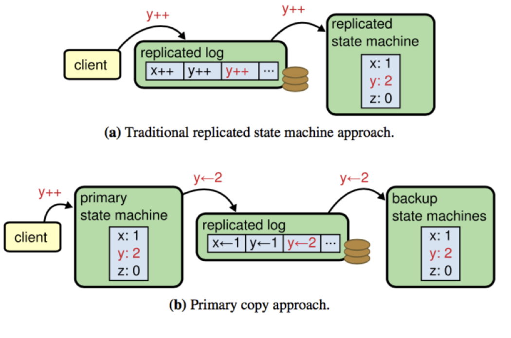

- [raft vs zab](#raft-vs-zab)
  - [Leader Election](#leader-election)
  - [Log replication and commitment](#log-replication-and-commitment)
  - [Log compaction](#log-compaction)
  - [Client read](#client-read)

# raft vs zab
[Raft协议和Zab协议及其对比](https://niceaz.com/2018/11/03/raft-and-zab/#raft-vs-zab)

## Leader Election
- 检测 leader down 机
  - Raft 协议 leader 宕机仅仅由 folower 进行检测,当 folower 收不到 leader 心跳时,则认为 leader 宕机,变为 candidate.
  - Zk 的 leader down 机分别由 leader 和 folower 检测,leader 维护了一个 Quorum 集合,当该 Quorum 集合不再超过半数,leader 自动变为 LOOKING 状态.
    folower 与 leader 之间维护了一个超链接,连接断开则 folower 变为 LOOKING 状态.
- 过期 leader 的屏蔽:Raft 通过 term 识别过期的 leader.Zk 通过 Epoch识别过期的 leader.这点两者是相似的
- leader 选举的投票过程:Raft 每个选举周期每个节点只能投一次票,选举失败进入下次周期才能重新投票.Zk 每次选举节点需要不断的变换选票以便选出数据最新的节点为 leader
- 保证 commited 的数据出现在未来 leader 中:Raft选取 leader 时拒绝数据比自己旧的节点的投票.Zk 通过在选取 leader 时不断更新选票使得拥有最新数据的节点当选 leader

## Log replication and commitment
- 选取新 leader 后数据同步:
  - Raft 没有固定在某个特定的阶段做这件事情,通过每个节点的 AppendEntry RPC 分别做数据同步.
  - Zk 则在新leader 选举之后,有一个 Recovery Phase 做这个件事情.
- 选取新 leader 后同步的数据量:
  - Raft 只需要传输和新 leader 差异的部分.
  - Zab 的原始协议需要传输 leader 的全部数据,Zk 优化后,视情况而定,最坏情况下需要传输 leader 全部数据.
- 新 leader 对之前 leader 未 commit 数据的处理:
  - Raft 不会直接 commit 之前 leader 的数据,通过 commit 本 term 的数据间接的 commit 之前 leader 的数据.
  - Zk 在 Recovery Phase直接 commit 之前 leader 的数据.
- 新加入集群节点的数据同步:
  - Raft 对于新加入集群的节点数据同步不会影响客户端的写请求.
  - Zk 对于新加入集群的节点,需要单独走一下 Recovery Phase,目前是通过读写锁同步的,因此会阻塞客户端的写请求.(Zk 可以在这里使用 copy-on-write 机制避免阻塞问题??)

## Log compaction
Raft 和 Zk 状态机的实现机制不同使得两者在 snapshot 的时候有很大差别.
Raft是典型的传统复制状态机,对于更新请求,严格复制对应的 command.
Zk 则不是严格的复制状态机,对于更新请求,复制的不是响应的 command 而是更新后的值.如图所示.

- Raft 的 snapshot 机制对应了某一个时刻完成的状态机的数据
- Zk 是一种 fuzzy snapshot 机制,Zk snapshot 的时候,会记录下来当前的 zxid,恢复的时候,从该 snapshot 开始,replay 所有的 log 实现最终数据的正确性.Zk 甚至不存在一个时刻和 snapshot 的数据完全一致.

Zk 之所以可以这样做,很大程度上依赖于其状态机的实现,比如 y++ 这条 log 在 Raft的复制状态机机制下如果被重复执行就会导致错误的结果,但是 y <- 2 被重复执行不会影响数据的正确性.

## Client read
- Raft 严格禁止 stale read 的存在,无论是 Raft log read 或 readIndex read 或 lease read 都不会出现 stale read.
- Zk 默认情况下会出现 stale read,如果想避免 stale read 必须使用 sync() + read()
