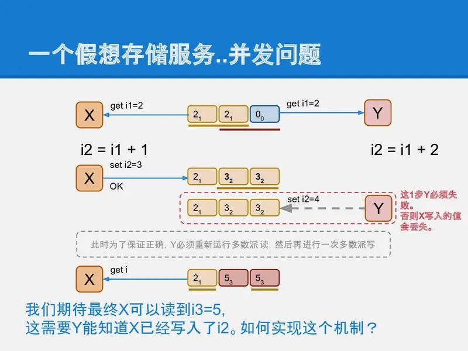
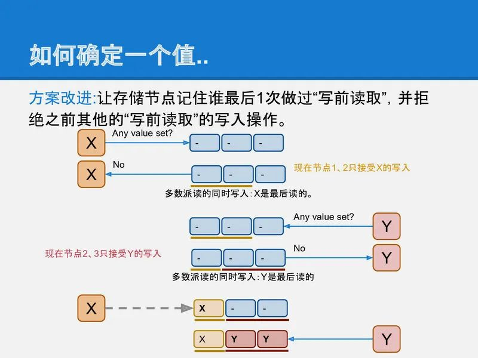

# intro
[分布式算法Paxos 的直观解释](https://mp.weixin.qq.com/s/-ULrqBZ_GLY1_LN9eNPpXg)

分布式中唯一的一个问题, 对某事达成一致.
Paxos协议由Leslie Lamport最早在1990年提出,由于Paxos在云计算领域的广泛应用Leslie Lamport因此获得了2013年度图灵奖.

paxos的工作, 就是把一堆运行的机器协同起来, 让多个机器成为一个整体系统. 在这个系统中, 每个机器都必须让系统中的状态达成一致,
例如三副本集群如果一个机器上上传了一张图片, 那么另外2台机器上也必须复制这张图片过来, 整个系统才处于一个一致的状态.

# 基础的复制算法
## 主从异步复制
主从异步复制是最简单的策略之一, 它很容易实现, 但存在一个问题: 客户端收到一个数据已经安全(OK)的信息, 跟数据真正安全(数据复制到全部的机器上)在时间上有一个空隙,
这段时间负责接收客户端请求的那个机器(master)如果被闪电击中或被陨石砸到或被打扫卫生的大姐踢断了电源, 那数据就可能会丢失.
因此它不是一个可靠的复制策略(使用主从异步复制要求你必须相信宇宙中不存在闪电陨石和扫地大姐).

如MysQL 的主从异步复制

## 主从同步复制
跟主从异步复制相比, 主从同步复制提供了完整的可靠性: 直到数据真的安全的复制到全部的机器上之后, master才告知客户端数据已经安全.

但主从同步复制有个致命的缺点就是整个系统中有任何一个机器宕机, 写入就进行不下去了. 相当于系统的可用性随着副本数量指数降低.

## 主从半同步复制
在同步和异步之间, 做一个折中, 看起来是一个不错的方案. 这就是半同步复制.
它要求master在应答客户端之前必须把数据复制到足够多的机器上, 但不需要是全部. 这样副本数够多可以提供比较高的可靠性; 1台机器宕机也不会让整个系统停止写入.

但是它还是不完美, 例如数据a复制到slave-1, 但没有到达slave-2; 数据b复制达到了slave-2但没有到达slave-1, 这时如果master挂掉了需要从某个slave恢复出数据,
任何一个slave都不能提供完整的数据. 所以在整个系统中, 数据存在某种不一致.

## 多数派读写
为了解决半同步复制中数据不一致的问题, 可以将这个复制策略再做一改进: 多数派读写: 每条数据必须写入到半数以上的机器上. 每次读取数据都必须检查半数以上的机器上是否有这条数据.

在这种策略下, 数据可靠性足够, 宕机容忍足够, 任一机器故障也能读到全部数据.

然鹅多数派读写的策略也有个但是, 就是对于一条数据的更新时, 会产生不一致的状态. 例如:

- node-1, node-2都写入了a=x,
- 下一次更新时node-2, node-3写入了a=y.

这时, 一个要进行读取a的客户端如果联系到了node-1和node-2, 它将看到2条不同的数据.

为了不产生歧义, 多数派读写还必须给每笔写入增加一个全局递增的时间戳. 更大时间戳的记录如果被看见, 就应该忽略小时间戳的记录.
这样在读取过程中, 客户端就会看到a=x₁, a=y₂ 这2条数据, 通过比较时间戳1和2, 发现y是更新的数据, 所以忽略a=x₁. 这样保证多次更新一条数据不产生歧义.

是的, 但是又来了. 这种带时间戳的多数派读写依然有问题. 就是在客户端没有完成一次完整的多数派写的时候:
例如, 上面的例子中写入, a=x₁写入了node-1和node-2, a=y₂时只有node-3 写成功了, 然后客户端进程就挂掉了, 留下系统中的状态如下:

```info
node-1: a=x₁
node-2: a=x₁
node-3: a=y₂
```
这时另一个读取的客户端来了,

- 如果它联系到node-1和node-2, 那它得到的结果是a=x₁.
- 如果它联系到node-2和node-3, 那它得到的结果是a=y₂.

整个系统对外部提供的信息仍然是不一致的.

现在我们已经非常接近最终奥义了, paxos可以认为是多数派读写的进一步升级, paxos中通过2次原本并不严谨的多数派读写, 实现了严谨的强一致consensus算法.

# 从多数派读写到paxos的推导
首先为了清晰的呈现出分布式系统中的核心问题: 一致性问题, 我们先设定一个假象的存储系统, 在这个系统上, 我们来逐步实现一个强一致的存储, 就得到了paxos对一致性问题的解决方法.

一个假象存储服务

- 一个有三个存储节点的存储服务集群
- 使用多数派读写的策略
- 只存储1 个变量 i
- i 的每次更新对应多个版本, i1, i2, i3......
- 这个存储系统支持3 个命令
  1. get: 读最新的 i
  1. set <n>: 设置下个版本i 的值
  1. inc <n>: 对i 加<n>, 也生成1 个新版本

我们将用这个存储系统来演示多数派读写策略的不足, 以及如何用paxos 解决这些问题.

在实现中, set命令直接实现为一个多数派写, 这一步非常简单.
而inc操作逻辑上也很简单, 读取一个变量的值i₁, 给它加上一个数字得到i₂, 再通过多数派把i₂写回到系统中.

冰雪如你一定已经看到了这种实现方式中的问题: 如果有2个并发的客户端进程同时做这个inc的操作, 在多数派读写的实现中, 必然会产生一个Y客户端覆盖X客户端的问题. 从而产生了数据更新点的丢失.

而paxos就是为了解决这类问题提出的, 它需要让Y能检测到这种并发冲突, 进而采取措施避免更新丢失.



提取一下上面提到的问题: 让Y去更新的时候不能直接更新i₂, 而是应该能检测到i₂的存在, 进而将自己的结果保存在下一个版本i₃中, 再写回系统中.

而这个问题可以转化成: i的每个版本只能被写入一次, 不允许修改. 如果系统设计能满足这个要求, 那么X和Y的inc操作就都可以正确被执行了.

于是我们的问题就转化成一个更简单, 更基础的问题: 如何确定一个值(例如iⱼ)已经被写入了.

直观来看, 解决方法也很简单, 在X或Y写之前先做一次多数派读, 以便确认是否有其他客户端进程已经在写了, 如果有, 则放弃.

但是!!!, 这里还有个并发问题, X和Y可能同时做这个写前读取的操作, 并且同时得出一个结论: 还没有其他进程在写入, 我可以写. 这样还是会造成更新丢失的问题.

为了解决上面的问题, 存储节点还需要增加一个功能, 就是它必须记住谁最后一个做过写前读取的操作. 并且只允许最后一个完成写前读取的进程可以进行后续写入, 同时拒绝之前做过写前读取的进程写入的权限.

可以看到, 如果每个节点都记得谁读过, 那么当Y最后完成了写前读取的操作后, 整个系统就可以阻止过期的X的写入.

这个方法之所以能工作也是因为多数派写中, 一个系统最多只能允许一个多数派写成功. paxos也是通过2次多数派读写来实现的强一致.


TODO: 这里有个疑问, 如图中所说, 最后, 1节点只接受X 的写入, 2, 3 节点只接受Y 的写入, 那在多数派写的时候, 如果Y 联系到的是 1和2 怎么办, 1 他写不进去, 会怎么处理.
还是Y 在做写前读取的时候, 读取的是 2 和 3, 写的时候直接写这两个节点?

以上就是paxos算法的全部核心思想了, 是不是很简单? 剩下的就是如何实现的简单问题了: 如何标识一个客户端如X和Y, 如何确认谁是最后一个完成写前读写的进程, 等等.

# Paxos算法描述
Paxos 是什么

- 一个可靠的存储系统, 基于多数派读写
- 每个paxos 实例用来存储一个值
- 用两轮RPC 来确定一个值
- 一个值确定后不能被修改
- 确定指被多数派接受写入
- 强一致性

我们要介绍的paxos实际上是最朴实的classic paxos, 在这之后我们顺提下几个老爷子对paxos的优化, multi paxso和fast paxos, 它们都是针对paxos的理论层面的优化.

- classic paxos: 1 个实例(确定1个值)写入需要2轮RPC
- multi paxos: 约为1轮RPC, 确定1个值(第一次RPC 做了合并)
- fast paxos:
  - 没冲突: 1轮RPC 确定一个值
  - 有冲突: 2轮RPC 确定一个值

paxos算法中解决了如何在不可靠硬件基础上构建一个可靠的分布式系统的方法.
但paxos核心算法中只解决网络延迟/乱序的问题, 它不试图解决存储不可靠和消息错误的问题, 因为这两类问题本质上跟分布式关系不大, 属于数据校验层面的事情.

有兴趣可以参考 [Byzantine Paxos] 的介绍.

Paxos 的执行条件

- 存储必须是可靠的, 没有数据丢失和错误, 否则需要用Byzantine Paxos
- 容忍
  - 消息丢失(节点不可达)
  - 消息乱序

Paxos 概念

- Proposer: 发起paxos 的进程, 可以理解为客户端.
- Acceptor: 存储节点, 接受, 处理和存储消息
- Quorum: 在99%的场景里都是指多数派, 也就是半数以上的Acceptor.
- Round 用来标识一次paxos算法实例, 每个round是2次多数派读写: 算法描述里分别用phase-1和phase-2标识.
  同时为了简单和明确, 算法中也规定了每个Proposer都必须生成全局单调递增的round, 这样round既能用来区分先后也能用来区分不同的Proposer(客户端).

在存储端(Acceptor) 也有几个概念

- last_rnd: 是acceptor 记住的最后一次进行写前读取的proposer(客户端)是谁, 以此来决定谁可以在后面真正把一个值写到存储中.
- v: 最后被写入的值
- vrnd(value round number): 跟v 是一对, 记录了在哪个round 中v 被写入了

v 和 vrnd 是用于恢复一次未完成的paxos 用的.
一次未完成的paxos算法运行可能留下一些没有达到多数派的值的写入(就像原生的多数派写的脏读的问题), paxos中通过vrnd来决定哪些值是最后写入的, 并决定恢复哪个未完成的paxos运行.
后面我们会通过几个例子来描述vrnd的作用.

# why zab
那既然Paxos如此强大,那为什么还会出现ZAB协议?

Paxos协议虽然是完备的,但要把它应用到实际的分布式系统中还有些问题要解决:

1. 在多个Proposer的场景下,Paxos不保证先提交的提案先被接受,实际应用中要保证多提案被接受的先后顺序怎么办?
1. Paxos允许多个Proposer提交提案,那有可能出现活锁问题,出现场景是这样的:
  提案n在第二阶段还没有完成时, 新的提案n+1的第一阶段prepare请求到达Acceptor, 按协议规定Acceptor将响应新提案的prepare请求并保证不会接受小于n+1的任何请求,这可能导致提案n将不会被通过,
  同样在n+1提案未完成第二阶段时,假如提案n的提交者又提交了n+2提案,这可能导致n+1提案也无法通过.
1. Paxos协议规定提案的值v只要被大多数Acceptor接受过,后续的所有提案不能修改值v,那现实情况下我还要修改v值怎么办?

ZooKeeper的核心算法ZAB通过一个简单的约束解决了前2个问题:所有提案都转发到唯一的Leader(通过Leader选举算法从Acceptor中选出来的)来提交,由Leader来保证多个提案之间的先后顺序,
同时也避免了多Proposer引发的活锁问题.

[分布式系统可用性与一致性](https://blog.csdn.net/congge_1993/article/details/73613689)
