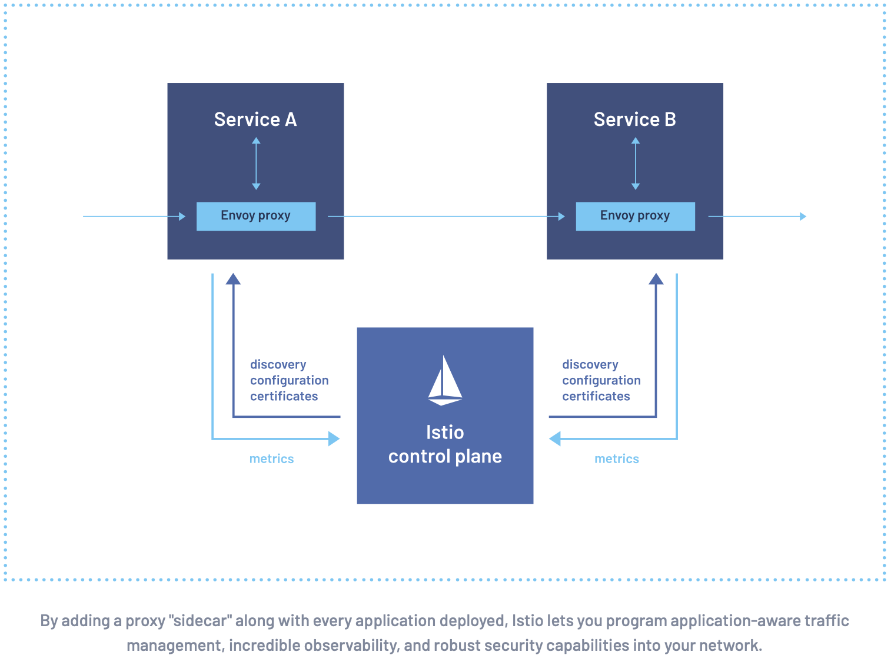

Modern applications are typically architected as distributed collections of microservices, with each collection of
microservices performing some discrete business function.
A service mesh is a dedicated infrastructure layer that you can add to your applications.
It allows you to transparently add capabilities like observability, traffic management, and security, without adding
them to your own code.

As the deployment of distributed services, such as in a Kubernetes-based system, grows in size and complexity, it can
become harder to understand and manage.
Its requirements can include discovery, load balancing, failure recovery, metrics, and monitoring.
A service mesh also often addresses more complex operational requirements, like A/B testing, canary deployments, rate
limiting, access control, encryption, and end-to-end authentication.

Service-to-service communication is what makes a distributed application possible.
Routing this communication, both within and across application clusters, becomes increasingly complex as the number of
services grow. Istio helps reduce this complexity while easing the strain on development teams.

Istio is an open source service mesh that layers transparently onto existing distributed applications.
