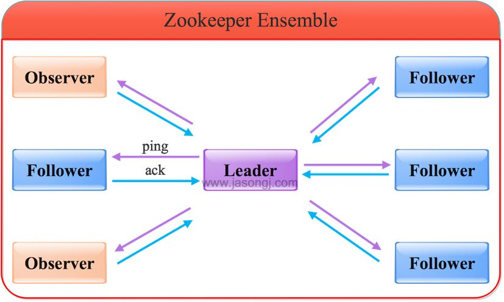
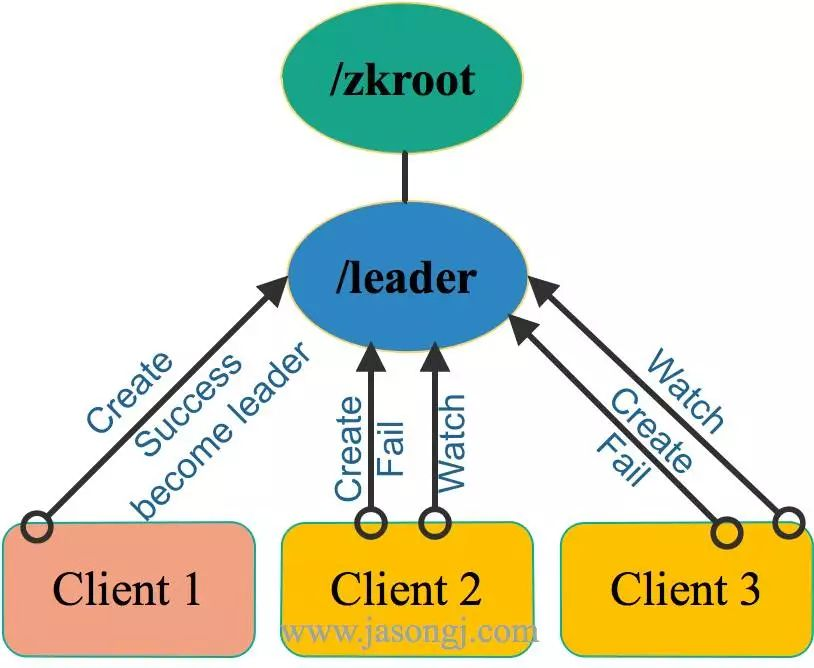
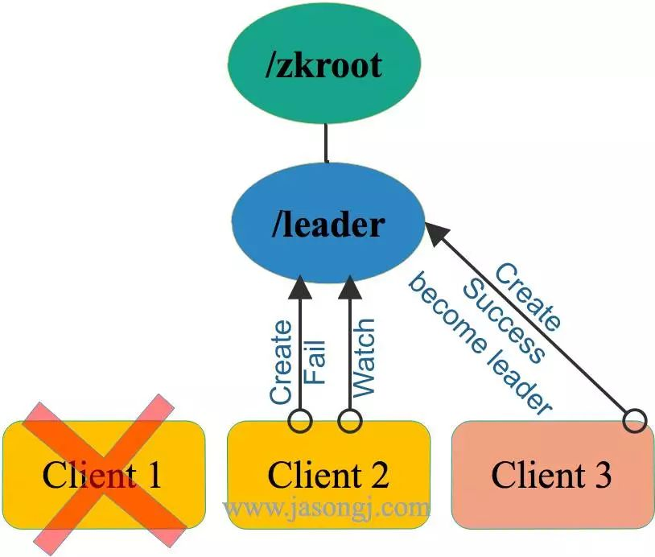
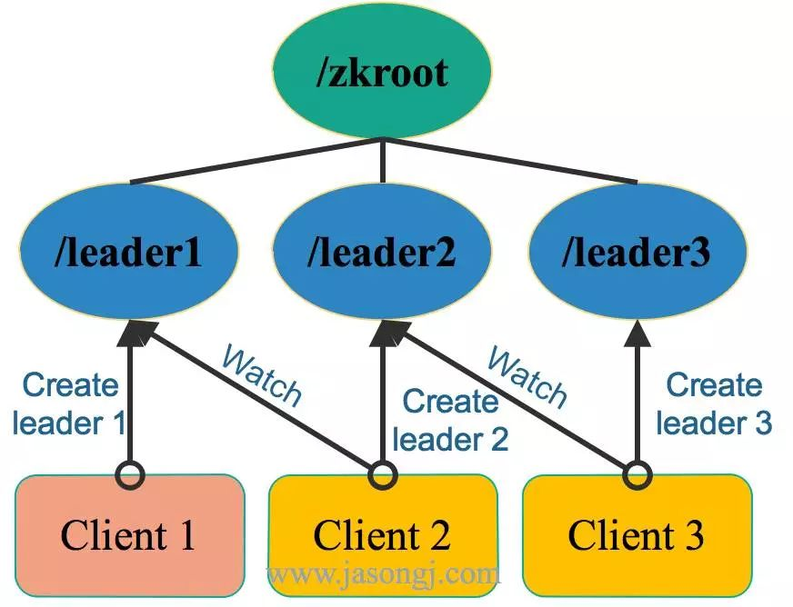
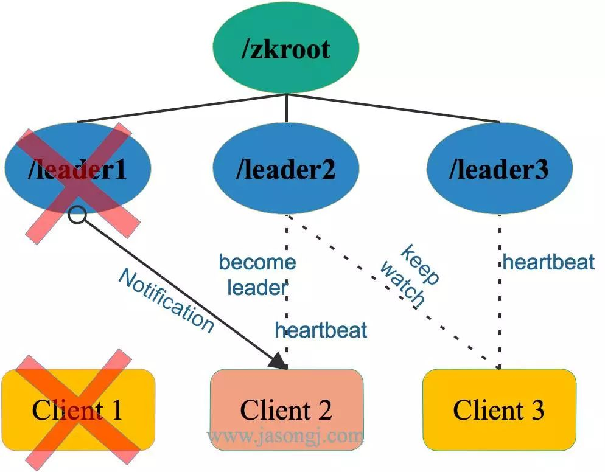
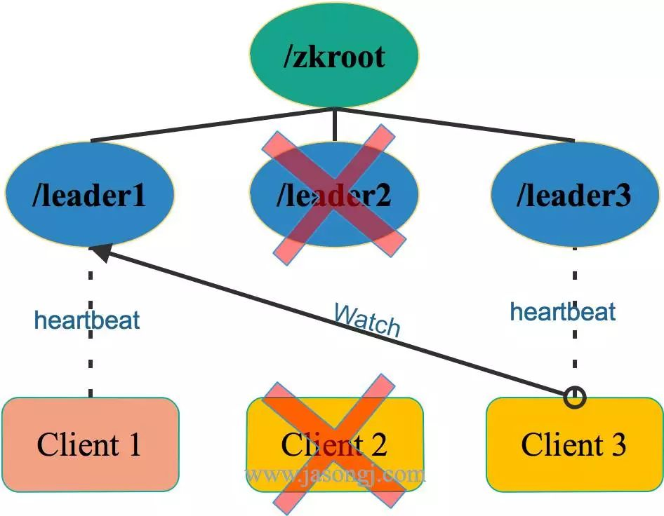

# intro
reference

- [实例详解ZooKeeper ZAB协议,分布式锁与领导选举](https://dbaplus.cn/news-141-1875-1.html)
- [十分钟了解ZAB协议](https://zhuanlan.zhihu.com/p/44207241)

ZooKeeper是一个分布式协调服务,可用于服务发现,分布式锁,分布式领导选举,配置管理等.

这一切的基础,都是ZooKeeper提供了一个类似于Linux文件系统的树形结构(可认为是轻量级的内存文件系统,但只适合存少量信息,完全不适合存储大量文件或者大文件),同时提供了对于每个节点的监控与通知机制.
既然是一个文件系统,就不得不提ZooKeeper是如何保证数据的一致性的.

本节将将介绍ZooKeeper如何保证数据一致性,如何进行领导选举,以及数据监控/通知机制的语义保证

Zookeeper基于ZAB(Zookeeper Atomic Broadcast) 实现了主备模式下的系统架构,保持集群中各个副本之间的数据一致性.

ZAB协议定义了选举(election),发现(discovery),同步(sync),广播(Broadcast)四个阶段.

- 选举(election): 选出哪台为主机,
- 发现(discovery): 同步(sync)当主选出后,要做的恢复数据的阶段,
- 广播(Broadcast): 当主机和从选出并同步好数据后,正常的主写同步从写数据的阶段.

ZooKeeper集群是一个基于主从复制的高可用集群,每个服务器承担如下三种角色中的一种:

- Leader 一个ZooKeeper集群同一时间只会有一个实际工作的Leader,它会发起并维护与各Follwer及Observer间的心跳.所有的写操作必须要通过Leader完成再由Leader将写操作广播给其它服务器.
- Follower 一个ZooKeeper集群可能同时存在多个Follower,它会响应Leader的心跳.Follower可直接处理并返回客户端的读请求,同时会将写请求转发给Leader处理,并且负责在Leader处理写请求时对请求进行投票.
- Observer 角色与Follower类似,但是无投票权.

zk集群的一个节点,有三种状态:

- looking: 选举状态,当前群龙无首,
- leading: leader才有的状态,
- following: follower才有的状态,

每次写成功的消息,都有一个全局唯一的标识,叫zxid.是64bit的正整数,高32为叫epoch表示选举纪元,低32位是自增的id,每写一次加一.

# 选举
当集群新建,或者主机死机,或者主机与一半或以上的从机失去联系后,都会触发选择新的主机操作.有两种算法fast paxos和basic paxos.

投票优先级:优先比较zxid,如果相等,再比较机器的id,都按从大到小的顺序
## fast paxos
默认ZAB采用的算法是fast paxos算法.

- 每次选举都要把选举轮数加一,类似于zxid里的epoch字段,防止不同轮次的选举互相干扰.
- 每个进入looking状态的节点,最开始投票给自己,然后把投票消息发给其它机器.内容为<第几轮投票, 被投节点的编号, 被投节点的zxid>. zxid 初始时都为0
- 其他looking状态的节点收到后,
  1. 首先判断票是否有效. 是否有效的方法为看票的投票轮数和本地记载的投票轮数是否相等:
    1. 如果比本地投票轮数的小,丢弃.
    1. 如果比本地投票轮数的大, 证明自己投票过期了,清空本地投票信息, 更新投票轮数和结果为收到的内容. 通知其他所有节点新的投票方案.
    1. 如果和本地投票轮数相等,按照投票的优先级比较收到的选票和自己投出去的选票.
      1. 如果收到的优先级大, 更新自己的投票为对方发过来投票方案,把投票发出去.
      1. 如果收到的优先级小,则忽略该投票.
      1. 如果收到的优先级相等, 则更新对应节点的投票.
- 每收集到一个投票后,查看已经收到的投票结果记录列表,看是否有节点能够达到一半以上的投票数.如果有达到,则终止投票,宣布选举结束,更新自身状态.然后进行发现和同步阶段. 否则继续收集投票.

## basic paxos
1. 每个looking节点先发出请求,询问其他节点的投票.其他节点返回自己的投票 <zk的id,zxid>.第一次都投自己.
1. 收到结果后,如果收到的投票比自己投票的zxid大,更新自己的投票.
1. **当收到所有节点返回后**,统计投票,有一个节点的选举达到一半以上,则选举成功.否则继续开始下一轮询问,直到选择出leader结束.

## basic paxos和fast paxos区别
这里fast是主动推送出,只要结果有更新,就马上同步给其他节点.其他节点可能还没把自己的票通知给所有节点,就发现自己投的票优先级低,要更新投票,然后更新再重新通知给所有节点.

basic则要每一节点都询问完,才能知道新结果,然后再去问其他节点新的选举结果.

fast比basic快的地方,是一个节点,不用和每个节点都交换投票信息后,才能知道自己的票是否要更新.会减少交互次数.

# 读写服务
根据ZAB协议,所有的写操作都必须通过Leader完成,Leader写入本地日志后再复制到所有的Follower节点.
一旦Leader节点无法工作,ZAB协议能够自动从Follower节点中重新选出一个合适的替代者,即新的Leader,该过程即为领导选举.该领导选举过程,是ZAB协议中最为重要和复杂的过程.

## 写Leader
通过Leader进行写操作流程如下图所示:

由上图可见,通过Leader进行写操作,主要分为五步:

1. 客户端向Leader发起写请求
1. Learder 主收到写请求时,先本地为事务生成zxid, 然后将写请求以Proposal的形式发给所有Follower并等待ACK
1. Follower收到Leader的Proposal后, 先把提议事务的日志写到本地磁盘,成功后返回给leader ACK
1. Leader得到过半数的ACK(Leader对自己默认有一个ACK)后, 对事务提交, 再通知向所有的Follower和Observer Commmit
1. Leader将处理结果返回给客户端

通过只有leader 控制写然后同步follower and observer, 保证了生成全局zxid不冲突.
全局唯一的zxid能够给选举和同步数据区分出优先级. 同时全局唯一递增的zxid, 保证了能够有优先级最高的节点当主.

## 写Follower/Observer

从上图可见:

1. Follower/Observer均可接受写请求,但不能直接处理,而需要将写请求转发给Leader处理
1. 除了多了一步请求转发,其它流程与直接写Leader无任何区别

## 读操作
Leader/Follower/Observer都可直接处理读请求,从本地内存中读取数据并返回给客户端即可.

由于处理读请求不需要服务器之间的交互,Follower/Observer越多,整体可处理的读请求量越大,也即读性能越好.

ZooKeeper 提供了一个类似于 Linux 文件系统的树形结构.该树形结构中每个节点被称为 znode ,可按如下两个维度分类:

# zk 使用
## zk 节点类型
1. Persist vs. Ephemeral
  - Persist节点,一旦被创建,便不会意外丢失,即使服务器全部重启也依然存在.每个 Persist 节点即可包含数据,也可包含子节点
  - Ephemeral节点,在创建它的客户端与服务器间的 Session 结束时自动被删除.服务器重启会导致 Session 结束,因此 Ephemeral 类型的 znode 此时也会自动删除
1. Sequence vs. Non-sequence
  - Non-sequence节点,多个客户端同时创建同一 Non-sequence 节点时,只有一个可创建成功,其它匀失败.并且创建出的节点名称与创建时指定的节点名完全一样
  - Sequence节点,创建出的节点名在指定的名称之后带有10位10进制数的序号.多个客户端创建同一名称的节点时,都能创建成功,只是序号不同

## zk 语义保证
ZooKeeper简单高效,同时提供如下语义保证,从而使得我们可以利用这些特性提供复杂的服务.

- 顺序性:客户端发起的更新会按发送顺序被应用到 ZooKeeper 上
- 原子性:更新操作要么成功要么失败,不会出现中间状态
- 单一系统镜像:一个客户端无论连接到哪一个服务器都能看到完全一样的系统镜像(即完全一样的树形结构).
  注:写操作并不保证更新被所有的 Follower 立即确认,因此通过部分 Follower 读取数据并不能保证读到最新的数据,而部分 Follwer 及 Leader 可读到最新数据.如果一定要保证单一系统镜像,可在读操作前使用 sync 方法.
- 可靠性:一个更新操作一旦被接受即不会意外丢失,除非被其它更新操作覆盖
- 最终一致性:写操作最终(而非立即)会对客户端可见

## ZooKeeper Watch机制
所有对 ZooKeeper 的读操作,都可附带一个 Watch .一旦相应的数据有变化,该 Watch 即被触发.

Watch 有如下特点:

- 主动推送:Watch被触发时,由 ZooKeeper 服务器主动将更新推送给客户端,而不需要客户端轮询.
- 一次性:数据变化时,Watch 只会被触发一次.如果客户端想得到后续更新的通知,必须要在 Watch 被触发后重新注册一个 Watch.
- 可见性:如果一个客户端在读请求中附带Watch, Watch 被触发的同时再次读取数据,客户端在得到 Watch 消息之前肯定不可能看到更新后的数据.换句话说,更新通知先于更新结果.
- 顺序性:如果多个更新触发了多个 Watch ,那 Watch 被触发的顺序与更新顺序一致.

# 分布式锁与领导选举关键点
1. 最多一个获取锁 / 成为Leader
  - 对于分布式锁(这里特指排它锁)而言,任意时刻,最多只有一个进程(对于单进程内的锁而言是单线程)可以获得锁.
  - 对于领导选举而言,任意时间,最多只有一个成功当选为Leader.否则即出现脑裂(Split brain)
1. 锁重入 / 确认自己是Leader
  - 对于分布式锁,需要保证获得锁的进程在释放锁之前可再次获得锁,即锁的可重入性.
  - 对于领导选举,Leader需要能够确认自己已经获得领导权,即确认自己是Leader.
1. 释放锁 / 放弃领导权
  - 锁的获得者应该能够正确释放已经获得的锁,并且当获得锁的进程宕机时,锁应该自动释放,从而使得其它竞争方可以获得该锁,从而避免出现死锁的状态.
  - 领导应该可以主动放弃领导权,并且当领导所在进程宕机时,领导权应该自动释放,从而使得其它参与者可重新竞争领导而避免进入无主状态.
1. 感知锁释放 / 领导权的放弃
  - 当获得锁的一方释放锁时,其它对于锁的竞争方需要能够感知到锁的释放,并再次尝试获取锁.
  - 原来的Leader放弃领导权时,其它参与方应该能够感知该事件,并重新发起选举流程.

## 非公平领导选举
从上面几个方面可见,分布式锁与领导选举的技术要点非常相似,实际上其实现机制也相近.这里以领导选举为例来说明二者的实现原理,分布式锁的实现原理也几乎一致.

### 选主过程
假设有三个ZooKeeper的客户端,如下图所示,同时竞争Leader.
这三个客户端同时向ZooKeeper集群注册Ephemeral且Non-sequence类型的节点,路径都为 /zkroot/leader(工程实践中,路径名可自定义)

如上图所示,由于是Non-sequence节点,这三个客户端只会有一个创建成功,其它节点均创建失败.
此时,创建成功的客户端(即上图中的Client 1)即成功竞选为 Leader .其它客户端(即上图中的Client 2和Client 3)此时均为 Follower.

### 放弃领导权
如果 Leader 打算主动放弃领导权,直接删除 /zkroot/leader 节点即可.

如果 Leader 进程意外宕机,其与 ZooKeeper 间的 Session 也结束,该节点由于是Ephemeral类型的节点,因此也会自动被删除.

此时 /zkroot/leader 节点不复存在,对于其它参与竞选的客户端而言,之前的 Leader 已经放弃了领导权.

### 感知领导权的放弃
由上图可见,创建节点失败的节点,除了成为 Follower 以外,还会向 /zkroot/leader 注册一个 Watch ,一旦 Leader 放弃领导权,也即该节点被删除,所有的 Follower 会收到通知.

### 重新选举
感知到旧 Leader 放弃领导权后,所有的 Follower 可以再次发起新一轮的领导选举,如下图所示.

从上图中可见:
新一轮的领导选举方法与最初的领导选举方法完全一样,都是发起节点创建请求,创建成功即为 Leader,否则为 Follower ,且 Follower 会 Watch 该节点
新一轮的选举结果,无法预测,与它们在第一轮选举中的顺序无关.这也是该方案被称为非公平模式的原因

小结

1. 非公平模式实现简单,每一轮选举方法都完全一样
1. 竞争参与方不多的情况下,效率高.每个 Follower 通过 Watch 感知到节点被删除的时间不完全一样,只要有一个 Follower 得到通知即发起竞选,即可保证当时有新的 Leader 被选出
1. 给ZooKeeper 集群造成的负载大,因此扩展性差.如果有上万个客户端都参与竞选,意味着同时会有上万个写请求发送给 Zookeper.
  如"ZooKeeper架构"一文所述,ZooKeeper 存在单点写的问题,写性能不高.同时一旦 Leader 放弃领导权,ZooKeeper 需要同时通知上万个 Follower,负载较大.

## 公平领导选举
### 选主过程
如下图所示,公平领导选举中,各客户端均创建 /zkroot/leader 节点,且其类型为Ephemeral与Sequence.

由于是Sequence类型节点,故上图中三个客户端均创建成功,只是序号不一样.此时,每个客户端都会判断自己创建成功的节点的序号是不是当前最小的.如果是,则该客户端为 Leader,否则即为 Follower.
(判断最小就意味着需要遍历这个目录下所有节点, 然后才能判断)

在上图中,Client 1 创建的节点序号为1, Client 2 创建的节点序号为2, Client 3 创建的节点序号为3. 由于最小序号为 1, 且该节点由Client 1 创建,故Client 1 为 Leader .

### 放弃领导权
Leader 如果主动放弃领导权,直接删除其创建的节点即可.
如果 Leader 所在进程意外宕机,其与 ZooKeeper 间的 Session 结束,由于其创建的节点为Ephemeral类型,故该节点自动被删除.

### 感知领导权的放弃
与非公平模式不同,每个 Follower 并非都 Watch 由 Leader 创建出来的节点,而是 **Watch 序号刚好比自己序号小的节点**.
在上图中,总共有 1,2,3 共三个节点,因此Client 2 Watch /zkroot/leader1,Client 3 Watch /zkroot/leader2.(注:序号应该是10位数字,而非一位数字,这里为了方便,以一位数字代替)
一旦 Leader 宕机,/zkroot/leader1 被删除,Client 2可得到通知.此时Client 3由于 Watch 的是 /zkroot/leader2 ,故不会得到通知.

### 重新选举
重新选举Client 2得到 /zkroot/leader1 被删除的通知后,不会立即成为新的 Leader .而是先判断自己的序号 2 是不是当前最小的序号.在该场景下,其序号确为最小.因此Client 2成为新的 Leader .

这里要注意,如果在Client 1放弃领导权之前,Client 2就宕机了,Client 3会收到通知.此时Client 3不会立即成为Leader,而是要先判断自己的序号 3 是否为当前最小序号.
很显然,由于Client 1创建的 /zkroot/leader1 还在,因此Client 3不会成为新的 Leader ,并向Client 2序号 2 前面的序号,也即 1 创建 Watch.该过程如下图所示.

小结

1. 实现相对复杂,
1. 扩展性好,每个客户端都只 Watch 一个节点且每次节点被删除只须通知一个客户端,
1. 旧 Leader 放弃领导权时,其它客户端根据竞选的先后顺序(也即节点序号)成为新 Leader,这也是公平模式的由来,
1. 延迟相对非公平模式要高,因为它必须等待特定节点得到通知才能选出新的 Leader.

