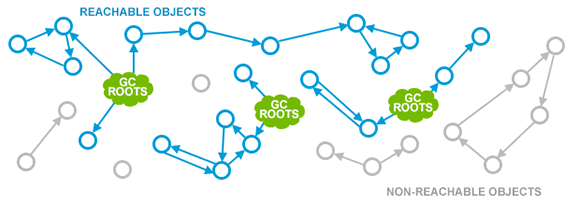
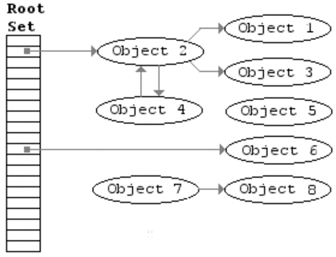
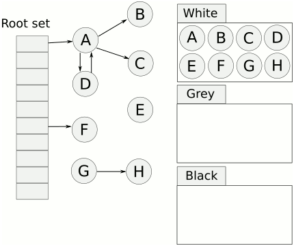
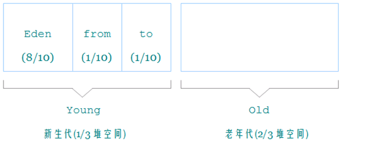

# GC
[深入Golang Runtime之Golang GC的过去,当前与未来](https://www.jianshu.com/p/bfc3c65c05d1)

## GC与资源回收
GC是一种内存管理机制. 在有GC的语言中也要注意释放文件, 连接, 数据库等资源!

前面提到GC是一种自动内存管理机制, 回收不再使用的对象的内存. 除了内存外, 进程还占用了socket, 文件描述符等资源等, 一般来说
这些都不是GC处理的.

有一些GC系统可以将一些系统资源与一块内存关联, 在回收内存时, 其相关的资源也被释放, 这种机制称为finalization. 但是
finalization存在很大的不足, 因为GC是不确定的, 无法明确GC什么时候会发生, finalization无法像析构函数那样精确的控制系统资源
的释放, 资源的不再使用与被释放之间可能存在很大的时延, 也无法控制由谁释放资源.

Java 原来有类似的机制, Java 1.9中已经明确把finalizer标记为废弃.

## 术语简单说明
### mutator
mutate的是变化的意思, mutator就是改变者, 在GC里, 指的是改变对象之间引用关系的实体, 可以简单的理解为我们写的的应用程序(运
行我们写的代码的线程, 协程).

### allocator, collector
自动内存管理机制一般包含allocator(分配器)和collector(回收器). allocator负责为应用代码分配对象, 而collector则负责寻找存活
的对象, 并释放不再存活的对象.

### STW
stop the world, GC的一些阶段需要停止所有的mutator(应用代码)以确定当前的引用关系. 这便是很多人对GC担心的来源, 这也是GC算
法优化的重点. 对于大多数API/RPC服务, 10-20ms左右的STW完全接受的. Golang GC的STW时间从最初的秒级到百ms, 10ms级别, ms级别,
到现在的ms以下, 已经达到了准实时的程度.

### Root对象
根对象是mutator不需要通过其他对象就可以直接访问到的对象. 比如全局对象, 栈对象, 寄存器中的数据等. 通过Root对象, 可以追踪
到其他存活的对象.

### 可达性
即通过对Root对象能够直接或者间接访问到.



### 对象的存活
如果某一个对象在程序的后续执行中可能会被mutator访问, 则称该对象是存活的, 不存活的对象就是我们所说的garbage. 一般通过可达
性来表示存活性.

# Mark Sweep
三大GC基础算法中的一种. 分为mark(标记)和sweep(清扫)两个阶段. 朴素的Mark Sweep流程如下:



1. Stop the World
1. Mark: 通过Root和Root直接间接访问到的对象, 来寻找所有可达的对象, 并进行标记
1. Sweep: 对堆对象迭代, 已标记的对象置位标记. 所有未标记的对象加入freelist, 可用于再分配.
1. Start the Wrold

朴素的Mark Sweep是整体STW, 并且分配速度慢, 内存碎片率高. 有很多对Mark Sweep的优化, 比如

- 相同大小阶梯的对象分配在同一小块内存中, 减少碎片率.
- freelist改成多条, 同一个大小范围的对象, 放在一个freelist上, 加快分配速率, 减少碎片率.
- 并发Sweep和并发Mark, 大大降低stw时间.

## 并发收集
朴素的Mark Sweep算法会造成巨大的STW时间, 导致应用长时间不可用, 且与堆大小成正比, 可扩展性不好. Go的GC算法就是基于Mark
Sweep, 不过是并发Mark和并发Sweep.

一般说并发GC有两层含义, 一层是每个mark或sweep本身是多个线程(协程)执行的(concurrent),一层是mutator(应用程序)和collector同
时运行(background).

首先concurrent这一层是比较好实现的, GC时整体进行STW, 那么对象引用关系不会再改变, 对mark或者sweep任务进行分块, 就能多个线
程(协程)conncurrent执行任务mark或sweep.

而对于backgroud这一层, 也就是说mutator和mark, sweep同时运行, 则相对复杂.

首先backgroup sweep是比较容易实现的, 因为mark后, 哪些对象是存活, 哪些是要被sweep是已知的, sweep的是不再引用的对象, sweep
结束前, 这些对象不会再被分配到. 所以sweep容和mutator内存共存, 后面我们可以看到golang是先在1.3实现的sweep并发. 1.5才实现
的mark并发.

## 写屏障
接上面, mark和mutator同时运行就比较麻烦, 因为mutator会改变已被scan的对象的引用关系.

假设下面这种情况:
```go
b.obj1=c

  gc mark start
  gc scan a

mutaotr  a.obj1=c
mutator  b.obj1=nil

  gc scan b
  gc mark termination
  sweep and free c(error)
```
mutator和collector同时运行.

b有c的引用. gc开始, 先扫描了a, 然后mutator运行, a引用了c, b不再引用c, gc再扫描b, 然后sweep, 清除了c. 这里其实a还引用了c,
导致了正确性问题.

为了解决这个问题, go引入了写屏障(写屏障有多种类型, Dijkstra-style insertion write barrier, Yuasa-style deletion write
barrier等). 写屏障是在写入指针前执行的一小段代码用于防止指针丢失. 这一小段代码Golang是在编译时写入的. Golang目前写屏障在
mark阶段开启.

Dijkstra write barrier在
```go
mutaotr a.obj1=c
```
这一步, 将c的指针写入到a.obj1之前, 会先执行一段判断代码, 如果c已经被扫描过, 就不再扫描, 如果c没有被扫描过, 就把c加入到待
扫描的队列中. 这样就不会出现丢失存活对象的问题存在.

## 三色标记法
三色标记法是传统Mark-Sweep的一个改进, 由Dijkstra(就是提出最短路径算法的)在1978年发表的论文On-the-Fly Garbage Collection:
An Exercise in Cooperation中提出.

它是一个并发的GC算法.

原理如下,

1. 首先创建三个集合:白, 灰, 黑. 白色节点表示未被mark和scan的对象, 灰色节点表示已经被mark, 但是还没有scan的对象, 而黑色表
  示已经mark和scan完的对象.
1. 初始时所有对象都在白色集合.
1. 从根节点开始广度遍历, 将其引用的对象加入灰色集合.
1. 遍历灰色集合, 将灰色对象引用的白色对象放入灰色集合, 之后将此灰色对象放入黑色集合.

标记过程中通过write-barrier检测对象引用的变化.重复4直到灰色中无任何对象. GC结束, 黑色对象为存活对象, 而剩下的白色对象就
是Garbage. Sweep所有白色对象.



下面我们会提到Golang也是使用的三色标记法. 在Go Runtime的实现中, 并没有白色集合, 灰色集合, 黑色集合这样的容器. 实现如下:

- 白色对象: 某个对象对应的gcMarkBit为0(未被标记)
- 灰色对象: gcMarkBit为1(已被标记)且在(待scan)gcWork的待scan buffer中
- 黑色对象: gcMarkBit为1(已被标记)且不在(已经scan)gcWork的待scan buffer中

# go
目前Golang GC(我这里指Go 1.11, 2018年8月发布)具有以下特征.

- 三色标记
- Mark Sweep算法,并发标记, 并发清除
- Muator会执行辅助标记, 辅助清扫
- 非分代
- 准确式GC, 能够知道内存中某个数据是数字还是指向对象的指针. 相对的是保守式GC.
- 非紧缩, 非移动,GC之后不会进行紧缩堆(也就不会移动堆对象地址)
- 写屏障实现增量式

Golang 1.8后GC的STW时间基本上做到了和堆大小无关. 而并发Mark时间则与存活对象数目(当然这个描述并不是非常准确)基本成正比,
与CPU的核数基本成反比.

[Getting to Go: The Journey of Go's Garbage Collector](https://blog.golang.org/ismmkeynote)
size segregated spans have some other advantages.

Low fragmentation: Experience with C, besides Google's TCMalloc and Hoard, I was intimately involved with Intel's
Scalable Malloc and that work gave us confidence that fragmentation was not going to be a problem with non-moving
allocators.

Internal structures: We fully understood and had experience with them. We understood how to do size segregated spans,
we understood how to do low or zero contention allocation paths.

Speed: Non-copy did not concern us, allocation admittedly might be slower but still in the order of C. It might not be
as fast as bump pointer but that was OK.

We also had this foreign function interface issue. If we didn't move our objects then we didn't have to deal with the
long tail of bugs you might encounter if you had a moving collector as you attempt to pin objects and put levels of
indirection between C and the Go object you are working with.

# Generational GC(分代GC)
分代GC理论是80年代提出来的, 基于大部分对象都会在短时间内成为垃圾这个软件工程上的事实, 将内存分为多个区, 不同的区采取不同
的GC算法. 分代GC并不是一种GC算法, 而是一种策略.

## Java的分代GC
Java GC是分代GC的忠实拥簇者, 从98年发布的Java 1.2开始, 就已经是分代GC了. 图中是Java多种分代算法的默认分配情况.



图中Eden区, from, to区统称为新生代. 一般空间比较小, JVM中默认为堆的1/3.

对象优先分配在新生代(容量小, 放新对象)的Eden区, Minor GC时把Eden区的存活对象和From区对象一起复制到to区, GC完之后, 交换
from和to区. 新对象到达一定年龄(经历GC不被回收的次数)后才提升到老年代(容量大, 放长期存活的对象)中. 新生代和老生代采用不同
的算法. 新生代采用复制(Copy)算法, 老生代则一般采用并发的Mark Sweep.

大部分时候只需要对新生代进行Minor GC,因为新生代空间小,Minor GC的暂停很短(生产服务中, 4核机器中500M-1G的新生代, GC大概为
3ms-10ms的级别). 且绝大部分对象分配后就很快被Minor GC回收, 不会提升到老年代中, 对老年代Major GC的次数就会很少, 大大减少
了频繁进行Major GC而Scan和Mark消耗的CPU时间, 减少回收大堆而导致的大的STW时间频次. 像API/RPC后台服务, 比较稳定的话, 可能
几小时或一天才进行一次Major GC.

## Golang的分代GC
### 为何Golang对分代GC需求相对不大
Golang因为是面向值对象的, 而非Java那样面向引用, 且逃逸分析能够减少在堆中分配对象, 所以Golang天生产生的垃圾相对于Java比较
少. 同时Golang的内存结构是类似TCMalloc多阶缓存机制, 大大减少多线程竞争, 所以Golang的对象分配速度比较快(Java的新生代使用
指针移动的方式进行分配, 吐吞量更高), 同时经过多个版本的演进, Golang GC的STW已经降到了sub ms, 所以一直以来Golang对于分代
GC的需求并不是那么大.

Golang目前在尝试引入分代GC的原因是目前Golang进行GC的频次还是有点快, 而每次GC时Golang都需要Mark Scan所有存活的对象, 导致
GC的CPU消耗比较高.

在实际生产中, 千QPS的服务, Java CMS可能几个小时或一天才需要进行一次Major GC, Scan和Mark一遍堆中存活的对象, 而Go则为十多
秒或分钟就需要进行一次GC, 把所有存活的对象扫描一遍(虽然Golang的STW非常短)

分代GC策略中, 新生代一般是Copy算法, 这样会移动对象, 而Golang之前GC是非移动的(Go中的对象可以直接传入到C中, 所以不能GC前后
不能移动对象位置), Go实现分代GC也需要是非移动的. 如何实现呢?

