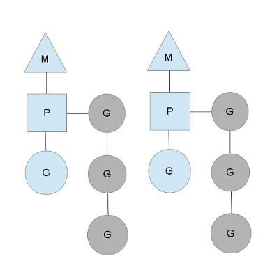

# intro
[Go by Example](https://gobyexample.com)

在 Go 中,首字母大写的名称是被导出的.
eg: `Foo` 和 `FOO` 都是被导出的名称.名称 `foo` 是不会被导出的.
在import 了 math 包之后, math 中的常量pi就就成为exported name, 但是需要使用首字母大写的形式来访问: `math.Pi`

# IO
## fmt
Formatted printing in Go uses a style similar to C's printf family but is richer and more general.

- fmt.Printf, fmt.Fprintf, fmt.Sprintf
- fmt.Println, fmt.Printf, fmt.Print

- `%v`: When printing a struct, the modified format `%+v` annotates the fields of the structure with their names, and for any value the alternate format `%#v` prints the value in full Go syntax.
- `%q`: That quoted string format is also available through %q when applied to a value of type string or []byte. The alternate format %#q will use backquotes instead if possible.
  (The %q format also applies to integers and runes, producing a single-quoted rune constant.)
- `%x`: works on strings, byte arrays and byte slices as well as on integers, generating a long hexadecimal string, and with a space in the format (`% x`) it puts spaces between the bytes.
- `%T`: prints the type(actually dynamic type) of a value.

when you pass a value to the fmt.Print function, it checks to see if it implements the fmt.Stringer interface
```go
type Stringer interface {
  String() string
}
```
Any type that implements a String() string method is a stringer, and the fmt package will use that method to format values of that type.

io 包指定了 io.Reader 接口, 它表示从数据流读取, 有一个 Read 方法:
`func (T) Read(b []byte) (n int, err error)`
Read 用数据填充指定的字节 slice,并且返回填充的字节数和错误信息. 在遇到数据流结尾时,返回 io.EOF 错误.

- Go 标准库包含了这个接口的许多实现, 包括文件, 网络连接, 压缩, 加密等

[read from a string](../demo/go/reader_string.go)

# 数据类型
All assignment operations in Go are copy operations.

slice and map contain internal pointers, so copies point to the same underlying data.

变量在定义时没有明确的初始化时会赋值为**零值**.

- 数值类型为 0 ,
- 布尔类型为 false ,
- 字符串为 "" (空字符串)
- 引用类型为nil
- slice 的零值是 nil, 一个 nil 的 slice 的长度和容量是0.

## 基本类型
- bool
- string: string is immutable
- int, int8, int16, int32, int64, uint, uint8, uint16, uint32, uint64, uintptr
- byte  // uint8 的别名
- rune  // int32 的别名, 代表一个Unicode码
- float32, float64
- complex64, complex128

### array
An array type definition specifies a length and an element type. For example, the type `[4]int` represents an array of four integers.

Go's arrays are values. An array variable denotes the entire array; it is not a pointer to the first array element (as would be the case in C).
This means that when you assign or pass around an array value you will make a copy of its contents.
(To avoid the copy you could pass a pointer to the array, but then that's a pointer to an array, not an array.)

### string
Strings are actually very simple: they are just read-only slices of bytes with a bit of extra syntactic support from the language.
Because they are read-only, there is no need for a capacity (you can't grow them), but otherwise for most purposes you can treat them just like read-only slices of bytes.

The array underlying a string is hidden from view; there is no way to access its contents except through the string.
That means that when we do either of these conversions, a copy of the array must be made. Go takes care of this, of course, so you don't have to.
After either of these conversions, modifications to the array underlying the byte slice don't affect the corresponding string.

## 引用类型
- slice
- map
- interface
- channel

### slice
built on fixed-size arrays to give a flexible, extensible data structure.

It's important to understand that even though a slice contains a pointer, it is itself a value.
Under the covers, it is a struct value holding a pointer, a length and a capacity. It is not a pointer to a struct.
```go
type sliceHeader struct {
  Length        int
  Capacity      int
  ZerothElement *byte
}
```

The type specification for a slice is `[]T`, where T is the type of the elements of the slice. Unlike an array type, a slice type has no specified length.

The zero value of a slice is nil(the element pointer is still nil). The len and cap functions will both return 0 for a nil slice.
However the slice created by `array[0:0]` has length zero (and maybe even capacity zero) but its pointer is not nil, so it is not a nil slice.

- `func copy(dst, src []T) int`: The copy function supports copying between slices of different lengths (it will copy only up to the smaller number of elements).
  In addition, copy can handle source and destination slices that share the same underlying array, handling overlapping slices correctly.
- `func append(s []T, x ...T) []T`

As mentioned earlier, re-slicing a slice doesn't make a copy of the underlying array.
The full array will be kept in memory until it is no longer referenced. Occasionally this can cause the program to hold all the data in memory when only a small piece of it is needed.
To fix this problem one can copy the interesting data to a new slice before returning it:
```go
func CopyDigits(filename string) []byte {
  b, _ := ioutil.ReadFile(filename)
  b = digitRegexp.Find(b)
  c := make([]byte, len(b))
  copy(c, b)
  return c
}
```

### map
可以比较的数据类型才能作为一个map的键,所以map的键都是基本类型.

### channel
Do not communicate by sharing memory, share memory by communicating.

channels are first class values, just like strings or integers.

```go
ch <- v  // 将 v 送入 channel ch.
v := <-ch  // 从 ch 接收,并且赋值给 v.
```

和 map 与 slice 一样,channel 使用前必须创建: `ch := make(chan int)`

By default channels are unbuffered, meaning that they will only accept sends (chan <-) if there is a corresponding receive (<- chan) ready to receive the sent value.
Buffered channels accept a limited number of values without a corresponding receiver for those values.

The select statement provides another way to handle multiple channels.
It's like a switch, but each case is a communication:

- All channels are evaluated
- Selection blocks until one communication can proceed
- If multiple can proceed, select chooses pseudo-randomly.
- A defalut clause, if present, executes immediately if no channel is ready.

当case上读一个通道时,如果这个通道是nil,则该case永远阻塞.
这个功能有1个妙用,select通常处理的是多个通道,当某个读通道关闭了,但不想select再继续关注此case,继续处理其他case,把该通道设置为nil即可.

```go
select {
  case v1 := <- c1:
    fmt.Printf("received %v from c1\n", v1)
  case v2 := <- c2:
    fmt.Printf("received %v from c2\n", v2)
  default:
    fmt.Printf("no one ready to communicate\n")
}
```

## 类型转换
表达式 T(v) 将值 v 转换为类型 T .
与 C 不同的是 Go 的在不同类型之间的项目赋值时需要显式转换.

结构体
```go
type Vertex struct {
  X int
  Y int
}
v := Vertex{1, 2}
p := &v // 结构体指针, 访问也通过`.`, 而不是 `->`, eg: p.X

p  = &Vertex{1, 2} // 类型为 *Vertex
```

## new and make
Go has two allocation primitives, the built-in functions new and make. They do different things and apply to different types.

new is a built-in function that allocates memory, but unlike its namesakes in some other languages it does not initialize the memory, it only zeros it.
It returns a pointer to a newly allocated zero value of type T.

`new(File)` and `&File{}` are equivalent

The built-in function `make(T, args)` serves a purpose different from `new(T)`. It creates slices, maps, and channels only, and it returns an initialized (not zeroed) value of type `T (not *T)`.
The reason for the distinction is that these three types represent, under the covers, references to data structures that must be initialized before use.
A slice, for example, is a three-item descriptor containing a pointer to the data (inside an array), the length, and the capacity, and until those items are initialized, the slice is nil.
For slices, maps, and channels, make initializes the internal data structure and prepares the value for use.

# [interface](https://jordanorelli.com/post/32665860244/how-to-use-interfaces-in-go)
## `interface{}`
The `interface{}` type, the empty interface, is the source of much confusion. The `interface{}` type is the interface that has no methods.
So all types satisfy the empty interface.
That means that if you write a function that takes an interface{} value as a parameter, you can supply that function with any value. So, this function:
```go
func DoSomething(v interface{}) {
   // ...
}
```
will accept any parameter.

An interface value is constructed of two words of data;
one word is used to point to a method table for the value's underlying type, and the other word is used to point to the actual data being held by that value.

static type and dynamic type
```go
var foo interface{}  // foo is of static type interface{}

foo {
  value: nil
  type: nil
}

// foo is of dynamic type float64
foo = 3.14
foo {
  value: 3.14
  type: float64
}

// foo is of dynamic type *Person
foo = &Person{}
foo {
  value: 0x11face04
  type: *Person
}
```

## type switch
```go
func Println(x interface{}) {
  switch x.(type) {
  case bool:
    fmt.Println(x.(bool))
  case int:
    fmt.Println(x.(int))
  default:
    fmt.Println("unkown type")
  }
}
```
the clause `x.(type)` is only valid in type switch

# function
函数也是值.
```go
func add(x int, y int) int {
  return x + y
}
```
由于两个参数x, y 都是int 类型, 可以缩写为: `x, y int`

多值返回
```go
func swap(x, y string) (string, string) {
  return y, x
}
a, b := swap("hello", "world")
```

Finally, each source file can define its own niladic init function to set up whatever state is required.
init is called after all the variable declarations in the package have evaluated their initializers, and those are evaluated only after all the imported packages have been initialized.

## method
Go 没有类.然而,仍然可以在结构体类型上定义方法.

方法接收者 出现在 func 关键字和方法名之间的参数中.
```go
type Vertex struct {
  X, Y float64
}

func (v *Vertex) Abs() float64 {
  return math.Sqrt(v.X * v.X + v.Y * v.Y)
}

func main() {
  v := &Vertex{3, 4}
  fmt.Println(v.Abs())
}
```
`v *Vertex` 就是接收者, 使用指针与C 中原因一样, 通过指针可以直接访问原来的变量, 而不是副本

你可以对包中的 任意 类型定义任意方法,而不仅仅是针对结构体.
但是,不能对来自其他包的类型或基础类型定义方法.
[demo](../demo/go/method_for_MyFloat64.go)

# goroutine
goroutine 是由 Go 运行时环境管理的轻量级线程.
the functionality is analogous to the & on the end of a shell command

- `runtime.GOMAXPROCS(num int)`: 控制并发度, -1 会用到所有的core
- `go run -race file.go`: dead lock 检测

What is a goroutine? It's an independently executing function, launched by a go statement.

It has its own call stack, which grows and shrinks as required.

It's very cheap. It's practical to have thousands, even hundreds of thousands of goroutines.

It's not a thread.

There might be only one thread in a program with thousands of goroutines.
Instread, goroutines are multiplexed dynamically onto threads as needed to keep all the goroutines running.
But if you think of it as a very cheap thread, you won't be far off.

## concurrency vs parallelism
并发是指程序的逻辑结构, 并行是指程序的运行状态.

Concurrency is not parallelism, althouth it enables parallelism.

If you have only one processor, your program can still be concurrent but it cannot be parallel.

On the other hand, a well-written concurrent program might run efficiently in parallel on a multiprocessor.

Usually

- I/O Bound == Concurrency
- CPU Bound == Parallelism

# runtime
Go does have an extensive library, called the runtime, that is part of every Go program.
The runtime library implements garbage collection, concurrency, stack management, and other critical features of the Go language.
Although it is more central to the language, Go's runtime is analogous to libc, the C library.

It is important to understand, however, that Go's runtime does not include a virtual machine, such as is provided by the Java runtime.
Go programs are compiled ahead of time to native machine code.
Thus, although the term is often used to describe the virtual environment in which a program runs, in Go the word "runtime" is just the name given to the library providing critical language services.

## [scheduler](http://morsmachine.dk/go-scheduler)
What does the Go runtime need with a scheduler?

- The POSIX thread API is very much a logical extension to the existing Unix process model and as such, threads get a lot of the same controls as processes.
  Threads have their own signal mask, can be assigned CPU affinity, can be put into cgroups and can be queried for which resources they use.
  All these controls add overhead for features that are simply not needed for how Go programs use goroutines and they quickly add up when you have 100,000 threads in your program.
- Another problem is that the OS can't make informed scheduling decisions, based on the Go model.
  For example, the Go garbage collector requires that all threads are stopped when running a collection and that memory must be in a consistent state.
  This involves waiting for running threads to reach a point where we know that the memory is consistent.
  When you have many threads scheduled out at random points, chances are that you're going to have to wait for a lot of them to reach a consistent state.
  The Go scheduler can make the decision of only scheduling at points where it knows that memory is consistent.
  This means that when we stop for garbage collection, we only have to wait for the threads that are being actively run on a CPU core.

GPM M:N scheduler

- G: The circle represents a goroutine. It includes the stack, the instruction pointer and other information important for scheduling goroutines, like any channel it might be blocked on.
- P: The rectangle represents a context for scheduling. You can look at it as a localized version of the scheduler which runs Go code on a single thread.
  It's the important part that lets us go from a N:1 scheduler to a M:N scheduler. In the runtime code, it's called P for processor.
- M: The triangle represents an OS thread



Here we see 2 threads (M), each holding a context (P), each running a goroutine (G).
In order to run goroutines, a thread must hold a context.

**Who you gonna (sys)call?**

You might wonder now, why have contexts at all? Can't we just put the runqueues on the threads and get rid of contexts? Not really.
The reason we have contexts is so that we can hand them off to other threads if the running thread needs to block for some reason.

An example of when we need to block, is when we call into a syscall.
Since a thread cannot both be executing code and be blocked on a syscall, we need to hand off the context so it can keep scheduling.


Here we see a thread giving up its context so that another thread can run it. The scheduler makes sure there are enough threads to run all contexts.
M1 in the illustration above might be created just for the purpose of handling this syscall or it could come from a thread cache.
The syscalling thread will hold on to the goroutine that made the syscall since it's technically still executing, albeit blocked in the OS.

When the syscall returns, the thread must try and get a context in order to run the returning goroutine.
The normal mode of operation is to steal a context from one of the other threads. If it can't steal one, it will put the goroutine on a global runqueue, put itself on the thread cache and go to sleep.

The global runqueue is a runqueue that contexts pull from when they run out of their local runqueue.
Contexts also periodically check the global runqueue for goroutines. Otherwise the goroutines on global runqueue could end up never running because of starvation.

This handling of syscalls is why Go programs run with multiple threads, even when GOMAXPROCS is 1. The runtime uses goroutines that call syscalls, leaving threads behind.

Goroutine 在 system call 和 channel call 时都可能发生阻塞,但这两种阻塞发生后,处理方式又不一样的.

- 当程序发生 system call,M 会发生阻塞,同时唤起(或创建)一个新的 M 继续执行其他的 G.
  If the Go code requires the M to block, for instance by invoking a system call, then another M will be woken up from the global queue of idle M's.
  This is done to ensure that goroutines, still capable of running, are not blocked from running by the lack of an available M.[11]
- 当程序发起一个 channel call,程序可能会阻塞,但不会阻塞 M,G 的状态会设置为 waiting,M 继续执行其他的 G.当 G 的调用完成,会有一个可用的 M 继续执行它.
  If a goroutine makes a channel call, it may need to block, but there is no reason that the M running that G should be forced to block as well.
  In a case such as this, the G's status is set to waiting and the M that was previously running it continues running other G's until the channel communication is complete.
  At that point the G's status is set back to runnable and will be run as soon as there is an M capable of running it.

## [Garbage Collection](https://www.youtube.com/watch?v=q4HoWwdZUHs)
Responsibility

- tracking memory allocation in heap memory
- releasing allocations that are no longer needed
- keeping allocation that are still in-use

As of version 1.12, Go uses a non-generational, concurrent, tri-color, mark and sweep collector.

Three phases of the gargage collector

1. mark setup, STW(stop the world)
  - When a collection starts, the first activity that must be berformed is turning on the Write Barrier.
  - In order to turn the Write Barrier on, every application goroutine runing must be stopped
  (all goroutines must find themself in a safe point, and right now, that safe point is only going to occur when we are inside of a function call, so now we are waiting function calls to happend).
1. marking, concurrent
  - Inspect the stacks to find root pointers to the heap
  - Traverse the heap graph form those root pointers
  - Mark values on the heap that are still in-use
1. mark termination, STW
  - Turn the Write Barrier off
  - Various clean up tasks are performed
  - Next collection goal is calculated

Sweeping - Freeing heap memory

- Occurs when Goroutines attemp to allocate new heap memory
- The latency os Sweeping is added to the cost of performing an allocation, not GC.

