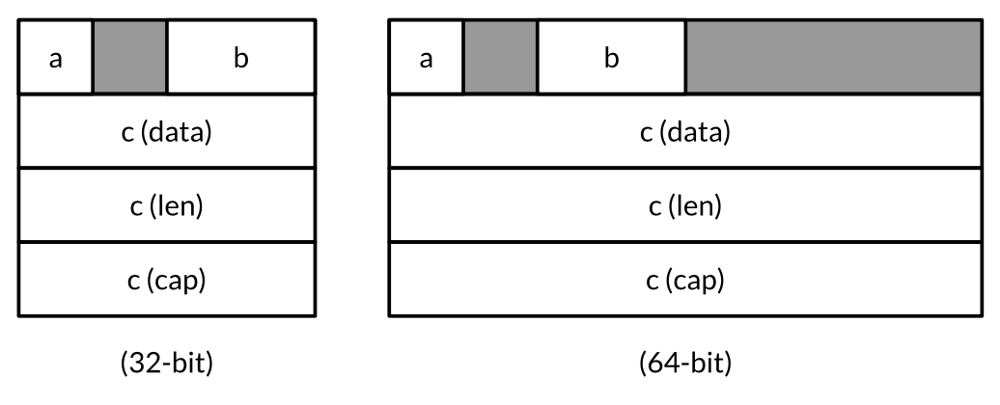

# unsafe.Sizeof, AlignOf and Offsetof
The unsafe.Sizeof function reports the size in bytes of the representation of its operand, which may be an expression of any type; the expression is not evaluated.
The return value is a constant expression of type uintptr.

Sizeof reports only the size of the fixed part of each data structure, like the pointer and the length of a string, but not indirect parts like the contents of the string.

Typical sizes

| Type                          | Size                    |
|-------------------------------|-------------------------|
| bool                          | 1 byte                  |
| intN, uintN, floatN, complexN | N/8 bytes               |
| int,uint,uintptr              | 1 word                  |
| `*T`                          | 1 word                  |
| string                        | 2 words(data, len)      |
| []T                           | 3 words(data, len, cap) |
| map                           | 1 word                  |
| func                          | 1 word                  |
| chan                          | 1 word                  |
| interface                     | 2 words(type, value)    |

A word is 4 bytes on a 32-bit platform and 8 bytes on a 64-bit platform.

The language specification does not guarantee that the order in which fields are declared is the order in which they are laid out in memory, so in theory compiler is free to rearrage them, although as we write this, non do.

The unsafe.Alignof functino reports the required alignment of its argument's type.
The return value is a constan expression of type uintptr.

the unsafe.Offsetof function, whose operand must be a field selector x.f, computes the offset of field f relative to the start of its enclosing struct x, accounting for holes, if any.
```go
var x struct {
  a bool
  b int16
  c []int
}
```


```
typical 32-bit platform
Sizeof(x)   = 16  Alignof(x)   = 4
Sizeof(x.a) = 1   Alignof(x.a) = 1  Offsetof(x.a) = 0
Sizeof(x.b) = 2   Alignof(x.b) = 2  Offsetof(x.a) = 2
Sizeof(x.c) = 12  Alignof(x.c) = 4  Offsetof(x.a) = 4
```

# unsafe.Pointer
The unsafe.Pointer type is a special kind of pointer that can hold the address of any variable.

Like ordinar y pointers, unsafe.Pointers are comparable and may be compared with nil, which is the zero value of the type.

An unsafe.Pointer may also be converted to a uintptr that holds the pointer’s numeric value, letting us perform arithmetic on addresses.(Recall that a uintptr is an unsigned integer wide enough to represent an address.)
This conversion too may be applied inreverse, but again, converting from a uintptr to an unsafe.Pointer may subvert the type system since not all numbers are valid addresses.

Many unsafe.Pointer values are thus intermediaries for converting ordinar y pointers to raw numeric addresses and back again.
The example below takes the address of variable x, adds the offset of its b field, converts the resulting address to `*int16`, and through that pointer updates x.b:
```go
var x struct {
  a bool
  b int16
  c []int
}
// equivalent to pb := &x.b
pb := (*int16)(unsafe.Pointer(uintptr(unsafe.Pointer(&x)) + unsafe.Offsetof(x.b)))
*pb = 42
fmt.Println(x.b) // "42"
```

Although the syntax is cumbersome, but do not be tempted to introduce temporary variables of type uintptr to break the lines. This code is incorrect:
```go
// NOTE: subtly incorrect!
tmp := uintptr(unsafe.Pointer(&x)) + unsafe.Offsetof(x.b) pb := (*int16)(unsafe.Pointer(tmp))
*pb = 42
```
The reason is very subtle. Some garbage collectors move variables around in memory to reduce fragmentation or bookkeeping. Garbage collectors of this kind are known as moving GCs.
When a variable is moved, all pointers that hold the address of the old location must be updated to point to the new one.
From the perspective of the garbage collector, an unsafe.Pointer is a pointer and thus its value must change as the variable moves, but a uintptr is just a number so its value must not change.
The incorrect code above hides a pointer from the garbage collector in the non-pointer variable tmp. By the time the second statement executes, the variable x could have moved and the number in tmp would no longer be the address &x.b.
The third statement clobbers an arbitrary memory location with the value 42.

There are myriad pathological variations on this theme. After this statement has executed:
```go
pT := uintptr(unsafe.Pointer(new(T))) // NOTE: wrong!
```
there are no pointers that refer to the variable created by new, so the garbage collector is entitled to recycle its storage when this statement completes, after which pT contains the address where the variable was but is no longer.

When calling a library function that returns a uintptr, such as those below from the reflect package, the result should be immediately converted to an unsafe.Pointer to ensure that it continues to point to the same variable.
```go
package reflect
func (Value) Pointer() uintptr
func (Value) UnsafeAddr() uintptr
func (Value) InterfaceData() [2]uintptr // (index 1)
```

## scenario
### 与 atomic 一起来并发读写
```go
type Config struct {
  Routes   map[string]net.Addr
  Backends []net.Addr
}

var config unsafe.Pointer  // actual type is *Config

// Worker goroutines use this function to obtain the current config.
func CurrentConfig() *Config {
  return (*Config)(atomic.LoadPointer(&config))
}

// Background goroutine periodically creates a new Config object
// as sets it as current using this function.
func UpdateConfig(cfg *Config) {
  atomic.StorePointer(&config, unsafe.Pointer(cfg))
}
```
This pattern prevents the writer from blocking readers during update.

