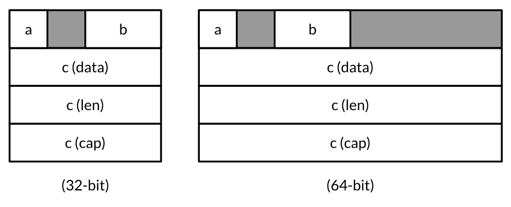

# unsafe.Sizeof, AlignOf and Offsetof
The unsafe.Sizeof function reports the size in bytes of the representation of its operand, which may be an expression of any type; the expression is not evaluated.
The return value is a constant expression of type uintptr.

Sizeof reports only the size of the fixed part of each data structure, like the pointer and the length of a string, but not indirect parts like the contents of the string.

Typical sizes

| Type                          | Size                    |
|-------------------------------|-------------------------|
| bool                          | 1 byte                  |
| intN, uintN, floatN, complexN | N/8 bytes               |
| int,uint,uintptr              | 1 word                  |
| `*T`                          | 1 word                  |
| string                        | 2 words(data, len)      |
| []T                           | 3 words(data, len, cap) |
| map                           | 1 word                  |
| func                          | 1 word                  |
| chan                          | 1 word                  |
| interface                     | 2 words(type, value)    |

A word is 4 bytes on a 32-bit platform and 8 bytes on a 64-bit platform.

The language specification does not guarantee that the order in which fields are declared is the order in which they are laid out in memory, so in theory compiler is free to rearrage them, although as we write this, non do.

The unsafe.Alignof functino reports the required alignment of its argument's type.
The return value is a constan expression of type uintptr.

the unsafe.Offsetof function, whose operand must be a field selector x.f, computes the offset of field f relative to the start of its enclosing struct x, accounting for holes, if any.
```go
var x struct {
  a bool
  b int16
  c []int
}
```


```
typical 32-bit platform
Sizeof(x)   = 16  Alignof(x)   = 4
Sizeof(x.a) = 1   Alignof(x.a) = 1  Offsetof(x.a) = 0
Sizeof(x.b) = 2   Alignof(x.b) = 2  Offsetof(x.a) = 2
Sizeof(x.c) = 12  Alignof(x.c) = 4  Offsetof(x.a) = 4
```

# unsafe.Pointer
The unsafe.Pointer type is a special kind of pointer that can hold the address of any variable.

Like ordinar y pointers, unsafe.Pointers are comparable and may be compared with nil, which is the zero value of the type.

An unsafe.Pointer may also be converted to a uintptr that holds the pointer’s numeric value, letting us perform arithmetic on addresses.(Recall that a uintptr is an unsigned integer wide enough to represent an address.)
This conversion too may be applied inreverse, but again, converting from a uintptr to an unsafe.Pointer may subvert the type system since not all numbers are valid addresses.

Many unsafe.Pointer values are thus intermediaries for converting ordinar y pointers to raw numeric addresses and back again.
The example below takes the address of variable x, adds the offset of its b field, converts the resulting address to `*int16`, and through that pointer updates x.b:
```go
var x struct {
  a bool
  b int16
  c []int
}
// equivalent to pb := &x.b
pb := (*int16)(unsafe.Pointer(uintptr(unsafe.Pointer(&x)) + unsafe.Offsetof(x.b)))
*pb = 42
fmt.Println(x.b) // "42"
```

Although the syntax is cumbersome, but do not be tempted to introduce temporary variables of type uintptr to break the lines. This code is incorrect:
```go
// NOTE: subtly incorrect!
tmp := uintptr(unsafe.Pointer(&x)) + unsafe.Offsetof(x.b) pb := (*int16)(unsafe.Pointer(tmp))
*pb = 42
```
The reason is very subtle. Some garbage collectors move variables around in memory to reduce fragmentation or bookkeeping. Garbage collectors of this kind are known as moving GCs.
When a variable is moved, all pointers that hold the address of the old location must be updated to point to the new one.
From the perspective of the garbage collector, an unsafe.Pointer is a pointer and thus its value must change as the variable moves, but a uintptr is just a number so its value must not change.
The incorrect code above hides a pointer from the garbage collector in the non-pointer variable tmp. By the time the second statement executes, the variable x could have moved and the number in tmp would no longer be the address &x.b.
The third statement clobbers an arbitrary memory location with the value 42.

[Go语言实战笔记（二十七）| Go unsafe Pointer](https://www.flysnow.org/2017/07/06/go-in-action-unsafe-pointer.html)

Go语言是不允许两个指针类型进行转换的.

```go
i := 10
ip := &i
var fp *float64 = (*float64)(ip)
```
以上代码我们在编译的时候,会提示`cannot convert ip (type *int) to type *float64`,也就是不能进行强制转型.
那如果我们还是需要进行转换怎么做呢?这就需要我们使用unsafe包里的Pointer了,下面我们先看看unsafe.Pointer是什么,然后再介绍如何转换.

unsafe.Pointer是一种特殊意义的指针,它可以包含任意类型的地址,有点类似于C语言里的`void*`指针,全能型的.
```go
i := 10
ip := &i
var fp *float64 = (*float64)(unsafe.Pointer(ip))
```
注意, 这里是强行把`*int`的指针按照`*float64` 来解释, 所以得到`*fp` 的值肯定不是10 的float64 类型.

unsafe.Pointer 定义在 src/unsafe/unsafe.go, 实际上就是一个 `*int`
```go
type ArbitraryType int
type Pointer *ArbitraryType
```

我们看下关于unsafe.Pointer的4个规则.

- 任何指针都可以转换为 unsafe.Pointer
- unsafe.Pointer 可以转换为任何指针
- uintptr 可以转换为unsafe.Pointer
- unsafe.Pointer 可以转换为uintptr

我们都知道`*T`是不能计算偏移量的,也不能进行计算,但是uintptr可以,所以我们可以把指针转为uintptr再进行偏移计算,这样我们就可以访问特定的内存了,达到对不同的内存读写的目的.

```go
type user struct {
	name string
	age  int
}

u := new(user)
fmt.Println(*u)

pName := (*string)(unsafe.Pointer(u))
*pName = "xxx"

pAge := (*int)(unsafe.Pointer(uintptr(unsafe.Pointer(u)) + unsafe.Offsetof(u.age)))
*pAge = 20
```
第一个修改user的name值的时候,因为name是第一个字段,所以不用偏移,我们获取user的指针,然后通过unsafe.Pointer转为`*string`进行赋值操作即可.

第二个修改user的age值的时候,因为age不是第一个字段,所以我们需要内存偏移,内存偏移牵涉到的计算只能通过uintptr,所我们要先把user的指针地址转为uintptr,然后我们再通过unsafe.Offsetof(u.age)获取需要偏移的值,进行地址运算(+)偏移即可.

这里我们可以看到,我们第二个偏移的表达式非常长,但是也千万不要把他们分段,不能像下面这样.
```go
tmp := uintptr(unsafe.Pointer(u))+unsafe.Offsetof(u.age)
pAge := (*int)(unsafe.Pointer(tmp))
*pAge = 20
```
逻辑上看,以上代码不会有什么问题,但是这里会牵涉到GC,如果我们的这些临时变量被GC,那么导致的内存操作就错了,我们最终操作的,就不知道是哪块内存了,会引起莫名其妙的问题.
(这里存疑, 上面的代码都是类型转换, 创建的临时变量也应该是在栈上创建, 没有必要跑到堆上去创建, 不应该涉及到gc 的问题)

还有, 整个unsafe包都是用于Go编译器的,不用运行时,在我们编译的时候,Go编译器已经把他们都处理了.

## scenario
### 与 atomic 一起来并发读写
```go
type Config struct {
  Routes   map[string]net.Addr
  Backends []net.Addr
}

var config unsafe.Pointer  // actual type is *Config

// Worker goroutines use this function to obtain the current config.
func CurrentConfig() *Config {
  return (*Config)(atomic.LoadPointer(&config))
}

// Background goroutine periodically creates a new Config object
// as sets it as current using this function.
func UpdateConfig(cfg *Config) {
  atomic.StorePointer(&config, unsafe.Pointer(cfg))
}
```
This pattern prevents the writer from blocking readers during update.

