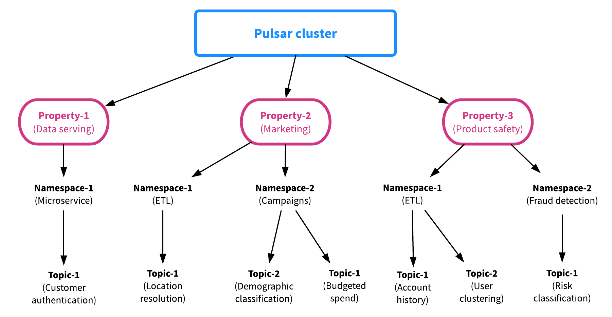
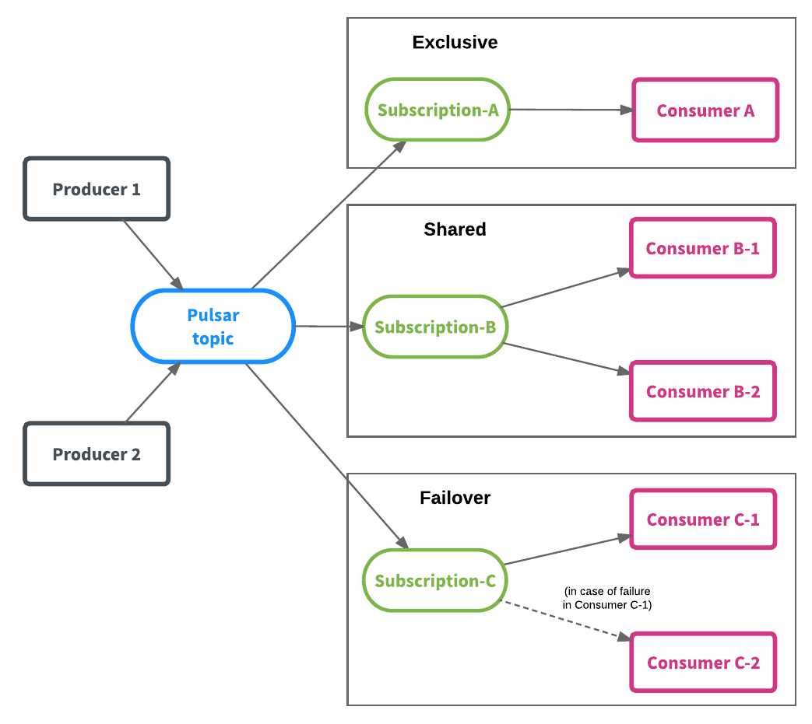

# Message Consumption
[Comparing Pulsar and Kafka: unified queuing and streaming](https://streaml.io/blog/pulsar-streaming-queuing)

In a modern real-time streaming architecture, messaging use cases can be separated into two categories: queuing and streaming.

## Queuing
Queuing is unordered or shared messaging.
With queuing messaging, multiple consumers are created to receive messages from a single point-to-point messaging channel.
When the channel delivers a message, any of the consumers could potentially receive it. The messaging system's implementation determines which consumer actually receives the message.

Queuing use cases are usually found in conjunction with stateless applications.
Stateless applications don't care about ordering but they do require the ability
to acknowledge or remove individual messages as well as the ability to scale consumption parallelism as much as possible.
Typical queuing-based messaging systems include RabbitMQ and RocketMQ.

## Streaming
In contrast, streaming is strictly ordered or exclusive messaging.
With streaming messaging, there is always only one consumer consuming the messaging channel.
The consumer receives the messages dispatched from the channel in the exactorder in which they were written.

Streaming use cases are usually associated with stateful applications.
Stateful applications care about ordering and their state.  The ordering of messages determines the state of a stateful application.
Ordering will impact the correctness of whatever processing logic the application needs to apply when out-of-order consumption occurs.

Both streaming and queuing are necessary in a microservices-oriented or event-driven architecture.

## The Pulsar Model
Apache Pulsar unifies queuing and streaming into a unified messaging model: producer-topic-subscription-consumer.
A topic(partition) is a named channel for sending messages. Each topic partition is backed by a distributed log stored in Apache BookKeeper.
Each published message is only stored once on a topic partition, replicated to be stored on multiple bookies (BookKeeper servers),and can be consumed as many times as necessary by consumers.

The topic is the source of truth for consumption. Although messages are only stored once on the topic partition, there can be different ways of consuming those messages.
Consumers are grouped together for consuming messages. Each group of consumers is a subscription on a topic.
Each consumer group can have its own way of consuming the messages—exclusively, shared, or failover—which can be different across consumer groups.
This combines queuing and streaming in one model and API, and it was designed and implemented with the goal of not impacting performance and introducing cost overhead,
while also providing a lot of flexibility to users to consume messages in a way that's best for the use case at hand.

# pulsar
## introduction
[Introduction to the Apache Pulsar pub-sub messaging platform](https://streaml.io/blog/intro-to-pulsar)

Pulsar was built from the ground up to support multi-tenant use cases.
Pulsar supports two multi-tenancy-specific resources to enable multi-tenancy: properties and namespaces.
A property represents a tenant in the system. To give an example, imagine a Pulsar cluster deployed to support a wide variety of applications (as was the case with Pulsar at Yahoo).
Within a Pulsar cluster, each property can represent a team in the enterprise, a core feature, or a product line, to give just a few examples.
Each property, in turns, can contain several namespaces, for example one namespace for each application or use case.
A namespace can then contain any number of topics.

Authorization is managed at the property level, and the permissions are managed at the namespace level.

The namespace is the basic administrative unit in Pulsar.
At the namespace level, you can set permissions, fine-tune replication settings, manage geo-replication of message data across clusters, control message expiry, and perform critical operations.
All topics in a namespace inherit the same settings,

As mentioned before, each namespace can have one or more topics;
each topic can have multiple subscriptions; and each subscription is set to retain and receive all messages published on the topic.
To provide even more flexibility to application, Pulsar enables three different types of subscriptions that can coexist on the same topic:

- Exclusive subscription(streaming model): there can be only a single consumer at any given time.
- Failover subscription(streaming model): multiple consumers are allowed to connect to a topic but only one consumer will receive messages at any given time.
- Shared subscription(queuing model): multiple consumers can attach to the same subscription and each consumer will receive a fraction of the messages.
  The other consumers will start receiving messages only when the current receeiving consumer fails.

A subscription in Pulsar is effectively the same as a consumer group in Apache Kafka.
Creating subscriptions is highly scalable and very cheap. You can create as many subscriptions as you need.
Different subscriptions on the same topic don't have to be of the same subscription type.

[Why Apache Pulsar? Part 1](https://streaml.io/blog/why-apache-pulsar)
Unlike other messaging systems, Pulsar allows scaling the number of active consumers beyond the number of partitions within a topic.

Since Pulsar is using Apache BookKeeper as the stream storage, it also exposes the underlying log through a stream Reader API, allowing applications to start consuming from any earlier positions.

When a Pulsar broker receives a message, it sends it to a set of bookie nodes. When message data is received by a bookie, it saves a copy in memory and also writes the data to a WAL.
This log is forced to stable storage before the bookie sends an acknowledgment to the broker

[Why Apache Pulsar? Part 2](https://streaml.io/blog/why-apache-pulsar-part-2)
I/O isolation between reads and writes

In most messaging systems, consumer lag can produce general performance degradation.
If a consumer on a topic starts lagging, this can affect other consumers that might be going faster and staying at the top of queue.
This happens because the slow consumer forces the messaging system to retrieve the data from the storage media, which leads to I/O thrashing and results in very low throughput.
This slows down the consumers whose data needs to be brought into memory before it can be served. This happens because reads and writes share a single path of execution.

Pulsar resolves this issue by using Apache BookKeeper as its message storage system.
By using BookKeeper, Pulsar is able to provide I/O isolation between reads and writes by using different paths of execution for reads and writes.
Regular reads are served directly by Pulsar brokers, while durable writes are made to BookKeeper Write-ahead logs (WALs) and catch-up reads are made from BookKeeper stable storage.

It's important to provide predictable latency for publishing applications under all circumstances.
With I/O isolation, you can achieve lower and more predictable publish latency even when disks are saturated due to heavy read activity.

## Pulsar Comparison with Apache Kafka
- Concepts
  - Kafka: Producer-topic-consumer group-consumer
  - Pulsar: Producer-topic-subscription-consumer
- Consumption
  - Kafka: More focused on streaming, exclusive messaging on partitions. No shared consumption.
  - Pulsar: Unified messaging model and API. Streaming via exclusive, failover subscription, Queuing via shared subscription
- Acking
  - Kafka: Simple offset management, Prior to Kafka 0.8, offsets are stored in ZooKeeper, After Kafka 0.8, offsets are stored on offset topics
  - Pulsar: Unified messaging model and API. Streaming via exclusive, failover subscription, Queuing via shared subscription
- Retention
  - Kafka: Messages are deleted based on retention. If a consumer doesn't read messages before retention period, it will lose data.
  - Pulsar: Messages are only deleted after all subscriptions consumed them. No data loss even the consumers of a subscription are down for a long time.
    Messages are allowed to keep for a configured retention period time even after all subscriptions consume them.
- TTL: A message will automatically be marked as acknowledged if it is not consumed by any consumers within the configured TTL time period.
  The difference between message retention and message TTL is that message retention applies to messages that are marked as acknowledged and set to be deleted. 
  - Kafka: No TTL support
  - Pulsar: Supports message TTL

If you would like to hear a short sentence about how Apache Pulsar differs from Apache Kafka in their respective messaging models, here is mine:

Apache Pulsar combines high-performance streaming (which Apache Kafka pursues) and flexible traditional queuing (which RabbitMQ pursues) into a unified messaging model and API.
Pulsar gives you one system for both streaming and queuing, with the same high performance, using a unified API.

