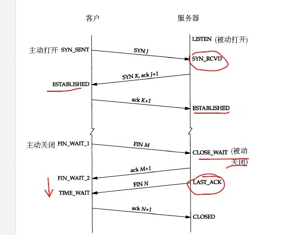
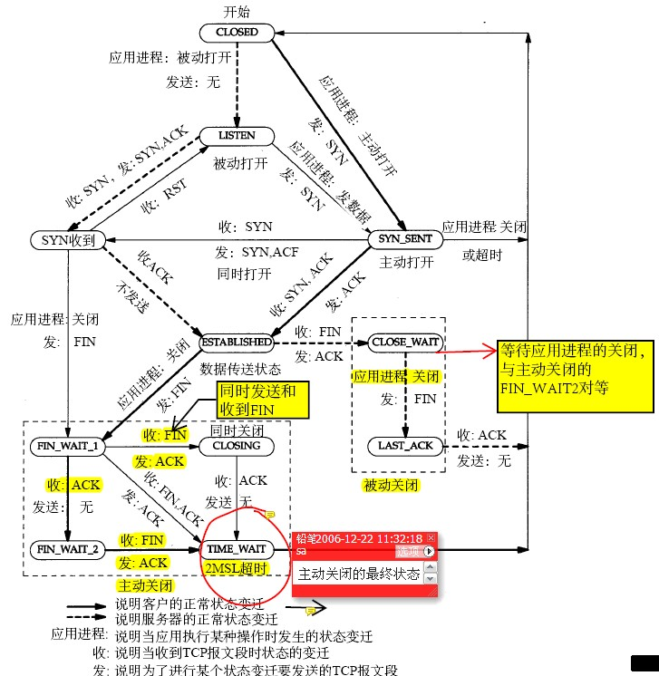

- [tcp连接的11种状态](#tcp连接的11种状态)
	- [TIME WAIT状态](#time-wait状态)
		- [time wait状态如何产生?](#time-wait状态如何产生)
		- [time wait状态产生的原因](#time-wait状态产生的原因)
		- [time wait 状态如何避免](#time-wait-状态如何避免)
- [异常情况分析](#异常情况分析)
	- [关于SIGPIPE导致的程序退出](#关于sigpipe导致的程序退出)
	- [长连接的情况下出现了不同程度的延时](#长连接的情况下出现了不同程度的延时)
	- [服务器进程终止](#服务器进程终止)
		- [服务器主机崩溃](#服务器主机崩溃)
		- [服务器主机崩溃后重启](#服务器主机崩溃后重启)
		- [服务器主机关机](#服务器主机关机)

[最常见的12道计算机网络面试题](https://www.justdojava.com/2019/11/03/Network_interview_question/)

Note that TCP does not guarantee that the data will be received by the other endpoint, as this is impossible.
It delivers data to the other endpoint if possible, and notifies the user (by giving up on retransmissions and breaking
the connection) if it is not possible.
Therefore, TCP cannot be described as a 100% reliable protocol.

**socket中TCP的三次握手建立连接**



1. 当客户端调用connect 时, 触发了连接请求, 向服务器发送了SYN J 包, 这时connect 进入阻塞状态.
1. 服务器监听到连接请求, 即收到SYN J 包, 调用accept 函数接收请求(会为该TCP 分配缓存和变量), 并向客户端发送SYN K, ACK J+1,
  这时accept 进入阻塞状态.
1. 客户端收到服务器的SYN K, ACK J+1 之后, connect返回, 并对SYN K 进行确认, 服务器收到ACK K+1 时, accept 返回, 至此三次握
  手完毕,连接建立.

客户端的connect在三次握手的第二个次返回,而服务器端的accept在三次握手的第三次返回.

内核为任何一个给定的监听套接字维护两个队列:

1. **未完成连接队列(incomplete connection queue)**:
每个这样的SYN 分节对应其中一项, 已由某个客户发出并到达服务器,而服务器正在等待完成相应的TCP三路握手过程.这些套接字处于
`SYN_RCVD`状态

2. **已完成连接队列(completed connection queue)**:
每个已完成TCP 三路握手过程的客户对应其中一项. 这些套接字处于established 状态

当来自客户的SYN到达时,TCP在未完成连接队列中创建一个新项.
如果三路握手正常完成, 该项就从未完成连接队列移到已完成连接队列的末尾.
当进程调用accept时,已完成连接队列中的队头项将返回给进程,或者如果该队列为空,那么进程将被投入睡眠,直到TCP 在该队列中放入一
项才唤醒它

**TCP FLAG 标记**

基于标记的TCP包匹配经常被用于过滤试图打开新连接的TCP数据包.
TCP标记和他们的意义如下所列:

- F : FIN - 结束; 结束会话
- S : SYN - 同步; 表示开始会话请求
- R : RST - 复位;中断一个连接
- P : PUSH - 推送; 数据包立即发送
- A : ACK - 应答
- U : URG - 紧急
- E : ECE - 显式拥塞提醒回应
- W : CWR - 拥塞窗口减少

**讲一讲SYN超时,洪泛攻击,以及解决策略**

在TCP 的三次握手机制的第一步中, 客户端会向服务器发送SYN 报文段. 服务器接收到SYN 报文段后会为该TCP 分配缓存和变量, 如果攻
击分子大量地往服务器发送SYN 报文段, 服务器的连接资源终将被耗尽, 导致内存溢出无法继续服务.

解决策略: 当服务器接受到SYN 报文段时, 不直接为该TCP 分配资源, 而只是打开一个半开的套接字. 接着会使用SYN 报文段的源Id,目
的Id,端口号以及只有服务器自己知道的一个密函数生成一个cookie, 并把cookie 作为序列号响应给客户端.

如果客户端是正常建立连接, 将会返回一个确认字段为cookie + 1 的报文段.接下来服务器会根据确认报文的源Id,目的Id,端口号以及秘
密函数计算出一个结果,如果结果的值 + 1等于确认字段的值,则证明是刚刚请求连接的客户端,这时候才为该 TCP 分配资源.

这样一来就不会为恶意攻击的 SYN 报文段分配资源空间,避免了攻击.

# [tcp连接的11种状态](https://blog.csdn.net/shanliangliuxing/article/details/36500731)


1. LISTEN: 首先服务端需要打开一个socket进行监听,状态为 LISTEN.
2. `SYN_SENT`: 客户端通过应用程序调用connect 进行active open. 于是客户端tcp发送一个SYN以请求建立一个连接.之后状态置为
  `SYN_SENT`. 在发送连接请求后等待匹配的连接请求
3. `SYN_RECV`: 服务端收到client 的SYN 后发出ACK 进行确认, 同时自己向客户端发送一个SYN(两个数据包合二为一). 之后状态置为
  `SYN_RECV`. 在收到和发送一个连接请求后等待对连接请求的确认
4. ESTABLISHED: 代表一个打开的连接, 双方可以进行或已经在数据交互了
5. `FIN_WAIT1`: 主动关闭(active close)端应用程序调用close, 于是其TCP发出FIN请求主动关闭连接, 之后进入`FIN_WAIT1`状态
6. `CLOSE_WAIT`: 被动关闭(passive close) 端TCP 接到FIN后, 就发出ACK 以回应FIN 请求(它的接收也作为文件结束符传递给上层应
  用程序),并进入`CLOSE_WAIT`
7. `FIN_WAIT2`: 主动关闭端接到ACK后, 就进入了FIN-WAIT-2
8. `LAST_ACK`: 被动关闭端一段时间后, 接收到文件结束符的应用程序将调用CLOSE 关闭连接.这导致它的TCP也发送一个 FIN,等待对方
  的ACK.就进入了LAST-ACK
9. `TIME_WAIT`: 在主动关闭端接收到FIN后, TCP就发送ACK包,并进入TIME-WAIT状态. 等待足够的时间以确保远程TCP接收到连接中断请
  求的确认
10. CLOSING: 比较少见. Both sockets are shut down but we still don't have all our data sent. 等待远程TCP对连接中断的确认
11. CLOSED: 被动关闭端在接受到ACK包后, 就进入了closed的状态, 连接结束

## [TIME WAIT状态](https://blog.csdn.net/u013616945/article/details/77510925)
### time wait状态如何产生?
`TIME_WAIT` 状态的形成只发生在主动关闭连接的一方.

主动关闭方在接收到被动关闭方的FIN请求后,发送给对方一个ACK后, 将自己的状态由`FIN_WAIT2`修改为`TIME_WAIT`,
而必须再等2倍的MSL(Maximum Segment Lifetime, MSL是一个数据报在网络中的最大生存时间)时间之后双方才能把状态都改为CLOSED以
关闭连接.
目前RHEL里保持`TIME_WAIT`状态的时间为60秒.

产生这种结果使得这个TCP连接在2MSL连接等待期间,定义这个连接的四元组(客户端IP地址和端口,服务端IP地址和端口号)不能被使用.

### time wait状态产生的原因
1. **为实现TCP全双工连接的可靠释放**:
由TCP状态变迁图可知,假设发起主动关闭的一方(client)最后发送的ACK在网络中丢失,由于TCP协议的重传机制,执行被动关闭的一方
(server)将会重发其FIN, 在该FIN到达client之前, client必须维护这条连接状态,也就说这条TCP连接所对应的资源(client方的
`local_ip, local_port`)不能被立即释放或重新分配,直到另一方重发的FIN达到之后, client重发ACK后,经过2MSL时间周期没有再收到
另一方的FIN之后,该TCP连接才能恢复初始的CLOSED状态.
如果主动关闭一方不维护这样一个time wait状态,那么当被动关闭一方重发的FIN到达时,主动关闭一方的TCP传输层会用RST包响应对方,
这会被对方认为是有错误发生,然而这事实上只是正常的关闭连接过程,并非异常.

2. **为使旧的数据包在网络因过期而消失**:
为说明这个问题,我们先假设TCP协议中不存在time wait状态的限制,再假设当前有一条TCP连接:
`(local_ip, local_port, remote_ip, remote_port)`, 因某些原因,我们先关闭,接着很快以相同的四元组建立一条新连接. 本文前面介
绍过,TCP连接由四元组唯一标识,因此,在我们假设的情况中,TCP协议栈是无法区分前后两条不同的TCP 连接, 在它看来,这根本就是同一
条连接,中间先释放再建立的过程对其来说是"感知"不到的. 这样就可能发生这样的情况: 前一条TCP连接由local peer发送的数据到达
remote peer后,会被该remot peer的TCP传输层当做当前TCP连接的正常数据接收并向上传递至应用层,从而引起数据错乱进而导致各种无
法预知的诡异现象.

### time wait 状态如何避免
进入time wait 状态的一般情况下是客户端. 大多数服务器端一般执行被动关闭, 服务器不会进入time wait状态. 当在服务器端关闭某
个服务再重新启动时, 服务器是会进入time wait状态的.

首先服务器可以设置`SO_REUSEADDR`套接字选项来通知内核,如果端口忙,但TCP连接位于time wait状态时可以重用端口.
在一个非常有用的场景就是,如果你的服务器程序停止后想立即重启,而新的套接字依旧希望使用同一端口,此时`SO_REUSEADDR`选项就可
以避免time wait状态.

一个套接字由相关五元组构成,<协议,本地地址,本地端口,远程地址,远程端口>. `SO_REUSEADDR` 仅仅表示可以重用本地地址,本地端口,
整个相关五元组还是唯一确定的. 所以,重启后的服务程序有可能收到非期望数据.必须慎重使用`SO_REUSEADDR` 选项.

# 异常情况分析
## 关于SIGPIPE导致的程序退出
当server close一个连接时, server 会向client 发送一个FIN, client read 会返回0. 通过read 返回0, 我们就能知道对方已经关闭了连接, 通常这时候我们就需要关闭本端的连接.
如果client 端接着发数据, 根据TCP协议的规定, 会收到一个RST响应, 同时errno 会被置为104(connection reset by peer).
如果client 再往server发送数据时, 系统会发出一个SIGPIPE信号给client进程,同时errno 会被置为32(broken pipe), 告诉进程这个连接已经断开了, 不要再写了.

SIGPIPE信号的默认执行动作是terminate(终止,退出),所以client会退出. 若不想客户端退出可以把SIGPIPE设为`SIG_IGN`, `signal(SIGPIPE, SIG_IGN);`

服务器采用了fork的话,要收集垃圾进程,防止僵尸进程的产生,可以这样处理:
```C++
signal(SIGCHLD, SIG_IGN);  // 交给系统init去回收.
```
这里子进程就不会产生僵尸进程了.

## 长连接的情况下出现了不同程度的延时
在一些长连接的条件下, 发送一个小的数据包, 结果会发现从数据write成功到接收端需要等待一定的时间后才能接收到, 而改成短连接这个现象就消失了
(如果没有消失,那么可能网络本身确实存在延时的问题,特别是跨机房的情况下).
在长连接的处理中出现了延时, 而且时间固定,基本都是40ms, 出现40ms延时最大的可能就是由于没有设置`TCP_NODELAY`.
在长连接的交互中,有些时候一个发送的数据包非常的小,加上一个数据包的头部就会导致浪费,而且由于传输的数据多了,就可能会造成网络拥塞的情况,
在系统底层默认采用了**Nagle算法,可以把连续发送的多个小包组装为一个更大的数据包然后再进行发送**.
但是对于我们交互性的应用程序意义就不大了, 这个时候Nagle算法就会产生负作用,在我们的环境下会产生40ms的延时,这样就会导致客户端的处理等待时间过长, 导致程序压力无法上去.
在代码中无论是服务端还是客户端都是建议设置这个选项,避免某一端造成延时.所以对于长连接的情况我们建议都需要设置`TCP_NODELAY`.

对于服务端程序而言, 采用的模式一般是bind -> listen -> accept, 这个时候accept出来的句柄的各项属性其实是从listen的句柄中继承,
所以对于多数服务端程序只需要对于listen进行监听的句柄设置一次`TCP_NODELAY`就可以了,不需要每次都设置一次.

## 服务器进程终止
[针对TCP连接异常断开的分析](https://www.cnblogs.com/549294286/p/5208357.html)
[code](https://gist.github.com/ericuni/4d6eb09a6af73d15fa3004707c958f32)

1. 在同一个主机上启动服务器和客户, 并在客户上输入一行文本, 以验证一切正常. 正常情况下, 该行文本将由服务器回射给客户.

	```
	[root@dev:git]$ ./client
	hello
	hello

	[root@dev:git]$ netstat -nap | grep tcp
	tcp        0      0 0.0.0.0:9998            0.0.0.0:*               LISTEN       178/server
	tcp        0      0 127.0.0.1:9998          127.0.0.1:33050         ESTABLISHED  180/server
	tcp        1      0 127.0.0.1:33050         127.0.0.1:9998          ESTABLISHED  179/client
	```
1. 找到服务器子进程的ID,通过kill命令杀死它.作为进程终止处理的部分工作,子进程中所有打开着的描述字都被关闭.这就导致向客户发送一个FIN,而客户TCP则响应以一个ACK.这就是TCP连接终止的前一半工作.

	```
	[root@dev:git]$ ./server
	child 180 exit
	```
1. 子进程终止时,内核将给父进程递交SIGCHLD信号.
1. 客户上没有发生任何特殊之事.客户TCP接受来自服务器TCP的FIN并响应一个ACK,然后问题是客户进程此时阻塞在fgets调用上,等待从终端接受一行文本.它是看不到这个FIN的.
1. 此时我们如果运行netstat命令,可以看到如下的套接口的状态, `FIN_WAIT2`即为我们杀掉的那个子进程的,因为我们知道主动关闭的那端在发送完fin并接受对端的ack后将进入`fin_wait2`状态,此时它在等待对端的fin.

	```
	[root@dev:git]$ netstat -nap | grep tcp
	tcp        0      0 0.0.0.0:9998            0.0.0.0:*               LISTEN      178/server
	tcp        0      0 127.0.0.1:9998          127.0.0.1:33050         FIN_WAIT2   -
	tcp        1      0 127.0.0.1:33050         127.0.0.1:9998          CLOSE_WAIT  179/client
	```
1. 现在我们在客户上在输入一行文本,我们可以看到如下的输出

	```
	[root@dev:git]$ ./client
	hello again
	server term prematurely.
	```
1. 当我们输入"hello again"时,客户TCP接着把数据发送给服务器,TCP允许这么做,因为客户TCP接受到FIN只是表示服务器进程已关闭了连接的服务端,从而不再往其中发送任何数据而已.
	FIN的接受并没有告知客户TCP服务器进程已经终止(在这个例子中它确实是终止了).当服务器TCP接收到来自客户的数据时,既然先前打开那个套接口的进程已经终止,于是响应一个RST.
1. 然而客户进程看不到这个RST,因为它在调用write后立即调用read,并且由于第2步中接收到FIN,所调用的read立即返回0(表示)EOF.我们的客户此时并未预期收到EOF,于是以出错信息"server term prematurely."(服务器过早终止)退出.
	- 我们的上述讨论还取决于程序的时序.客户调用read既可能发生在服务器的RST被客户收到之前,也可能发生在收到之后.
		如果read发生在收到RST之前(如本例子所示),那么结果是客户得到一个未预期的EOF,否则结果是由readline返回一个ECONNRESET("connection reset by peer"对方复位连接)错误.
1. 当客户终止时,它所有打开着的描述字都被关闭.

本例子的问题在于:当FIN到达套接口时,客户正阻塞在fgets调用上.客户实际上在应对两个描述字-套接口和用户输入,它不能单纯阻塞在这两个源中某个特定源的输入上,而是应该阻塞在其任何一个源的输入上.(可用select等io复用的函数实现)

### 服务器主机崩溃
1. 当服务器主机崩溃时,已有的网络连接上发不出任何东西.这里我们假设的是主机崩溃,而不是执行了关机命令.
2. 我们在客户上输入一行文本,它由write写入内核,再由客户TCP作为一个数据分节送出.客户随后阻塞于read调用,等待服务器的应答.
3. 这种情况下,客户TCP持续重传数据分节,试图从服务器上接受一个ACK.(源自Berkeley的实现重传该数据分节12次,共等待约9分钟才放弃重传.)
	当客户TCP最终放弃时(假设这段时间内,服务器主机没有重新启动或者如果是服务器主机为崩溃但从网络上不可达的情况,那么假设主机仍然不可达),返回客户进程一个错误.既然客户阻塞在read调用上,该调用将返回一个错误.
	假设服务器已崩溃,从而对客户的数据分节根本没有响应,那么所返回的错误是ETIMEDOUT.
	然而如果某个中间路由器判定服务器主机已不可达, 从而响应以一个"destination unreachable",那么所返回的错误是EHOSTUNREACH或ENETUNREACH.
    尽管我们的客户最后还是发现对端主机已崩溃或不可达,不过有时候我们需要更快地检测出这种情况,而不是不得不等待9分钟.所用的方法就是对read调用设置一个超时.
    另外我们刚讨论的情形只有在向服务器主机发送数据时,才能检测出它已经崩溃,如果我们不主动发送主句也想检测出服务器主机的崩溃,那么就需要用到SO_KEEPALIVE这个套接口选项.

### 服务器主机崩溃后重启
在前一节的分析中,当我们发送数据时,服务器主机仍然处于崩溃状态,这节,我们将在发送数据前重新启动崩溃了的服务器主机.
模拟这种情况的简单方法就是:建立连接,再从网络上断开服务器主机,将它关机后再重启,最后把它重新连接到网络中.
如前一节所述,如果在服务器主机崩溃时客户不主动给服务器发送数据,那么客户不会知道服务器主机已经崩溃.

所发生的步骤如下:

1. 启动客户服务器,在客户上输入一行文本已确认连接已建立.
2. 服务器主机崩溃并重启.
3. 在客户上输入一行文本,它将作为一个TCP数据分节发送到服务器主机.
4. 当服务器主机崩溃后重启时,它的TCP丢失了崩溃前的所有连接信息,因此服务器TCP对于所收到的来自客户的数据分节响应以一个RST.
5. 当客户TCP收到该RST时,客户正阻塞于read调用,导致该调用返回ECONNRESET错误.

### 服务器主机关机
Unix系统关机时, init进程通常先给所有进程发送SIGTERM信号(该信号可被捕获),再等待一段固定的时间(一般在5~20秒之间),然后给所有仍在运行的进程发送SIGKILL信号(该信号不能被捕获).
这么做是留给所有运行中的进程一小段时间来清除和终止.如果我们不捕获SIGTERM信号并终止,我们的服务器将由SIGKILL信号终止.
当服务器进程终止时,它的所有打开着的描述字都被关闭,随后发生的步骤与第一节中讨论过的一样.
正如第一节中所述的情形,我们必须在客户中使用select或poll函数,使得服务器进程的终止已经发生,客户马上检测到.

