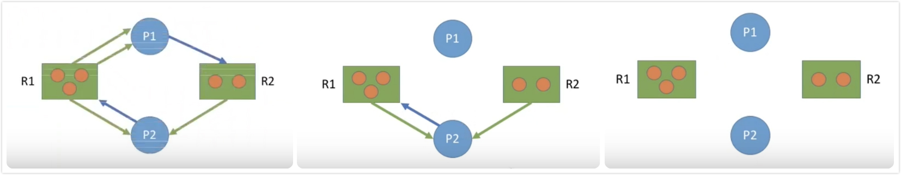

# 悲观锁 与 乐观锁
[面试必备之乐观锁与悲观锁](https://juejin.im/post/5b4977ae5188251b146b2fc8)

## 悲观锁
总是假设最坏的情况,每次去拿数据的时候都认为别人会修改,所以每次在拿数据的时候都会上锁,这样别人想拿这个数据就会阻塞直到它拿到锁.
传统的关系型数据库里边就用到了很多这种锁机制,比如行锁,表锁等,读锁,写锁等,都是在做操作之前先上锁.

## 乐观锁
总是假设最好的情况,每次去拿数据的时候都认为别人不会修改,所以不会上锁,但是在更新的时候会判断一下在此期间别人有没有去更新这个数据,可以使用版本号机制和CAS算法实现.
乐观锁适用于多读的应用类型,这样可以提高吞吐量.
像数据库提供的类似于`write_condition`机制,其实都是提供的乐观锁.在Java中java.util.concurrent.atomic包下面的原子变量类就是使用了乐观锁的一种实现方式CAS实现的.

### 乐观锁常见的两种实现方式
乐观锁一般会使用版本号机制或CAS算法实现.

- 版本号机制: 一般是在数据表中加上一个数据版本号version字段,当数据被修改时,version值会加一.
  当线程A要更新数据值时,在读取数据的同时也会读取version值,在提交更新时,若刚才读取到的version值为当前数据库中的version值相等时才更新,否则重试更新操作,直到更新成功.
- CAS算法: 即compare and swap(比较与交换),是一种有名的无锁算法.
  无锁编程,即不使用锁的情况下实现多线程之间的变量同步,也就是在没有线程被阻塞的情况下实现变量的同步,所以也叫非阻塞同步(Non-blocking Synchronization).CAS算法涉及到三个操作数
  1) 需要读写的内存值 V; 2) 进行比较的值 A; 3) 拟写入的新值 B. 当且仅当 V 的值等于 A时,CAS通过原子方式用新值B来更新V的值,否则不会执行任何操作(比较和替换是一个原子操作).
  一般情况下是一个自旋操作,即不断的重试.

### CAS 乐观锁的缺点
1. ABA 问题: 如果一个变量V初次读取的时候是A值,并且在准备赋值的时候检查到它仍然是A值,那我们就能说明它的值没有被其他线程修改过了吗?
  很明显是不能的,因为在这段时间它的值可能被改为其他值,然后又改回A,那CAS操作就会误认为它从来没有被修改过.这个问题被称为CAS操作的"ABA"问题.
1. 循环时间长开销大: 自旋CAS(也就是不成功就一直循环执行直到成功)如果长时间不成功,会给CPU带来非常大的执行开销.
1. 只能保证一个共享变量的原子操作: CAS 只对单个共享变量有效,当操作涉及跨多个共享变量时 CAS 无效.

## 两种锁的使用场景
从上面对两种锁的介绍,我们知道两种锁各有优缺点,不可认为一种好于另一种,像乐观锁适用于写比较少的情况下(多读场景),即冲突真的很少发生的时候,这样可以省去了锁的开销,加大了系统的整个吞吐量.
但如果是多写的情况,一般会经常产生冲突,这就会导致上层应用会不断的进行retry,这样反倒是降低了性能,所以一般多写的场景下用悲观锁就比较合适.

# 自旋锁与互斥锁
[面试必备之深入理解自旋锁](https://zhuanlan.zhihu.com/p/40729293)

## 自旋锁 Spin Lock
是指当一个线程在尝试获取锁的时候,如果锁已经被其它线程获取,那么该线程将循环等待,然后不断的判断锁是否能够被成功获取,直到获取到锁才会退出循环.

获取锁的线程一直处于活跃状态,但是并没有执行任何有效的任务,使用这种锁会造成busy-waiting.

它是为实现保护共享资源而提出一种锁机制.其实,自旋锁与互斥锁比较类似,它们都是为了解决对某项资源的互斥使用.无论是互斥锁,还是自旋锁,在任何时刻,最多只能有一个保持者,
也就说,在任何时刻最多只能有一个执行单元获得锁.但是两者在调度机制上略有不同.
对于互斥锁,如果资源已经被占用,资源申请者只能进入睡眠状态.
但是自旋锁不会引起调用者睡眠,如果自旋锁已经被别的执行单元保持,调用者就一直循环在那里看是否该自旋锁的保持者已经释放了锁,"自旋"一词就是因此而得名.

获取,释放自旋锁,实际上是读写自旋锁的存储内存或寄存器.因此这种读写操作必须是原子的.通常用test-and-set等原子操作来实现.

### 自旋锁存在的问题
如果某个线程持有锁的时间过长,就会导致其它等待获取锁的线程进入循环等待,消耗CPU.使用不当会造成CPU使用率极高.

### 自旋锁的优点
- 自旋锁不会使线程状态发生切换,一直处于用户态,即线程一直都是active的,不会使线程进入阻塞状态,减少了不必要的上下文切换,执行速度快. 因此对于线程只会阻塞很短时间的场合是有效的.
- 非自旋锁在获取不到锁的时候会进入阻塞状态,从而进入内核态,当获取到锁的时候需要从内核态恢复,需要线程上下文切换, 严重影响性能.

# 死锁
什么是死锁?死锁产生的条件?

在两个或者多个并发线程中,如果每个线程持有某种资源而又等待其它线程释放它或它们现在保持着的资源,在未改变这种状态之前都不能向前推进,称这一组线程产生了死锁.
通俗的讲就是两个或多个线程无限期的阻塞,相互等待的一种状态.

死锁产生的四个条件(有一个条件不成立,则不会产生死锁)

1. 互斥条件:一个资源一次只能被一个线程使用
1. 请求与保持条件:一个线程因请求资源而阻塞时,对已获得资源保持不放
1. 不剥夺条件:线程获得的资源,在未完全使用完之前,不能强行剥夺
1. 循环等待条件:若干线程之间形成一种头尾相接的环形等待资源关系.
  注意: 发生死锁时一定有循环等待, 但是发生循环等待时未必死锁(循环等待是死锁的必要不充分条件). 如果同类资源数大于1, 则即使有循环等待, 也未必发生死锁.
  但是如果系统中每类资源都只有一个, 那循环等待就是死锁的充分必要条件了.

解决死锁的基本思想就是上面的死锁形成的条件, 方法如下: 预防死锁, 避免死锁(银行家算法), 检测死锁, 解除死锁

## [死锁预防](https://www.youtube.com/watch?v=zV8su0Bf_lE)
在程序运行之前防止发生死锁.

前面说了死锁产生的条件有四个,分别是:互斥条件,占有和等待条件,不剥夺条件,循环等待条件.

而死锁防止的策略就是至少破坏这四个条件其中一项.

### 破坏互斥条件
使资源同时访问而非互斥使用,就没有进程会阻塞在资源上,从而不发生死锁.

只读数据文件,磁盘等软硬件资源均可采用这种办法管理,
但是许多资源是独占性资源,如可写文件,键盘等只能互斥的占有,
所以这种做法在许多场合是不适用的.

或者把物理互斥使用的资源改造为逻辑允许共享使用, 则系统不会进入死锁状态. 比如用spooling技术(类似于在进程和物理设备之间加了一个blocking queue) 将打印机改造为共享的.

### 破坏占有和等待条件
采用静态分配的方式,静态分配的方式是指进程必须在执行之前就申请需要的全部资源,且直至所要的资源全部得到满足后才开始执行.

实现简单,但是严重的减低了资源利用率.
因为在每个进程占有的资源中,有些资源在运行后期使用,有些资源在例外情况下才被使用,可能会造成进程占有一些几乎用不到的资源,而使其他想使用这些资源的进程等待.

### 破坏不剥夺条件
剥夺调度能够防止死锁,但是只适用于内存和处理器资源.

- 方法一:占有资源的进程若要申请新资源,必须主动释放已占有资源,若需要此资源,应该向系统重新申请.
- 方法二:资源分配管理程序为进程分配新资源时,若有则分配,否则将剥夺此进程已占有的全部资源,并让进程进入等待资源状态,资源充足后再唤醒它重新申请所有所需资源.

### 破坏循环等待条件
给系统的所有资源编号,规定进程请求所需资源的顺序必须按照资源的编号依次进行.

- 采用层次分配策略,将系统中所有的资源排列到不同层次中
- 一个进程得到某层的一个资源后,只能申请较高一层的资源
- 当进程释放某层的一个资源时,必须先释放所占有的较高层的资源
- 当进程获得某层的一个资源时,如果想申请同层的另一个资源,必须先释放此层中已占有的资源

## [死锁避免 - 银行家算法](https://www.youtube.com/watch?v=KALJtqEqNek)
银行家算法是一种最有代表性的避免死锁的算法. 在避免死锁方法中允许线程动态地申请资源, 但系统在进行资源分配之前,应先计算此次分配资源的安全性,若分配不会导致系统进入不安全状态,则分配,否则等待.

### 什么是安全序列
你是一位成功的银行家, 手里掌握着100亿的资金.
有三个企业想找你贷款, 分别是企业B, 企业A, 企业T.
B 表示最多借70亿, A 表示最多借40亿, T表示最多借50亿.
然而, 江湖有个不成文的规矩: 如果你借给企业的钱总数达不到企业提出的最大要求, 那么不管你之前给企业借了多少钱, 那些钱都拿不回来了.
刚开始, BAT 三个企业分别从你这里借走了20, 10, 30亿, 此时你手里还有40亿的资金.

|  |最大需求 |已借走 |最多还会借|
|--|---------|-------|----------|
|B |70       |20     |50        |
|A |40       |10     |30        |
|T |50       |30     |20        |

此时, 如果B 还想借走30亿, 你敢借吗?
假如答应了B 的需求, 手里就剩下10亿.

|  |最大需求 |已借走       |最多还会借   |
|--|---------|-------------|-------------|
|B |70       |20 + 30 = 50 |50 - 30 = 20 |
|A |40       |10           |30           |
|T |50       |30           |20           |

如果BAT都提出再借20亿的请求, 那么任何一个企业的需求都得不到满足.
所以经过慎重考虑, 给B借30亿是不安全的.

如果是A 想再借20亿, 可以借给他吗?

|  |最大需求 |已借走       |最多还会借   |
|--|---------|-------------|-------------|
|B |70       |20           |50           |
|A |40       |10 + 20 = 30 |30 - 20 = 10 |
|T |50       |30           |20           |

然后我们可以把剩下的20亿全部借给T, 等T把钱全部还回来了, 手里就会有 50亿, 再把这些钱全部借给B, B 还钱之后共有 70亿, 然后再借给A.
所以之后按照T -> B -> A 的顺序借钱是OK 的(这个具体例子中, 安全序列不止这一个).

所谓安全序列, 就是指如果系统按照这种序列分配资源, 则每个进程都能顺利完成.
只要能找出一个安全序列, 系统就是安全状态, 当然, 安全序列可能有多个.

如果分配了资源之后, 系统中找不出任何一个安全序列, 系统就进入了不安全状态. 这就意味着之后可能所有进程都无法顺利的执行下去.
当然, 如果有进程提前归还了一些资源, 那系统也有可能重新回到安全状态, 不过我们在分配资源之前总是要考虑最坏的情况.

如果系统处于安全状态, 就一定不会发生死锁.
如果系统进入不安全状态, 就可能发生死锁(处于不安全状态未必就是发生了死锁, 但是发生死锁时一定是在不安全状态).
因此可以在资源分配之前预先判断这次分配是否会导致系统进入不安全状态, 以此决定是否答应资源分配请求.
这也是银行家算法的核心思想.

### 银行家算法
在进程提出资源申请时, 先预判此次分配是否会导致系统进入不安全状态.
如果会进入不安全状态, 就暂时不答应这次请求, 让该进程阻塞等待.

在计算机系统中会有多种资源, 可以把一个数字扩展为一个向量.

## [死锁检测和解除](https://www.youtube.com/watch?v=AahPeAkrIwU&t=618s)
### 死锁检测
为了能对系统是否已发生了死锁进行检测, 必须

1. 用某种数据结构来保存资源的请求和分配信息;
1. 提供一种算法, 利用上述信息来检测系统是否已进入死锁状态.

数据结构: 资源分配图

- 两种节点: 进程节点和资源节点
- 两种边
  1. 进程节点 -> 资源节点: 表示进程想申请几个资源
  1. 资源节点 -> 进程节点: 表示已经为进程分配了几个资源.

如果系统中剩余的可用资源数足够满足进程的需求, 那么这个进程暂时是不会阻塞的, 可以顺利的执行下去.
如果这个进程执行结束了把资源归还系统, 就可能使某些正在等待资源的进程被激活, 并顺利的执行下去.
相应的, 这些被激活的进程执行完了之后又会归还一些资源, 这样可能又会激活另外一些阻塞的进程......

如果按上述过程分析, 最终能消除所有边, 就称这个图是可完全简化的.
此时一定没有发生死锁(相当于能找到一个安全序列).

如果最终不能消除所有边, 那么此时就是发生了死锁.
最终还连着边的那些进程就是处于死锁状态的进程.

死锁检测的算法正式描述如下:

1. 在资源分配图中, 找出既不阻塞又不是孤点的进程P. 消去它所有的请求边和分配边,使之成为孤立的节点.
1. 进程P所释放的资源, 可以唤醒某些因等待这些资源而阻塞的进程, 原来的阻塞进程可能变为非阻塞进程. 根据 1) 中的方法进行一系列简化之后, 若能消去图中所有的边, 则称该图是可完全简化的.

死锁定理: 如果某时刻系统的资源分配图是不可完全简化的, 那么此时系统死锁.

### 死锁的解除
解除死锁的方法主要有

1. 资源剥夺. 挂起(暂时放到外存上)某些死锁进程, 并抢占它的资源, 将这些资源分配给其他的死锁进程. 但是应防止被挂起的进程长时间得不到资源而饥饿.
1. 终止进程.
1. 进程回退. 让一个或多个死锁进程回退到足以避免死锁的地步. 这就要求系统要纪录进程的历史信息, 设置还原点.

如何决定对谁下手

1. 进程优先级低的
1. 已执行时间短的
1. 还需要执行更长时间才能结束的
1. 已经使用了更多资源的
1. 批处理的而不是交互式的

