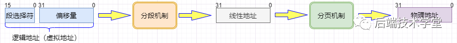
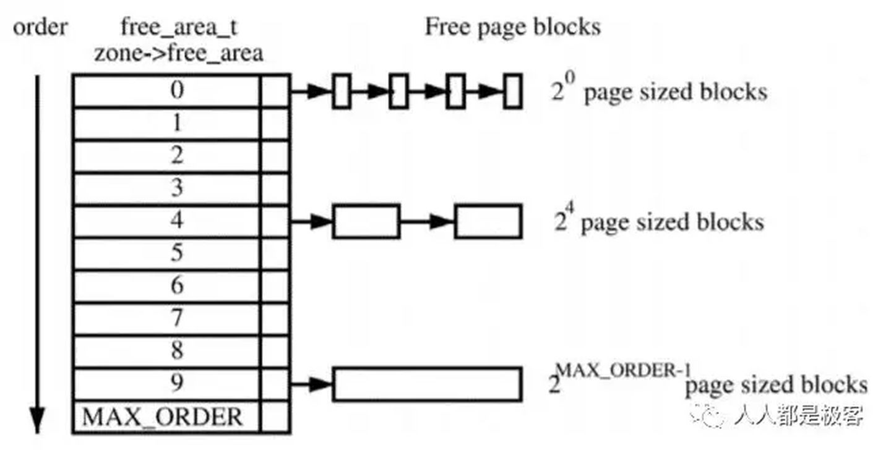
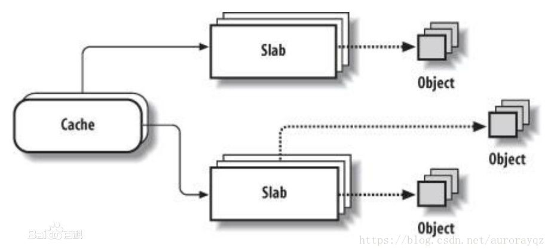

# 分段和分页
分页和分段有什么区别?

- 段是信息的逻辑单位, 它是根据用户的需要划分的, 例如程序段, 数据段, 因此段对用户是可见的; 页是信息的物理单位,是为了管理
  主存的方便而划分的, 对用户是透明的.
- 段的大小不固定, 由它所完成的功能决定; 页大大小固定, 由系统决定
- 段向用户提供二维地址空间, 页向用户提供的是一维地址空间

分页机制的思想是:通过映射,可以使连续的线性地址与物理地址相关联,逻辑上连续的线性地址对应的物理地址可以不连续.

大多数使用虚拟存储器的系统都使用一种称为分页(paging)机制.虚拟地址空间划分成称为页(page)的单位,而相应的物理地址空间也被进
行划分,单位是页桢(frame).页和页桢的大小必须相同.

[逻辑地址,线性地址和物理地址的关系](https://blog.csdn.net/prike/article/details/52722934)

任何时候,计算机上都存在一个程序能够产生的地址集合,我们称之为地址范围.这个范围的大小由CPU的位数决定,例如一个32位的CPU,它
的地址范围是0~0xFFFFFFFF (4G),而对于一个64位的CPU,它的地址范围为0~0xFFFFFFFFFFFFFFFF (64T).这个范围就是我们的程序能够产
生的地址范围,我们把这个地址范围称为虚拟地址空间,该空间中的某一个地址我们称之为虚拟地址.与虚拟地址空间和虚拟地址相对应的
则是物理地址空间和物理地址,大多数时候我们的系统所具备的物理地址空间只是虚拟地址空间的一个子集.这里举一个最简单的例子直观
地说明这两者,对于一台内存为256M的32bit x86主机来说,它的虚拟地址空间范围是0~0xFFFFFFFF(4G),而物理地址空间范围是
0x000000000~0x0FFFFFFF(256M)

- 物理地址,CPU地址总线传来的地址
- 线性地址(Linear Address): 是逻辑地址到物理地址变换之间的中间层.
  在分段部件中逻辑地址是段中的偏移地址, 然后加上基地址就是线性地址. 是一个32位无符号整数,可以用来表示高达4GB的地址,通过
  逻辑地址变换就可以生成一个线性地址.
  如果启用了分页机制,那么线性地址可以再经过变换以产生一个物理地址.如果没有启用分页机制,那么线性地址直接就是物理地址.
- 逻辑地址(也叫虚拟地址): 是在有地址变换功能的计算机中,访内指令给出的地址(操作数), 也就是是机器语言指令中,用来指定一个操
  作数或是一条指令的地址.
  要经过寻址方式的计算或变换才得到内存储器中的实际有效地址即物理地址.
  一个逻辑地址由两部份组成: "段标识符:段内偏移量". 段标识符是由一个16位长的字段组成,称为段选择符.其中前13位是个索引号,后
  面3位包含一些硬件细节.

CPU将一个逻辑地址转换为物理地址,需要进行两步: 首先CPU要利用其段式内存管理单元,先将为个逻辑地址转换成一个线程地址,再利用
其页式内存管理单元,转换为最终物理地址.

这样做两次转换,的确是非常麻烦而且没有必要的,因为直接可以把线性地址抽像给进程.之所以这样冗余, intel 完全是为了兼容而已.

不管是用户空间还是内核空间, 使用的地址都是虚拟地址, 当需进程要实际访问内存的时候, 会由内核的「请求分页机制」产生「缺页异
常」调入物理内存页.

# 内存碎片
[外碎片与内碎片](https://www.jianshu.com/p/1070a66b2783)

## 外部碎片
是处于任何两个已分配区域或页面之间的空闲存储块.这些存储块的总和可以满足当前申请的长度要求,但是由于它们的地址不连续或其他
原因,使得系统无法满足当前申请.

伙伴算法(buddy)用来解决外碎片.

[Linux内核内存管理算法Buddy和Slab](https://zhuanlan.zhihu.com/p/36140017)

假设这是一段连续的页框,阴影部分表示已经被使用的页框,现在需要申请一个连续的5个页框.这个时候,在这段内存上不能找到连续的5个
空闲的页框,就会去另一段内存上去寻找5个连续的页框,这样子,久而久之就形成了页框的浪费.

为了避免出现这种情况,Linux内核中引入了伙伴系统算法(Buddy system).把所有的空闲页框分组为11个块链表,每个块链表分别包含大小
为1,2,4,8,16,32,64,128,256,512和1024个连续页框的页框块.最大可以申请1024个连续页框,对应4MB大小的连续内存.每个页框块的第一
个页框的物理地址是该块大小的整数倍,如图:

TODO: 如果申请大于4MB 的内存, 怎么处理?

假设要申请一个256个页框的块,先从256个页框的链表中查找空闲块,如果没有,就去512个页框的链表中找,找到了则将页框块分为2个256
个页框的块,一个分配给应用,另外一个移到256个页框的链表中.如果512个页框的链表中仍没有空闲块,继续向1024个页框的链表查找,如
果仍然没有,则返回错误.

页框块在释放时,会主动将两个连续的页框块合并为一个较大的页框块.

从上面可以知道Buddy算法一直在对页框做拆开合并拆开合并的动作.Buddy算法牛逼就牛逼在运用了世界上任何正整数都可以由2^n的和组
成.这也是Buddy算法管理空闲页表的本质.

## 内部碎片
是处于操作系统分配的用于装载某一进程的内存区域内部的存储块.占有这些区域或页面的进程并不使用这个存储块.而在进程占有这块存
储块时,系统无法利用它.直到进程释放它,或进程结束时,系统才有可能利用这个存储块.

因为所有的内存分配必须起始于可被4, 8 或 16 整除(视处理器体系结构而定)的地址或者因为MMU的分页机制的限制,决定内存分配算法
仅能把预定大小的内存块分配给客户.假设当某个客户请求一个 43 字节的内存块时, 因为没有适合大小的内存, 所以它可能会获得44字
节,48字节等稍大一点的字节,因此由所需大小四舍五入而产生的多余空间就叫内部碎片.

slab算法用来解决内碎片.

[面试官:你谈谈对物理内存和虚拟内存的理解,一文彻底搞懂](https://segmentfault.com/a/1190000022506020)

一般来说,内核对象的生命周期是这样的:分配内存-初始化-释放内存,内核中有大量的小对象,比如文件描述结构对象,任务描述结构对象,
如果按照伙伴系统按页分配和释放内存,对小对象频繁的执行 分配内存-初始化-释放内存 会非常消耗性能.

伙伴系统分配出去的内存还是以页框为单位,而对于内核的很多场景都是分配小片内存,远用不到一页内存大小的空间.
slab 分配器,通过将内存按使用对象不同再划分成不同大小的空间,应用于内核对象的缓存.

伙伴系统和slab不是二选一的关系,slab 内存分配器是对伙伴分配算法的补充.

[Linux是如何避免内存碎片的](https://blog.csdn.net/aurorayqz/article/details/79671785)

而slab分配器是基于对象进行管理的,相同类型的对象归为一类(如进程描述符就是一类),每当要申请这样一个对象,slab分配器就从一个
slab列表中分配一个这样大小的单元出去,而当要释放时,将其重新保存在该列表中,而不是直接返回给伙伴系统,从而避免这些内碎片.
slab分配器并不丢弃已分配的对象,而是释放并把它们保存在内存中.当以后又要请求新的对象时,就可以从内存直接获取而不用重复初始
化.

对象高速缓存的组织如右下图所示,高速缓存的内存区被划分为多个slab,每个slab由一个或多个连续的页框组成,这些页框中既包含已分
配的对象,也包含空闲的对象.

在cache和object中加入slab分配器,是在时间和空间上的折中方案.

另外为了解决多核和NUMA架构下效率问题,slab管理器`kmem_cache`又把slab page对象分为2层结构,从下往上依次为:

- 第一层为NUMA node下cpu共享page: 管理器为`kmem_cache_node`,管理node下的slab对象,解决NUMA架构的内存访问效率问题.当本层的
  空闲page不足时,从伙伴系统申请空闲page,
- 第二层为per-cpu专属page: 管理器为`kmem_cache_cpu`,管理cpu专属的slab对象,解决多核竞争问题.当本层的空闲page不足时,从第一
  层申请空闲page

# 用户空间
[别再说你不懂Linux内存管理了,10张图给你安排的明明白白](
https://mp.weixin.qq.com/s?__biz=MzkwOTE2OTY1Nw==&mid=2247486893&idx=1&sn=8295c8a87137ccc7fa5eebcbca350b81)

用户进程能访问的是「用户空间」,每个进程都有自己独立的用户空间, 虚拟地址范围从从 0x00000000 至 0xBFFFFFFF 总容量3G(操作系
统环境都是x86 架构的32 位Linux 系统).

用户进程通常只能访问用户空间的虚拟地址,只有在执行内陷操作或系统调用时才能访问内核空间.

进程(执行的程序)占用的用户空间按照「访问属性一致的地址空间存放在一起」的原则,划分成 5个不同的内存区域.访问属性指的是"可
读,可写,可执行等 .

- 代码段: 存放可执行文件的操作指令,可执行程序在内存中的镜像.代码段需要防止在运行时被非法修改,所以只准许读取操作
- 数据段: 存放可执行文件中已初始化全局变量,换句话说就是存放程序静态分配的变量和全局变量.
- BSS段: 包含了程序中未初始化的全局变量, 在内存中 bss 段全部置零.
- 堆heap: 存放进程运行中被动态分配的内存段,它的大小并不固定,可动态扩张或缩减.当进程调用malloc等函数分配内存时,新分配的内
  存就被动态添加到堆上(堆被扩张),当利用free等函数释放内存时,被释放的内存从堆中被剔除(堆被缩减)
- 栈stack: 栈是用户存放程序临时创建的局部变量,也就是函数中定义的变量(但不包括 static 声明的变量,static意味着在数据段中存
  放变量). 除此以外,在函数被调用时,其参数也会被压入发起调用的进程栈中,并且待到调用结束后,函数的返回值也会被存放回栈中.由
  于栈的先进先出特点,所以栈特别方便用来保存/恢复调用现场.从这个意义上讲,我们可以把堆栈看成一个寄存,交换临时数据的内存区.

上述几种内存区域中数据段,BSS 段,堆通常是被连续存储在内存中,在位置上是连续的, 而代码段和栈往往会被独立存放. 堆和栈两个区
域在 i386 体系结构中栈向下扩展,堆向上扩展,相对而生.

## 用户空间内存分配
malloc 用于申请用户空间的虚拟内存, 当申请小于128KB 小内存的时, malloc 使用sbrk或brk 分配内存,当申请大于 128KB 的内存时,
使用 mmap 函数申请内存,

存在问题

由于 brk/sbrk/mmap 属于系统调用,如果每次申请内存都要产生系统调用开销,cpu 在用户态和内核态之间频繁切换,非常影响性能.

而且,堆是从低地址往高地址增长,如果低地址的内存没有被释放,高地址的内存就不能被回收,容易产生内存碎片.

解决

因此, malloc 采用的是内存池的实现方式,先申请一大块内存,然后将内存分成不同大小的内存块,然后用户申请内存时,直接从内存池中
选择一块相近的内存块分配出去.

