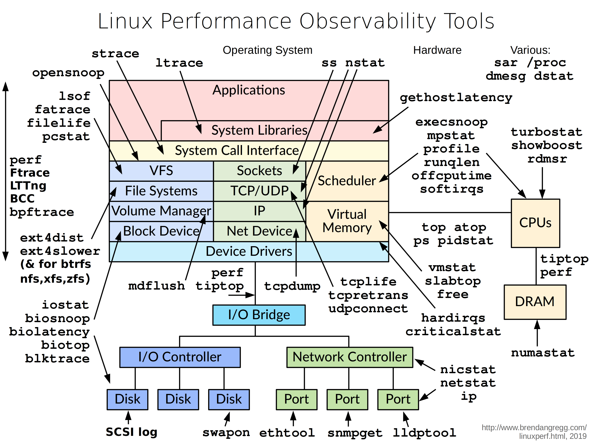

- [Linux Performance](http://www.brendangregg.com/linuxperf.html)
- [Linux Performance Analysis in 60,000 Milliseconds](
  https://netflixtechblog.com/linux-performance-analysis-in-60-000-milliseconds-accc10403c55)
- [Linux Performance Tools, Brendan Gregg, part 1 of 2](https://www.youtube.com/watch?v=FJW8nGV4jxY)
- [Linux Performance Tools, Brendan Gregg, part 2 of 2](https://www.youtube.com/watch?v=zrr2nUln9Kk)

# methods
## [The USE Method](http://www.brendangregg.com/usemethod.html)
The USE Method can be summarized as:

For every resource, check utilization, saturation, and errors.
It's intended to be used early in a performance investigation, to identify systemic bottlenecks.

Terminology definitions:

- resource: all physical server functional components (CPUs, disks, busses, ...)
- utilization: the average time that the resource was busy servicing work
- saturation: the degree to which the resource has extra work which it can't service, often queued
- errors: the count of error events

The metrics are usually expressed in the following terms:

- utilization: as a percent over a time interval. eg, "one disk is running at 90% utilization".
- saturation: as a queue length. eg, "the CPUs have an average run queue length of four".
- errors: scalar counts. eg, "this network interface has had fifty late collisions".
- Errors should be investigated because they can degrade performance, and may not be immediately noticed when the
  failure mode is recoverable. This includes operations that fail and are retried, and devices from a pool of redundant
  devices that fail.

Software Resources

Some software resources can be considered in a similar way. This usually applies to smaller components of software, not
entire applications. For example:

- mutex locks:
  - utilization may be defined as the time the lock was held;
  - saturation by those threads queued waiting on the lock.
- thread pools:
  - utilization may be defined as the time threads were busy processing work;
  - saturation by the number of requests waiting to be serviced by the thread pool.
- process/thread capacity: the system may have a limited number of processes or threads
  - the current usage of which may be defined as utilization;
  - waiting on allocation may be saturation;
  - and errors are when the allocation failed (eg, "cannot fork").
- file descriptor capacity: similar to the above, but for file descriptors.

Don't sweat this type.
If the metrics work well, use them, otherwise software can be left to other methodologies (eg, latency).

## workload characterization method
1. **Who** is causing the load? PID, UID, IP addre, ...
1. **Why** is the load called? code path, stack trace
1. **What** is the load? IOPS, throughput, type, r/w
1. **How** is the load chaning over time?

# observation tools


- basic: uptime, vmstat, iostat, mpstat, ps, top, free, dmesg, ...
- intermediate: tcpdump, netstat, nicstat, pidstat, sar, ...
- advanced: ss, slaptop, perf_events

## basic
### uptime
one way to print load averages

```plain
~ uptime
12:05  up 5 days, 19:55, 1 users, load averages: 30.02, 26.43, 19.02
```
The three numbers are exponentially damped moving sum averages with a 1 minute, 5 minute, and 15 minute constant.
The three numbers give us some idea of how load is changing over time.

load > # of cpus, may mean cpu saturation.

In the example above, the load averages show a recent increase, hitting 30 for the 1 minute value, compared to 19 for
the 15 minute value.
That the numbers are this large means a lot of something: probably CPU demand; vmstat or mpstat will confirm.

### top
system and per-process interval summary

top can miss short-lived processes (atop won't)

### vmstat
virtual memory statistics and more

```plain
~ vmstat 1
procs ---------memory---------- ---swap-- -----io---- -system-- ------cpu-----
 r  b swpd   free   buff  cache   si   so    bi    bo   in   cs us sy id wa st
34  0    0 200889792  73708 591828    0    0     0     5    6   10 96  1  3  0  0
32  0    0 200889920  73708 591860    0    0     0   592 13284 4282 98  1  1  0  0
32  0    0 200890112  73708 591860    0    0     0     0 9501 2154 99  1  0  0  0
32  0    0 200889568  73712 591856    0    0     0    48 11900 2459 99  0  0  0  0
32  0    0 200890208  73712 591860    0    0     0     0 15898 4840 98  1  1
```
vmstat was run with an argument of 1, to print one second summaries.

The first line of output has some columns that show the average since boot, instead of the previous second.

- r: Number of processes running on CPU and waiting for a turn. This provides a better signal than load averages for
  determining CPU saturation, as it does not include I/O. To interpret: an "r" value greater than the CPU count is
  saturation.
- free: Free memory in kilobytes. If there are too many digits to count, you have enough free memory.
  The "free -m" command better explains the state of free memory.
- si, so: Swap-ins and swap-outs. If these are non-zero, you're out of memory.
- us, sy, id, wa, st: These are breakdowns of CPU time, on average across all CPUs.
  They are user time, system time (kernel), idle, wait I/O, and stolen time (by other guests, or with Xen, the guest's
  own isolated driver domain).

The CPU time breakdowns will confirm if the CPUs are busy, by adding user + system time.
A constant degree of wait I/O points to a disk bottleneck; this is where the CPUs are idle, because tasks are blocked
waiting for pending disk I/O. You can treat wait I/O as another form of CPU idle, one that gives a clue as to why they
are idle.

System time is necessary for I/O processing. A high system time average, over 20%, can be interesting to explore
further: perhaps the kernel is processing the I/O inefficiently.

In the above example, CPU time is almost entirely in user-level, pointing to application level usage instead. The CPUs
are also well over 90% utilized on average. This isn't necessarily a problem; check for the degree of saturation using
the "r" column.

### mpstat
multi-processor statistics, per cpu

This command prints CPU time breakdowns per CPU, which can be used to check for an imbalance.
A single hot CPU can be evidence of a single-threaded application.

```plain
$ mpstat -P ALL 1
Linux 3.13.0-49-generic (titanclusters-xxxxx)  07/14/2015  _x86_64_ (32 CPU)

07:38:49 PM  CPU   %usr  %nice   %sys %iowait   %irq  %soft  %steal  %guest  %gnice  %idle
07:38:50 PM  all  98.47   0.00   0.75    0.00   0.00   0.00    0.00    0.00    0.00   0.78
07:38:50 PM    0  96.04   0.00   2.97    0.00   0.00   0.00    0.00    0.00    0.00   0.99
07:38:50 PM    1  97.00   0.00   1.00    0.00   0.00   0.00    0.00    0.00    0.00   2.00
07:38:50 PM    2  98.00   0.00   1.00    0.00   0.00   0.00    0.00    0.00    0.00   1.00
07:38:50 PM    3  96.97   0.00   0.00    0.00   0.00   0.00    0.00    0.00    0.00   3.03
```

### iostat
This is a great tool for understanding block devices (disks), both the workload applied and the resulting performance.

```plain
~ iostat -xz 1
Linux 4.14.81.bm.15-amd64 (n227-022-231) 	06/14/2021 	_x86_64_	(8 CPU)

avg-cpu:  %user   %nice %system %iowait  %steal   %idle
           1.28    0.00    0.66    0.05    0.02   97.99

Device:      rrqm/s   wrqm/s     r/s     w/s    rkB/s    wkB/s avgrq-sz avgqu-sz   await r_await w_await  svctm  %util
scd0           0.00     0.00    0.00    0.00     0.00     0.00     7.17     0.00    0.97    0.97    0.00   0.00   0.00
sdb            0.21     2.69   11.87    1.51   193.06   127.60    47.94     0.01    0.99    0.82    2.37   0.07   0.10
sda            0.00     5.38    1.75    3.04    63.56    92.20    65.03     0.00    0.96    0.94    0.98   0.07   0.03
```
- r/s, w/s, rKB/s, wKB/s: These are the delivered reads, writes, read Kbytes, and write Kbytes per second to the device.
  Use these for workload characterization. A performance problem may simply be due to an excessive load applied.
- await: The average time for the I/O in milliseconds. This is the time that the application suffers, as it includes
  both time queued and time being serviced. Larger than expected average times can be an indicator of device saturation,
  or device problems.
- avgqu-sz: The average number of requests issued to the device. Values greater than 1 can be evidence of saturation
  (although devices can typically operate on requests in parallel, especially virtual devices which front multiple
  back-end disks.)
- %util: Device utilization. This is really a busy percent, showing the time each second that the device was doing work.
  Values greater than 60% typically lead to poor performance (which should be seen in await), although it depends on the
  device. Values close to 100% usually indicate saturation.

If the storage device is a logical disk device fronting many back-end disks, then 100% utilization may just mean that
some I/O is being processed 100% of the time, however, the back-end disks may be far from saturated, and may be able to
handle much more work.

Bear in mind that poor performing disk I/O isn't necessarily an application issue. Many techniques are typically used to
perform I/O asynchronously, so that the application doesn't block and suffer the latency directly (e.g., read-ahead for
reads, and buffering for writes).

### free
main memory usage

```plain
$ free -m
             total       used       free     shared    buffers     cached
Mem:        245998      24545     221453         83         59        541
-/+ buffers/cache:      23944     222053
Swap:            0          0          0
```
The right two columns show:

- buffers: For the buffer cache, used for block device I/O.
- cached: For the page cache, used by file systems.

We just want to check that these aren't near-zero in size, which can lead to higher disk I/O (confirm using iostat), and
worse performance. The above example looks fine, with many Mbytes in each.

### dmesg
```plain
$ dmesg | tail
[1880957.563150] perl invoked oom-killer: gfp_mask=0x280da, order=0, oom_score_adj=0
[...]
[1880957.563400] Out of memory: Kill process 18694 (perl) score 246 or sacrifice child
[1880957.563408] Killed process 18694 (perl) total-vm:1972392kB, anon-rss:1953348kB, file-rss:0kB
[2320864.954447] TCP: Possible SYN flooding on port 7001. Dropping request.  Check SNMP counters.
```
This views the last 10 system messages, if there are any. Look for errors that can cause performance issues.
The example above includes the oom-killer, and TCP dropping a request.

Don't miss this step! dmesg is always worth checking.

## intermediate
### sar
- system activity reporter. many stats
- archive or live mode(interval [count])
- well designed, header naming convention, logical groups: TCP, ETCP, DEV, EDEV


```plain
$ sar -n DEV 1
Linux 3.13.0-49-generic (titanclusters-xxxxx)  07/14/2015     _x86_64_    (32 CPU)

12:16:48 AM     IFACE   rxpck/s   txpck/s    rxkB/s    txkB/s   rxcmp/s   txcmp/s  rxmcst/s   %ifutil
12:16:49 AM      eth0  18763.00   5032.00  20686.42    478.30      0.00      0.00      0.00      0.00
12:16:49 AM        lo     14.00     14.00      1.36      1.36      0.00      0.00      0.00      0.00
12:16:49 AM   docker0      0.00      0.00      0.00      0.00      0.00      0.00      0.00      0.00

12:16:49 AM     IFACE   rxpck/s   txpck/s    rxkB/s    txkB/s   rxcmp/s   txcmp/s  rxmcst/s   %ifutil
12:16:50 AM      eth0  19763.00   5101.00  21999.10    482.56      0.00      0.00      0.00      0.00
12:16:50 AM        lo     20.00     20.00      3.25      3.25      0.00      0.00      0.00      0.00
12:16:50 AM   docker0      0.00      0.00      0.00      0.00      0.00
```
Use this tool to check network interface throughput: rxkB/s and txkB/s, as a measure of workload, and also to check if
any limit has been reached.

In the above example, eth0 receive is reaching 22 Mbytes/s, which is 176 Mbits/sec (well under, say, a 1 Gbit/sec limit).

```plain
$ sar -n TCP,ETCP 1
Linux 3.13.0-49-generic (titanclusters-xxxxx)  07/14/2015    _x86_64_    (32 CPU)

12:17:19 AM  active/s passive/s    iseg/s    oseg/s
12:17:20 AM      1.00      0.00  10233.00  18846.00

12:17:19 AM  atmptf/s  estres/s retrans/s isegerr/s   orsts/s
12:17:20 AM      0.00      0.00      0.00      0.00      0.00

12:17:20 AM  active/s passive/s    iseg/s    oseg/s
12:17:21 AM      1.00      0.00   8359.00   6039.00

12:17:20 AM  atmptf/s  estres/s retrans/s isegerr/s   orsts/s
12:17:21 AM      0.00      0.00      0.00      0.00      0.00
```
This is a summarized view of some key TCP metrics. These include:

- active/s: Number of locally-initiated TCP connections per second (e.g., via connect()).
- passive/s: Number of remotely-initiated TCP connections per second (e.g., via accept()).
- retrans/s: Number of TCP retransmits per second.

The active and passive counts are often useful as a rough measure of server load: number of new accepted connections(
passive), and number of downstream connections (active). It might help to think of active as outbound, and passive as
inbound, but this isn't strictly true (e.g., consider a localhost to localhost connection).

Retransmits are a sign of a network or server issue; it may be an unreliable network (e.g., the public Internet), or it
may be due a server being overloaded and dropping packets.

The example above shows just one new TCP connection per-second.

### pidstat
very useful process stats, eg by-thread, disk IO

```plain
$ pidstat 1
Linux 3.13.0-49-generic (titanclusters-xxxxx)  07/14/2015    _x86_64_    (32 CPU)

07:41:02 PM   UID       PID    %usr %system  %guest    %CPU   CPU  Command
07:41:03 PM     0         9    0.00    0.94    0.00    0.94     1  rcuos/0
07:41:03 PM     0      4214    5.66    5.66    0.00   11.32    15  mesos-slave
07:41:03 PM     0      4354    0.94    0.94    0.00    1.89     8  java
07:41:03 PM     0      6521 1596.23    1.89    0.00 1598.11    27  java
07:41:03 PM     0      6564 1571.70    7.55    0.00 1579.25    28  java
07:41:03 PM 60004     60154    0.94    4.72    0.00    5.66     9  pidstat

07:41:03 PM   UID       PID    %usr %system  %guest    %CPU   CPU  Command
07:41:04 PM     0      4214    6.00    2.00    0.00    8.00    15  mesos-slave
07:41:04 PM     0      6521 1590.00    1.00    0.00 1591.00    27  java
07:41:04 PM     0      6564 1573.00   10.00    0.00 1583.00    28  java
07:41:04 PM   108      6718    1.00    0.00    0.00    1.00     0  snmp-pass
07:41:04 PM 60004     60154    1.00    4.00    0.00    5.00     9  pidstat
```
Pidstat is a little like top's per-process summary, but prints a rolling summary instead of clearing the screen.
This can be useful for watching patterns over time, and also recording what you saw into a record of your investigation.

The above example identifies two java processes as responsible for consuming CPU. The %CPU column is the total across
all CPUs; 1591% shows that that java processes is consuming almost 16 CPUs.

- -t: Also display statistics for threads associated with selected tasks
- -d: Report I/O statistics

### strace
- system call tracer
- currently has massive overheat(ptrace based), can slow the target by > 100x.
- Each line in the trace contains the system call name, followed by its arguments in parentheses and its return value.

```plain
~ strace -tttT -p 2511269
strace: Process 2511269 attached
1623661802.570747 futex(0x25380a8, FUTEX_WAIT, 0, NULL
```
- -ttt: time(us) since epoch
- -T: syscall time(s)
- `-e trace=`: Trace only the specified set of system calls, eg. `$ strace -e trace=open,read ls`
- -p pid: Attach to the process with the process ID pid and begin tracing, strace -tp `pgrep xxx`

```plain
~ strace ls
execve("/bin/ls", ["ls"], [/* 21 vars \*/]) = 0
brk(0)                                  = 0x8c31000
access("/etc/ld.so.nohwcap", F_OK)      = -1 ENOENT (No such file or directory)
mmap2(NULL, 8192, PROT_READ, MAP_PRIVATE|MAP_ANONYMOUS, -1, 0) = 0xb78c7000
access("/etc/ld.so.preload", R_OK)      = -1 ENOENT (No such file or directory)
open("/etc/ld.so.cache", O_RDONLY)      = 3
fstat64(3, {st_mode=S_IFREG|0644, st_size=65354, ...}) = 0
...
```

### netstat
various network protocol statistics using -s
```plain
~ netstat -s
Tcp:
    5214835 active connection openings
    29257 passive connection openings
    4557321 failed connection attempts
    853 connection resets received
    13 connections established
    33561064 segments received
    37947351 segments sent out
    11004279 segments retransmitted
    109 bad segments received
    150127 resets sent
Udp:
    558483 packets received
    11081766 packets to unknown port received
    0 packet receive errors
    12256177 packets sent
    0 receive buffer errors
    0 send buffer errors
TcpExt:
    15 resets received for embryonic SYN_RECV sockets
    62 ICMP packets dropped because they were out-of-window
    314562 TCP sockets finished time wait in fast timer
    189 packetes rejected in established connections because of timestamp
    809814 delayed acks sent
    ...
```

A multi-tool:

- -i: interface stats
- -r: route table
- default: list conns

```plain
~ netstat -i
Kernel Interface table
Iface      MTU    RX-OK RX-ERR RX-DRP RX-OVR    TX-OK TX-ERR TX-DRP TX-OVR Flg
docker0   1500   454585      0      0 0        642257      0      0      0 BMRU
eth0      1500 44101742      0      0 0      42981575      0      0      0 BMRU
lo       65536 30478091      0      0 0      30478091      0      0      0 LRU
veth6f8a  1500    79193      0      0 0        229891      0      0      0 BMRU

~ netstat -r
Kernel IP routing table
Destination     Gateway         Genmask         Flags   MSS Window  irtt Iface
default         n227-020-001.by 0.0.0.0         UG        0 0          0 eth0
10.227.20.0     0.0.0.0         255.255.252.0   U         0 0          0 eth0
172.17.0.0      0.0.0.0         255.255.0.0     U         0 0          0 docker0
```

netstat -p: shows process details

per-second interval with -c

### nicstat
network interface stats, iostat-like output

check network throughput and interface %util

### tcpdump
sniff network packets for post analysis

### swapon
show swap device usage if you have swap enabled

### lsof
more a debug tool, lsof(8) shows file descriptor usage, which for some apps, equals current active network connections.

`lsof -p pid` 可以看到这个进程打开的所有文件, 如果文件被其他进程删除, 会有一个删除的标记

## advanced
- misc: ltrace, ss, iptraf, ethtool, snmpget, lldptool, iotop, blktrace, slaptop, /proc, pcstat
- cpu performance counters: perf_events, tiptop, rdmsr
- advanced tracers: perf_events, ftrace, bBPF, SystemTap, ktap, LTTng, dtrace4linux, sysdig

### ss
more socket statistics

### iptraf
packet distribution by size

### iotop
block device IO (disk) by process

### slabtop
kernel slab allocator memory usage

### pcstat
- show page cache residency by file
- uses the mincore(2) syscall. useful for database performance analysis

### perf_events brief
- provides the perf command
- in linux source code: tools/perf, usually pkg added by linux-tools-common
- multi-tool with many capabilities
  - CPU profiling
  - PMC profiling
  - Static & dynamic tracing

# benchmarking tools


- multi: UnixBench, Imbench, sysbench, perf bench
- FS/disk: dd, hdparm, fio
- app/lib: ab, wrk, jmeter, openssl
- networking: ping, hping3, iperf, ttcp, traceroute, mtr, pchar

### fio
FS or disk IO micro-benchmarks
```zsh
fio --name=seqwrite --rw=write --bs=128k --size=122374m
```
results include basic latency distribution

### pchar
traceroute with bandwidth per hop

# tuning tools
generic interfaces: sysctl, /sys

many areas have custom tuning tools

- applications: their own config
- CPU/scheduler: nice, renice, taskset, ulimit, chcpu
- storage IO: tune2fs, ionice, hdparm, blockdev,
- network: ethtool, tc, ip, route
- dynamic patching: stap, kpatch

# static tools
static performance tuning: check the static state and configuration of the system

- cpu types & flags: `more /proc/cpuinfo`
- cpu frequency scaling config, kernel may be configured to dynamically modify cpu frequency
- storage devices: `lsscsi`, smartctl
- file system capacity: df -h
- file system and volume configuration: mdadm --misc -D /dev/md0
- route table
- state of hardware
- system messages: dmeg
- network interface config: ifconfig -a; ip link
- NUMA config: numactl -s; numactl -H
- PCI info: lspci
- installed kernel modules: lsmod
- root crontab config: crontab -l
- services: service --status-all
- etc.

routing table
```plain
~ ip route get 54.214.28.210
54.214.28.210 via 10.227.20.1 dev eth0 src 10.227.22.231 uid 1001
    cache
```

# profiling
objectives:

- profile cpu usage by stack sampling
- generate cpu flame graphs
- understand gotchas with stacks & symbols

## cpu profiling
record stacks at a timed interval: simple and effective

- pros: low(deterministic) overheat
- cons: coarse accuracy, but usually sufficient

### perf_events detail
perf_events workflow


- `perf record -g -t tid`: record thread tid's profile into perf.data
  - `-g`: means doing call-graph (stack chain/backtrace) recording
  - `-t`: thread id
  - `-p`: process id
  - `-o`: output file name, default perf.data
- `perf report`: read perf.data(created by perf record) and display the profile
  - `-i`: 指定文件
- `perf diff [oldfile] [newfile]`

[perf Examples](http://www.brendangregg.com/perf.html#Examples)

# tracing
objectives

- understand frameworks: tracepoints, kprobes, uprobes
- understand mainline tracers: ftrace, perf_events, eBPF
- awareness of other traces: SystemTap, LTTng, ktap, sysdig
- awareness of what tracing can accomplish (eg. perf-tools)

choosing a tracer

study what linux already has built-in (perf_events, ftrace, bBPF?)

## eBPF
Extended BPF: programs on tracepoints

- high performance filtering: JIT
- in-kernel summaries: maps

[eBPF 概念和基本原理](https://blog.fleeto.us/post/what-is-ebpf/)

有了eBPF,无需修改内核,也不用加载内核模块,程序员也能在内核中执行自定义的字节码.


如果所有的检查都通过了,eBPF 程序被加载并编译到内核中,并监听特定的信号.该信号以事件的形式出现,会被传递给被加载的eBPF程序.
一旦被触发,字节码就会根据其中的指令执行并收集信息.

### 事件和钩子
eBPF 程序是在内核中被事件触发的.在一些特定的指令被执行时时,这些事件会在钩子处被捕获.钩子被触发就会执行 eBPF 程序,对数据
进行捕获和操作.钩子定位的多样性正是 eBPF 的闪光点之一.
例如下面几种:

- 系统调用:当用户空间程序通过系统调用执行内核功能时.
- 功能的进入和退出:在函数退出之前拦截调用.
- 网络事件:当接收到数据包时.
- kprobe 和 uprobe:挂接到内核或用户函数中.

### 辅助函数
eBPF 程序被触发时,会调用辅助函数.这些特别的函数让 eBPF 能够有访问内存的丰富功能.
例如 Helper 能够执行一系列的任务:

- 在数据表中对键值对进行搜索,更新以及删除.
- 生成伪随机数.
- 搜集和标记隧道元数据.
- 把 eBPF 程序连接起来,这个功能被称为 tail call.
- 执行 Socket 相关任务,例如绑定,获取 Cookie,数据包重定向等.

这些助手函数必须是内核定义的,换句话说,eBPF 程序的调用能力是受到一个白名单限制的.这个名单很长,并且还在持续增长之中.

要在eBPF 程序和内核以及用户空间之间存储和共享数据,eBPF 需要使用 Map.正如其名,Map 是一种键值对.Map 能够支持多种数据结构,
eBPF 程序能够通过辅助函数在 Map 中发送和接收数据.

## SystemTap
- fully programmable, fully featured, including access to user-level tracepoints
- compiles tracing programs into kernel modules

