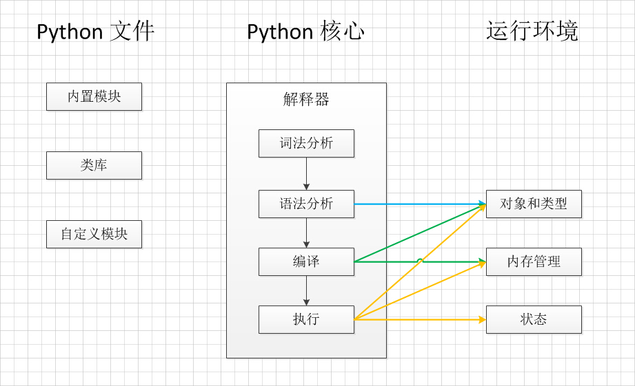

[Python内部执行过程](https://www.cnblogs.com/stefan-liu/p/5172424.html)

当我们执行Python代码的时候，在Python解释器用四个过程“拆解”我们的代码，最终被CPU执行返回给用户。

1. 首先当用户键入代码交给Python处理的时候会先进行词法分析，例如用户键入关键字或者当输入关键字有误时，都会被词法分析所触发，不正确的代码将不会被执行。
1. 下一步Python会进行语法分析，例如当"for i in test:"中，test后面的冒号如果被写为其他符号，代码依旧不会被执行。
1. 下面进入最关键的过程，在执行Python前，Python会生成.pyc文件，这个文件就是字节码.
  如果我们不小心修改了字节码，Python下次重新编译该程序时会和其上次生成的字节码文件进行比较，如果不匹配则会将被修改过的字节码文件进行覆盖，以确保每次编译后字节码的准确性。



# 字节码
那么什么是字节码？字节码在Python虚拟机程序里对应的是PyCodeObject对象。.pyc文件是字节码在磁盘上的表现形式。简单来说就是在编译代码的过程中，首先会将代码中的函数、类等对象分类处理，然后生成字节码文件。
有了字节码文件，CPU可以直接识别字节码文件进行处理，接着Python就可执行了。

## 编译字节码
Python中有一个内置函数compile，可以将源文件编译成codeobject，首先看这个函数的说明：
```python
compile(...) compile(source, filename, mode[, flags[, dont_inherit]]) -> code object
```

参数1：源文件的内容字符串
参数2：源文件名称
参数3：exec-编译module，single-编译一个声明，eval-编译一个表达式 一般使用前三个参数就够了

使用示例：
```python
#src_file.py
#some function
def f(d = 0):
  c = 1
  print "hello"

a = 9
b = 8
f()

>>> a = open('src_file.py', 'r').read()  # 命令行模式中打开源文件进行编译
>>> co = compile(a,'src_file','exec')
>>> type(co)
<type 'code'>  # 编译出了codeobject对象
```

## codeobject对象的属性
codeobject有哪些变量，接上节的内容分析一下：
```python
>>> print co.co_names    #所有的符号名称
('f', 'a', 'b')
 
>>> print co.co_name    #模块名、函数名、类名
<module>
 
>>> print co.co_consts    #常量集合、函数f和两个int常量a,b，d
(0, <code object f at 0xb7273b18, file "src_file", line 2>, 9, 8, None)
 
>>> print co.co_consts[1].co_varnames    #可以看到f函数也是一个codeobject,打印f中的局部变量
('c',)
 
>>> print co.co_code    #字节码指令
dZdZdZedS
 
>>> print co.co_consts[1].co_firstlineno    #代码块在文件中的起始行号
2
 
>>> print co.co_stacksize    #代码栈大小
2
 
>>> print co.co_filename    #文件名
src_file    #模块名、函数名、类名
```

codeobject的`co_code`代表了字节码，这个字节码有什么含义？我们可以使用dis模块进行python的反编译：
```python
import dis
dis.dis(co)
>>> output
 2        0 LOAD_CONST               0 (0)
          3 LOAD_CONST               1 (<code object f at 0xb7273b18, file "src_file", line 2>)
          6 MAKE_FUNCTION            1
          9 STORE_NAME               0 (f)
 5        12 LOAD_CONST              2 (9)
          15 STORE_NAME              1 (a)
 
 6        18 LOAD_CONST              3 (8)
          21 STORE_NAME              2 (b)
 
 7        24 LOAD_NAME               0 (f)
          27 CALL_FUNCTION           0
          30 POP_TOP             
          31 LOAD_CONST              4 (None)
          34 RETURN_VALUE
```
从反编译的结果来看，python字节码其实是模仿的x86的汇编，将代码编译成一条一条的指令交给一个虚拟的cpu去执行。
```
第一列：行号
第二列：指令在代码块中的偏移量
第三列：指令
第四列：操作数
第五列：操作数说明
```

