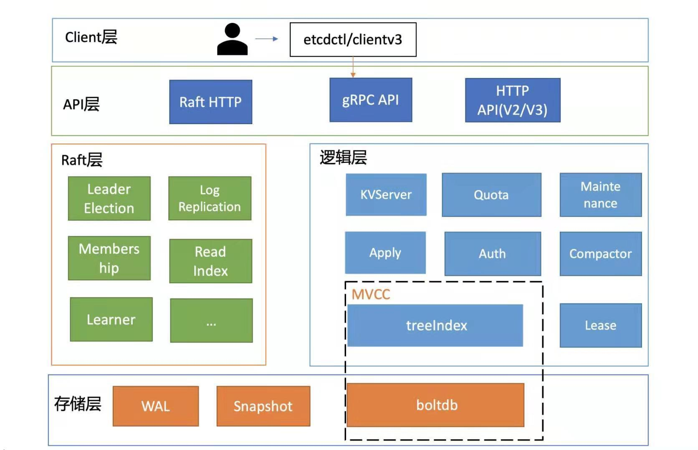

- [intro](#intro)
  - [architecture](#architecture)
- [对比其他存储组件](#对比其他存储组件)
  - [对比ZooKeeper](#对比zookeeper)
  - [对比Consul](#对比consul)
- [存储实现](#存储实现)
- [BoltDB](#boltdb)

# intro
The name "etcd" originated from two ideas, the unix "/etc" folder and "d"istributed systems.
Hence, a "d"istributed "/etc" is "etcd".

etcd is a strongly consistent, distributed key-value store that provides a reliable way to store data that needs to be
accessed by a distributed system or cluster of machines.

1. 使用Go语言编写
2. 键值对存储
3. 支持RESTful风格的HTTP+JSON的API,v3版本增加了对gRPC的支持
4. 支持SSL客户端安全认证
5. 单实例支持每秒1000次以上的写入操作
6. 基于Raft共识算法实现分布式一致性,保证数据的强一致
7. 可以监视(watch)数据的改变(changes)

etcd多用于存储配置数据(元数据),我们对于配置数据(元数据)的写操作其实是比较少的,更多的是读操作,并且需要在配置数据发生变更
时能够同时通知所有客户端. 也就是说etcd的使用场景是一种"读多写少"的场景,etcd里的一个key,其实并不会发生频繁的变更,但是一旦
发生变更,etcd就需要通知监控这个key的所有客户端.

etcd可以用于:

1. 存储配置数据(元数据)
2. 服务发现(需要搭配第三方工具)
3. 发布订阅
4. 实现分布式锁
5. 完成分布式协调

Kubernetes将配置数据存储到etcd中来进行服务发现和集群管理. Kubernetes API服务器将群集状态持久保存到etcd中, 并使用etcd的
watch API监视集群并知悉关键的配置更改.

## architecture

raft: 
[Using etcd for metadata](https://etcd.io/docs/current/learning/why/#using-etcd-for-metadata)
etcd replicates all data within **a single consistent replication group**. For storing up to a few GB of data with
consistent ordering, this is the most efficient approach.
By limiting consensus to one replication group, etcd gets distributed consistency with a simple protocol while achieving
low latency and high throughput.

The replication behind etcd cannot horizontally scale because it lacks data sharding. In contrast, NewSQL databases
usually shard data across multiple consistent replication groups, storing data sets on the order of terabytes and above.

存储层: 存储层包含预写日志(WAL)模块, 快照(Snapshot)模块, boltdb 模块. 其中WAL 可保障etcd crash 后数据不丢失, boltdb 则保
存了集群元数据和用户写入的数据.

# 对比其他存储组件
## 对比ZooKeeper
ZooKeeper解决了与etcd相同的问题:分布式系统协调和元数据存储,但是etcd参考了ZooKeeper的设计和实现经验.二者之间的不同有:

1. zookeeper从逻辑上来看是一种目录结构,而etcd从逻辑上来看就是有序的kv存储
2. 更方便的watch机制:zookeeper的watcher在watch一次发送通知之后被移除,如果想要持续watch则需要反复注册wacther,etcd则可以持
  续watch键的变化
3. zookeeper需要用户自己实现分布式锁,而etcd提供了分布式锁的API
4. etcd采用多版本并发控制,支持获取多版本键,而zookeeper不支持

综上所述,etcd用起来比zookeeper要轻便,简单,但是缺点是etcd相比Zookeeper还是一个比较年轻的项目,需要一些时间来成长和稳定.

## 对比Consul
Consul是一个端到端的服务发现框架,它提供内置的健康检查,故障检测和DNS服务(相比之下,这些etcd都没有).其使用RESTful HTTP API
进行键值对操作,但是键值对操作不像etcd和zookeeper那么扩展:缺少多版本键,条件事务以及持续的watch机制(stream watch).如果想使
用分布式一致键值对存储,使用etcd,如果希望使用端到端的集群服务发现功能,采用Consul是更好的选择.

# 存储实现
# BoltDB
[github](https://github.com/boltdb/bolt)

BoltDB是一个单机的支持事务的键值对存储组件,它是纯Go语言实现的持久化解决方案,之所以称为持久化解决方案而不是数据库,是因为
BoltDB不具备像MySQL和Postgres这种数据库的很多功能.
其具有以下特点:

1. 采用mmap技术,将文件映射到内存,后续可从内存中快速读取文件中的数据
1. 采用写时复制技术(Copy On Write)
1. 采用B+ 树索引提高随机读的并发
1. 支持ACID事务, MVCC
1. 适合读多写少的场景

关于BoltDB与其他类型的DB的比较, 可以参考[Comparison with other databases](
https://github.com/boltdb/bolt/blob/master/README.md#comparison-with-other-databases)
由于BoltDB 已经封版, 原作者不再维护, 因此如果想要使用更多功能, 可以使用[bbolt](https://github.com/etcd-io/bbolt)

