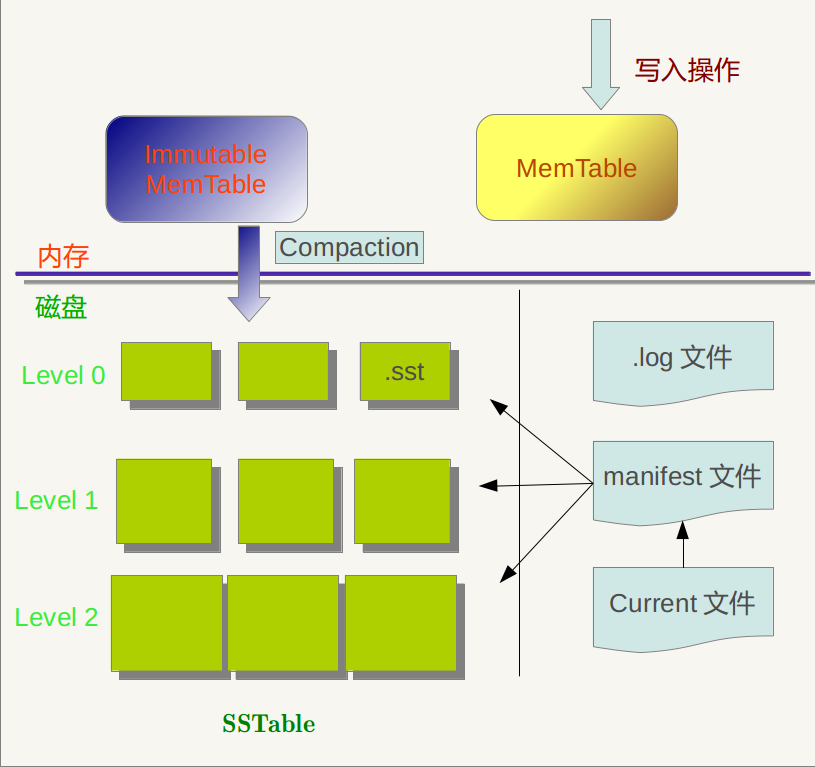
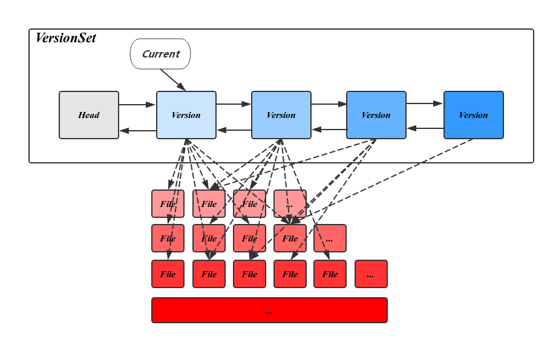

# leveldb
[LevelDB库简介](https://www.cnblogs.com/chenny7/p/4026447.html)

LevelDB是Google开源的持久化KV单机数据库,具有很高的随机写,顺序读/写性能,但是随机读的性能很一般,也就是说,LevelDB很适合应用在查询较少,而写很多的场景.

特性

1. 可以创建数据全景的snapshot(快照),并允许在快照中查找数据,
1. 可以通过前向(或后向)迭代器遍历数据(迭代器会隐含的创建一个snapshot)
1. 一次只允许一个进程访问一个特定的数据库;
1. 没有内置的C/S架构,但开发者可以使用LevelDB库自己封装一个server;
1. LevelDB本身只是一个lib库,在源码目录make编译即可,然后在我们的应用程序里面可以直接include leveldb/include/db.h头文件

## 存储模型
下图是LevelDB运行一段时间后的存储模型快照:


内存中的MemTable和Immutable MemTable以及磁盘上的几种主要文件:Current文件,Manifest文件,log文件以及SSTable文件.
当然,LevelDb除了这六个主要部分还有一些辅助的文件,但是以上六个文件和数据结构是LevelDb的主体构成元素.

log文件,MemTable,SSTable文件都是用来存储k-v记录的,下面再说说manifest和Current文件的作用.

SSTable中的某个文件属于特定层级, 而且其存储的记录是key有序的,那么必然有文件中的最小key和最大key,这是非常重要的信息,Manifest 就记载了SSTable各个文件的管理信息,
比如属于哪个Level,文件名称叫啥,最小key和最大key各自是多少.下图是Manifest所存储内容的示意:

| level  |  sstable  | min key | max key |
|--------|-----------|---------|---------|
|level 0 | test1.sst | "abc"   | "hello" |
|level 0 | test2.sst | "bbc"   | "world" |

另外,在LevleDb的运行过程中,随着Compaction的进行,SSTable文件会发生变化,会有新的文件产生,老的文件被废弃,Manifest也会跟着反映这种变化,此时往往会新生成Manifest文件来记载这种变化,
而Current则用来指出哪个Manifest文件才是我们关心的那个Manifest文件.

在写memtable时,如果flush 的条件, 会将其改成immutable memtable(只读),然后等待dump到磁盘SST文件中,此时也会生成新的memtable供写入新数据, memtable采用skiplist结构实现.

## SSTable文件
Level 0的SSTable文件和其它Level的文件相比有特殊性:这个层级内的sst文件,两个文件可能存在key重叠.
其它Level的SSTable文件, 则不会出现同一层级内sst文件的key重叠现象,就是说Level L(L >= 1)中任意两个sst文件,那么可以保证它们的key值是不会重叠的.

当某个level下的SSTable文件数目超过一定设置值后,levelDb会从这个level的SSTable中选择一个文件, 将其和高一层级的level+1的SSTable文件合并,这就是major compaction.

我们知道在大于0的层级中,每个SSTable文件内的Key都是由小到大有序存储的,而且不同文件之间的key范围(文件内最小key和最大key之间)不会有任何重叠.
Level 0的SSTable文件有些特殊,尽管每个文件也是根据Key由小到大排列,但是因为level 0的文件是通过minor compaction直接生成的,所以任意两个level 0下的两个sstable文件可能再key范围上有重叠.
所以在做major compaction的时候,对于大于level 0的层级,选择其中一个文件就行,但是对于level 0来说,指定某个文件后,本level中很可能有其他SSTable文件的key范围和这个文件有重叠,
这种情况下,要找出所有有重叠的文件和level 1的文件进行合并,即level 0在进行文件选择的时候,可能会有多个文件参与major compaction.

LevelDb在选定某个level进行compaction后,还要选择是具体哪个文件要进行compaction,比如这次是文件A进行compaction,那么下次就是在key range上紧挨着文件A的文件B进行compaction,
这样每个文件都会有机会轮流和高层的level 文件进行合并.

如果选好了level L的文件A和level L+1层的文件进行合并,那么问题又来了,应该选择level L+1哪些文件进行合并?
levelDb选择L+1层中和文件A在key range上有重叠的所有文件来和文件A进行合并.也就是说,选定了level L的文件A,之后在level L+1中找到了所有需要合并的文件B,C,D…..等等.

## 版本控制
在Leveldb中,Version就代表了一个版本,它包括当前磁盘及内存中的所有文件信息.在所有的version中,只有一个是CURRENT(当前版本),其它都是历史版本.

当执行一次compaction 或者 创建一个Iterator后,Leveldb将在当前版本基础上创建一个新版本,当前版本就变成了历史版本.

VersionSet 所有Version 构成的双向链表, 这些Version按时间顺序先后产生，记录了当时的元信息，链表头指向当前最新的Version，
同时维护了每个Version的引用计数，被引用中的Version不会被删除，其对应的SST文件也因此得以保留，通过这种方式，使得LevelDB可以在一个稳定的快照视图上访问文件。
VersionSet中除了Version的双向链表外还会记录一些如LogNumber，Sequence，下一个SST文件编号的状态信息。



VersionEdit 表示Version之间的变化,相当于delta 增量,表示有增加了多少文件,删除了文件:

```info
Version0 + VersionEdit --> Version1
Version0->Version1->Version2->Version3
```
VersionEdit会保存到MANIFEST文件中,当做数据恢复时就会从MANIFEST文件中读出来重建数据.

Leveldb的version管理和双buffer切换类似,但是如果原version被某个iterator引用,那么这个version会一直保持,直到没有被任何一个iterator引用,此时就可以删除这个version.

## RocksDB
RocksDB支持一次获取多个K-V,还支持Key范围查找.LevelDB只能获取单个Key

压缩方面RocksDB可采用多种压缩算法,除了LevelDB用的snappy,还有zlib,bzip2.LevelDB里面按数据的压缩率(压缩后低于75%)判断是否对数据进行压缩存储,
而RocksDB典型的做法是Level 0-2不压缩,最后一层使用zlib,而其它各层采用snappy.

RocksDB支持管道式的Memtable,也就说允许根据需要开辟多个Memtable,以解决Put与Compact速度差异的性能瓶颈问题.
在LevelDB里面因为只有一个Memtable,如果Memtable满了却还来不及持久化,这个时候LevelDB将会减缓Put操作,导致整体性能下降.
