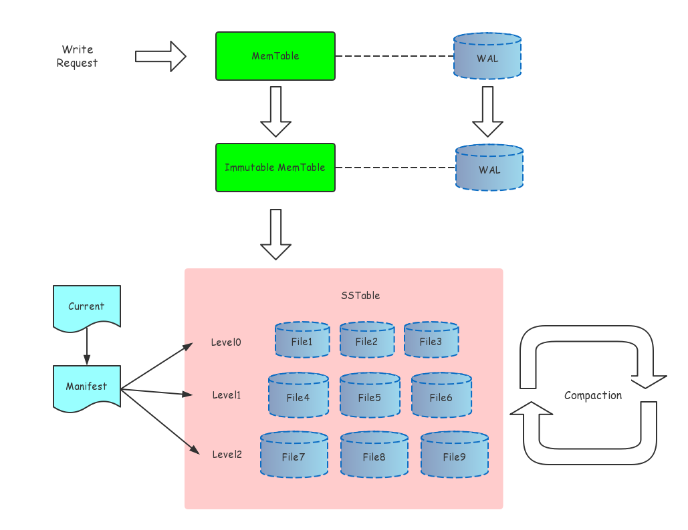

写请求是先写WAL, 然后写memtable 的.
因为很多地方都是把log 画在了current 和 manifest 那里, 挑这个图主要是为了体现log 和 memtable 的对应关系.

源码阅读是基于 [leveldb-1.9.0](https://github.com/chen3feng/thirdparty/tree/master/leveldb-1.9.0)

源代码目录结构
```plain
|_leveldb
    |_doc: 相关文档, 有 log 和 sstable 的格式介绍
    |_include/leveldb: 头文件, 对外暴漏的接口
    |_db: 主要逻辑的实现
    |_table: sstable 相关
    |_port: 编译系统环境相关
    |_util: 通用的功能实现
    |_helper/memenv: 一个简单的完全内存的文件系统实现
```

main reference

- [doc](https://github.com/google/leveldb/tree/master/doc)
- [leveldb笔记](https://izualzhy.cn/archive.html?tag=leveldb)
- [leveldb实现解析.pdf](https://yuerblog.cc/wp-content/uploads/leveldb%E5%AE%9E%E7%8E%B0%E8%A7%A3%E6%9E%90.pdf)
- [leveldb handbook](https://leveldb-handbook.readthedocs.io/zh/latest/basic.html)

