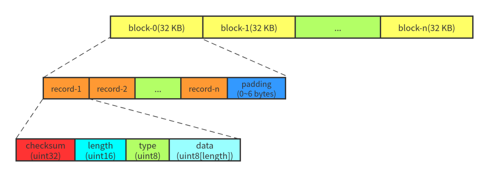

为了防止写入内存的数据库因为进程异常, 系统掉电等情况发生丢失, leveldb在写内存之前会将本次写操作的内容写入日志文件中.


在leveldb中, 有两个memtable, 以及对应的两份日志文件. 其中一个memory db是可读写的, 当这个db的数据量超过预定的上限时, 便会
转换成一个不可读的memory db, 与此同时, 与之对应的日志文件也变成一份frozen log.

而新生成的immutable memory db则会由后台的minor compaction进程将其转换成一个sstable文件进行持久化, 持久化完成, 与之对应的
frozen log被删除.

# log 的结构


```cpp
// db/log_format.h

/*
Each block consists of a sequence of records:
block := record* trailer?
record :=
  checksum: uint32  // crc32c of type and data[] ; little-endian
  length: uint16  // little-endian
  type: uint8  // One of FULL, FIRST, MIDDLE, LAST
  data: uint8[length]
*/

enum RecordType {
  // Zero is reserved for preallocated files
  kZeroType = 0,

  kFullType = 1,

  // For fragments
  kFirstType = 2,
  kMiddleType = 3,
  kLastType = 4
};

static const int kBlockSize = 32768;  // 32KB

// Header is checksum (4 bytes), length (2 bytes), type (1 byte)
static const int kHeaderSize = 4 + 2 + 1;
```
其中checksum校验的范围包括chunk的类型以及随后的data数据.

LevelDB 为什么采用这种定长块的方式保存日志呢?

一个明显的好处就是,当日志文件发生数据损坏的时候,这种定长块的模式可以很简单地跳过有问题的块,而不会导致局部的错误影响到
整个文件.

目前 LevelDB 没有对日志进行压缩.

# log writer
```cpp
// db/log_writer.h
class Writer {
 private:
  WritableFile* dest_;
  int block_offset_;       // Current offset in block
}
```
如果 block 的末尾刚好 7 字节,则填充一个 length 为 0 的 record.

# log reader
```cpp
// db/log_reader.h

class Reader {
 private:
	SequentialFile* const file_;
  bool const checksum_;  // 是否进行crc 校验
  char* const backing_store_;  // kBlockSize 大小的buffer, 从file_ 读取block 时用到
	Slice buffer_;

	// Offset of the last record returned by ReadRecord.
	// 就是ReadRecord 得到的logical record 在file_ 中的offset
  uint64_t last_record_offset_;
  // Offset of the first location past the end of buffer_.
  uint64_t end_of_buffer_offset_;

  // Offset at which to start looking for the first record to return
  uint64_t const initial_offset_;
}
```
- initial_offset_: log 文件开头可以添加一些信息,读取写入的时候,跳过这些数据.当前版本只在 log_reader 中支持,log_writer 中
  并没有相关逻辑,所以当前 initial_offset_ 为 0.
- buffer_: 下一个要读取的physical record 的起始位置到当前block 的结束位置之间的buffer. 刚读到一个block 的时候, buffer_ 
  为整个block, 随着这个block 中的 physical record 的不断读取, buffer_ 也往前移动.

# ref
- [LevelDB 完全解析(2)Log](https://mp.weixin.qq.com/s/Ry7FRClFz8XRut_fSYlX2g)
- [日志](https://leveldb-handbook.readthedocs.io/zh/latest/journal.html)

