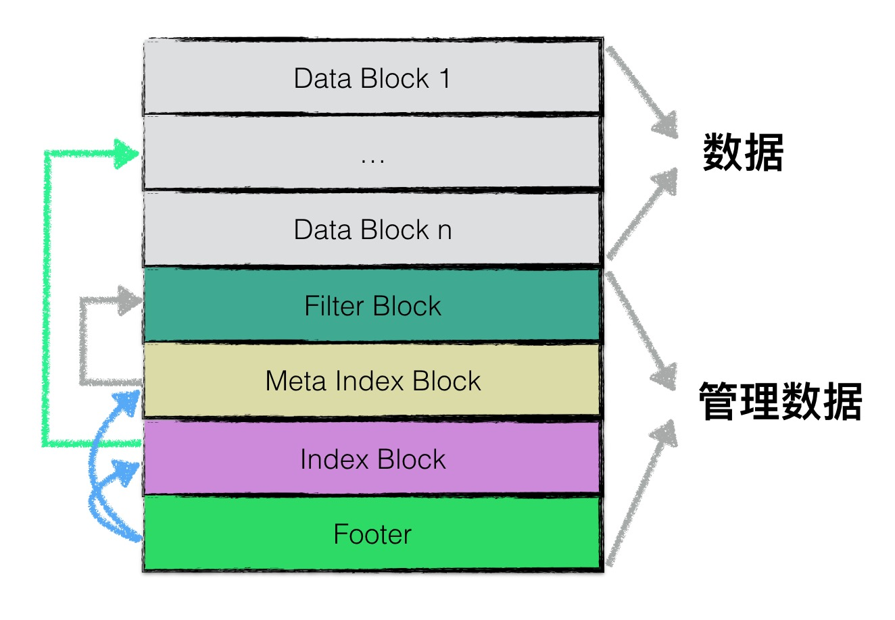

- [footer](#footer)
- [block](#block)
  - [物理结构](#物理结构)
  - [block 数据部分](#block-数据部分)
  - [block iterator](#block-iterator)
- [block builder](#block-builder)
- [filter block](#filter-block)
- [read](#read)
  - [get](#get)
  - [iterator](#iterator)
- [table builder](#table-builder)



```plain
<beginning_of_file>
[data block 1]
[data block 2]
...
[data block N]
[meta block 1]
...
[meta block K]
[meta index block]
[index block]
[Footer]        (fixed size; starts at file_size - sizeof(Footer))
<end_of_file>
```

在逻辑上,根据功能不同,leveldb在逻辑上又将sstable分为:

1. data block 用来存储key value数据对,
1. meta block: 目前只有filter block, 用来存储一些过滤器相关的数据(布隆过滤器),但是若用户不指定leveldb使用过滤器,leveldb
  在该block中不会存储任何内容,
1. meta Index block: It contains one entry for every other meta block where the key is the name of the meta block and
  the value is a BlockHandle pointing to that meta block.
1. index block: It contains one entry per data block, where the key is a string >= last key in that data block and
  before the first key in the successive data block. The value is the BlockHandle for the data block.
1. footer: At the very end of the file is a fixed length footer that contains the BlockHandle of the meta index and
  index blocks as well as a magic number.

# footer
```plain
metaindex_handle: char[p];       // Block handle for metaindex
index_handle:     char[q];       // Block handle for index
padding:          char[40-p-q];  // zeroed bytes to make fixed length
                                 // (40==2*BlockHandle::kMaxEncodedLength)
magic:            fixed64;       // == 0xdb4775248b80fb57 (little-endian)
```

```cpp
// table/format.h

class Footer {
 public:
  enum {
    kEncodedLength = 2*BlockHandle::kMaxEncodedLength + 8  // 48 bytes
  };

 private:
  BlockHandle metaindex_handle_;
  BlockHandle index_handle_;
}

class BlockHandle {
 public:
  enum { kMaxEncodedLength = 10 + 10 };

 private:
  uint64_t offset_;
  uint64_t size_;
}
```

# block
除了 footer block 以外,其余类型 block 的格式都是一致的.

## 物理结构


Data + Compression Type + CRC 组成一个block. CRC 的校验范围包括数据以及压缩类型

这里compression type 为什么不是放在meta block 中, 而要每个block 都存储一个?

有下面两个原因

1. 从实现上来看, 前后两次打开db 时是可以指定不同的 compression type 的, 所以不能保证一个db 内部只有一种compression type.
1. 另外即使保证从外面传的options 中的 compression type 不变, 也一样会发生不一样的情况, 因为在压缩数据的时候, 会检查压缩
  比, 如果不理想会强制改为不压缩的.

具体的读取physical block
```cpp
// table/format.cc
Status ReadBlock(RandomAccessFile* file, const ReadOptions& options,
                 const BlockHandle& handle, BlockContents* result)

struct BlockContents {
  Slice data;           // Actual contents of data
  bool cachable;        // True iff data can be cached
  bool heap_allocated;  // True iff caller should delete[] data.data()
};
```
当 file 是 PosixMmapReadableFile 类型时, 因为采用了 mmap 的方式, 数据已经映射到内存中了, 没有必要再放到block cache 中,
所以 BlockContents 中的 cachable 和 heap_allocated 都是 false

当 file 是 PosixRandomAccessFile 类型时, 是从磁盘中读的, 所以是可以cache 的, 因此 cachable 和 heap_allocated 都是 true.

如果 `options.verify_checksums` 为true, 会进行crc 校验.
每次读取操作都可以相互独立的设置verify_checksums.

如果 存储到磁盘上的时候进行了压缩, 还会进行解压缩, 最终返回的 BlockContents 是未压缩的.

## block 数据部分


```cpp
class Block {
 private:
  const char* data_;
  size_t size_;
  uint32_t restart_offset_;     // Offset in data_ of restart array
  bool owned_;                  // Block owns data_[]
}
```
对于 mmap 打开的文件, owned_是 false.
owned_ 为true 时, Block 的析构函数会释放掉 data_

第一部分用来存储kv数据. 由于sstable中所有的kv对都是严格按序存储的, 为了节省存储空间, leveldb并不会为每一对kv对都存储完整
的key值, 而是存储与**上一个key非共享的部分**, 避免了key重复内容的存储.

然后每间隔若干个kv对(默认时16个), 将为该条记录重新存储一个完整的key. 每个重新存储完整key的点称之为Restart point.

用于加速block 内部查找数据, 可以先在restart points 之间二分查找, 然后在小分段里面再顺序查找.

restart point length: 重启点的个数, 定长的uint32_t

restart point: 重启点在block 内部的offset, 第一个重启点的offset 为固定的0

每个数据项的格式如下图所示:


## block iterator
```cpp
// table/block.cc
class Block::Iter : public Iterator {
 private:
  const Comparator* const comparator_;
  const char* const data_;      // underlying block contents
  uint32_t const restarts_;     // Offset of restart array (list of fixed32) in block
  uint32_t const num_restarts_; // Number of uint32_t entries in restart array

  // current_ is offset in data_ of current entry.  >= restarts_ if !Valid
  uint32_t current_;
  uint32_t restart_index_;  // Index of restart block in which current_ falls
  std::string key_;
  Slice value_;
  Status status_;
}
```
seek 的时候, 先在 restart point 数组中二分查找, 然后再到两个restart point 区间内顺序查找.

# block builder
```cpp
// table/block_builder.cc

class BlockBuilder {
 public:
  void Add(const Slice& key, const Slice& value);

 private:
  const Options*        options_;
  std::string           buffer_;      // Destination buffer
  std::vector<uint32_t> restarts_;    // Restart points
  int                   counter_;     // Number of entries emitted since restart point
  bool                  finished_;    // Has Finish() been called?
  std::string           last_key_;
}
```
- options_: comparator 是 internal key comparator
- last_key_: 前缀压缩使用
- restarts_: restart point 的offset

block 写入时,不会对 key 做排序的逻辑, 因为 sstable 的产生是由 memtable dump 或者 compact 时 merge 排序产生, key 的顺序上
层已经保证.

Add 的key 是internal key, 而不是user key

# filter block
[leveldb笔记之7:filter block](https://izualzhy.cn/filter-block)

If a `FilterPolicy` was specified when the database was opened, a filter block is stored in each table.

The "meta index" block contains an entry that maps from `filter.<N>` to the BlockHandle for the filter block where `<N>`
is the string returned by the filter policy's `Name()`method.

The filter block stores a sequence of filters, where filter i contains the output of `FilterPolicy::CreateFilter()` on
all keys that are stored in a block whose file offset falls within the range `[i*base, (i+1)*base-1]` , Currently, base
is 2KB.

So for example, if blocks X and Y start in the range `[0KB, 2KB - 1]`, all of the keys in X and Y will be converted to a
filter by calling `FilterPolicy::CreateFilter()`, and the resulting filter will be stored as the first filter in the
filter block.

The filter block is formatted as follows:
```plain
[filter 1]
[filter 2]
...
[filter n]

[offset of filter 1]                  : 4 bytes
[offset of filter 2]                  : 4 bytes
...
[offset of filter n]                  : 4 bytes

[offset of beginning of offset array] : 4 bytes
lg(base)                              : 1 byte
```


```cpp
// table/filter_block.cc

// Generate new filter every 2KB of data
static const size_t kFilterBaseLg = 11;
static const size_t kFilterBase = 1 << kFilterBaseLg;  // = 2048

// the distance of two sequential block_offset could be very large.
// for exmaple, in TEST_F(FilterBlockTest, MultiChunk), block_offset 3100 and 9000
// so there could be empty filters. and
void FilterBlockBuilder::StartBlock(uint64_t block_offset) {
  uint64_t filter_index = (block_offset / kFilterBase);
  assert(filter_index >= filter_offsets_.size());
  while (filter_index > filter_offsets_.size()) {
    GenerateFilter();
  }
}
```
Base Lg默认值为11, 表示每2KB的数据, 创建一个新的过滤器来存放过滤数据.

这里的2KB是严格的间隔, 这样查找一个键时, 先查找到Index Block里相应的Data Block的偏移, 根据这个偏移量, 查找到对应的布隆过
滤器, 这就是这个Block里的键生成的布隆过滤器, 对于Block大小为4K, 而布隆过滤器每2K开启的情况.

比如第一个Block的偏移是0, 那么对应的就是第1个布隆过滤器.

而第二个Block偏移是4K, 会首先产生一个空的filter, 然后再产生一个filter, 也就是第3个filter, 第二个block 的数据都在第三个
filter 里面.

另外一种情况, 也就是 [table_format.md](https://github.com/google/leveldb/blob/master/doc/table_format.md) 中举的例子,
如果两个block 的offset 都在同一个2k 区间, 它们就会使用同一个filter.

**但是block 的大小阈值是4k, 怎么会发生这种情况呢?**

data block 的默认大小阈值是 4k, 但是可以配置成更小的值, 所以两个不同的block 落在同一个2k 区间是可能发生的.

**为什么data block 的大小是4k, 而filter 的间隔是2k? 生成一个空的filter 的目的是啥?**

因为在FilterBlockReader::KeyMayMatch 中, 根据block offset 定位到具体的哪个filter 就是简单的通过
`block_offset >> kFilterBaseLg` 来计算的, 如果没有一个空的 filter 来占位, 就会导致计算出问题.

按数据大小而非block切分主要是为了尽量均匀,以应对存在一些block的key很多,另一些block的key很少的情况.

TODO: 这里不太理解, 一个data block 有一个offset, 一个offset 一定会产生一个有效的filter(或者和其他data block 共用一个),
也就是这个data block 的所有数据都会产生在这个filter 里面, 还是没法均匀啊.

filter block 的数据拿到后解析为 FilterBlockReader, 之后判断key 是不是被过滤, 通过 `FilterBlockReader::KeyMayMatch` 接口.
```cpp
// table/filter_block.h
class FilterBlockReader {
 public:
  bool KeyMayMatch(uint64_t block_offset, const Slice& key)

 private:
  const FilterPolicy* policy_;
  const char* data_;    // Pointer to filter data (at block-start)
  const char* offset_;  // Pointer to beginning of offset array (at block-end), i.e. filter 1 offset
  size_t num_;          // Number of entries in offset array
  size_t base_lg_;      // Encoding parameter (see kFilterBaseLg in .cc file)
}
```

```cpp
// table/filter_block.cc
bool FilterBlockReader::KeyMayMatch(uint64_t block_offset, const Slice& key) {
  uint64_t index = block_offset >> base_lg_;
  ...
}
```
根据block 的offset 算出在哪个filter data 上. 然后就可以根据offset_ 和 index 拿到filter 的数据, 再按照bloom filter 的格式
去判断.

使用的地方
```cpp
// table/table.cc
Status Table::InternalGet(const ReadOptions& options, const Slice& k, void* arg,
                          void (*saver)(void*, const Slice&, const Slice&)) {
  Iterator* iiter = rep_->index_block->NewIterator(rep_->options.comparator);
  if (iiter->Valid()) {
    Slice handle_value = iiter->value();
    FilterBlockReader* filter = rep_->filter;
    BlockHandle handle;
    if (filter != NULL && handle.DecodeFrom(&handle_value).ok() &&
      !filter->KeyMayMatch(handle.offset(), k)) {
       // Not found
    }
    ...
  }
  ...
}
```

从index block 中拿到data block 在sstable 中的offset 和 size 之后, 先根据bloom filter 判断要找的key 是不是一定不在

```cpp
// table/filter_block.h
class FilterBlockBuilder {
 private:
  const FilterPolicy* policy_;
  std::string keys_;              // Flattened key contents
  std::vector<size_t> start_;     // Starting index in keys_ of each key
  std::string result_;            // Filter data computed so far
  std::vector<uint32_t> filter_offsets_;
}
```
- keys_: 当前这个filter 的所有key
- result_: 所有filter 拼接到一起的 result
- filter_offsets_: 所有的filter 的offset

# read
## get
```cpp
// table/table.cc
Status Table::InternalGet(const ReadOptions& options, const Slice& k, void* arg,
                          void (*saver)(void*, const Slice&, const Slice&)) {
  Iterator* iiter = rep_->index_block->NewIterator(rep_->options.comparator);
  if (iiter->Valid()) {
    Slice handle_value = iiter->value();
    FilterBlockReader* filter = rep_->filter;
    BlockHandle handle;
    if (filter != NULL && handle.DecodeFrom(&handle_value).ok() &&
      !filter->KeyMayMatch(handle.offset(), k)) {
       // Not found
    }
    ...
  }
  ...
}
```
如果有 bloom filter 的话, 先判断一下

最终如果找到, 就会调用 `(*saver)(arg, block_iter->key(), block_iter->value())`

## iterator
```cpp
// table/table.cc
Iterator* Table::NewIterator(const ReadOptions& options) const {
  return NewTwoLevelIterator(rep_->index_block->NewIterator(rep_->options.comparator),
                             &Table::BlockReader, const_cast<Table*>(this), options);
}
```

返回的是一个 `TwoLevelIterator` , 实际上就是一个 index block iterator + data block iterator
```cpp
class TwoLevelIterator: public Iterator {
 private:
  BlockFunction block_function_;  // read block
  void* arg_; // Table*, block function 会用到
  const ReadOptions options_;
  Status status_;
  IteratorWrapper index_iter_;
  IteratorWrapper data_iter_; // May be NULL
  // If data_iter_ is non-NULL, then "data_block_handle_" holds the
  // "index_value" passed to block_function_ to create the data_iter_.
  std::string data_block_handle_;
}
```
- arg_ 就是传入的 `const_cast<Table*>(this)`
- block_function_ 也就是 Table::BlockReader, 因为 BlockReader 是一个 static function, 需要 arg_ 指示block function 从哪
  个sstable 读取 block
- `data_block_handle_` 起到cache 的作用, 当index_iter_ seek 得到的data block handle 和 cache 住的 data_block_handle_, 就避
  免了再次调用block function

# table builder
```cpp
// include/leveldb/table_builder.h, table/table_builder.cc

class TableBuilder {
}

struct TableBuilder::Rep {
  WritableFile* file;
  uint64_t offset;  // offset in file
  BlockBuilder data_block;
  BlockBuilder index_block;
  std::string last_key;
  int64_t num_entries;
  FilterBlockBuilder* filter_block;  // filter policy 有效时

  // We do not emit the index entry for a block until we have seen the
  // first key for the next data block.  This allows us to use shorter
  // keys in the index block.  For example, consider a block boundary
  // between the keys "the quick brown fox" and "the who".  We can use
  // "the r" as the key for the index block entry since it is >= all
  // entries in the first block and < all entries in subsequent
  // blocks.
  //
  // Invariant: r->pending_index_entry is true only if data_block is empty.
  bool pending_index_entry;
  BlockHandle pending_handle;  // Handle to add to index block
}
```
- last_key: 确保顺序和用于计算分界点, 也就是index block 的key

```cpp
void TableBuilder::Add(const Slice& key, const Slice& value)
```
1. 如果是一个新的 block(也就是上一个block 刚flush 到磁盘, 通过 `pending_index_entry` 为 true 来标记), 则需要为上一个data
  block 写一个记录到 index block 中, 没有在flush 之后立刻写index block, 是因为写到index block 的记录的key 没有直接取data
  block 的最后一个key, 虽然理论上也是可行的, 但是为了尽可能的节省空间和加快之后的比较速度, 挑选一个短的 index key 更好,
  正如 上面的那段注释中举例的那样: 上一个data block 的最后一个key 是"the quick brown fox" 紧接着的data block 的第一个key
  是 "the who", 我们可以直接使用 "the quick brown fox" 作为index key. 但是我们有更好的选择(通过
  `Comparator::FindShortestSeparator` 计算得到), 比如 "the r", 够短, 只要满足>= all entries in the first block and < all
  entries in subsequent blocks 就行
1. 如果filter_block 不为 nullptr, 则添加一个一个记录到filter block 中
1. 将key, value加到 data block 中, `BlockBuilder::Add`
1. 当当前block 的大小超过阈值时, 默认4k, 由 `options.block_size` 配置, flush 磁盘
	1. 写磁盘, 当compression type 不为 kNoCompression 时, 会对数据进行压缩, 但是压缩后也会检查, 如果压缩比太低, 会强制改为
		不压缩
	1. 置 `pending_index_entry` 为true
	1. 当filter_block 不为nullptr 时, 开启一个新的filter

```cpp
Status TableBuilder::Finish()
```
1. 写filter block, 不压缩
1. 写 meta index block
1. 写 index block, 如果 `pending_index_entry` 为true, 要先为最后一个data block 记录一条记录到 index block 中
1. 写 footer

