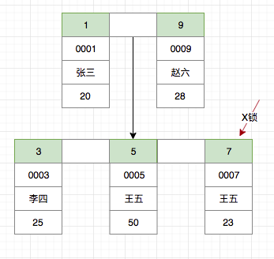
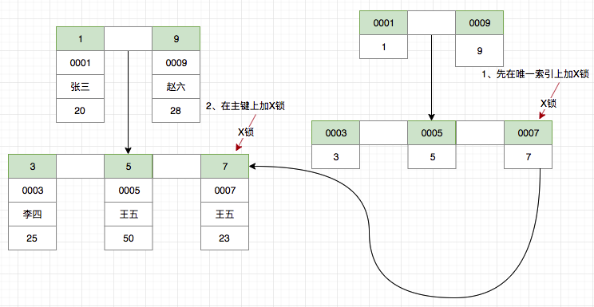
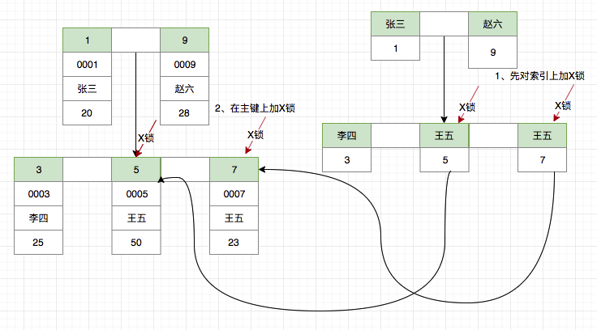
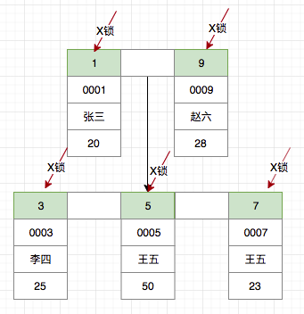
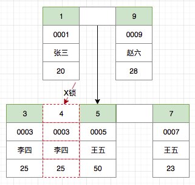
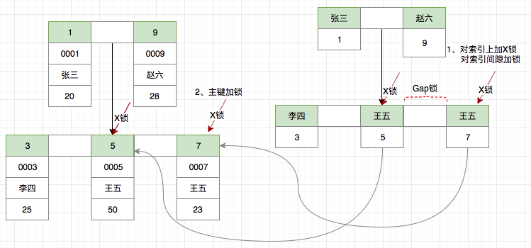
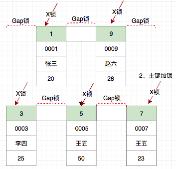

# sql
## create
```sql
show create table tb;  // 查看建表语句
```

### 复制数据到新表
- 复制表结构(包括index, key 等)
	1. `CREATE TABLE 新表 LIKE 旧表`
- 复制数据
	1. `CREATE TABLE 新表 SELECT * FROM 旧表`
	1. `INSERT INTO 新表 SELECT * FROM 旧表`

## insert
- `INSERT INTO table_name VALUES(value1, value2, value3, ...);`
- `INSERT INTO table_name(column1, column2, column3, ...) VALUES(value1, value2, value3, ...);`

MySql避免重复插入记录(根据主键判重)

1. `insert ignore into xxx`
1. `replace into xxx`

## update
```sql
UPDATE table_name SET column1 = value1, column2 = value2, ...  WHERE some_column = some_value;
```

如果update 的一条记录在数据库不存在(就是说后面的where语句没有找到record), 不会对数据库产生影响, 同时语句的执行也不会报错.

两个表update

- `update a set age = (select age from b where b.name = a.name)`: 用到了子查询, 当数据量大的时候, 效率非常低
- `update a, b set a.age = b.age where a.name = b.name`: 比上面的子查询效率会高很多, 尤其是在建立有合适的索引时.

## alter
```sql
ALTER TABLE table_name ADD column_name datatype
alter table flows add column ip_prot tinyint(4) null default 0;

ALTER TABLE table_name DROP COLUMN column_name

ALTER TABLE table_name MODIFY COLUMN column_name datatype

ALTER TABLE table_name CHANGE old_col_name new_col_name column_definition
ALTER TABLE table_name RENAME TO new_table_name;
```

## select
mysql中提供了一个G标志,放到sql语句后,可以使一行的每个列打印到单独的行.
```sql
select * from t_goods \G
```

### limit
mysql不支持`select top n`的语法,应该用这个替换:
```sql
select * from tablename order by orderfield desc/asc limit offset, counter;
```
offset 指示从哪里开始查询,如果是0则是从头开始, counter 表示查询的个数

为了检索从某一个偏移量到记录集的结束所有的记录行,可以指定counter 为 -1:

### group by, where, having
可以在包含 GROUP BY 子句的查询中使用 WHERE 子句.在完成任何分组之前,将消除不符合 WHERE 子句中的条件的行.例如:
```sql
SELECT ProductModelID, AVG(ListPrice) AS 'Average List Price'
FROM Production.Product
WHERE ListPrice > $1000
GROUP BY ProductModelID
ORDER BY ProductModelID;
```

having子句与where有相似之处但也有区别,都是设定条件的语句.

1. **having只能用在group by之后,对分组后的结果进行筛选**(即使用having的前提条件是分组).
2. where肯定在group by 之前, 即也在having之前
3. where后的条件表达式里不允许使用聚合函数,而having可以

在查询过程中优先级
```sql
where 子句 > 聚合语句(sum, min, max, avg, count) > having子句
```
eg:

1. `select sum(num) as rmb from order where id>10` 只有对id大于10的记录才对进行聚合语句
1. `select reportsto as manager, count(*) as reports from employees group by reportsto having count(*) > 4`
首先将reportsto相同的group起来, 统计各个group里面成员的个数, 然后再筛选出大于4的groups.
如果把上面的having换成where则会出错.

统计分组数据时用到聚合语句, 对分组数据再次判断时要用having. 如果不用这些关系就不存在使用having, 直接使用where就行了.
having就是来弥补where在分组数据判断时的不足. 因为where执行优先级别要快于聚合语句.

当一个查询语句同时出现了where,group by,having,order by的时候,执行顺序和编写顺序是:

1. 执行where xx对全表数据做筛选,返回第1个结果集
2. 针对第1个结果集使用group by分组,返回第2个结果集
3. 针对第2个结果集中的每1组数据执行select xx,有几组就执行几次,返回第3个结果集
4. 针对第3个结集执行having xx进行筛选,返回第4个结果集
5. 针对第4个结果集排序

eg: 完成一个复杂的查询语句,需求如下: 按由高到低的顺序显示个人平均分在70分以上的学生姓名和平均分,
为了尽可能地提高平均分,在计算平均分前不包括分数在60分以下的成绩.

分析

1. 要求显示学生姓名和平均分, 因此确定第1步`select s_name,avg(score) from student`
2. 计算平均分前不包括分数在60分以下的成绩,因此确定第2步 `where score>=60`
3. 显示个人平均分, 相同名字的学生(同一个学生)考了多门科目,因此按姓名分组.确定第3步 `group by s_name`
4. 显示个人平均分在70分以上 因此确定第4步 `having avg(s_score)>=70`
5. 按由高到低的顺序, 因此确定第5步 `order by avg(s_score) desc`

合起来就是:
```sql
select s_name,avg(s_score) from student
where score>=60
group by s_name
having avg(s_score)>=70
order by avg(s_score) desc
```

### join
[sql joins](http://www.techonthenet.com/sql/joins.php)

There are 4 different types of SQL joins:

- SQL INNER JOIN (or sometimes called simple join)
- SQL LEFT OUTER JOIN (or sometimes called LEFT JOIN)
- SQL RIGHT OUTER JOIN (or sometimes called RIGHT JOIN)
- SQL FULL OUTER JOIN (or sometimes called FULL JOIN)

#### INNER JOIN (SIMPLE JOIN)
It is the most common type of SQL join.
SQL INNER JOINS return all rows from multiple tables where the join condition is met.

The syntax for the SQL INNER JOIN is:
```sql
SELECT columns
FROM table1
INNER JOIN table2
ON table1.column = table2.column;
```
In this visual diagram, the SQL INNER JOIN returns the shaded area:


The SQL INNER JOIN would return the records where table1 and table2 intersect.

#### LEFT OUTER JOIN
This type of join returns all rows from the LEFT-hand table specified in the ON condition and only those rows from the other
table where the joined fields are equal (join condition is met).

In some databases, the LEFT OUTER JOIN keywords are replaced with LEFT JOIN.


#### SQL RIGHT OUTER JOIN
This type of join returns all rows from the RIGHT-hand table specified in the ON condition and only those rows from the
other table where the joined fields are equal (join condition is met).


#### SQL FULL OUTER JOIN
This type of join returns all rows from the LEFT-hand table and RIGHT-hand table
**with nulls in place where the join condition is not met**.


# [execution plan](http://my.oschina.net/zimingforever/blog/60233)
mysql的查看执行计划的语句很简单,explain + 你要执行的sql语句就OK了.

举一个例子
```sql
EXPLAIN SELECT * from employees where employees.gender='M'
```
结果示例:
|id |select_type |table     |type |possible_keys |key  |key_len |ref  |rows   |Extra      |
|---|------------|----------|-----|--------------|-----|--------|-----|-------|-----------|
|1  |SIMPLE      |employees |ALL  |NULL          |NULL |NULL    |NULL |300252 |Using where|

1. id是一组数字, 表示查询中执行select子句或操作表的顺序.
	- 如果id相同, 则执行顺序从上至下.
	- 如果是子查询, id的序号会递增, id越大则优先级越高, 越先会被执行.
	- id如果相同, 则可以认为是一组, 从上往下顺序执行, 所有组中, id越高, 优先级越高, 越容易执行
1. select_type有simple, primary, subquery, derived, union, unionresult.
	- simple: 表示查询中不包含子查询或者union.
	- primary: 当查询中包含任何复杂的子部分, 最外层的查询被标记成primary.
	- subquery: 在select或where列表中包含了子查询, 则子查询被标记成subquery.
	- derived: 在from的列表中包含的子查询被标记成derived.
	- union: 若第二个select出现在union后, 则被标记成union, 若union在from子句的子查询中, 外层的select被标记成derived.
	- union result: 从union表获取结果的select被标记成union result.
1. table: 访问哪个表
1. type叫访问类型, 表示在表中找到所需行的方式, 常见类型有all, index, range, ref, eq_ref, const, system, NULL 性能从左至右由差至好.
	- ALL: 即full table scan, mysql将遍历全表来找到所需要的行.
	- index: 为full index scan, 只遍历索引树.
	- range: 表示索引范围扫描, 对索引的扫描开始于一点,返回匹配的值域的行,常见于between, <, > 的查询.
	- ref: 为非唯一性索引扫描, 返回匹配某个单独值的所有行, 常见于非唯一索引即唯一索引的非唯一前缀进行的查找.
	- eq_ref: 表示唯一性索引扫描, 对于每个索引键, 表中只有一条记录与之匹配, 常见于主键或者唯一索引扫描.
	- const: 表示当对查询部分进行优化, 并转化成一个常量时, 使用这些类型访问. 比如将主键置于where列表中, mysql就能把该查询置成一个常量.
	- system: const的一个特例,当查询表中只有一行的情况下使用的是system
	- NULL: 表示在执行语句中,不用查表或索引.
1. possible keys: 表示能使用哪个索引在表中找到行, 查询涉及到的字段上若存在索引, 则该索引被列出, 但不一定被查询使用.
1. key表示查询时使用的索引. 若查询中使用了覆盖索引, 则该索引仅出现在key 中举个例子
1. keylen表示索引所使用的字节数, 可以通过该列结算查询中使用的索引长度
1. ref表示上述表的链接匹配条件, 即哪些列或常量可被用于查找索引列上的值.
1. rows表示根据mysql表统计信息及索引选用情况, 估算找到所需记录要读取的行数.
1. extra表示不在其他列并且也很重要的额外信息.
	- using index: 表示在相应的select中使用了覆盖索引.
	- using where: 表示存储引擎搜到记录后进行了后过滤(POST-FILTER),
		如果查询未能使用索引, using where的作用只是提醒我们mysql要用where条件过滤结果集.
	- using temporay: 表示用临时表来存储结果集, 常见于排序和分组查询.
	- using file sort: mysql中无法用索引完成的排序成为文件排序.

mysq的执行计划有一定局限性:

- EXPLAIN不会告诉你关于触发器,存储过程的信息或用户自定义函数对查询的影响情况
- EXPLAIN不考虑各种Cache
- EXPLAIN不能显示MySQL在执行查询时所作的优化工作
- 部分统计信息是估算的,并非精确值
- EXPALIN只能解释SELECT操作,其他操作要重写为SELECT后查看执行计划

# index
使用索引时的注意事项

- 索引不会包含有 null 值的列: 只要列中包含有 null 值都将不会被包含在索引中,复合索引中只要有一列含有 null 值,那么这一列对于此复合索引就是
	无效的.所以我们在数据库设计时建议不要让字段的默认值为 null.
- 使用短索引: 对字符串列进行索引,如果可能应该指定一个前缀长度.
	例如,如果有一个 char(255)的列,如果在前 10 个或 20 个字符内,多数值是惟一的,那么就不要对整个列进行索引.短索引不仅可以提高查询速度而且
	可以节省磁盘空间和 I/O 操作.
- 索引列排序: 查询只使用一个索引,因此如果 where 子句中已经使用了索引的话,那么 order by 中的列是不会使用索引的.因此数据库默认排序可以符合
	要求的情况下不要使用排序操作,尽量不要包含多个列的排序,如果需要最好给这些列创建复合索引.
- 不使用 not in 和 <> 操作. 这不属于支持的范围查询条件,不会使用索引.

## CREATE INDEX
建表的时候创建索引
```sql
INDEX index_name(`field`),
```

ALTER TABLE用来创建普通索引,UNIQUE索引或PRIMARY KEY索引
```sql
ALTER TABLE table_name ADD INDEX index_name (column_list)
ALTER TABLE table_name ADD UNIQUE (column_list)
ALTER TABLE table_name ADD PRIMARY KEY (column_list)
```

`column_list` 指出对哪些列进行索引,多列时各列之间用逗号分隔.

索引名`index_name`可选,缺省时,MySQL将根据第一个索引列赋一个名称

PRIMARY KEY索引仅是一个名称为 PRIMARY 的 UNIQUE索引. 这表示一个表只能包含一个PRIMARY KEY, 因为一个表中不可能具有两个同名的索引.

## 删除索引
```sql
ALTER TABLE table_name DROP INDEX index_name
ALTER TABLE table_name DROP PRIMARY KEY
```

## 查看索引
```sql
show index from tblname;
show keys from tblname;
```

## [联合索引最左匹配](https://segmentfault.com/a/1190000015416513)
在mysql建立联合索引时会遵循最左前缀匹配的原则,即最左优先,在检索数据时从联合索引的最左边开始匹配,示例:
对列col1,列col2和列col3建一个联合索引
```sql
KEY test_col1_col2_col3 on test(col1,col2,col3);
```
联合索引 test_col1_col2_col3 实际建立了`(col1),(col1,col2),(col,col2,col3)`三个索引.

mysql创建联合索引的规则是首先会对联合合索引的最左边的,也就是第一个字段col1的数据进行排序,在第一个字段的排序基础上
然后再对后面第二个字段col2进行排序.其实就相当于实现了类似 order by col1 col2这样一种排序规则.

对于联合索引(col1,col2,col3),查询语句`SELECT * FROM test WHERE col2=2`;是否能够触发索引?
大多数人都会说NO,实际上却是YES.
原因:
```sql
EXPLAIN SELECT * FROM test WHERE col2=2;
EXPLAIN SELECT * FROM test WHERE col1=1;
```
观察上述两个explain结果中的type字段, 结果分别是 index, ref.
结合前面的execution plan 那一节, index 类型也是使用到了索引,只是是遍历整个索引树.

# Data Type And Functions
## date time
[时间差](http://blog.csdn.net/yzsind/article/details/8831429)

datetime 直接之间作差得到结果不是时间意义上的作差.
实际是mysql的时间相减是做了一个隐式转换操作, 直接把年月日时分秒拼起来, 如`2013-04-21 16:59:33` 直接转换为`20130421165933`, 由于时间不是十进制,所以最后得到的结果没有意义,这也是导致出现坑爹的结果.

要得到正确的时间相减秒值,有以下3种方法:

1. `time_to_sec(timediff(t2, t1))`: timediff 得到的结果是一个时间格式
2. `timestampdiff(second, t1, t2)`
3. `unix_timestamp(t2) - unix_timestamp(t1)`

时间位移: `ADDTIME('2014-05-26 18:26:21', '0:0:2')` 求后2秒的时间.

## str
- `length()`
- `char_length()`
- `locate(substr, str)`: 如果包含, 返回 > 0 的数, 否则返回0

## cast functions and operators
- BINARY: cast a string to a binary string, `BINARY str` is a shorthand for `CAST(str AS BINARY)`.
- `CAST(expr AS type)`: cast a value as a certain type
- CONVERT(): cast a value as a certain type

The BINARY operator casts the string following it to a binary string.
This is an easy way to force a column comparison to be done byte by byte rather than character by character.
```sql
SELECT 'a' = 'A';  // 1
SELECT BINARY 'a' = 'A';  // 0
SELECT 'a' = 'a ';  // 1
SELECT BINARY 'a' = 'a ';  // 0
```

## bit operators
[Bit Functions and Operators](https://dev.mysql.com/doc/refman/8.0/en/bit-functions.html)
|Name	       |Description                           |
|------------|--------------------------------------|
|&	         |Bitwise AND                           |
|>>	         |Right shift                           |
|<<	         |Left shift                            |
|^	         |Bitwise XOR                           |
|BIT_COUNT() |Return the number of bits that are set|
||	         |Bitwise OR                            |
|~	         |Bitwise inversion                     |

优先级: ~ > ^ > & > >> = << > |

# 存储引擎
## MyISAM
每张MyISAM 表被存放在三个文件: frm 文件存放表格定义. 数据文件是MYD (MYData), 索引文件是MYI(MYIndex) 引伸.
因为MyISAM相对简单所以在效率上要优于InnoDB,小型应用使用MyISAM是不错的选择.

MyISAM表是保存成文件的形式,在跨平台的数据转移中使用MyISAM存储会省去不少的麻烦

## Innodb
InnoDB 是 MySQL 上第一个提供外键约束(FOREIGN KEY constraints)的表引擎.InnoDB 的设计目标是处理大容量数据库系统,它的 CPU 利用率是其它基于磁盘的关系数据库引擎所不能比的.
在技术上,InnoDB 是一套放在 MySQL 后台的完整数据库系统,InnoDB 在主内存中建立其专用的缓冲池用于高速缓冲数据和索引.

InnoDB 是聚集索引,MyISAM 是非聚集索引.
聚簇索引的文件存放在主键索引的叶子节点上,因此 InnoDB 必须要有主键,通过主键索引效率很高.
但是辅助索引需要两次查询,先查询到主键,然后再通过主键查询到数据.因此,主键不应该过大,因为主键太大,其他索引也都会很大.
而 MyISAM 是非聚集索引,数据文件是分离的,索引保存的是数据文件的指针.主键索引和辅助索引是独立的.

InnoDB 把数据和索引存都放在表空间同一个数据文件(可能是多个物理文件)里.

1. MyISAM 则适合用于频繁查询的应用, innodb的引擎比较适合于插入和更新操作比较多的应用
1. MyISAM 类型不支持事务处理等高级处理, 也不支持外键,而InnoDB类型支持事务, 回滚, 外键和崩溃恢复能力等高级数据库功能(ACID: Atomicity, Consistency, Isolation, Durability)
1. MyISAM 类型的表强调的是性能, 其执行数度比InnoDB类型更快
1. InnoDB 中不保存表的具体行数,也就是说,执行`select count(*) from table`时,InnoDB要扫描整个表, 但MyISAM只要简单的读出保存好的行数即可. 但当count语句包含 where条件时,两种表的操作是一样的.
1. InnoDB 最小的锁粒度是行锁,MyISAM 最小的锁粒度是表锁.一个更新语句会锁住整张表,导致其他查询和更新都会被阻塞,因此并发访问受限.这也是 MySQL 将默认存储引擎从 MyISAM 变成 InnoDB 的重要原因之一;
1. innodb如果是共享表空间, ibdata1文件越来越大

innodb存储引擎可将所有数据存放于`ibdata*`的共享表空间, 也可将每张表存放于独立的.ibd文件的独立表空间. 共享表空间以及独立表空间都是针对数据的存储方式而言的.

- 共享表空间: 某一个数据库的所有的表数据,索引文件全部放在一个文件中,默认这个共享表空间的文件路径在data目录下. 默认的文件名为:ibdata1 初始化为10M.
- 独立表空间: 每一个表都将会以独立的文件方式来进行存储,每一个表都有一个.frm表描述文件,还有一个.ibd文件. 其中这个文件包括了单独一个表的数据内容以及索引内容,默认情况下它的存储位置也是在表的位置之中.

## RocksDB
### RocksDB与innodb的比较
1. innodb空间浪费, B tree分裂导致page内有较多空闲,尤其是刚分裂完成时, page利用率不高.
	对于顺序插入的场景,块的填充率较高.但对于随机场景,每个块的空间利用率就急剧下降了.
  反映到整体上就是一个表占用的存储空间远大于实际数据所需空间.
1. innodb现有的压缩效率也不高,压缩以block为单位,也会造成浪费.
1. 写入放大:innodb 更新以页为单位,最坏的情况更新N行会更新N个页.RocksDB append only方式
1. RocksDB对齐开销小:SST file (默认2MB)需要对齐,但远大于4k, `RocksDB_block_size`(默认4k) 不需要对齐,因此对齐浪费空间较少
1. RocksDB索引前缀相同值压缩存储
1. RocksDB占总数据量90%的最底层数据,行内不需要存储系统列seqid
1. MyRocks在MySQL 5.6/5.7就实现了逆序索引,基于逆序的列族实现,显然,逆序索引不能使用默认的default列族.
1. 基于LSM特性,MyRocks还以很低的成本实现了TTL索引,类似于HBase.

# 运维
## login
```bash
mysql -u user -p$passwd -h host -P port -D db --default-character-set=utf8
```

## conf
mysql的配置文件: `/etc/my.cnf`.

mysql server 自己带有一些示例配置文件: `rpm -ql mysql-server | grep cnf`,
得到的结果有`my-huge.cnf, my-innodb-heavy-4G.cnf, my-large.cnf, my-medium.cnf, my-small.cnf`,
将这些文件复制为`/etc/my.cnf`, 就可以修改mysql的默认配置, 对于现在的硬件配置, 使用`my-huge.cnf`就可以.

当由于系统的空间不够时, mysql 会在`/var/lib/mysql` 目录下创建一个hostname.error 的文件对错误进行说明,
而不会在 `/var/log/mysqld.log` 中说明.
如果经常出现空间不够的错误提示, 可以再`/etc/my.cnf` 中 修改数据的位置 `datadir=/var/lib/mysql`

## Backup
备份
```bash
## 备份整个数据库
mysqldump -u 用户名 -p 数据库名 > 导出的文件名

## 备份一个表
mysqldump -u 用户名 -p 数据库名 表名 > 导出的文件名
```

恢复
```sql
mysql > source 导入的文件名
```
或者
```bash
mysql -u root -p voice<voice.sql
```

# InnoDB Locking and Transaction Model
## [隔离级别](https://www.cnblogs.com/digdeep/p/4968453.html)
其中 隔离性 分为了四种:

- READ UNCOMMITTED:可以读取未提交的数据,未提交的数据称为脏数据,所以又称脏读.此时:幻读,不可重复读和脏读均允许,
- READ COMMITTED:只能读取已经提交的数据,此时:允许幻读和不可重复读,但不允许脏读,所以RC隔离级别要求解决脏读,
- REPEATABLE READ:同一个事务中多次执行同一个select, 读取到的数据没有发生改变,
	此时:允许幻读,但不允许不可重复读和脏读,所以RR隔离级别要求解决不可重复读,
- SERIALIZABLE: 幻读,不可重复读和脏读都不允许,所以serializable要求解决幻读,

几个概念

- 脏读:可以读取未提交的数据.RC 要求解决脏读,
- 不可重复读:同一个事务中多次执行同一个select, 读取到的数据发生了改变(被其它事务update并且提交),
- 可重复读:同一个事务中多次执行同一个select, 读取到的数据没有发生改变(一般使用MVCC实现),RR各级级别要求达到可重复读的标准,
- 幻读:同一个事务中多次执行同一个select, 读取到的数据行发生改变.也就是行数减少或者增加了(被其它事务delete/insert并且提交).
	SERIALIZABLE要求解决幻读问题,

这里一定要区分 不可重复读和幻读:

不可重复读的重点是修改: 同样的条件的select, 你读取过的数据, 再次读取出来发现值不一样了
幻读的重点在于新增或者删除: 同样的条件的select, 第1次和第2次读出来的记录数不一样

ANSI SQL标准没有从隔离程度进行定义,而是定义了事务的隔离级别,同时定义了不同事务隔离级别解决的三大并发问题:

|Isolation Level     |Dirty Read |Unrepeatable Read |Phantom Read |
|--------------------|-----------|-----------------|--------------|
|Read UNCOMMITTED    |YES        |YES              |YES           |
|READ COMMITTED(RC)  |NO         |YES              |YES           |
|READ REPEATABLE(RR) |NO         |NO               |YES           |
|SERIALIZABLE        |NO         |NO               |NO            |

除了MySQL默认采用RR隔离级别之外,其它几大数据库都是采用RC隔离级别.

### RC 与 RR 在锁方面的区别
- 显然 RR 支持 gap lock(next-key lock),而RC则没有gap lock.
	因为MySQL的RR需要gap lock来解决幻读问题.而RC隔离级别则是允许存在不可重复读和幻读的.所以RC的并发一般要好于RR;
- RC 隔离级别,通过 where 条件过滤之后,不符合条件的记录上的行锁,会释放掉(虽然这里破坏了"两阶段加锁原则"),
	但是RR隔离级别,即使不符合where条件的记录,也不会释放行锁和gap lock,所以从锁方面来看,RC的并发应该要好于RR.

## InnoDB Locking
- 表级锁: 开销小, 加锁快, 不会出现死锁, 锁定粒度大, 发生锁冲突的概率最高, 并发度最低.
- 行级锁: 开销大, 加锁慢, 会出现死锁, 锁定粒度最小, 发生锁冲突的概率最低, 并发度也最高.

### [锁的种类](https://dev.mysql.com/doc/refman/5.6/en/innodb-locking.html)
#### Shared Lock And Exclusive Locks
InnoDB implements standard row-level locking where there are two types of locks, shared (S) locks and exclusive (X) locks.

- A shared (S) lock permits the transaction that holds the lock to read a row.
- An exclusive (X) lock permits the transaction that holds the lock to update or delete a row.

#### Intention Locks
为了支持不同粒度的锁而设计的一种 表级别锁(但不是通常认为的表锁) which permits coexistence of row locks and table locks.
它表示了表之后将被加上哪种行级锁.意向锁的分类如下:

- Intention Shared Lock,意向共享锁(IS) ,表示事务将要在表上加共享锁,规则是在表中申请某些行的共享锁之前,必须先申请IS锁.
- Intention Exclusive Lock,意向排他锁(IX) ,表示事务将要在表上加排他锁,规则是在表中申请某些行的排他锁之前,必须先申请IX锁.
```sql
SELECT ... LOCK IN SHARE MODE  // 该语句将会在表上加IS锁,同时在对应的记录上加上S锁.
SELECT ... FOR UPDATE  // 该语句将会在表上加上IX锁,同时在对应的记录上加上X锁
```

#### Record Locks
A record lock is a lock on an index record. For example, `SELECT c1 FROM t WHERE c1 = 10 FOR UPDATE;`
prevents any other transaction from inserting, updating, or deleting rows where the value of t.c1 is 10.

Record locks always lock index records, even if a table is defined with no indexes.
For such cases, InnoDB creates a hidden clustered index and uses this index for record locking.

#### GAP Locks
A gap lock is a lock on a gap between index records, or a lock on the gap before the first or after the last index record.

For example, `SELECT c1 FROM t WHERE c1 BETWEEN 10 and 20 FOR UPDATE;` prevents other transactions from inserting a value of
15 into column t.c1, whether or not there was already any such value in the column, because the gaps between all existing
values in the range are locked.

#### Next-key Locks
Next-key锁是记录锁和Gap锁的结合,锁住了记录和记录之前的一段Gap区间. 比如索引包含了10,11,13和20,那么Next-key分出的区间如下:
```info
(negative infinity, 10]
(10, 11]
(11, 13]
(13, 20]
(20, positive infinity)
```

#### Insert Intention Locks
An insert intention lock is a type of gap lock set by INSERT operations prior to row insertion.
This lock signals the intent to insert in such a way that multiple transactions inserting into the same index gap
need not wait for each other if they are not inserting at the same position within the gap.

[论 MySql InnoDB 如何通过插入意向锁控制并发插入](https://juejin.im/post/5b865859e51d4538e331ae9a)

### [加锁原则](https://juejin.im/post/5dc6c5325188250b92054dd8)
对于 InnoDB 而言,虽然加锁的类别繁多,加锁形式也灵活多样,但也遵循了一些原则:

- 对于 `select ... from ...` 语句,使用快照读,一般情况下不加锁,仅在Serializable级别会加共享读锁
- 对于 `select ... from ... lock in share mode` 语句使用当前读,加共享读锁(S锁)
- 对于 `select ... from ... for update` 语句,为当前读,加排他写锁(X锁)
- 常见 DML语句(insert, delete, update),使用当前读,加排他写锁(X锁)
- 常见 DDL语句(alter table, create table ...)等,加的是表级锁

```sql
CREATE TABLE `t_user` (
  `id` bigint(20) NOT NULL AUTO_INCREMENT COMMENT '主键',
  `no` char(18) NOT NULL DEFAULT '' COMMENT '身份证',
  `name` varchar(50) NOT NULL DEFAULT '' COMMENT '姓名',
  `age` int(4) NOT NULL DEFAULT '0' COMMENT '年龄',
  PRIMARY KEY (`id`),
  UNIQUE KEY `no` (`no`),
  KEY `name` (`name`)
) ENGINE=InnoDB COMMENT='用户表';
```
默认插入数据如下:

| id | no   | name | age |
|----|------|------|-----|
| 1  | 0001 | 张三 | 20  |
| 3  | 0003 | 李四 | 25  |
| 5  | 0005 | 王五 | 50  |
| 7  | 0007 | 王五 | 23  |
| 9  | 0009 | 赵六 | 28  |

#### Read Uncommitted 级别
Read Uncommitted 级别是事务隔离的最低级别,在此隔离级别下会存在脏读的现象,会影响到数据的正确性,因此我们在日常开发过程中很少使用该隔离级别.
在此隔离级别下更新语句采取的是普通的加行锁的机制,Read Committed的加锁过程与Read Uncommitted一致.
由于Read Committed使用范围较Read Uncommitted更广,在Read Committed级别下详细分析.

#### Read Committed 级别
Read Committed级别采取了一致性读策略,解决了事务的脏读问题,我们以下简称为RC级别.
在此级别下更新语句加锁与Read Uncommitted一致,可能存在的锁有行锁与意向锁.
加锁过程采取了Semi-consistent read优化策略,对于扫描过的数据如若不匹配,加锁后会立即释放.

##### 使用主键
假设我们需要在上述t_user表格中,删除ID=7的王五这一条记录,语句为:
```sql
delete from t_user where id = 7;
```
由于使用了主键,只需对该条记录加X锁即可,其加锁过程如下:



##### 使用唯一索引
假设我们通过身份证no这个唯一索引来删除id=7这条数据会如何加锁呢?
```sql
delete from t_user where no = '0007';
```
由于唯一索引为二级索引,Innodb 首先通过唯一索引对数据进行过滤,对于0007唯一索引加X锁,然后还需要在聚集索引上对主键=7的数据进行加X锁.



##### 使用非唯一索引
假设我们使用非唯一索引,那么情况又会如何呢?
```sql
delete from t_user where name = '王五';
```
由于唯一索引为二级索引,Innodb 首先通过索引对数据进行过滤,对于王五的两条索引加X锁,然后还需要在聚集索引上对主键=5,7 的数据进行加X锁.



##### 未使用任何索引
如果不使用任何索引,情况会是怎样呢?
```sql
delete from t_user where age = 23;
```
由于删除语句没有使用任何索引,那么 InnoDB 必须进行全表扫描以确定哪条数据需要删除.也就是说首先需要对全表的所有数据进行加锁,
InnoDB 在RC级别下的加锁过程采取了Semi-consistent read优化策略,对于扫描过的数据如若不匹配,加锁后会立即释放.



##### 插入过程加锁
那么对于插入过程,RC级别又是如何加锁的呢?
```sql
insert into t_user(id, no, name, age) values(4, '00004', '小灰灰', 8);
```
InnoDB事实上只对主键加了X锁.



#### Read Repeatable 级别
Read Repeatable级别引入了间隙锁等一系列机制,来防止其他事务的插入操作,以下简称RR级别.
但与此同时间隙锁的范围也带来了很多额外的开销与问题,其中之一就有由于引入了间隙锁加大了锁的粒度范围,使用不当容易造成死锁.
由于RR级别下可以通过参数innodb_locks_unsafe_for_binlog来配置是否开启gap锁,在此我们讨论的是开启gap锁的情况.

##### 使用主键
假设我们需要在上述t_user表格中,删除ID=7的王五这一条记录,语句为:
```sql
delete from t_user where id = 7;
```
由于使用了主键,可以唯一确认影响的记录,只需对该条记录加X锁即可,其加锁过程与RC级别下的使用主键加锁过程相同.


##### 使用唯一索引
假设我们通过身份证no这个唯一索引来删除id=7这条数据会如何加锁呢?
```sql
delete from t_user where no = '0007';
```
由于唯一索引为二级索引,Innodb 首先通过唯一索引对数据进行过滤,对于0007唯一索引加X锁,然后还需要在聚集索引上对主键=7的数据进行加X锁.


##### 使用非唯一索引
假设我们使用非唯一索引,那么情况又会如何呢?
```sql
delete from t_user where name = '王五';
```
由于使用索引为二级索引,Innodb 首先通过索引对数据进行过滤,由于普通索引不能保证影响数据范围唯一,有可能其他的事务在对二者之间的间隙操作添加新数据,
因此还需要对于王五之间的间隙进行加锁,以防有其他事务在事务提交前在此间隙插入数据,最后还需要在聚集索引上对主键=5,7 的数据进行加X锁.



##### 未使用任何索引
那么在RR级别下,如果不使用索引会导致什么情况呢?
```sql
delete from t_user where age = 23;
```
如若不使用任何索引,InnoDB只能够通过全表扫描以确定需要删除的数据,因此首先会需要对所有数据进行加锁,此外由于需要避免其他事务插入,
还需要对所有的间隙进行加锁,这对InnoDB性能影响非常显著.



##### 插入过程
在RR级别下,插入过程是如何加锁的呢?
```sql
insert into t_user(id, no, name, age) values(4, '00004', '小灰灰', 8);
```
插入过程是不需要增加gap锁的,因此RR级别下的加锁过程与RC级别下的加锁过程差不多.
依照官方文档,插入过程隐式的加了插入意向锁,该锁虽然为间隙锁,但大多数时候并不会影响其他行的插入.


#### Serializable 级别
Serializable 级别是事务隔离的最高级别,在此级别下所有的请求会进行串行化处理.在InnoDB中该级别下的 更新语句加锁过程与Read Repeatable下一致.
