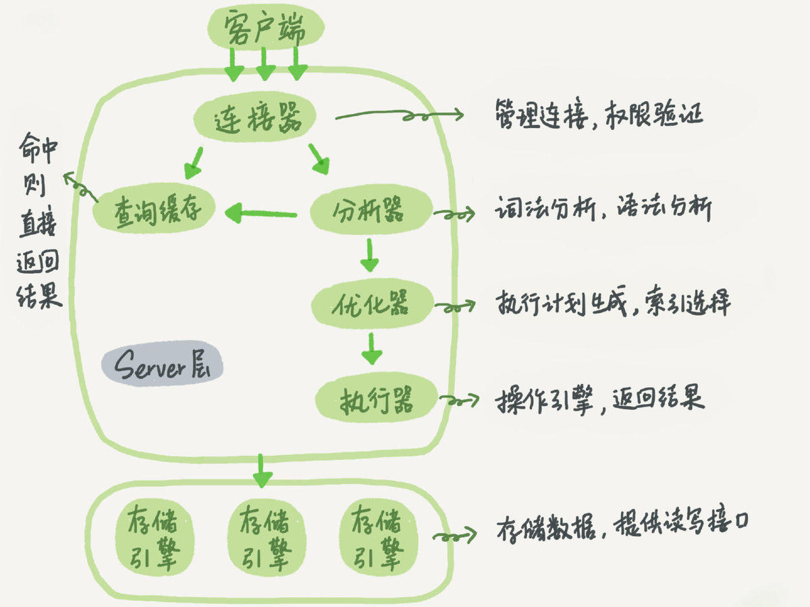

# mysql 逻辑架构


第二层架构是MySQL 比较有意思的地方. 大多数的mysql 的核心服务层功能都在这一层, 包括查询解析, 分析, 优化, 缓存以及所有的内
置函数(例如, 日期, 时间, 数学和加密函数等), 所有跨存储引擎的功能也都在这一层实现: 存储过程, 触发器, 视图等.

第三层包含了存储引擎. 存储引擎负责mysql 中数据的存储和提取. 和linux 下各种文件系统一样, 每个存储引擎都有它的优势和劣势.
服务器通过API 与存储引擎进行通信. 这些接口屏蔽了不同存储引擎之间的差异, 使得这些差异对上层的查询过程透明. 存储引擎API 包
含几十个底层函数, 用于执行诸如"开始一个事务" 或者 "根据主键提取一行记录" 等操作. 但存储引擎不会去解析sql(innodb 是一个例
外, 它会去解析外键定义, 因为mysql 服务器本身没有实现该功能), 不同存储引擎之间也不会相互通信, 而只是简单的响应上层服务器
的请求.

每个客户端连接都会在服务器进程中拥有一个线程, 这个连接的查询只会在这个单独的线程中执行, 服务器会负责缓存线程, 因此不需要
为每一个新建的连接创建或销毁线程.

mysql 会解析查询, 并创建内部数据结构(解析树), 然后对其进行各种优化, 包括重写查询, 决定表的读取顺序, 以及选取合适的索引等.
用户可以通过特殊的关键字提示(hint)优化器, 影响它的决策过程, 也可以请求优化器解释(explain) 优化过程的各个因素, 使用户可以
知道服务器是如何进行优化决策的, 并提供一个参考基准, 便于用户重构查询和schema, 修改相关配置, 使应用尽可能高效的运行.

优化器并不关心表使用的是什么存储引擎, 但存储引擎对于优化查询是有影响的. 优化器会请求存储引擎提供容量或某个具体操作的开销
信息, 以及表数据的统计信息. 例如, 某些存储引擎的某种索引, 可能对一些特定的查询有优化.

对于select 语句, 在解析查询之前, 服务器会先检查查询缓存(query cache), 如果能够在其中找到对应的查询, 服务器就不必再执行查
询解析, 优化和执行的整个过程, 而是直接返回查询缓存中的结果集.

# 并发控制
服务器层和存储引擎层两个层面的并发控制.

一种提高共享资源并发性的方式就是让锁定对象更有选择性. 尽量只锁定需要修改的部分数据, 而不是所有的资源. 更理想的方式是, 只
对会修改的数据片进行精确的锁定. 任何时候, 在给定的资源上, 锁定的数据量越少, 则系统的并发程度越高, 只要相互之间不发生冲突
即可.

问题是加锁也需要消耗资源. 锁的各种操作, 包括获得锁, 检查锁是否已经解除, 释放锁等, 都会增加系统的开销. 如果系统花费大量的
时间来管理锁, 而不是存取数据, 那么系统的性能可能会因此受到影响.

所谓的锁策略, 就是在锁的开销和数据的安全性之间寻求平衡, 这种平衡当然也会影响到性能. 大多数商业数据库系统没有提供更多的选
择, 一般都是在表上施加行级锁(row level lock), 并以各种复杂的方式来实现, 以便在锁比较多的情况下尽可能提供更好的性能.

而mysql 则提供了多种选择, 每种mysql 存储引擎都可以实现自己的锁策略和锁粒度. 在存储引擎的设计中, 锁管理是个非常重要的决定.
将锁粒度固定在某个级别, 可以为某些特定的应用场景提供更好的性能, 但同时却会失去对另外一些应用场景的良好支持. 好在mysql 支
持多个存储引擎的架构, 所以不需要单一的通用解决方案.
下面将介绍两种最重要的锁策略.

## 表锁(table lock)
表锁是mysql 中最基本的锁策略, 并且是开销最小的策略.

尽管存储引擎可以管理自己的锁, mysql 本身还是会使用各种有效的表锁来实现不同的目的. 例如, 服务器会为诸如alter table 之类的
语句使用表锁, 而忽略存储引擎的锁机制.

## 行级锁(row lock)
行级锁可以最大程度的支持并发处理(同时也带来了最大的锁开销).
众多周知, 在InnoDB 和 XtraDB 以及一些其他存储引擎中实现了行级锁.
行级锁只在存储引擎层实现, 而mysql 服务器层没有实现, 服务器层是完全不了解存储引擎中的锁实现.

# 事务
事务是由一组SQL语句组成的逻辑处理单元,事务具有以下4个属性,通常简称为事务的ACID属性.

- 原子性(Atomicity): 事务是一个原子操作单元, 其对数据的修改, 要么全都执行, 要么全都不执行.
  原子性的实现是基于回滚日志(undo log). 在undo log 日志文件,事物中使用的每条insert 都对应了一条delete, 每条update 也都对
  应一条相反的update 语句.
- 一致性(Consistent): 在事务开始和完成时,数据都必须保持一致状态.
  这意味着所有相关的数据规则都必须应用于事务的修改,以保持数据的完整性,事务结束时,所有的内部数据结构(如B树索引或双向链表)
  也都必须是正确的.
- 隔离性(Isolation): 数据库系统提供一定的隔离机制, 保证事务在不受外部并发操作影响的"独立"环境执行.
  这意味着事务处理过程中的中间状态对外部是不可见的,反之亦然. 隔离是分级别的, 在 innodb 中默认的隔离级别为可重复读(
  Repeatable Read)
- 持久性(Durable): 事务完成之后, 它对于数据的修改是永久性的, 即使出现系统故障也能够保持.
  事务持久性是基于重做日志(redo log) 实现的.

## 隔离级别
[隔离级别](https://www.cnblogs.com/digdeep/p/4968453.html)

隔离性其实比想象的要复杂,在 SQL 标准中定义了4 种隔离级别,每一种级别都规定了一个事物中所做的修改,哪些事物内和事物间是可见
的,哪些是不可见的.较低级别的隔离通常可以执行更高的并发,系统开销也更低.

另外,每种存储引擎实现的隔离级别可能都不太一样,这个需要进一步查阅所选存储引擎的手册.

- READ UNCOMMITTED(未提交读): 

  事物中的修改,即使没有提交,对其他事物也都是可见的.事物可以读取未提交的数据,这也被称为 脏读(Dirty Read).
  该级别会导致很多问题,从性能上来说,不会比其他的级别好太多,单缺乏其他级别的很多好处,在实际应用中一般很少使用;

- READ COMMITTED(RC, 提交读):

  大多数据库默认此级别(但MySQL 不是).满足前面提到的隔离性的简单定义:一个事物开始时,只能「看见」已经提交的事物所做的修改.
  换句话说,一个事物在提交前所做的操作对其他事物是不可见的.

  有时候也称为 不可重复读(nonrepeatable),因为两次执行同样的查询(单条记录),可能会得到不一样的结果

  这个意思是: A 事物中执行查询,下一个相同的查询还未执行前,B 事物对这部分数据修改了,那么当A 事物中再执行同一条查询语句时,
  会获取到 B 已提交的数据,导致两次相同查询不一致.

- REPEATABLE READ(RR, 可重复读): MySQL 默认事物隔离级别

  但是理论上可重复读,还是无法解决另一外一个 幻读(Phantom Read) 问题:在某个事物中重复读取某个范围内的记录时,另一个事物在
  该范围内插入了新的记录或删除了记录,导致两次读取不一致的问题(但是前后两次读取都存在的记录, 数据内容不变), 会产生幻行(
  Phantom Row).

  InnoDB 和 XtraDB 存储引擎通过 多版本并发控制(MVCC,Multiversion Concurrency Control)解决了幻读的问题.

  这是mysql innodb 默认的隔离级别, mysql 使用间隙锁来解决幻读.

- SERIALIZABLE(可串行化):

  最高的隔离级别.通过强制事务串行执行,避免了前面说的幻读的问题.

  实际情况很少使用该级别,无并发,强一致性时才会考虑该级别.

隔离级别中给提到的几个问题:

- 脏读: 可以读取未提交的数据. RC 要求解决脏读;
- 不可重复读: 同一个事务中多次执行同一个select, 读取到的数据发生了改变(被其它事务update并且提交);
- 可重复读: 同一个事务中多次执行同一个select, 读取到的数据没有发生改变(一般使用MVCC实现), RR 要求达到可重复读;
- 幻读: 同一个事务中多次执行同一个select, 读取到的数据行发生改变. 也就是行数减少或者增加了(被其它事务delete/insert并且提
  交). SERIALIZABLE要求解决幻读问题.

脏读与不可重复读的区别:

- 脏读读取的是另一个事物没有提交的数据
- 而不可重复读读取的是另一个事务已经提交的数据.

不可重复读和幻读的区别:

- 不可重复读的重点是修改: 同样条件的select, 读取过的数据, 再次读取出来发现值不一样了
- 幻读的重点在于新增或者删除: 同样条件的select, 第1次和第2次读出来的记录数不一样

ANSI SQL标准没有从隔离程度进行定义,而是定义了事务的隔离级别,同时定义了不同事务隔离级别解决的三大并发问题:

| Isolation Level     | Dirty Read | Unrepeatable Read | Phantom Read |
| ---                 | ---        | ---               | ---          |
| Read UNCOMMITTED    | YES        | YES               | YES          |
| READ COMMITTED(RC)  | NO         | YES               | YES          |
| READ REPEATABLE(RR) | NO         | NO                | YES          |
| SERIALIZABLE        | NO         | NO                | NO           |

除了MySQL默认采用RR隔离级别之外,其它几大数据库都是采用RC隔离级别.

### RC 与 RR 在锁方面的区别
- 显然RR 支持 gap lock(next-key lock),而RC则没有gap lock.
	因为MySQL的RR需要gap lock来解决幻读问题.而RC隔离级别则是允许存在不可重复读和幻读的.所以RC的并发一般要好于RR;
- RC 隔离级别,通过 where 条件过滤之后,不符合条件的记录上的行锁,会释放掉(虽然这里破坏了"两阶段加锁原则"),
	但是RR隔离级别,即使不符合where条件的记录,也不会释放行锁和gap lock,所以从锁方面来看,RC的并发应该要好于RR.

## 死锁
为了解决这种问题,数据库系统实现了各种 死锁检测 和 死锁超时机制.

- 死锁检测: 比如InnoDB 存储引擎,检测到死锁的循环依赖,立即返回一个错误,减少了死锁导致出现非常慢的查询.
- 死锁超时: 当查询的时间到达锁等待超时的设置后放弃锁请求,该方式通常来说不太好. InnoDB 目前处理死锁的方法是:将持有最少行
  级排他锁的事物进行回滚(这是相对比较简单的死锁回滚算法)

锁的行为和顺序是和存储引擎实现相关的,相同的语句某些引擎会产生死锁,而有的则不会.死锁的产生有双重因素:

1. 真正数据冲突,此种情况通常很难避免
1. 存储引擎实现方式导致

死锁发现以后,只有部分或完全回滚其中的一个事物,才能打破死锁.对于事务型系统,这是无法避免的,所以应用程序在设计时必须考虑如
何处理死锁.大多数情况下只需要重新执行因死锁回滚的事物即可.

## 事务日志
事物日志可以帮助提高事物的效率.使用事物日志,存储引擎在修改表的数据时只需要修改其内存拷贝,再把该修改行为记录到持久在硬盘
上的事物日志中,而不用每次都将修改的数据本身持久到磁盘中.
事物日志采用的是追加的方式,因此写日志的操作是磁盘上一小块区域内的顺序I/O,而不像随机 I/O 需要在磁盘的多个地方移动磁头,所
以采用事物日志的方式相对来说要快得多.

事物日志持久以后,内存中被修改的数据在后台可以慢慢刷回到磁盘.目前大多数的存储引擎都是这样实现的,通常称之为预写式日志
(Write-Ahead Logging),修改数据需要写两次磁盘.

如果数据的修改已经记录到事物日志并持久化,但数据本身还没有写回磁盘,此时系统崩溃,存储引擎在重启时能够自动恢复这部分修改的
数据.具体的恢复方式则视存储引擎而定.

## mysql 中的事务
MySQL 提供了两种事务型的存引擎:InnoDB 和 NDB Cluster.还有一些第三方存储引擎也支持事物,知名的有 XtraDB 和 PBXT.

MySQL 默认采用自动提交模式.也就是说,如果不是显式的开始一个事物,则每个查询都被当做一个事物执行提交操作.
在当前的连接中,可以通过设置 AUTOCOMMIT 变量来启用或禁用自动提交模式
```sql
mysql> SHOW VARIABLES LIKE 'AUTOCOMMIT';
+---------------+-------+
| Variable_name | Value |
+---------------+-------+
| autocommit    | ON    |
+---------------+-------+
1 row in set (0.00 sec)
mysql> SET AUTOCOMMIT = 1;
```
当等于 0 时,所有的查询都在一个事物中,需要显示的执行 COMMIT 提交或 ROLLBACK 回滚,该事物才会结束,同时又开始了另一个新事物.

另外还有一些命令,在执行之前会强制执行COMMIT 提交当前的活动事物.典型的例子:在数据定义语言(DDL)中,如果是会导致大量数据改变
的操作,比如 ALTER TABLE .还有 LOCK TABLES 等其他语句也会导致同样的结果.

MySQL 服务器层不管理事务,事务由下层的存储引擎实现.所以在同一个事务中,使用多种存储引擎是不可靠的.

