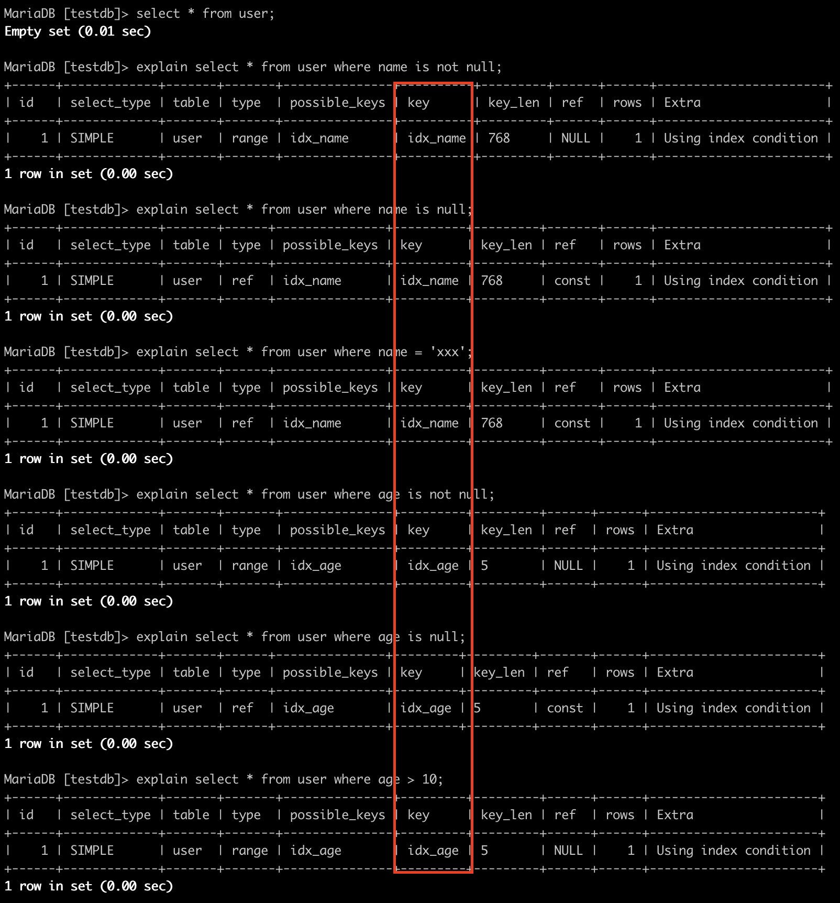

- [data type](#data-type)
  - [numbers](#numbers)
  - [date time](#date-time)
  - [str](#str)
  - [null](#null)
    - [值计算](#值计算)
    - [索引问题](#索引问题)
    - [存储空间](#存储空间)
- [operator](#operator)
  - [bit operators](#bit-operators)
- [function](#function)
  - [cast functions](#cast-functions)

# data type
## numbers
The DECIMAL and NUMERIC types store exact numeric data values. These types are used when it is important to preserve
exact precision, for example with monetary data.
In MySQL, NUMERIC is implemented as DECIMAL.

```sql
salary DECIMAL(5,2)
```
5 是有效数字个数, 2 是小数点位数, 存储的范围就是 [-999.99, 999.99]

## date time
[时间差](http://blog.csdn.net/yzsind/article/details/8831429)

datetime 直接之间作差得到结果不是时间意义上的作差, 实际是mysql做了一个隐式转换操作, 直接把年月日时分秒拼起来,如
`2013-04-21 16:59:33` 直接转换为`20130421165933`, 由于时间不是十进制,所以最后得到的结果没有意义,这也是导致出现坑爹的结果.

要得到正确的时间相减秒值,有以下3种方法:

1. `time_to_sec(timediff(t2, t1))`: timediff 得到的结果是一个时间格式
2. `timestampdiff(second, t1, t2)`
3. `unix_timestamp(t2) - unix_timestamp(t1)`

时间位移: `ADDTIME('2014-05-26 18:26:21', '0:0:2')` 求后2秒的时间.

```sql
TIMESTAMPADD(unit, interval, datetime_expr)
SELECT TIMESTAMPADD(SECOND, 2, '2009-05-18 00:00:00')  // example
```
The unit: FRAC_SECOND(microseconds), SECOND, MINUTE, HOUR, DAY, WEEK, MONTH, QUARTER or YEAR.

## str
- `length()`
- `char_length()`
- `locate(substr, str)`: 如果包含, 返回 > 0 的数, 否则返回0

非必要情况下,不要使用TEXT类型,MySQL memory引擎的内部临时表不支持TEXT类型,如果查询中包含这样的数据,那么内部临时表会无法使
用memory引擎,将会创建一张基于innodb引擎的内部临时表,使SQL的性能变得很差.

## null
[为什么数据库字段要使用not null](https://mp.weixin.qq.com/s/3w2qEAHJOgdZekphrTTDYA)

null 和not null default xxx 使用的空值代表的含义是不一样, null 可以认为这一列的值是未知的, 空值则可以认为我们知道这个值,
只不过他是空的而已.
举个例子, 一张表中的某一条name 字段是null, 我们可以认为不知道名字是什么, 反之如果是空字符串则可以认为我们知道没有名字,他
就是一个空值.

针对InnoDB作为考量条件.

1. 如果不设置not null的话,null是列的默认值,如果不是本身需要的话,尽量就不要使用null
1. 使用null带来更多的问题,比如索引,索引统计,值计算更加复杂,如果使用索引,就要避免列设置成null
1. 如果是索引列,会带来的存储空间的问题,需要额外的特殊处理,还会导致更多的存储空间占用
1. 对于稀疏数据有更好的空间效率,稀疏数据指的是很多值为null,只有少数行的列有非null值的情况

### 值计算
```sql
CREATE TABLE `user` (
  `id` bigint(20) NOT NULL AUTO_INCREMENT,
  `name` varchar(255) DEFAULT NULL,
  `age` int(11) DEFAULT NULL,
  PRIMARY KEY (`id`)
) ENGINE=InnoDB DEFAULT CHARSET=utf8mb4
```

**聚合函数不准确**

对于null值的列,使用聚合函数的时候会忽略null值.
现在我们有一张表,name字段默认是null,此时 `count(*)`是对表中的行数进行统计,`count(name)`则是对表中非null的列进行统计.

**=失效**

对于null值的列,是不能使用=表达式进行判断的,下面对name的查询是不成立的,必须使用is null.

**与其他值运算**

null和其他任何值进行运算都是null,包括表达式的值也是null.
user表第二条记录age是null,所以+1之后还是null,name是null,进行concat运算之后结果还是null.

**distinct, group by, order by**

对于distinct和group by来说,所有的null值都会被视为相等,对于order by来说升序null会排在最前

### 索引问题
```sql
CREATE TABLE `user` (
  `id` bigint(20) NOT NULL AUTO_INCREMENT,
  `name` varchar(255) DEFAULT NULL,
  `age` int(11) DEFAULT NULL,
  PRIMARY KEY (`id`),
  KEY `idx_name` (`name`),
  KEY `idx_age` (`age`)
) ENGINE=InnoDB DEFAULT CHARSET=utf8mb4
```

关于网上很多说如果null 那么不能使用索引的说法, 这个描述其实并不准确, 根据引用[官方文档](
https://dev.mysql.com/doc/refman/5.6/en/is-null-optimization.html)里描述, 使用is null 和范围查询都是可以和正常一样使用索
引的,实际验证的结果好像也是这样,看以下例子:



然后接着我们往数据库中继续插入一些数据进行测试,当null列值变多之后发现索引失效了.


从上面的简单测试结果其实可以看到,索引列存在null就会存在书中所说的导致优化器在做索引选择的时候更复杂,更加难以优化.

### 存储空间
数据库中的一行记录在最终磁盘文件中也是以行的方式来存储的, 对于InnoDB 来说, 有4种行存储格式: REDUNDANT, COMPACT, DYNAMIC
和COMPRESSED.

InnoDB的默认行存储格式是COMPACT.
如果存在null的话就会多占用一个字节的标志位的空间.

# operator
## bit operators
[Bit Functions and Operators](https://dev.mysql.com/doc/refman/8.0/en/bit-functions.html)
| Name        | Description                            |
| ---         | ---                                    |
| &           | Bitwise AND                            |
| >>          | Right shift                            |
| <<          | Left shift                             |
| ^           | Bitwise XOR                            |
| BIT_COUNT() | Return the number of bits that are set |
| \|	        | Bitwise OR                             |
| ~	          | Bitwise inversion                      |

优先级: ~ > ^ > & > >> = << > |

# function
## cast functions
- BINARY: cast a string to a binary string, `BINARY str` is a shorthand for `CAST(str AS BINARY)`.
- `CAST(expr AS type)`: cast a value as a certain type
- CONVERT(): cast a value as a certain type

The BINARY operator casts the string following it to a binary string.
This is an easy way to force a column comparison to be done byte by byte rather than character by character.
```sql
SELECT 'a' = 'A';  // 1
SELECT BINARY 'a' = 'A';  // 0
SELECT 'a' = 'a ';  // 1
SELECT BINARY 'a' = 'a ';  // 0
```

| name       | description                        |
| ---        | ---                                |
| COALESCE() | return the first non-NULL argument |

