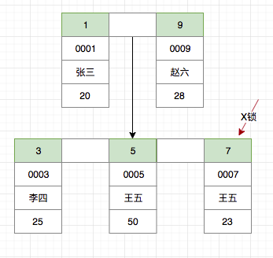
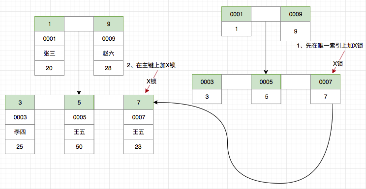
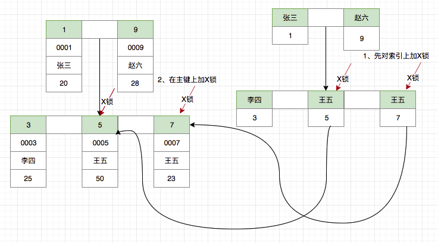
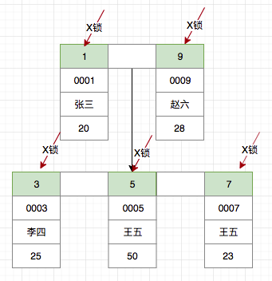
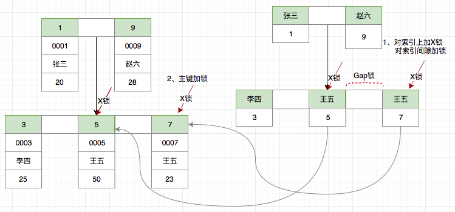
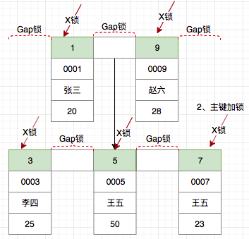
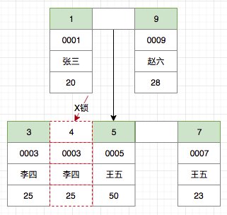

- [InnoDB Locking and Transaction Model](#innodb-locking-and-transaction-model)
  - [隔离级别](#隔离级别)
    - [RC 与 RR 在锁方面的区别](#rc-与-rr-在锁方面的区别)
  - [InnoDB Locking](#innodb-locking)
    - [锁的种类](#锁的种类)
      - [Shared Lock And Exclusive Locks](#shared-lock-and-exclusive-locks)
      - [Intention Locks](#intention-locks)
      - [Record Locks](#record-locks)
      - [GAP Locks](#gap-locks)
      - [Next-key Locks](#next-key-locks)
      - [Insert Intention Locks](#insert-intention-locks)
    - [加锁原则](#加锁原则)
      - [Read Uncommitted 级别](#read-uncommitted-级别)
      - [Read Committed 级别](#read-committed-级别)
        - [使用主键](#使用主键)
        - [使用唯一索引](#使用唯一索引)
        - [使用非唯一索引](#使用非唯一索引)
        - [未使用任何索引](#未使用任何索引)
        - [插入过程加锁](#插入过程加锁)
      - [Read Repeatable 级别](#read-repeatable-级别)
        - [使用主键](#使用主键-1)
        - [使用唯一索引](#使用唯一索引-1)
        - [使用非唯一索引](#使用非唯一索引-1)
        - [未使用任何索引](#未使用任何索引-1)
        - [插入过程](#插入过程)
      - [Serializable 级别](#serializable-级别)
    - [innodb行锁实现方式](#innodb行锁实现方式)

# InnoDB Locking and Transaction Model
事务是由一组SQL语句组成的逻辑处理单元,事务具有以下4个属性,通常简称为事务的ACID属性.

- 原子性(Atomicity): 事务是一个原子操作单元,其对数据的修改,要么全都执行,要么全都不执行.
- 一致性(Consistent): 在事务开始和完成时,数据都必须保持一致状态.这意味着所有相关的数据规则都必须应用于事务的修改,以保持
  数据的完整性,事务结束时,所有的内部数据结构(如B树索引或双向链表)也都必须是正确的.
- 隔离性(Isolation):数据库系统提供一定的隔离机制,保证事务在不受外部并发操作影响的"独立"环境执行.这意味着事务处理过程中的
  中间状态对外部是不可见的,反之亦然.
- 持久性(Durable):事务完成之后,它对于数据的修改是永久性的,即使出现系统故障也能够保持.

## [隔离级别](https://www.cnblogs.com/digdeep/p/4968453.html)
其中 隔离性 分为了四种:

- READ UNCOMMITTED:可以读取未提交的数据,未提交的数据称为脏数据,所以又称脏读.此时:幻读,不可重复读和脏读均允许,
- READ COMMITTED:只能读取已经提交的数据,此时:允许幻读和不可重复读,但不允许脏读,所以RC隔离级别要求解决脏读,
- REPEATABLE READ:同一个事务中多次执行同一个select, 读取到的数据没有发生改变,
	此时:允许幻读,但不允许不可重复读和脏读,所以RR隔离级别要求解决不可重复读,
- SERIALIZABLE: 幻读,不可重复读和脏读都不允许,所以serializable要求解决幻读,

几个概念

- 脏读:可以读取未提交的数据.RC 要求解决脏读,
- 不可重复读:同一个事务中多次执行同一个select, 读取到的数据发生了改变(被其它事务update并且提交),
- 可重复读:同一个事务中多次执行同一个select, 读取到的数据没有发生改变(一般使用MVCC实现),RR各级级别要求达到可重复读的标准,
- 幻读:同一个事务中多次执行同一个select, 读取到的数据行发生改变.也就是行数减少或者增加了(被其它事务delete/insert并且提交).
	SERIALIZABLE要求解决幻读问题,

这里一定要区分 不可重复读和幻读:

- 不可重复读的重点是修改: 同样的条件的select, 你读取过的数据, 再次读取出来发现值不一样了
- 幻读的重点在于新增或者删除: 同样的条件的select, 第1次和第2次读出来的记录数不一样

ANSI SQL标准没有从隔离程度进行定义,而是定义了事务的隔离级别,同时定义了不同事务隔离级别解决的三大并发问题:

| Isolation Level     | Dirty Read | Unrepeatable Read | Phantom Read |
| ---                 | ---        | ---               | ---          |
| Read UNCOMMITTED    | YES        | YES               | YES          |
| READ COMMITTED(RC)  | NO         | YES               | YES          |
| READ REPEATABLE(RR) | NO         | NO                | YES          |
| SERIALIZABLE        | NO         | NO                | NO           |

除了MySQL默认采用RR隔离级别之外,其它几大数据库都是采用RC隔离级别.

### RC 与 RR 在锁方面的区别
- 显然 RR 支持 gap lock(next-key lock),而RC则没有gap lock.
	因为MySQL的RR需要gap lock来解决幻读问题.而RC隔离级别则是允许存在不可重复读和幻读的.所以RC的并发一般要好于RR;
- RC 隔离级别,通过 where 条件过滤之后,不符合条件的记录上的行锁,会释放掉(虽然这里破坏了"两阶段加锁原则"),
	但是RR隔离级别,即使不符合where条件的记录,也不会释放行锁和gap lock,所以从锁方面来看,RC的并发应该要好于RR.

## InnoDB Locking
- 表级锁: 开销小, 加锁快, 不会出现死锁, 锁定粒度大, 发生锁冲突的概率最高, 并发度最低.
- 行级锁: 开销大, 加锁慢, 会出现死锁, 锁定粒度最小, 发生锁冲突的概率最低, 并发度也最高.

### [锁的种类](https://dev.mysql.com/doc/refman/5.6/en/innodb-locking.html)
#### Shared Lock And Exclusive Locks
InnoDB implements standard row-level locking where there are two types of locks, shared (S) locks and exclusive (X) locks.

- A shared (S) lock permits the transaction that holds the lock to read a row.
- An exclusive (X) lock permits the transaction that holds the lock to update or delete a row.

#### Intention Locks
为了支持不同粒度的锁而设计的一种 表级别锁(但不是通常认为的表锁) which permits coexistence of row locks and table locks.
它表示了表之后将被加上哪种行级锁.意向锁的分类如下:

- Intention Shared Lock,意向共享锁(IS) ,表示事务将要在表上加共享锁,规则是在表中申请某些行的共享锁之前,必须先申请IS锁.
- Intention Exclusive Lock,意向排他锁(IX) ,表示事务将要在表上加排他锁,规则是在表中申请某些行的排他锁之前,必须先申请IX锁.
```sql
SELECT ... LOCK IN SHARE MODE  // 该语句将会在表上加IS锁,同时在对应的记录上加上S锁.
SELECT ... FOR UPDATE  // 该语句将会在表上加上IX锁,同时在对应的记录上加上X锁
```

#### Record Locks
A record lock is a lock on an index record. For example, `SELECT c1 FROM t WHERE c1 = 10 FOR UPDATE;`
prevents any other transaction from inserting, updating, or deleting rows where the value of t.c1 is 10.

Record locks always lock index records, even if a table is defined with no indexes.
For such cases, InnoDB creates a hidden clustered index and uses this index for record locking.

#### GAP Locks
A gap lock is a lock on a gap between index records, or a lock on the gap before the first or after the last index record.

For example, `SELECT c1 FROM t WHERE c1 BETWEEN 10 and 20 FOR UPDATE;` prevents other transactions from inserting a value of
15 into column t.c1, whether or not there was already any such value in the column, because the gaps between all existing
values in the range are locked.

#### Next-key Locks
Next-key锁是记录锁和Gap锁的结合,锁住了记录和记录之前的一段Gap区间. 比如索引包含了10,11,13和20,那么Next-key分出的区间如下:
```info
(negative infinity, 10]
(10, 11]
(11, 13]
(13, 20]
(20, positive infinity)
```

#### Insert Intention Locks
An insert intention lock is a type of gap lock set by INSERT operations prior to row insertion.
This lock signals the intent to insert in such a way that multiple transactions inserting into the same index gap
need not wait for each other if they are not inserting at the same position within the gap.

[论 MySql InnoDB 如何通过插入意向锁控制并发插入](https://juejin.im/post/5b865859e51d4538e331ae9a)

### [加锁原则](https://juejin.im/post/5dc6c5325188250b92054dd8)
对于 InnoDB 而言,虽然加锁的类别繁多,加锁形式也灵活多样,但也遵循了一些原则:

- 对于 `select ... from ...` 语句,使用快照读,一般情况下不加锁,仅在Serializable级别会加共享读锁
- 对于 `select ... from ... lock in share mode` 语句使用当前读,加共享读锁(S锁)
- 对于 `select ... from ... for update` 语句,为当前读,加排他写锁(X锁)
- 常见 DML语句(insert, delete, update),使用当前读,加排他写锁(X锁)
- 常见 DDL语句(alter table, create table ...)等,加的是表级锁

```sql
CREATE TABLE `t_user` (
  `id` bigint(20) NOT NULL AUTO_INCREMENT COMMENT '主键',
  `no` char(18) NOT NULL DEFAULT '' COMMENT '身份证',
  `name` varchar(50) NOT NULL DEFAULT '' COMMENT '姓名',
  `age` int(4) NOT NULL DEFAULT '0' COMMENT '年龄',
  PRIMARY KEY (`id`),
  UNIQUE KEY `no` (`no`),
  KEY `name` (`name`)
) ENGINE=InnoDB COMMENT='用户表';
```
默认插入数据如下:

| id | no   | name | age |
|----|------|------|-----|
| 1  | 0001 | 张三 | 20  |
| 3  | 0003 | 李四 | 25  |
| 5  | 0005 | 王五 | 50  |
| 7  | 0007 | 王五 | 23  |
| 9  | 0009 | 赵六 | 28  |

#### Read Uncommitted 级别
Read Uncommitted 级别是事务隔离的最低级别,在此隔离级别下会存在脏读的现象,会影响到数据的正确性,因此我们在日常开发过程中很少使用该隔离级别.
在此隔离级别下更新语句采取的是普通的加行锁的机制,Read Committed的加锁过程与Read Uncommitted一致.
由于Read Committed使用范围较Read Uncommitted更广,在Read Committed级别下详细分析.

#### Read Committed 级别
Read Committed级别采取了一致性读策略,解决了事务的脏读问题,我们以下简称为RC级别.
在此级别下更新语句加锁与Read Uncommitted一致,可能存在的锁有行锁与意向锁.
加锁过程采取了Semi-consistent read优化策略,对于扫描过的数据如若不匹配,加锁后会立即释放.

##### 使用主键
假设我们需要在上述t_user表格中,删除ID=7的王五这一条记录,语句为:
```sql
delete from t_user where id = 7;
```
由于使用了主键,只需对该条记录加X锁即可,其加锁过程如下:



##### 使用唯一索引
假设我们通过身份证no这个唯一索引来删除id=7这条数据会如何加锁呢?
```sql
delete from t_user where no = '0007';
```
由于唯一索引为二级索引,Innodb 首先通过唯一索引对数据进行过滤,对于0007唯一索引加X锁,然后还需要在聚集索引上对主键=7的数据进行加X锁.



##### 使用非唯一索引
假设我们使用非唯一索引,那么情况又会如何呢?
```sql
delete from t_user where name = '王五';
```
由于唯一索引为二级索引,Innodb 首先通过索引对数据进行过滤,对于王五的两条索引加X锁,然后还需要在聚集索引上对主键=5,7 的数据进行加X锁.



##### 未使用任何索引
如果不使用任何索引,情况会是怎样呢?
```sql
delete from t_user where age = 23;
```
由于删除语句没有使用任何索引,那么 InnoDB 必须进行全表扫描以确定哪条数据需要删除.也就是说首先需要对全表的所有数据进行加锁,
InnoDB 在RC级别下的加锁过程采取了Semi-consistent read优化策略,对于扫描过的数据如若不匹配,加锁后会立即释放.



##### 插入过程加锁
那么对于插入过程,RC级别又是如何加锁的呢?
```sql
insert into t_user(id, no, name, age) values(4, '00004', '小灰灰', 8);
```
InnoDB事实上只对主键加了X锁.


#### Read Repeatable 级别
Read Repeatable级别引入了间隙锁等一系列机制,来防止其他事务的插入操作,以下简称RR级别.
但与此同时间隙锁的范围也带来了很多额外的开销与问题,其中之一就有由于引入了间隙锁加大了锁的粒度范围,使用不当容易造成死锁.
由于RR级别下可以通过参数innodb_locks_unsafe_for_binlog来配置是否开启gap锁,在此我们讨论的是开启gap锁的情况.

##### 使用主键
假设我们需要在上述t_user表格中,删除ID=7的王五这一条记录,语句为:
```sql
delete from t_user where id = 7;
```
由于使用了主键,可以唯一确认影响的记录,只需对该条记录加X锁即可,其加锁过程与RC级别下的使用主键加锁过程相同.


##### 使用唯一索引
假设我们通过身份证no这个唯一索引来删除id=7这条数据会如何加锁呢?
```sql
delete from t_user where no = '0007';
```
由于唯一索引为二级索引,Innodb 首先通过唯一索引对数据进行过滤,对于0007唯一索引加X锁,然后还需要在聚集索引上对主键=7的数据进行加X锁.


##### 使用非唯一索引
假设我们使用非唯一索引,那么情况又会如何呢?
```sql
delete from t_user where name = '王五';
```
由于使用索引为二级索引,Innodb 首先通过索引对数据进行过滤,由于普通索引不能保证影响数据范围唯一,有可能其他的事务在对二者之间的间隙操作添加新数据,
因此还需要对于王五之间的间隙进行加锁,以防有其他事务在事务提交前在此间隙插入数据,最后还需要在聚集索引上对主键=5,7 的数据进行加X锁.



##### 未使用任何索引
那么在RR级别下,如果不使用索引会导致什么情况呢?
```sql
delete from t_user where age = 23;
```
如若不使用任何索引,InnoDB只能够通过全表扫描以确定需要删除的数据,因此首先会需要对所有数据进行加锁,此外由于需要避免其他事务插入,
还需要对所有的间隙进行加锁,这对InnoDB性能影响非常显著.



##### 插入过程
在RR级别下,插入过程是如何加锁的呢?
```sql
insert into t_user(id, no, name, age) values(4, '00004', '小灰灰', 8);
```
插入过程是不需要增加gap锁的,因此RR级别下的加锁过程与RC级别下的加锁过程差不多.
依照官方文档,插入过程隐式的加了插入意向锁,该锁虽然为间隙锁,但大多数时候并不会影响其他行的插入.



#### Serializable 级别
Serializable 级别是事务隔离的最高级别,在此级别下所有的请求会进行串行化处理.在InnoDB中该级别下的 更新语句加锁过程与Read Repeatable下一致.

### innodb行锁实现方式
[mysql 行锁的实现](https://lanjingling.github.io/2015/10/10/mysql-hangsuo/)

InnoDB行锁是通过给索引上的索引项加锁来实现的,这一点MySQL与Oracle不同,后者是通过在数据块中对相应数据行加锁来实现的.
InnoDB这种行锁实现特点意味着:只有通过索引条件检索数据,InnoDB才使用行级锁,否则,InnoDB将使用表锁!
在实际应用中,要特别注意InnoDB行锁的这一特性,不然的话,可能导致大量的锁冲突,从而影响并发性能.

在不通过索引条件查询(select for update)的时候,InnoDB确实使用的是表锁,而不是行锁.

