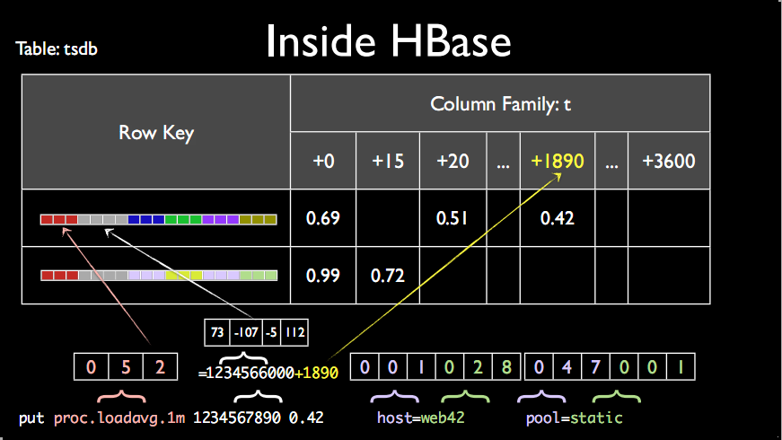

# intro
OpenTSDB is a distributed, scalable Time Series Database (TSDB) written on top of HBase.
主要用途,就是做监控系统,譬如收集大规模集群(包括网络设备,操作系统,应用程序)的监控数据并进行存储,查询.

存储到OpenTSDB的数据,是以metric为单位的,metric就是1个监控项,譬如服务器的话,会有CPU使用率,内存使用率这些metric,

OpenTSDB(Opentime series database)底层使用HBase、BlueFlood和KairosDB底层使用Cassandra，InfluxDB底层是自研的与LSM类似的TSM存储引擎，Prometheus是直接基于LevelDB存储引擎。
可以看到，主流的时序数据库的实现，底层存储基本都会采用LSM树加上分布式架构，只不过有的是直接使用已有的成熟数据库，有的是自研或者基于LevelDB自己实现。

# OpenTSDB存储相关的概念
介绍这些概念的时候,我们先看一个实际的场景.

譬如假设我们采集1个服务器(hostname=qatest)的CPU使用率,发现该服务器在21:00的时候,CPU使用率达到99%

下面结合例子看看OpenTSDB存储的一些核心概念

- Metric:即平时我们所说的监控项.譬如上面的CPU使用率
- Tags:就是一些标签,在OpenTSDB里面,Tags由tagk和tagv组成,即tagk=takv.标签是用来描述Metric的,譬如上面为了标记是服务器A的CpuUsage,tags可为hostname=qatest
- Value:一个Value表示一个metric的实际数值,譬如上面的99%
- Timestamp:即时间戳,用来描述Value是什么时候的,譬如上面的21:00
- Data Point:即某个Metric在某个时间点的数值.Data Point包括以下部分:Metric,Tags,Value,Timestamp, 上面描述的服务器在21:00时候的cpu使用率,就是1个DataPoint

保存到OpenTSDB的,就是无数个DataPoint.

# OpenTSDB的设计
还是以例子来说明,譬如保存这样的1个DataPoint:{metric:proc.loadavg.1m, timestamp:1234567890, value:0.42, tags:host=web42,pool=static}

## 表tsdb

### RowKey的设计
RowKey其实和 metric|timestamp|value|host=web42|pool=static 类似,

但是区别是,OpenTSDB为了节省存储空间,将每个部分都做了映射.

在OpenTSDB里面有这样的映射,metric-->3字节整数,tagk-->3字节整数,tagv-->3字节整数

上图的映射关系为,proc.loadavg.1m-->052,host-->001,web42-->028,pool-->047,static-->001

### column的设计
为了方便后期更进一步的节省空间.OpenTSDB将一个小时的数据,保存在一行里面.

所以上面的timestamp1234567890,会先模一下小时,得出1234566000,然后得到的余数为1890,表示的是它是在这个小时里面的第1890秒,
然后将1890作为column name,而0.42即为column value

## 表tsdb-uid
这里其实保存的就是一些metric,tagk,tagv的一些映射关系.

