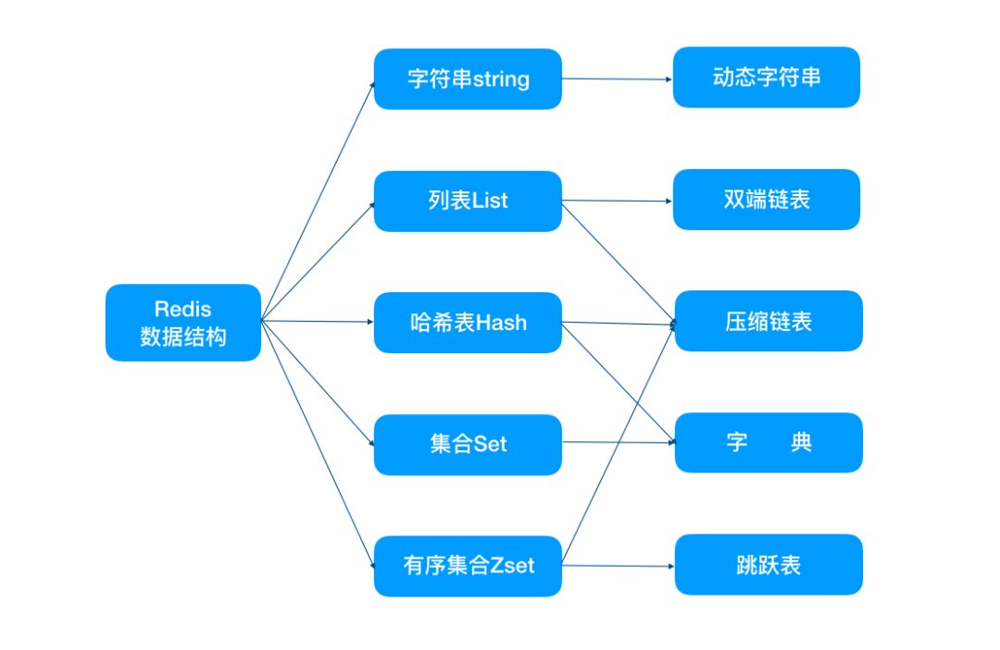

- [intro](#intro)
- [user value type](#user-value-type)
	- [string](#string)
		- [bit arrays(or simply bitmaps)](#bit-arraysor-simply-bitmaps)
	- [list](#list)
	- [set](#set)
	- [sorted set](#sorted-set)
	- [hash](#hash)
- [API](#api)
	- [pipeline](#pipeline)
	- [Transactions](#transactions)

# intro
Redis keys are binary safe, this means that you can use any binary sequence as a key,
from a string like "foo" to the content of a JPEG file.
The empty string is also a valid key.

- FLUSHALL: 清空所有数据
- RANDOMKEY: 随机获取一个key
- DBSIZE: 返回当前数据库的 key 的数量
- INFO: Redis 服务器的各种信息和统计数值

- start: `redis-server redis.conf`
- stop: `redis-cli shutdown`

# user value type
[Data types](https://redis.io/topics/data-types)
[An introduction to Redis data types and abstractions](https://redis.io/topics/data-types-intro)



- `type key`: returns the kind of value stored at the specified key:
- `exists key`: integer reply, 1 if the key exists

## string
Strings are the most basic kind of Redis value. Redis Strings are binary safe, this means that a Redis string can
contain any kind of data, for instance a JPEG image or a serialized Ruby object.

A String value can be at max 512 Megabytes in length.

You can do a number of interesting things using strings in Redis, for instance you can:

- Use Strings as atomic counters using commands in the INCR family: INCR, DECR, INCRBY.
- Append to strings with the APPEND command.
- Use Strings as a random access vectors with GETRANGE and SETRANGE.
- Encode a lot of data in little space, or create a Redis backed Bloom Filter using GETBIT and SETBIT.

[cmd](https://redis.io/commands/#string)

- `incr key` => "11" ## incr 是原子操作, INCRBY, DECR and DECRBY
- `expire key time(in seconds)`, 只对之前紧挨着的set key value 有效
- `ttl key`: 返回key的仍然有效时间, The -2 means that the key does not exist (anymore), -1 means that it will never
  expire.

### bit arrays(or simply bitmaps)
it is possible, using special commands(GETBIT, SETBIT etc), to handle string values like an array of bits:
you can set and clear individual bits, count all the bits set to 1, find the first set or unset bit, and so forth

## list
Redis Lists are simply lists of strings, sorted by insertion order. It is possible to add elements to a Redis List
pushing new elements on the head (on the left) or on the tail (on the right) of the list.

Redis lists are implemented via Linked Lists.
数据量很小时用ziplist

The max length of a list is 2^32 - 1 elements (4294967295, more than 4 billion of elements per list).

The main features of Redis Lists from the point of view of time complexity are the support for constant time insertion
and deletion of elements near the head and tail, even with many millions of inserted items.
Accessing elements is very fast near the extremes of the list but is slow if you try accessing the middle of a very big
list, as it is an O(N) operation.

You can do many interesting things with Redis Lists, for instance you can:

- Model a timeline in a social network, using LPUSH in order to add new elements in the user time line, and using LRANGE
  in order to retrieve a few of recently inserted items.
- You can use LPUSH together with LTRIM to create a list that never exceeds a given number of elements, but just
  remembers the latest N elements.
- Lists can be used as a message passing primitive.
- You can do a lot more with lists, this data type supports a number of commands, including blocking commands like BLPOP.

Automatic creation and removal of keys

So far in our examples we never had to create empty lists before pushing elements, or removing empty lists when they no
longer have elements inside. It is Redis' responsibility to delete keys when lists are left empty, or to create an empty
list if the key does not exist and we are trying to add elements to it, for example, with LPUSH.

This is not specific to lists, it applies to all the Redis data types composed of multiple elements -- Streams, Sets,
Sorted Sets and Hashes.

Basically we can summarize the behavior with three rules:

1. When we add an element to an aggregate data type, if the target key does not exist, an empty aggregate data type is
  created before adding the element.
1. When we remove elements from an aggregate data type, if the value remains empty, the key is automatically destroyed.
  The Stream data type is the only exception to this rule.
1. Calling a read-only command such as LLEN (which returns the length of the list), or a write command removing
  elements, with an empty key, always produces the same result as if the key is holding an empty aggregate type of the
  type the command expects to find.

## set
Redis Sets are an unordered collection of Strings.
It is possible to add, remove, and test for existence of members in O(1) (constant time regardless of the number of
elements contained inside the Set).

A very interesting thing about Redis Sets is that they support a number of server side commands to compute sets starting
from existing sets, so you can do unions, intersections, differences of sets in very short time.

The max number of members in a set is 232 - 1 (4294967295, more than 4 billion of members per set).

You can do many interesting things using Redis Sets, for instance you can:

- You can track unique things using Redis Sets. Want to know all the unique IP addresses visiting a given blog post?
  Simply use SADD every time you process a page view. You are sure repeated IPs will not be inserted.
- Redis Sets are good to represent relations. You can create a tagging system with Redis using a Set to represent every
  tag. Then you can add all the IDs of all the objects having a given tag into a Set representing this particular tag,
  using the SADD command. Do you want all the IDs of all the Objects having three different tags at the same time? Just
  use SINTER.
- You can use Sets to extract elements at random using the SPOP or SRANDMEMBER commands.

## sorted set
Redis Sorted Sets are, similarly to Redis Sets. The difference is that every member of a Sorted Set is associated with
score, that is used in order to take the sorted set ordered, from the smallest to the greatest score.
While members are unique, scores may be repeated.

They are ordered according to the following rule:

- If A and B are two elements with a different score, then A > B if A.score is > B.score.
- If A and B have exactly the same score, then A > B if the A string is lexicographically greater than the B string. A
  and B strings can't be equal since sorted sets only have unique elements.

Sorted sets are implemented via a dual-ported data structure containing both a skip list and a hash table.

## hash
Redis Hashes are maps between string fields and string values, so they are the perfect data type to represent objects
(e.g. A User with a number of fields like name, surname, age, and so forth):

With sorted sets you can add, remove, or update elements in a very fast way (in a time proportional to the logarithm of
the number of elements). Since elements are taken in order and not ordered afterwards, you can also get ranges by score
or by rank (position) in a very fast way. Accessing the middle of a sorted set is also very fast, so you can use Sorted
Sets as a smart list of non repeating elements where you can quickly access everything you need: elements in order, fast
existence test, fast access to elements in the middle!

In short with sorted sets you can do a lot of tasks with great performance that are really hard to model in other kind
of databases.

With Sorted Sets you can:

- Take a leaderboard in a massive online game, where every time a new score is submitted you update it using ZADD. You
  can easily take the top users using ZRANGE, you can also, given a user name, return its rank in the listing using
  ZRANK. Using ZRANK and ZRANGE together you can show users with a score similar to a given user. All very quickly.
- Sorted Sets are often used in order to index data that is stored inside Redis. For instance if you have many hashes
  representing users, you can use a sorted set with elements having the age of the user as the score and the ID of the
  user as the value. So using ZRANGEBYSCORE it will be trivial and fast to retrieve all the users with a given interval
  of ages.

# API
## pipeline
[Redis: Pipelining, Transactions and Lua Scripts](
	https://rafaeleyng.github.io/redis-pipelining-transactions-and-lua-scripts)

The server buffers all the answers in memory and sends all at once when the pipeline is done.
Using a few thousands of commands inside a pipeline is usually a good starting point.

Benefits of pipelining

1. batching several commands in a single message allows us to save multiple times the round trip time between the client
	and the Redis server
1. it avoids context switching, both in the client and in the server. When the server or the client need to read from or
	write to the network, a syscall is made and an expensive context switch happens between user space and kernel space.
	If we send 10 messages, each with a single command, 10 context switches will happen. If we send a single message with
	10 commands, it's likely that a single context switch will be needed.

注意点

1. pipelining is not atomic.
1. pipelining is non-blocking on the server. This means that even if a Client 1 has a huge and slow pipeline, other
	clients won't be blocked, because the commands from the other clients will be interleaved with the commands from
	Client 1 pipeline.
1. If some command fails, the pipeline continues and an error is returned at the end, as the response for that specific
	command (not for the whole pipeline).
1. [execution order is guaranteed](https://stackoverflow.com/questions/17634826/redis-pipelined-order-of-execution).
  但是对于有proxy 的集群, 顺序性取决于proxy 的实现.

## Transactions
A transaction works by issuing a MULTI command, then sending all the commands that compose the pipeline, and an EXEC or
a DISCARD at the end.

```redis
> MULTI
OK
> INCR foo
QUEUED
> INCR bar
QUEUED
> EXEC
1) (integer) 1
2) (integer) 1
```

However if the Redis server crashes or is killed by the system administrator in some hard way it is possible that only
a partial number of operations are registered. Redis will detect this condition at restart, and will exit with an error.
Using the redis-check-aof tool it is possible to fix the append only file that will remove the partial transaction so
that the server can start again.

