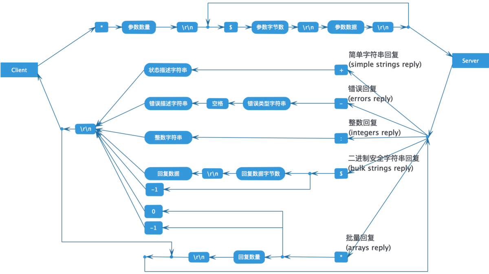

# [redis protocol sepcification](https://redis.io/topics/protocol)
Redis clients communicate with the Redis server using a protocol called RESP (REdis Serialization Protocol). While the
protocol was designed specifically for Redis, it can be used for other client-server software projects.

RESP is a compromise between the following things:

- Simple to implement.
- Fast to parse.
- Human readable.

**Request-Response model**

Redis accepts commands composed of different arguments. Once a command is received, it is processed and a reply is sent
back to the client.

This is the simplest model possible, however there are two exceptions:

- Redis supports pipelining. So it is possible for clients to send multiple commands at once, and wait for replies later.
- When a Redis client subscribes to a Pub/Sub channel, the protocol changes semantics and becomes a push protocol, that
  is, the client no longer requires sending commands, because the server will automatically send to the client new
  messages (for the channels the client is subscribed to) as soon as they are received.

Excluding the above two exceptions, the Redis protocol is a simple request-response protocol.

In RESP, the type of some data depends on the first byte:

- For Simple Strings the first byte of the reply is "+"
- For Errors the first byte of the reply is "-"
- For Integers the first byte of the reply is ":"
- For Bulk Strings the first byte of the reply is "$"
- For Arrays the first byte of the reply is "*"



用SET命令来举例说明RESP协议的格式.
```redis
redis> SET mykey "Hello"
"OK"
```
实际发送的请求数据:
```plain
*3\r\n$3\r\nSET\r\n$5\r\nmykey\r\n$5\r\nHello\r\n
```
实际收到的响应数据:
```plain
+OK\r\n
```

