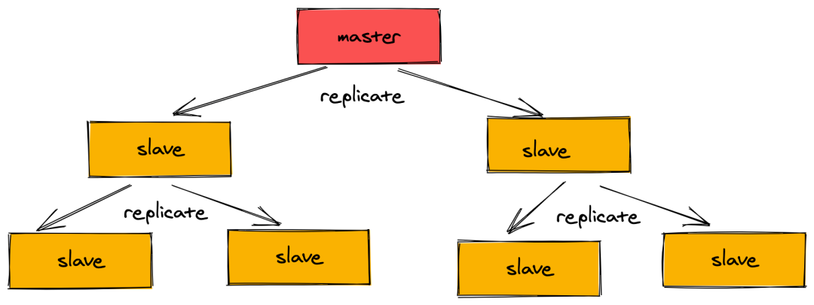
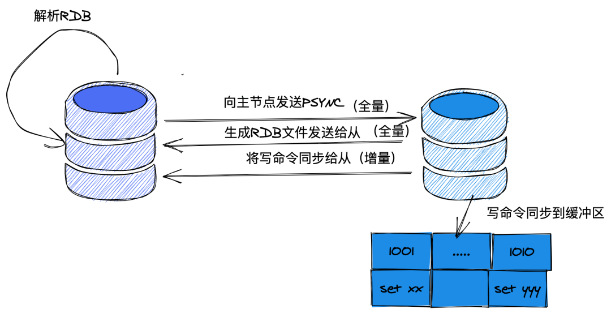

主从复制是高可用的基石, 哨兵模式提供了主从架构中的自动故障恢复能力, Gossip协议和一致性哈希提供了集群中新加入节点和退出节
点的发现以及节点加入或退出引起的数据重分配,最后基于上述的几个核心技术实现了高可用的Redis集群.

# 主从同步
Redis 的同步方式有:主从同步,从从同步(由于全部都由 master 同步的话,会损耗性能,所以部分的 slave 会通过 slave 之间进行同步).

同步过程如下:

1. 建立连接,然后从库告诉主库:"我要同步啦,你给我准备好",然后主库跟从库说:"收到".
1. 从库拿到数据后,要把数据保存到库里.这个时候就会在本地完成数据的加载,会用到 RDB .
1. 主库把新来的数据 AOF 同步给从库.

# gossip
Redis 采用了 Gossip 协议作为通信协议.

Gossip 协议类似病毒扩散的方式,将信息传播到其他的节点,这种协议效率很高,只需要广播到附近节点,然后被广播的节点继续做同样的
操作即可.

当然这种协议也有一个弊端就是:会存在浪费,哪怕一个节点之前被通知到了,下次被广播后仍然会重复转发.

使用 Gossip 协议的有: Redis Cluster, Consul, Apache Cassandra 等.

