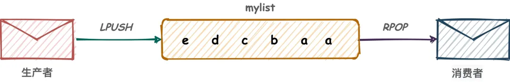
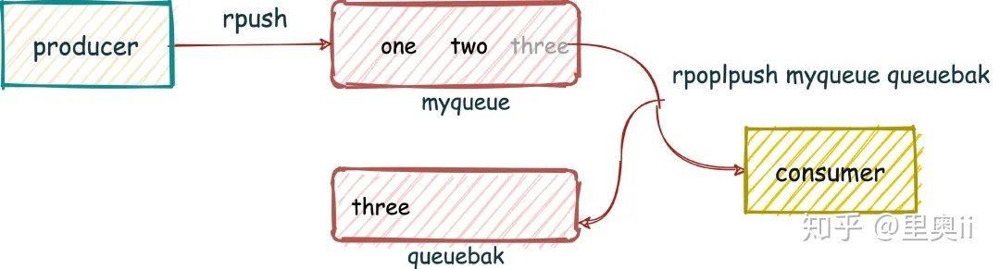
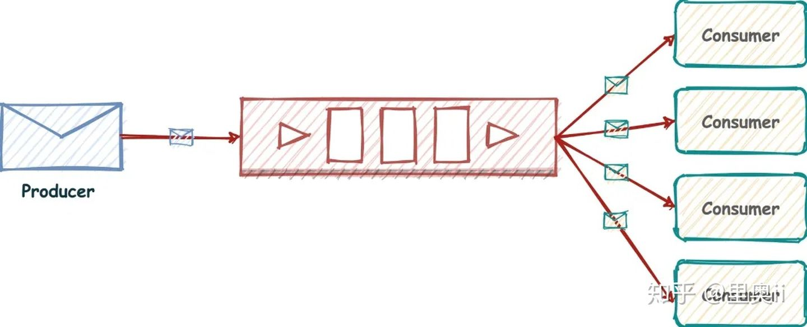
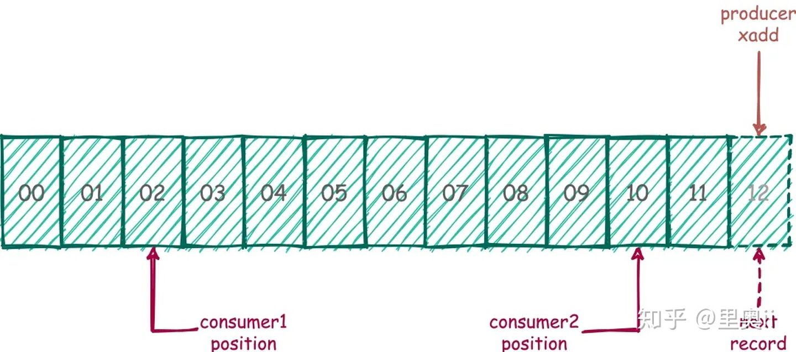

- [List 实现消息队列](#list-实现消息队列)
- [订阅与发布实现消息队列](#订阅与发布实现消息队列)
- [Streams 实现消息队列](#streams-实现消息队列)
  - [消费者组](#消费者组)

[Redis 消息队列的三种方案(List,Streams,Pub/Sub)](https://zhuanlan.zhihu.com/p/343632121)

# List 实现消息队列
Redis 列表是简单的字符串列表,按照插入顺序排序.你可以添加一个元素到列表的头部(左边)或者尾部(右边).

所以常用来做异步队列使用.将需要延后处理的任务结构体序列化成字符串塞进 Redis 的列表,另一个线程从这个列表中轮询数据进行处理.

- `LPUSH key element [element ...]`: Insert all the specified values one by one at the head of the list stored at key.
  O(1) for each element added. [ref](https://redis.io/commands/lpush)
- `RPOP key [count]`: Removes and returns the last elements of the list stored at key.

挑几个弹入,弹出的命令就可以组合出很多姿势

- LPUSH, RPOP 左进右出
- RPUSH, LPOP 右进左出

```redis
lpush mylist a a b c d e
```



通过LPUSH, RPOP 这样的方式, 会存在一个性能风险点,就是消费者如果想要及时的处理数据,就要在程序中写个类似 while(true) 这样
的逻辑, 不停的去调用 RPOP 或 LPOP 命令,这就会给消费者程序带来些不必要的性能损失.

所以, Redis 还提供了BLPOP, BRPOP 这种阻塞式读取的命令,客户端在没有读到队列数据时, 自动阻塞,直到有新的数据写入队列,再开始
读取新数据.这种方式就节省了不必要的 CPU 浪费.

如果将超时时间设置为 0 时,即可无限等待,直到弹出消息

因为 Redis 单线程的特点,所以在消费数据时,同一个消息会不会同时被多个 consumer 消费掉,但是需要我们考虑消费不成功的情况.

以上方式中, List 队列中的消息一经发送出去,便从队列里删除.如果由于网络原因消费者没有收到消息,或者消费者在处理这条消息的过
程中崩溃了,就再也无法还原出这条消息.究其原因,就是缺少消息确认机制.

为了保证消息的可靠性,消息队列都会有完善的消息确认机制(Acknowledge),即消费者向队列报告消息已收到或已处理的机制.

有两个命令, RPOPLPUSH, BRPOPLPUSH(阻塞)从一个list 中获取消息的同时把这条消息复制到另一个 list 里(可以当做备份),而且这个
过程是原子的.

这样我们就可以在业务流程安全结束后,再删除队列元素,实现消息确认机制.



数据从一个List 取出后放入另一个List, 业务操作安全执行完成后, 再去删除List 中的数据, 如果有问题的话, 很好回滚.

当然,还有更特殊的场景,可以通过 zset 来实现延时消息队列,原理就是将消息加到 zset 结构后,将要被消费的时间戳设置为对应的
score 即可,只要业务数据不会是重复数据就 OK.

# 订阅与发布实现消息队列
我们都知道消息模型有两种

- 点对点:Point-to-Point(P2P)
- 发布订阅:Publish/Subscribe(Pub/Sub)

List 实现方式其实就是点对点的模式,下边我们再看下 Redis 的发布订阅模式(消息多播),这才是"根正苗红"的 Redis MQ



Redis 通过PUBLISH, SUBSCRIBE, PSUBSCRIBE(pattern subscribe) 等命令实现了订阅与发布.
订阅分为订阅频道和订阅模式, 这个频道和模式有什么区别呢?

频道我们可以先理解为是个 Redis 的 key 值;
而模式可以理解为是一个类似正则匹配的Key, 可以匹配给定模式的频道.

再来看下订阅符合给定模式的频道,这回订阅的命令是 PSUBSCRIBE

Format of pushed messages

A message is a Array reply with three elements.
The first element is the kind of message:

- subscribe: means that we successfully subscribed to the channel given as the second element in the reply. The third
  argument represents the number of channels we are currently subscribed to.
- unsubscribe: means that we successfully unsubscribed from the channel given as second element in the reply. The third
  argument represents the number of channels we are currently subscribed to. When the last argument is zero, we are no
  longer subscribed to any channel, and the client can issue any kind of Redis command as we are outside the Pub/Sub
  state.
- message: it is a message received as result of a PUBLISH command issued by another client. The second element is the
  name of the originating channel, and the third argument is the actual message payload.

# Streams 实现消息队列
Redis 发布订阅 (pub/sub) 有个缺点就是消息无法持久化,如果出现网络断开,Redis 宕机等,消息就会被丢弃.而且也没有 Ack 机制来保
证数据的可靠性,假设一个消费者都没有,那消息就直接被丢弃了.

Redis 5.0 版本新增了一个更强大的数据结构-Stream.它提供了消息的持久化和主备复制功能,可以让任何客户端访问任何时刻的数据,并
且能记住每一个客户端的访问位置,还能保证消息不丢失.

它就像是个仅追加内容的消息链表,把所有加入的消息都串起来,每个消息都有一个唯一的ID 和对应的内容.而且消息是持久化的.



每个Stream 都有唯一的名称, 它就是Redis 的key,在我们首次使用 xadd 指令追加消息时自动创建.

Streams 是Redis 专门为消息队列设计的数据类型,所以提供了丰富的消息队列操作命令.

## 消费者组
Redis Stream 借鉴了很多 Kafka 的设计.

- Consumer Group: 有了消费组的概念, 每个消费组状态独立, 互不影响, 一个消费组可以有多个消费者
- last_delivered_id: 每个消费组会有个游标last_delivered_id 在数组之上往前移动, 表示当前消费组已经消费到哪条消息了
- pending_ids: 消费者的状态变量, 作用是维护消费者的未确认的id.pending_ids 记录了当前已经被客户端读取的消息, 但是还没有
  ack. 如果客户端没有ack, 这个变量里面的消息ID 会越来越多, 一旦某个消息被ack, 它就开始减少. 这个 pending_ids 变量在Redis
  官方被称之为PEL(Pending Entries List), 这是一个很核心的数据结构, 它用来确保客户端至少消费了消息一次, 而不会在网络传输
  的中途丢失了没处理.

