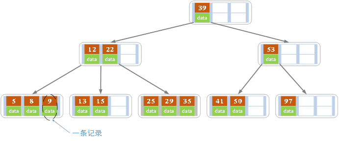
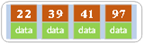
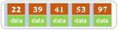
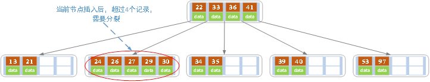
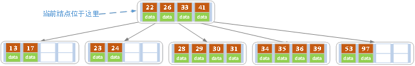

# 平衡二叉树
平衡二叉树是基于二分法的策略提高数据的查找速度的二叉树的数据结构.

因为平衡二叉树查询性能和树的层级(h高度)成反比,h值越小查询越快,为了保证树的结构左右两端数据大致平衡降低二叉树的查询难度一般会采用一种算法机制实现节点数据结构的平衡,
实现了这种算法的有比如Treap,红黑树,使用平衡二叉树能保证数据的左右两边的节点层级相差不会大于1.,通过这样避免树形结构由于删除增加变成线性链表影响查询效率,保证数据平衡的情况下查找数据的速度近于二分法查找,

总结平衡二叉树特点:

1. 非叶子节点最多拥有两个子节点,
1. 非叶子节值大于左边子节点,小于右边子节点,
1. 树的左右两边的层级数相差不会大于1;
1. 没有值相等重复的节点;

# B树
[B树和B+树的插入,删除图文详解](https://www.cnblogs.com/nullzx/p/8729425.html)

B树也称B-树,它是一颗多路平衡查找树.我们描述一颗B树时需要指定它的阶数,阶数表示了一个结点最多有多少个孩子结点,一般用字母m表示阶数.当m取2时,就是我们常见的二叉搜索树.

一颗m阶的B树定义如下:

- 个结点最多有m-1个关键字.
- 根结点最少可以只有1个关键字.
- 非根结点至少有Math.ceil(m/2)-1个关键字.
- 每个结点中的关键字都按照从小到大的顺序排列,每个关键字的左子树中的所有关键字都小于它,而右子树中的所有关键字都大于它.
- 所有叶子结点都位于同一层,或者说根结点到每个叶子结点的长度都相同.

上图是一颗阶数为4的B树.在实际应用中的B树的阶数m都非常大(通常大于100),所以即使存储大量的数据,B树的高度仍然比较小.
每个结点中存储了关键字(key)和关键字对应的数据(data),以及孩子结点的指针.我们将一个key和其对应的data称为一个记录.但为了方便描述,除非特别说明,后续文中就用key来代替(key, value)键值对这个整体.
在数据库中我们将B树(和B+树)作为索引结构,可以加快查询速速,此时B树中的key就表示键,而data表示了这个键对应的条目在硬盘上的逻辑地址.

## B树的插入操作
插入操作是指插入一条记录,即(key, value)的键值对.如果B树中已存在需要插入的键值对,则用需要插入的value替换旧的value.若B树不存在这个key,则一定是在叶子结点中进行插入操作.

1. 根据要插入的key的值,找到叶子结点并插入.
1. 判断当前结点key的个数是否小于等于m-1,若满足则结束,否则进行第3步.
1. 以结点中间的key为中心分裂成左右两部分,然后将这个中间的key插入到父结点中,这个key的左子树指向分裂后的左半部分,这个key的右子支指向分裂后的右半部分,然后将当前结点指向父结点,继续进行第3步.

下面以5阶B树为例,介绍B树的插入操作,在5阶B树中,结点最多有4个key,最少有2个key

在空树中插入39, 22,97和41, 根结点此时有4个key

继续插入53

插入后超过了最大允许的关键字个数4,所以以key值为41为中心进行分裂,
结果如下图所示,分裂后当前结点指针指向父结点,满足B树条件,插入操作结束.当阶数m为偶数时,需要分裂时就不存在排序恰好在中间的key,那么我们选择中间位置的前一个key或中间位置的后一个key为中心进行分裂即可.

依次插入13,21,40; 30,27, 33 ,36,35,34 ,24,29,结果如下图所示.(分号表示会触发节点分裂)

插入key值为26的记录,插入后的结果如下图所示.

当前结点需要以27为中心分裂,并向父结点进位27,然后当前结点指向父结点,结果如下图所示.

进位后导致当前结点(即根结点)也需要分裂,分裂的结果如下图所示.

分裂后当前结点指向新的根,此时无需调整.

最后再依次插入key为17,28,29,31,32的记录,结果如下图所示.

在实现B树的代码中,为了使代码编写更加容易,我们可以将结点中存储记录的数组长度定义为m而非m-1,这样方便底层的结点由于分裂向上层插入一个记录时,上层有多余的位置存储这个记录.
同时,每个结点还可以存储它的父结点的引用,这样就不必编写递归程序.

一般来说,对于确定的m和确定类型的记录,结点大小是固定的,无论它实际存储了多少个记录.
但是分配固定结点大小的方法会存在浪费的情况,比如key为28,29所在的结点,还有2个key的位置没有使用,但是已经不可能继续在插入任何值了,因为这个结点的前序key是27,后继key是30,所有整数值都用完了.
所以如果记录先按key的大小排好序,再插入到B树中,结点的使用率就会很低,最差情况下使用率仅为50%.

## B树的删除操作
删除操作是指,根据key删除记录,如果B树中的记录中不存对应key的记录,则删除失败.

1. 如果当前需要删除的key位于非叶子结点上,则用后继key覆盖要删除的key,然后在后继key所在的子支中删除该后继key.此时后继key一定位于叶子结点上,这个过程和二叉搜索树删除结点的方式类似.删除这个记录后执行第2步
1. 该结点key个数大于等于Math.ceil(m/2)-1,结束删除操作,否则执行第3步.
1. 如果兄弟结点key个数大于Math.ceil(m/2)-1,则父结点中的key下移到该结点,兄弟结点中的一个key上移,删除操作结束.
  否则,将父结点中的key下移与当前结点及它的兄弟结点中的key合并,形成一个新的结点.原父结点中的key的两个孩子指针就变成了一个孩子指针,指向这个新结点.然后当前结点的指针指向父结点,重复上第2步.

有些结点它可能即有左兄弟,又有右兄弟,那么我们任意选择一个兄弟结点进行操作即可.

下面以5阶B树为例,介绍B树的删除操作,5阶B树中,结点最多有4个key,最少有2个key

a) 原始状态, 如下图所示.

b) 在上面的B树中删除21,删除后结点中的关键字个数仍然大于等2,所以删除结束, 结果如下图所示.

c) 在上述情况下接着删除27.从上图可知27位于非叶子结点中,所以用27的后继替换它.从图中可以看出,27的后继为28,我们用28替换27,然后在28(原27)的右孩子结点中删除28.删除后的结果如下图所示.

删除后发现,当前叶子结点的记录的个数小于2,而它的兄弟结点中有3个记录(当前结点还有一个右兄弟,选择右兄弟就会出现合并结点的情况,不论选哪一个都行,只是最后B树的形态会不一样而已),我们可以从兄弟结点中借取一个key.
所以父结点中的28下移,兄弟结点中的26上移,删除结束.结果如下图所示.

d) 在上述情况下接着32,结果如下图.

当删除后,当前结点中只有一个key,而兄弟结点中也仅有2个key.所以只能让父结点中的30下移和这个两个孩子结点中的key合并,成为一个新的结点,当前结点的指针指向父结点.结果如下图所示.

当前结点key的个数满足条件,故删除结束.

e) 上述情况下,我们接着删除key为40的记录,删除后结果如下图所示.

同理,当前结点的记录数小于2,兄弟结点中没有多余key,所以父结点中的key下移,和兄弟(这里我们选择左兄弟,选择右兄弟也可以)结点合并,合并后的指向当前结点的指针就指向了父结点.

同理,对于当前结点而言只能继续合并了,最后结果如下所示.

合并后结点当前结点满足条件,删除结束.

# b+ 树

各种资料上B+树的定义各有不同,一种定义方式是关键字个数和孩子结点个数相同.这里我们采取维基百科上所定义的方式,即关键字个数比孩子结点个数小1,这种方式是和B树基本等价的.上图就是一颗阶数为4的B+树.

除此之外B+树还有以下的要求.

- B+树包含2种类型的结点:内部结点(也称索引结点)和叶子结点.根结点本身即可以是内部结点,也可以是叶子结点.根结点的关键字个数最少可以只有1个.
- B+树与B树最大的不同是内部结点不保存数据,只用于索引,所有数据(或者说记录)都保存在叶子结点中.
- m阶B+树表示了内部结点最多有m-1个关键字(或者说内部结点最多有m个子树),阶数m同时限制了叶子结点最多存储m-1个记录.
- 内部结点中的key都按照从小到大的顺序排列,对于内部结点中的一个key,左树中的所有key都小于它,右子树中的key都大于等于它.叶子结点中的记录也按照key的大小排列.
- 每个叶子结点都存有相邻叶子结点的指针,叶子结点本身依关键字的大小自小而大顺序链接.

相比B树

- B+树的层级更少:相较于B树B+每个非叶子节点存储的关键字数更多,树的层级更少所以查询数据更快,
- B+树查询速度更稳定:B+所有关键字数据地址都存在叶子节点上,所以每次查找的次数都相同所以查询速度要比B树更稳定;
- B+树天然具备排序功能:B+树所有的叶子节点数据构成了一个有序链表,在查询大小区间的数据时候更方便,数据紧密性很高,缓存的命中率也会比B树高.
- B+树全节点遍历更快:B+树遍历整棵树只需要遍历所有的叶子节点即可,,而不需要像B树一样需要对每一层进行遍历,这有利于数据库做全表扫描.

B树相对于B+树的优点是,如果经常访问的数据离根节点很近,而B树的非叶子节点本身存有关键字其数据的地址,所以这种数据检索的时候会要比B+树快.

# B\*树
规则

B\*树是B+树的变种,相对于B+树他们的不同之处如下:

- 首先是关键字个数限制问题,B+树初始化的关键字初始化个数是cei(m/2),b\*树的初始化个数为`cei(2/3*m)`
- B+树节点满时就会分裂,而B\*树节点满时会检查兄弟节点是否满(因为每个节点都有指向兄弟的指针),如果兄弟节点未满则向兄弟节点转移关键字,如果兄弟节点已满,则从当前节点和兄弟节点各拿出1/3的数据创建一个新的节点出来,

特点

在B+树的基础上因其初始化的容量变大,使得节点空间使用率更高,而又存有兄弟节点的指针,可以向兄弟节点转移关键字的特性使得B\*树额分解次数变得更少,

