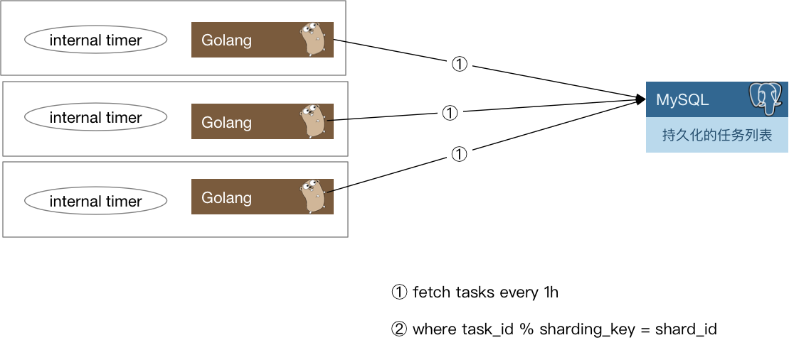

[延时任务系统](https://chai2010.cn/advanced-go-programming-book/ch6-cloud/ch6-03-delay-job.html)

我们在做系统时,很多时候是处理实时的任务,请求来了马上就处理,然后立刻给用户以反馈.但有时也会遇到非实时的任务,比如确定的时
间点发布重要公告.或者需要在用户做了一件事情的X分钟/Y小时后,对其特定动作,比如通知,发券等等.

如果业务规模比较小,有时我们也可以通过数据库配合轮询来对这种任务进行简单处理,但上了规模的公司,自然会寻找更为普适的解决方
案来解决这一类问题.

一般有两种思路来解决这个问题:

1. 实现一套类似crontab的分布式定时任务管理系统.
1. 实现一个支持定时发送消息的消息队列.

两种思路进而衍生出了一些不同的系统,但其本质是差不多的.都是需要实现一个定时器(timer).
在单机的场景下定时器其实并不少见,例如我们在和网络库打交道的时候经常会调用SetReadDeadline()函数,就是在本地创建了一个定时
器,在到达指定的时间后,我们会收到定时器的通知,告诉我们时间已到.这时候如果读取还没有完成的话,就可以认为发生了网络问题,从而
中断读取.

下面我们从定时器开始,探究延时任务系统的实现.

# 定时器的实现
定时器(timer)的实现在工业界已经是有解的问题了.常见的就是时间堆和时间轮.

## 数据库轮询
这是比较常见的一种方式,所有的订单或者所有的命令一般都会存储在数据库中.我们会起一个线程去扫数据库或者一个数据库定时Job,找
到那些超时的数据,直接更新状态,或者拿出来执行一些操作.这种方式很简单,不会引入其他的技术,开发周期短.

如果数据量比较大,千万级甚至更多,插入频率很高的话,上面的方式在性能上会出现一些问题,查找和更新对会占用很多时间,轮询频率高
的话甚至会影响数据入库.

如果数据量进一步增大,那扫数据库肯定就不行了.另一方面,对于订单这类数据,我们也许会遇到分库分表,那上述方案就会变得过于复杂,
得不偿失.

## 时间堆
最常见的时间堆一般用小顶堆实现,小顶堆其实就是一种特殊的二叉树.

小顶堆的好处是什么呢?对于定时器来说,如果堆顶元素比当前的时间还要大,那么说明堆内所有元素都比当前时间大,进而说明这个时刻我
们还没有必要对时间堆进行任何处理.定时检查的时间复杂度是O(1).

当我们发现堆顶的元素小于当前时间时,那么说明可能已经有一批事件已经开始过期了,这时进行正常的弹出和堆调整操作就好.每一次堆
调整的时间复杂度都是O(LgN).

Go自身的内置定时器就是用时间堆来实现的,不过并没有使用二叉堆,而是使用了扁平一些的四叉堆.

## 时间轮

[支付系统 - 延时任务的设计方案](https://juejin.cn/post/6855703799273783310)

用时间轮来实现定时器时,我们需要定义每一个格子的"刻度",可以将时间轮想像成一个时钟,中心有秒针顺时针转动.每次转动到一个刻度
时,我们就需要去查看该刻度挂载的任务列表是否有已经到期的任务.

还需要注意的一点是每个任务上的Round标记.只有指针路过时发现是Round=0的任务才会执行.得益于这样的设计,投递任务时,可以准确的
计算出这个任务的Round以及对应的时间刻度.每循环一次,Round>0的任务减一,等归零就可以执行了.

从结构上来讲,时间轮和哈希表很相似,如果我们把哈希算法定义为:触发时间%时间轮元素大小.那么这就是一个简单的哈希表.在哈希冲突
时,采用链表挂载哈希冲突的定时器.

除了这种单层时间轮,业界也有一些时间轮采用多层实现,这里就不再赘述了.

## redis zset
Redis中的ZSet是一个有序的Set,内部使用hash map和skiplist来保证数据的存储和有序,hash map里放的是成员到score的映射,而跳跃表
里存放的是所有的成员,排序依据是hash map里存的score,使用跳跃表的结构可以获得比较高的查找效率,并且在实现上比较简单.

在用作延迟任务的时候,可以在添加数据的时候,使用zadd把score写成未来某个时刻的unix时间戳.消费者使用zrangeWithScores获取优先
级最高的(最早开始的的)任务,并进行验证,是否到达要运行的时间,如果是则执行,然后删除zset中的数据.如果不是,则继续等待.

由于zrangeWithScores 和 zrem是先后使用,所以有可能有并发问题,即两个线程或者两个进程都会拿到一样的一样的数据,然后重复执行,
最后又都会删除.如果是分布式环境下,可以使用由Redis实现的分布式锁.

使用Redis的好处主要是:

- 解耦: 把任务,任务发起者,任务执行者的三者分开,逻辑更加清晰,程序强壮性提升,有利于任务发起者和执行者各自迭代,适合多人协作.
- 异常恢复: 由于使用Redis作为消息通道,消息都存储在Redis中.如果发送程序或者任务处理程序挂了,重启之后,还有重新处理数据的可
  能性.
- 分布式: 如果数据量较大,程序执行时间比较长,我们可以针对任务发起者和任务执行者进行分布式部署.特别注意任务的执行者,也就是
  Redis的接收方需要考虑分布式锁的问题.

# 任务分发
有了基本的定时器实现方案,如果我们开发的是单机系统,那么就可以撸起袖子开干了,不过本章我们讨论的是分布式,距离"分布式"还稍微
有一些距离.

我们还需要把这些"定时"或是"延时"(本质也是定时)任务分发出去.下面是一种思路

每一个实例每隔一小时,会去数据库里把下一个小时需要处理的定时任务捞出来,捞取的时候只要取那些
`task_id % shard_count = shard_id`的那些任务即可.

当这些定时任务被触发之后需要通知用户侧,有两种思路:

1. 将任务被触发的信息封装为一条消息,发往消息队列,由用户侧对消息队列进行监听.
1. 对用户预先配置的回调函数进行调用.

两种方案各有优缺点,如果采用1,那么如果消息队列出故障会导致整个系统不可用,当然,现在的消息队列一般也会有自身的高可用方案,大
多数时候我们不用担心这个问题.其次一般业务流程中间走消息队列的话会导致延时增加,定时任务若必须在触发后的几十毫秒到几百毫秒
内完成,那么采用消息队列就会有一定的风险.

如果采用2,会加重定时任务系统的负担.我们知道,单机的定时器执行时最害怕的就是回调函数执行时间过长,这样会阻塞后续的任务执行.
在分布式场景下,这种忧虑依然是适用的.一个不负责任的业务回调可能就会直接拖垮整个定时任务系统.所以我们还要考虑在回调的基础
上增加经过测试的超时时间设置,并且对由用户填入的超时时间做慎重的审核.

# 数据再平衡和幂等考量
当我们的任务执行集群有机器故障时,需要对任务进行重新分配.按照之前的求模策略,对这台机器还没有处理的任务进行重新分配就比较
麻烦了.如果是实际运行的线上系统,还要在故障时的任务平衡方面花更多的心思.

下面给出一种思路:

我们可以参考Elasticsearch的数据分布设计,每份任务数据都有多个副本,这里假设两副本. 一份数据虽然有两个持有者,但持有者持有的
副本会进行区分,比如持有的是主副本还是非主副本, 一个任务只会在持有主副本的节点上被执行.

当有机器故障时,任务数据需要进行数据再平衡的工作

当然,也可以用稍微复杂一些的思路,比如对集群中的节点进行角色划分,由协调节点来做这种故障时的任务重新分配工作,考虑到高可用,
协调节点可能也需要有1至2个备用节点以防不测.

之前提到我们会用消息队列触发对用户的通知,在使用消息队列时,很多队列是不支持exactly once的语义的,这种情况下我们需要让用户
自己来负责消息的去重或者消费的幂等处理.

