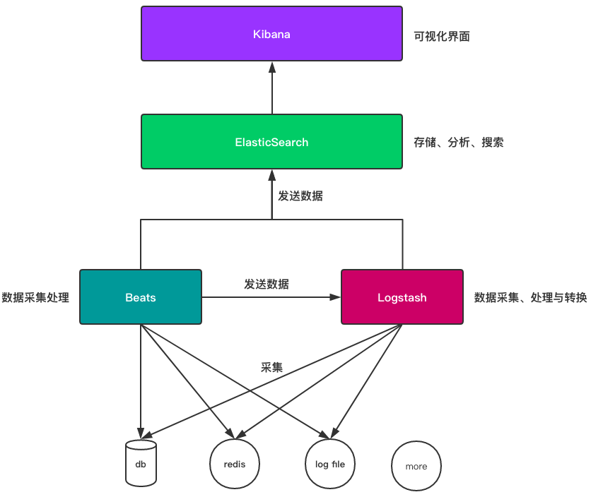
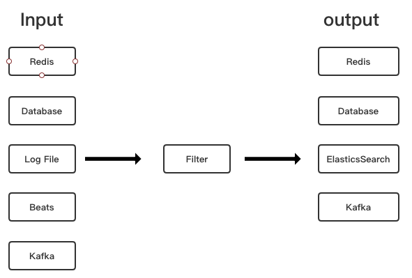

# intro
Elastic Stack是一套构建在开源基础之上,可以让我们安全可靠地采集任何来源,任何格式的数据,并且实时地对数据进行搜索,分析和可
视化工具链.
这些功能由Beats, Logstash, ElasticSearch, Kibana 这几个组件来实现.

- Beats: 轻量级数据收集引擎.基于原先 Logstash-fowarder 的源码改造出来.

- Logstash: 数据收集处理引擎.支持从各种数据源搜集数据,并对数据进行过滤,分析,丰富,统一格式等操作,然后存储以供后续使用.

- Elasticsearch: 分布式搜索引擎.具有高可伸缩,高可靠,易管理等特点.可以用于全文检索,结构化检索和分析,并能将这三者结合起来.
  基于 Lucene 开发,现在使用最广的开源搜索引擎之一, Wikipedia, StackOverflow, Github 等都基于它来构建自己的搜索引擎.

- Kibana :可视化化平台.它能够搜索,展示存储在 Elasticsearch 中索引数据.使用它可以很方便的用图表,表格,地图展示和分析数据.

各组件之间的关系:

# Beats
Beats是一个轻量型采集器的平台,集合了多种轻量级的,单一的数据采集器,几乎可以兼容所有的数据类型,这些采集器可以从成千上万的
系统中采集数据并向Logstash和Elasticsearch发送数据.
下面是Beats支持的采集器列表:

- Filebeat:文件文件
- Metricbeat:指标数据
- Packetbeat:网络数据
- Winlogbeat:Windows事件日志
- Auditbea:审计数据
- Heartbeat:运行时间监控
- Functionbeat:无需服务器的采集器

# Logstash
Logstash是开源的服务器端数据处理管道,能够同时从多个来源采集数据,转换数据,然后将数据发送到您最喜欢的存储库中,一般就是发送
到Elasticsearch当中.
从上面的定义中,我们可以看出,Logstash与Beats有类似的功能,而实际上,Logstash的功能比Beats更强大,Logstash支持丰富的过滤器,可
以通过过滤器将非常结构化的数据转换成结构化的数据,如下图所示:

